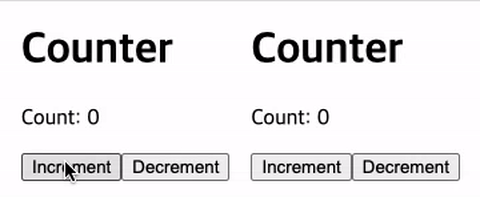
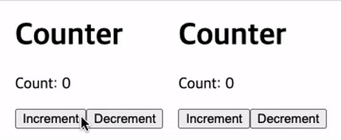
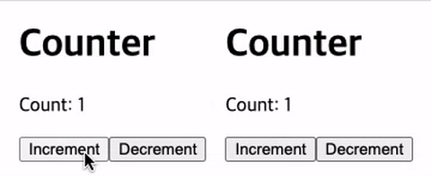
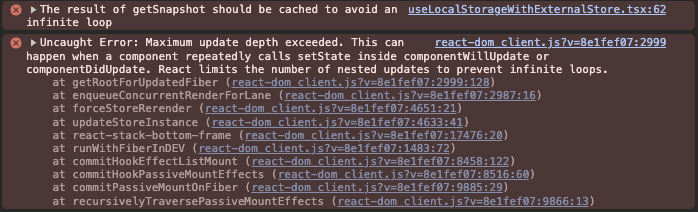
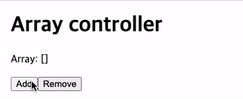
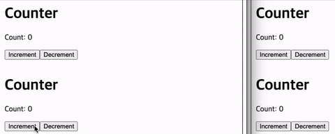
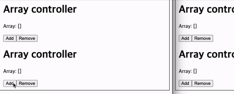
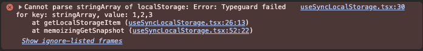
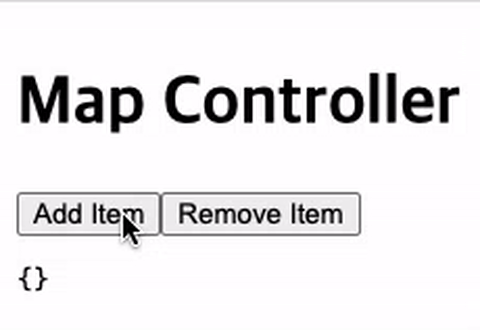

프론트엔드를 개발하다보면, 사용자 설정이나 테마 같은 페이지를 새로 고침하거나 재접속 하더라도 유지되어야 하는 정보들을 다루게 된다.

이럴 때 가장 쉽게 활용할 수 있는 브라우저 저장소가 바로 `localStorage`이다. `localStorage`를 사용하여 특정 값을 저장하고, 재접속 시 이를 참조하여 이전 상태를 복원한다. 저장되는 데이터는 영속적이고 사용 방법도 간단해 자주 사용되며, React에서도 이를 활용한 상태 관리 패턴이 많이 쓰인다.

하지만, React에서 `localStorage`를 사용할 때 몇 가지 문제점이 발생할 수 있다.

예를 들어, 하나의 컴포넌트에서 `localStorage`의 특정 키 값을 업데이트해도 React는 이 변화를 감지하지 못한다. `localStorage`에 저장하는 값을 별도의 상태(`useState`)로 다루더라도 다른 컴포넌트에서는 변화를 알 수 없다. 그래서 동일한 키를 여러 컴포넌트에서 사용하더라도 상태가 동기화되지 않기 때문에, 각 컴포넌트가 서로 다른 값을 바라보게 되는 문제가 생긴다.

또한, `localStorage`는 다른 탭과도 공유되는데, 여러 탭을 열어놓고 작업하는 경우 한 탭에서 `localStorage`의 값을 업데이트 하더라도 다른 탭에서는 변화를 알 수 없다. 이로 인해 한 탭에서 값을 변경하더라도 다른 탭에서는 이전 값을 여전히 유지하고 있을 수 있다.

이 글에서는, `localStorage`를 React의 상태와 안전하게 동기화 하고, 컴포넌트와 탭 사이의 상태를 동기화 하는 방법을 알아보려 한다. 또한 확장 옵션을 함께 설계하여, 추가적인 기능을 제공하는 `localStorage` Hook을 구현해보고자 한다.

### localStorage와 React

`localStorage`는 브라우저에서 제공하는 영속적인 저장소로, 데이터를 문자열 형태로 저장할 수 있는 API다. 이 저장소는 페이지를 새로 고침하거나 브라우저를 닫았다가 다시 열어도 데이터가 유지된다. 또한, `localStorage`는 동일한 도메인 내에서 모든 탭과 윈도우에서 공유된다.

`localStorage`는 키-값 쌍으로 데이터를 저장하며, 보통은 아래처럼 간단하게 값을 저장하고 꺼내 쓸 수 있다.

```ts
localStorage.setItem("theme", "dark");
const theme = localStorage.getItem("theme"); // 'dark'
```

`localStorage`는 문자열만 저장할 수 있기 때문에, 객체나 배열을 저장하려면 JSON.stringify를 사용하여 문자열로 변환한 후 저장하고, 불러올 때는 JSON.parse를 사용하여 다시 객체로 변환해야 한다.

```ts
localStorage.setItem(
  "settings",
  JSON.stringify({ theme: "dark", language: "en" })
);
const settings = JSON.parse(localStorage.getItem("settings") || "{}"); // { theme: "dark", language: "en" }
```

React에서는 `localStorage`를 상태 관리에 활용하는 경우가 많다. 예를 들어, 사용자의 테마 설정이나 애플리케이션의 설정 값을 `localStorage`에 저장하고, 이를 React의 상태로 관리하여 페이지를 새로 고침해도 이전 상태를 유지할 수 있다.

```ts
const [theme, setTheme] = useState<"dark" | "light">(() => {
  const saved = localStorage.getItem("theme");
  if (saved === "dark" || saved === "light") {
    return saved;
  }
  return "light";
});

useEffect(() => {
  localStorage.setItem("theme", theme);
}, [theme]);
```

이를 사용해 테마나 설정 등을 저장하고, 새로고침 등이 발생했을 때에도 이를 참조해 초기화하며 상태를 유지할 수 있다.

필요할 때마다 매번 선언하기에는 번거롭고 중복 코드가 발생하기 때문에, 이를 간편하게 사용하기 위해 커스텀 훅을 만들어 사용하는 경우가 많다.

```tsx useLocalStorage.tsx
import { useState, useEffect } from "react";

function getLocalStorageItem<T>(key: string, initialValue: T): T {
  try {
    const item = window.localStorage.getItem(key);
    return item ? JSON.parse(item) : initialValue;
  } catch (error) {
    console.error(`Cannot parse ${key} of localStorage:`, error);
    return initialValue;
  }
}

function useLocalStorage<T>(key: string, initialValue: T) {
  const [value, setValue] = useState<T>(getLocalStorageItem(key, initialValue));

  useEffect(() => {
    localStorage.setItem(key, JSON.stringify(value));
  }, [key, value]);

  return [value, setValue] as const;
}
```

이렇게 커스텀 훅을 만들어 사용하면, `localStorage`에 저장된 값을 쉽게 관리할 수 있다.

하지만, 이 방식은 몇 가지 문제점을 가지고 있다. 같은 키를 가지고 다른 컴포넌트에서 사용할 경우, 각 컴포넌트가 서로 다른 값을 바라보게 되는 문제가 발생할 수 있다.

예를 들어, 하나의 컴포넌트에서 `localStorage`의 특정 키 값을 업데이트해도 React는 이 변화를 감지하지 못한다. 그래서 다른 컴포넌트에서는 여전히 이전 값을 참조하게 된다.

```tsx Counter.tsx
function Counter() {
  const [count, setCount] = useLocalStorage("counter", 0);

  return (
    <div>
      <h1>Counter</h1>
      <p>Count: {count}</p>
      <button onClick={() => setCount(count + 1)}>Increment</button>
      <button onClick={() => setCount(count - 1)}>Decrement</button>
    </div>
  );
}
```

`Counter `컴포넌트가 있다. 이 컴포넌트는 `localStorage`에 `"counter"`라는 키로 값을 저장하고 있다.

해당 컴포넌트를 여러 개 렌더링하고, 한 컴포넌트를 조작한다고 해보자.

```tsx CounterViewer.tsx
function CounterViewer() {
  return (
    <div style={{ display: "flex", gap: "1rem" }}>
      <Counter />
      <Counter />
    </div>
  );
}
```



한 컴포넌트를 조작해도, 다른 컴포넌트의 상태는 변경되지 않는다. 다만 `localStorage`에 저장된 값은 변경되어, 새로 고침을 할 경우 마지막에 변경된 값으로 초기화가 되는 것을 확인할 수 있다.

`localStorage`는 React의 상태 관리와는 별개로 동작하는 브라우저 API다. 그래서 React의 상태가 업데이트 되더라도 `localStorage`의 변화는 감지하지 못한다. 이로 인해 React의 상태 관리와 `localStorage` 간의 동기화 문제가 발생한다.

`localStorage`의 동일한 키를 사용해 여러 컴포넌트들에서 사용하기 위해서는, 이를 동기화 시키는 방법이 필요하다.

### Custom Event로 동기화하기

이 문제를 해결하기 위해 먼저 생각할 수 있는 방법은, 값이 바뀌었을 때 다른 컴포넌트에게 이를 알려주는 방식이다. 값이 바뀔 때 이를 알리는 이벤트를 직접 만들어, `localStorage`의 값이 변경되었을 때 다른 컴포넌트들이 감지하도록 하는 것이다.

예를 들어, `localStorage.setItem`을 호출할 때마다 `CustomEvent`를 `dispatchEvent`를 통해 발생시키고, 다른 컴포넌트에서는 이 이벤트를 리스닝한다면, 상태 변화를 감지할 수 있게 된다.

`CustomEvent`는 브라우저에서 제공하는 이벤트 객체로, 사용자 정의 이벤트를 생성할 수 있다. 이를 활용하면 `localStorage`의 변화를 전파하는 이벤트를 선언할 수 있다.

```ts
type LocalStorageEventType = `localStorageChanged:${string}`;

type LocalStorageEventDetail<T> = {
  value: T;
};

class LocalStorageEvent<T> extends CustomEvent<LocalStorageEventDetail<T>> {
  constructor(
    type: LocalStorageEventType,
    eventInit: CustomEventInit<LocalStorageEventDetail<T>>
  ) {
    super(type, eventInit);
  }

  static isLocalStorageEvent<T>(event: Event): event is LocalStorageEvent<T> {
    return (
      event instanceof CustomEvent &&
      event.type.startsWith("localStorageChanged:") &&
      event.detail &&
      typeof event.detail.value !== "undefined"
    );
  }
}
```

`CustomEvent`를 상속받아 `LocalStorageEvent` 클래스를 정의했다. 이벤트 타입은 `localStorageChanged:`로 시작하여 뒤에 키가 붙도록 했으며, 이벤트의 상세 정보로는 변경된 값을 포함하도록 했다.

이벤트 객체를 받았을 때, 해당 이벤트가 `LocalStorageEvent`인지 확인하는 타입 가드를 추가했다. 이를 통해 이벤트가 올바른 타입인지 검증할 수 있다.

이제 `useLocalStorageWithEvent` Hook을 수정하여, `localStorage`의 값을 업데이트할 때마다 이 이벤트를 발생시키도록 해보자.

```tsx useLocalStorageWithEvent.tsx
function useLocalStorageWithEvent<T>(key: string, initialValue: T) {
  const eventKey: LocalStorageEventType = `localStorageChanged:${key}`;

  const [value, setValue] = useState<T>(getLocalStorageItem(key, initialValue));

  const setter = useCallback(
    (next: T | ((value: T) => T)) => {
      try {
        const newValue = next instanceof Function ? next(value) : next;
        window.localStorage.setItem(key, JSON.stringify(newValue));
        window.dispatchEvent(
          new LocalStorageEvent(eventKey, {
            detail: { value: newValue }
          })
        );
        setValue(newValue);
      } catch (error) {
        console.error(`Cannot setting ${key} of localStorage:`, error);
      }
    },
    [key, value, eventKey]
  );

  useEffect(() => {
    const handleStorageChange = (event: Event) => {
      if (LocalStorageEvent.isLocalStorageEvent<T>(event) === false) return;
      setValue(event.detail.value);
    };

    window.addEventListener(eventKey, handleStorageChange);
    return () => {
      window.removeEventListener(eventKey, handleStorageChange);
    };
  }, [eventKey]);

  return [value, setter] as const;
}
```

해당 Hook의 키를 기반으로 이벤트 타입을 정의하고, `setter` 함수와 이벤트를 구독하는 `useEffect`를 추가했다.

`setter`의 함수 파라미터로는 값 또는 값을 반환받는 함수로 하여, `useState`와 동일하게 구성했다. `next`가 함수인 경우에는 현재 값을 인자로 받아 새 값을 계산하고, 그렇지 않은 경우에는 단순히 새 값을 설정한다. 그리고 `localStorage`에 값을 저장한 후, `LocalStorageEvent`를 발생시켜 이벤트를 전파한다. 이때, 이벤트의 상세 정보로 새 값을 포함시켰다.

`useEffect`에서는 `eventKey`를 기반으로 이벤트 리스너를 등록하여, 전달받은 이벤트 객체가 `LocalStorageEvent`일 때, 이벤트의 값을 읽어 상태를 업데이트 하도록 했다.

이제, `useLocalStorage` Hook을 사용하는 컴포넌트들은 서로의 상태가 변경되었을 때 이를 감지하고 동기화할 수 있게 되었다.



`CustomEvent`를 활용하여, 하나의 컴포넌트에서 값을 업데이트했을 때 다른 컴포넌트들도 이를 감지하고 상태를 갱신할 수 있도록 구현했다. 간단하게 동기화를 구현할 수 있다는 점에서 괜찮은 방법이라고 생각한다.

하지만 이 방법은 몇 가지 한계와 단점이 있다.

이벤트는 React 시스템 외부에서 발생하기 때문에, 렌더링 타이밍과 상태 일관성이 보장되지 않을 수 있다. Strict Mode나 Concurrent Mode 처럼 렌더링이 반복되거나 지연될 수 있는 경우, 이벤트가 발생하는 시점과 상태 업데이트가 일어나는 시점이 다를 수 있다. 이로 인해 상태가 일관되지 않거나, 의도하지 않은 동작이 발생할 수 있다.

즉, `localStorage`를 업데이트 할 때의 최소한의 동기화 기능은 작동하지만, React의 상태 관리와 완전히 연결되어 있다고 보기는 어렵다. 그래서 React의 상태 관리와 완전히 통합된 방식으로 동기화를 구현하는 것이 필요하다.

### useSyncExternalStore로 동기화하기

이처럼 외부 상태와의 문제를 해결하고 React와 안전하게 동기화하기 위해, React에서는 `useSyncExternalStore` Hook을 제공한다.

`useSyncExternalStore`는 React 18에서 공식적으로 도입된 Hook으로, React 외부의 상태 변화를 감지하고, React의 상태 관리 시스템과 통합하여 안전하게 동기화할 수 있도록 도와준다. 이 Hook은 외부 상태의 변화를 구독하고, 값이 변경되었을 때 React의 렌더링 흐름에 맞추어 컴포넌트를 정확하게 업데이트해준다.

`useSyncExternalStore`의 명세는 다음과 같다.

```tsx
const snapshot = useSyncExternalStore(subscribe, getSnapshot, getServerSnapshot?);
```

`subscribe` 는 `callback` 함수를 받아 상태를 구독하는 함수이다. 상태가 변경될 때 해당 `callback`이 호출되도록 구성해야 하며, `callback`이 호출될 경우 React가 다음에 설명할 `getSnapshot`을 호출하여 필요할 경우 컴포넌트를 다시 렌더링하도록 한다.

주의할 점은, 이 함수는 구독을 정리하는 함수를 반환해야만 한다. 그리고 `subscribe`함수가 변경될 경우 React는 상태를 재구독하기 때문에, 함수가 매번 바뀌면 성능 문제가 발생할 수 있다. 따라서 `subscribe`는 불변하거나 memoization 되어야 한다.

`getSnapshot`은 필요한 상태의 스냅샷(실제 값)을 반환하는 함수이다. 상태가 변경되지 않았을 경우 항상 동일한 값(참조 포함)을 반환해야 하며, 상태가 변경될 경우에는 다른 값을 반환해야 한다. 내부적으로 `Object.is`를 사용해 반환 값을 비교하고, 반환된 값이 다르면 React는 리렌더링을 수행한다.

`getServerSnapshot`은 서버 렌더링 전용 옵션으로, 서버 렌더링 시점의 초기 상태를 반환하는 함수다. 클라이언트와 서버에서 실행될 때 동일한 값이 반환되어야 하이드레이션이 정상적으로 수행되며, 이 함수가 제공되지 않는다면 서버 렌더링 도중 오류가 발생할 수 있다.

이를 활용하면, 외부 상태를 안전하게 구독하고, React의 상태 관리 시스템과 통합하여 동기화할 수 있다. 간단하게, [공식 문서의 예제](https://react.dev/reference/react/useSyncExternalStore#subscribing-to-a-browser-api) 를 살펴보자.

네트워크의 활성화 여부를 판단해 출력하고 싶다고 하자. 브라우저에서는 `navigator.onLine` 속성을 읽어 네트워크 연결 상태를 확인할 수 있다. 그래서 `getSnapshot`은 다음과 같이 구성하여, `navigator.onLine`의 값을 반환하도록 한다.

```ts
function getSnapshot() {
  return navigator.onLine;
}
```

온라인 여부가 변경되는 것은, `online`, `offline`이벤트를 통해 확인할 수 있다. 그래서 `subscribe`는 다음과 같이 구성할 수 있다.

```ts
function subscribe(callback: () => void) {
  // subscribe to online and offline events
  window.addEventListener("online", callback);
  window.addEventListener("offline", callback);

  // unsubscribe function
  return () => {
    window.removeEventListener("online", callback);
    window.removeEventListener("offline", callback);
  };
}
```

`callback`을 전달 받아 각 이벤트에 리스너로 등록하도록 구성한다. 이 때, 구독을 해제하는 함수를 반환해야 한다는 것을 주의하자.

이제 `useSyncExternalStore`를 사용하여 네트워크 상태를 구독할 수 있다.

```tsx
import { useSyncExternalStore } from "react";

function OnlineStatus() {
  const online = useSyncExternalStore(subscribe, getSnapshot);

  return (
    <div>
      <h1>Network Status</h1>
      <p>{online ? "Online" : "Offline"}</p>
    </div>
  );
}
```

해당 코드를 통해, 네트워크 온라인 상태가 변경될 때마다 React가 업데이트를 수행하게 되며, React의 상태 관리 시스템과 안전하게 동기화된다.

이 Hook을 활용하면, `localStorage`의 변화를 구독하게 하고, 변경 시 React의 상태를 안전하게 업데이트하게 만들 수 있다.

`useSyncExternalStore`에서 전달할 `getSnapshot` 함수는 다음과 같다. `localStorage`에서 값을 읽어 반환하도록 구성하면 된다.

```ts
function getLocalStorageItem<T>(key: string, initialValue: T): T { ... }

function getSnapshot<T>(key: string, initialValue: T) {
  return getLocalStorageItem(key, initialValue);
}
```

그런데 `localStorage` 변경은 이벤트로 감지할 수 없다(`storage`이벤트는 다른 탭으로만 발생한다). 그래서 React에서 전달하는 `callback`을 직접 관리하여, 필요할 때 호출해주어야 한다. 우선 `subscribe`함수와 특정 변수를 통해 `callback`을 관리하도록 하자.

```ts
const listeners = new Map<string, Set<() => void>>();

function subscribe(key: string, callback: () => void) {
  if (!listeners.has(key)) listeners.set(key, new Set());
  const keyListeners = listeners.get(key)!;
  keyListeners.add(callback);

  return () => {
    keyListeners.delete(callback);
  };
}
```

전역 변수로 `listeners`를 선언하여 각 키 별로 `callback`을 관리하도록 했다. `subscribe`에서는 `callback`을 `listeners`에 추가하고, 이를 제거하는 뒷정리 함수를 반환하도록 했다.

React와 동기화 하기 위해, `localStorage`값을 업데이트 할 때마다 `listeners`에 등록된 `callback`을 호출해야 한다. 이를 위해 `localStorage.setItem` 대신 별도의 함수를 선언하여 값을 설정할 수 있도록 하자.

```ts
function setSnapshot<T>(key: string, value: T) {
  try {
    window.localStorage.setItem(key, JSON.stringify(value));
    const keyListeners = listeners.get(key);
    keyListeners?.forEach((listener) => listener());
  } catch (error) {
    console.error(`Cannot setting ${key} of localStorage:`, error);
  }
}
```

선언한 `setSnapshot` 함수를 사용하면 `localStorage`에 값을 저장하고, 해당 키에 등록된 모든 `callback`을 호출해 React에게 상태가 변경되었음을 알릴 수 있다.

이제 `useSyncExternalStore`를 사용하여 `localStorage`의 값을 구독하는 훅을 구현할 수 있다.

```tsx useLocalStorageWithExternalStore.tsx
function useLocalStorageWithExternalStore<T>(key: string, initialValue: T) {
  const memoizedSubscriber = useCallback(
    (cb: () => void) => subscribe(key, cb),
    [key]
  );

  const value = useSyncExternalStore(memoizedSubscriber, () =>
    getSnapshot(key, initialValue)
  );

  const setter = useCallback(
    (next: T | ((value: T) => T)) => {
      const newValue = next instanceof Function ? next(value) : next;
      setSnapshot(key, newValue);
    },
    [key, value]
  );

  return [value, setter] as const;
}
```

앞서 말했듯 `subscribe`는 memoization되어야 하기 때문에, 해당 키를 의존성으로 하는 `useCallback`을 사용하여 전달하도록 한다. 그리고 `getSnapshot`을 전달해 `localStorage`의 특정 키 값을 읽을 수 있도록 했다.

그리고 `setter` 함수가 `localStorage.setItem`을 호출하는 대신, `setSnapshot`을 사용해 값을 설정하도록 했다. 그러면 `localStorage`의 값을 업데이트 하고, 등록된 `callback`들을 실행할 것이다.

이 `useLocalStorageWithExternalStore` 훅을 사용하면, `localStorage`의 값을 구독하고, React 시스템을 통해 컴포넌트들이 상태를 안전하게 동기화할 수 있다.



그런데 `getSnapshot`의 설명을 보면, 동일한 값의 경우 항상 동일한 참조값을 반환해야 한다고 되어있다. 하지만 `localStorage`에 저장된 값이 객체일 경우, `getSnapshot`은 항상 새로운 객체를 반환하게 된다. `JSON.stringify`와 `JSON.parse`를 사용하기 때문에, 매번 새 객체가 생성되기 때문이다.

그렇다면 객체를 저장하면 어떻게 될까? 배열을 변경하고 출력하는 컴포넌트를 만들어보자.

```tsx ArrayController.tsx
let number = 0;

function ArrayController() {
  const [array, setArray] = useLocalStorageWithExternalStore<string[]>(
    "stringArray",
    []
  );

  return (
    <div>
      <h1>Array controller</h1>
      <p>Array: [{array.join(", ")}]</p>
      <button onClick={() => setArray([...array, `${++number}`])}>Add</button>
      <button onClick={() => setArray(array.slice(0, -1))}>Remove</button>
    </div>
  );
}
```

해당 컴포넌트는 배열을 관리하며, 버튼을 통해 배열의 아이템을 추가하거나 제거할 수 있는 기능이 있다. 이 컴포넌트를 렌더링해보자.

이 경우 렌더링 마다 `getSnapshot` 함수는 매번 새 값을 반환하게 되며, React에서는 에러가 발생해버린다.



`getSnapshot`이 매번 다른 값을 반환하기 때문에, React는 이를 변경된 값으로 인식하고 리렌더링을 수행하게 되며, 리렌더링을 반복하며 무한 루프로 인해 에러가 발생하게 되는것이다.

이를 해결하기 위해서는, 상태가 동일할 경우 항상 동일한 참조값을 반환하도록 수정해주어야 한다. `getSnapshot`함수를 수정해서 상태값을 비교하고, 동일한 경우에는 이전 값을 반환하도록 하자.

```tsx
function getSnapshot<T>(
  key: string,
  initialValue: T,
  isEqual: (a: T, b: T) => boolean
): () => T {
  let prevItem = getLocalStorageItem(key, initialValue);

  function memoizingGetSnapshot(): T {
    const nextItem = getLocalStorageItem(key, initialValue);
    if (isEqual(prevItem, nextItem) === false) {
      prevItem = nextItem;
    }
    return prevItem;
  }

  return memoizingGetSnapshot;
}
```

`getSnapshot` 함수에서 `isEqual` 함수를 추가로 전달 받아, 값을 비교할 수 있도록 했다. 이전 값을 저장하는 변수를 선언하고, `getLocalStorageItem`을 통해 값을 읽어와 할당한다. 그리고 현재 값을 반환하는 대신, 이전 값과 현재 값을 비교하고 값을 반환하는 함수를 반환하도록 변경했다.

이 함수는 호출 시 현재 값을 받아와, `isEqual` 함수를 통해 `prevItem`과 비교하고, 동일한 경우에는 이전 값을 그대로 반환하도록 구성했다. 이를 통해, 동일한 값이 반환되는 경우에는 React가 리렌더링을 수행하지 않도록 할 수 있다.

이제 `useLocalStorageWithExternalStore` Hook을 수정하고, `ArrayController` 컴포넌트에서 `isEqual` 함수를 전달하도록 하자.

```tsx useLocalStorageWithExternalStore.tsx
function useLocalStorageWithExternalStore<T>(
  key: string,
  initialValue: T,
  isEqual: (a: T, b: T) => boolean = (a, b) => a === b
) {
  const initialValueRef = useRef(initialValue);
  const isEqualRef = useRef(isEqual);
  ...
  const memoizedGetSnapshot = useMemo(() => {
    return getSnapshot(key, initialValueRef.current, isEqualRef.current);
  }, [key]);

  const value = useSyncExternalStore(memoizedSubscriber, memoizedGetSnapshot);
  ...
}
```

`getSnapshot`함수의 실행 결과인 함수를 `useMemo`로 memoization한다. 클로저를 사용해 외부 함수의 변수를 참조하는데, 매번 실행할 경우 지역 변수(`prevItem`)가 매번 초기화 되기 때문이다. 그리고 이 함수를 `useSyncExternalStore`에 `getSnapshot` 역할을 하도록 전달한다.

`initialValue`와 `isEqual`을 `useRef`를 통해 참조하도록 했다. 이렇게 하면 밖에서 memoization 하지 않고 전달하더라도, 처음 전달되는 값을 참조할 수 있게 되어 매번 새로운 참조값이 되는 것을 방지할 수 있다.

```tsx ArrayController.tsx
function isArrayEqual<T>(a: T[], b: T[]): boolean {
  if (a.length !== b.length) return false;
  return a.every((item, index) => item === b[index]);
}

function ArrayController() {
  const [array, setArray] = useLocalStorageWithExternalStore<string[]>(
    "stringArray",
    [],
    isArrayEqual
  );
  ...
}
```

수정을 하고 나서 버튼들을 눌러보면, 정상 작동하는것을 확인할 수 있다.



지금까지 구현한 Hook은 `useSyncExternalStore` Hook을 사용하여, React가 지원하는 방식으로 `localStorage`를 구독하며 각 컴포넌트들이 상태를 안전하게 동기화할 수 있도록 구현했다.

그런데, `localStorage`는 새로 고침하거나 재접속을 해도 유지될 뿐만 아니라, 여러 탭들 사이에서도 값이 공유되는 저장소다. 하지만, `useSyncExternalStore`는 현재 탭에서만 동작하기 때문에, 다른 탭에서 `localStorage`의 값을 업데이트 하면 현재 탭에서는 이를 알 수 없다.

그래서 브라우저의 탭을 여러 개 열어놓고 작업하는 경우, 각 탭 간에 상태가 동기화되지 않아 한 탭에서 값을 변경하더라도 다른 탭에서는 이전 값을 여전히 유지하고 있을 수 있다.

여러 탭 간의 공유를 위해서는, 이전에 언급했던 브라우저의 `storage` 이벤트를 활용할 수 있겠다.

### Window storage event

브라우저는 `storage`이벤트를 제공한다. 이는 `localStorage`에 저장된 값이 변경될 때 발생하는 이벤트로, 같은 주소를 가진 다른 탭 또는 윈도우에서 `localStorage`가 변경될 때 발생한다.

`storage`이벤트는 다른 윈도우에서의 변경에 대해서만 발생하며, 현재 탭에서 `localStorage`를 변경하는 경우에는 발생하지 않는다. 이벤트는 `window`객체에서 발생하며, 다음과 같이 리스너를 등록하여 사용할 수 있다.

```ts
window.addEventListener("storage", (event) => {
  if (event instanceof StorageEvent) {
    console.log("Storage changed:", event.key, event.oldValue, event.newValue);
  }
});
```

`storage` 이벤트는 `StorageEvent` 객체를 전달하며, 이 객체는 변경된 키(`key`), 이전 값(`oldValue`), 새 값(`newValue`) 등을 포함한다. 해당 이벤트를 통해 다른 탭에서 `localStorage`가 변경되었을 때 변화를 감지할 수 있다.

이를 활용하여, `localStorage`의 변화를 감지하고 상태를 동기화 해보자. 글의 처음에 작성했던 `useLocalStorage.tsx`를 확장하여, 다음과 같은 코드를 추가한다.

```tsx
useEffect(() => {
  const handleStorageChange = (event: StorageEvent) => {
    if (event.key !== key || !event.newValue) return;
    try {
      setValue(JSON.parse(event.newValue));
    } catch (error) {
      console.error(`Cannot parse ${key} of localStorage:`, error);
    }
  };

  window.addEventListener("storage", handleStorageChange);
  return () => {
    window.removeEventListener("storage", handleStorageChange);
  };
}, [key]);
```

<details>

<summary>`useLocalStorageWithListener.tsx` 전체 코드</summary>

```tsx useLocalStorageWithListener.tsx
// !line-numbers
import { useCallback, useEffect, useState } from "react";

function getLocalStorageItem<T>(key: string, initialValue: T): T {
  try {
    const item = window.localStorage.getItem(key);
    return item ? JSON.parse(item) : initialValue;
  } catch (error) {
    console.error(`Cannot parse ${key} of localStorage:`, error);
    return initialValue;
  }
}

function useLocalStorageWithListener<T>(key: string, initialValue: T) {
  const [value, setValue] = useState<T>(getLocalStorageItem(key, initialValue));

  const setter = useCallback(
    (next: T | ((value: T) => T)) => {
      try {
        const newValue = next instanceof Function ? next(value) : next;
        window.localStorage.setItem(key, JSON.stringify(newValue));
        setValue(newValue);
      } catch (error) {
        console.error(`Cannot setting ${key} of localStorage:`, error);
      }
    },
    [key, value]
  );

  useEffect(() => {
    const handleStorageChange = (event: StorageEvent) => {
      if (event.key !== key || !event.newValue) return;
      try {
        setValue(JSON.parse(event.newValue));
      } catch (error) {
        console.error(`Cannot parse ${key} of localStorage:`, error);
      }
    };

    window.addEventListener("storage", handleStorageChange);
    return () => {
      window.removeEventListener("storage", handleStorageChange);
    };
  }, [key]);

  return [value, setter] as const;
}

export default useLocalStorageWithListener;
```

</details>

`storage` 이벤트를 읽고, 해당 키가 현재 Hook에서 사용하는 키와 일치하는 경우에만 상태를 업데이트하도록 했다. 이로 인해 다른 탭에서 `localStorage`의 값이 변경되면, 현재 탭에서도 이를 감지하고 상태를 업데이트할 수 있게 된다.



왼쪽 탭에서 값을 변경하면 오른쪽 탭의 상태가 동기화 되는것을 볼 수 있다. 하지만 동일 탭에서는 `storage` 이벤트가 발생하지 않기 때문에, 현재 탭에서 값을 변경해도 다른 컴포넌트의 상태는 업데이트 되지 않는다.

정리하자면, `storage` 이벤트는 동일한 탭에서는 발생하지 않지만, 다른 탭으로 이벤트를 전파해 동기화를 가능하게 해준다. 이를 활용하면 `localStorage`가 변경될 때 멀티 탭 환경에서 상태를 일관되게 만들 수 있다.

### useSyncLocalStorage 구현

이전 섹션들에서 `useSyncExternalStore`와 `storage` 이벤트를 다루었다. `useSyncExternalStore`는 동일 탭에서의 `localStorage`의 상태를 안전하게 동기화할 수 있도록 해주며, `storage` 이벤트는 다른 탭에서의 `localStorage` 변경을 감지하여 상태를 동기화할 수 있게 해준다.

이 둘을 결합한다면 컴포넌트들 뿐만 아니라 다른 윈도우 사이에서도 동기화를 진행할 수 있게 된다. 즉, `localStorage`의 상태를 React와 안전하게 동기화하고, 컴포넌트와 탭 사이의 상태를 동기화하는 Hook을 구현할 수 있다.

앞서 구현한 기능들을 기반으로 `localStorage`와 React를 안전하게 동기화하고, 컴포넌트와 탭 간의 상태를 공유하는 `useSyncLocalStorage` Hook을 구현해보자.

#### 핵심 동기화 기능 구현

먼저 `localStorage`의 값을 구독하고, React와 안전하게 동기화 해야 한다. 앞서 구현했던 `useLocalStorageWithExternalStore`을 참고하여, `useSyncLocalStorage` Hook을 작성해보자.

이전에 작성했던 `useLocalStorageWithExternalStore`는 이미 React와의 동기화를 잘 수행하고 있으므로, 코드는 동일하게 사용하면 된다.

<details>
<summary>`useSyncLocalStorage.tsx` 코드</summary>

```tsx useSyncLocalStorage.tsx
// !line-numbers
import { useRef, useCallback, useSyncExternalStore } from "react";

function getLocalStorageItem<T>(key: string, initialValue: T): T {
  try {
    const item = window.localStorage.getItem(key);
    return item ? JSON.parse(item) : initialValue;
  } catch (error) {
    console.error(`Cannot parse ${key} of localStorage:`, error);
    return initialValue;
  }
}

const listeners = new Map<string, Set<() => void>>();

function getSnapshot<T>(
  key: string,
  initialValue: T,
  isEqual: (a: T, b: T) => boolean
): () => T {
  let prevItem = getLocalStorageItem(key, initialValue);

  function memoizingGetSnapshot(): T {
    const nextItem = getLocalStorageItem(key, initialValue);
    if (isEqual(prevItem, nextItem) === false) {
      prevItem = nextItem;
    }
    return prevItem;
  }

  return memoizingGetSnapshot;
}

function setSnapshot<T>(key: string, value: T): void {
  try {
    window.localStorage.setItem(key, JSON.stringify(value));
    const keyListeners = listeners.get(key);
    keyListeners?.forEach((listener) => listener());
  } catch (error) {
    console.error(`Cannot setting ${key} of localStorage:`, error);
  }
}

function subscribe(key: string, listener: () => void): () => void {
  if (!listeners.has(key)) listeners.set(key, new Set());
  const keyListeners = listeners.get(key)!;
  keyListeners.add(listener);

  return () => {
    keyListeners.delete(listener);
  };
}

function useSyncLocalStorage<T>(
  key: string,
  initialValue: T,
  isEqual: (a: T, b: T) => boolean = (a, b) => a === b
) {
  const initialValueRef = useRef(initialValue);
  const isEqualRef = useRef(isEqual);

  const memoizedSubscriber = useCallback(
    (cb: () => void) => subscribe(key, cb),
    [key]
  );

  const memoizedGetSnapshot = useMemo(() => {
    return getSnapshot(key, initialValueRef.current, isEqualRef.current);
  }, [key]);

  const value = useSyncExternalStore(memoizedSubscriber, memoizedGetSnapshot);

  const setter = useCallback(
    (next: T | ((value: T) => T)) => {
      const newValue = next instanceof Function ? next(value) : next;
      setSnapshot(key, newValue);
    },
    [key, value]
  );

  return [value, setter] as const;
}

export default useSyncLocalStorage;
```

</details>

다음, 탭 간의 동기화는 `storage` 이벤트를 통해 수행 가능하다고 했다. 앞에서 구현했던 `useLocalStorageWithExternalStore`를 이전 섹션을 참고해서, `storage` 이벤트를 리스닝하여 다른 탭에서의 변경도 감지하도록 코드를 추가하자.

```tsx
// !line-numbers 75
 ...
  useEffect(() => {
    const handleStorageChange = (event: StorageEvent) => {
      if (event.key !== key || !event.newValue) return;
      try {
        setter(JSON.parse(event.newValue));
      } catch (error) {
        console.error(`Cannot parse ${key} of localStorage:`, error);
      }
    };

    window.addEventListener("storage", handleStorageChange);
    return () => {
      window.removeEventListener("storage", handleStorageChange);
    };
  }, [key, setter]);
  ...
```

마찬가지로 `storage` 이벤트를 읽고, 해당 키가 현재 Hook에서 사용하는 키와 일치한 경우 `setter`를 호출하여 상태를 업데이트 하도록 했다.

이 경우 `setSnapshot`을 호출하며 `callback`들을 실행시켜 동일한 탭의 다른 컴포넌트들에게 상태가 변경되었음을 전달하며, `localStorage`를 변경하며 이벤트를 전파할 것이다. 그러면 다른 탭에서 해당 이벤트를 리스닝하고 있던 Hook들이 상태가 업데이트 되며 동기화 될 것이다.



이제 `localStorage`와 상태를 안전하게 동기화 하고, Hook을 사용하는 컴포넌트들 뿐만 아니라 브라우저의 탭들 사이에서도 동기화가 잘 이루어지는 Hook이 되었다.

여기서 마무리해도 되지만, 추가로 유틸적인 기능을 제공하여 더 유용한 Hook이 되도록 만들어보자.

#### 타입 가드

`localStorage`에 저장되는 값은 문자열로, `JSON.stringify`를 통해 직렬화되어 저장된다. 그리고 해당 값을 읽을 때에는 `JSON.parse`를 통해 역직렬화된다.

하지만, `JSON.parse`의 경우 결과물의 타입이 `any`로 반환되기 때문에, Typescript 환경에서는 `localStorage`를 사용할 때 타입 안정성을 보장하기 어렵다.

```ts
const item: SomeObject = {
  key: "string",
  value: 123
};
localStorage.setItem("item", JSON.stringify(item));
const parsedItem = JSON.parse(localStorage.getItem("item")!); // parsedItem의 타입은 any
console.log(parsedItem.notExist); // 타입 에러가 발생하지 않음
```

그래서 타입 단언으로 덮어씌워 타입 시스템을 우회하거나, 별도의 타입 가드를 통해 검증하여 타입 안정성을 확보해야 한다.

```ts
function isSomeObject(item: unknown): item is SomeObject { ... }
if (isSomeObject(parsedItem)) {
  console.log(parsedItem.notExist); // 타입 에러가 발생함
}
```

앞서 구현한 `useSyncLocalStorage` Hook은 `getLocalStorageItem` 함수를 통해 값을 읽어오는데, `JSON.parse`의 결과를 그대로 반환하며 함수의 반환 타입은 `T`로 선언하고 있다. 이는 타입 체커에게 반환 타입이 `T`라고 알려주어, 사실상 타입 단언과 유사한 역할을 수행하고 있다. 이는 타입 안정성을 보장하지 못하며, 실제 결과물은 `T`와 다를 수 있다.

따라서, `localStorage`에서 읽은 값이 실제로 `T` 타입인지 검증해야, 타입 안정성을 확보하고 에러를 방지할 수 있다. 이를 위해 타입 가드를 추가하여, `localStorage`에서 읽은 값이 예상한 타입인지 검증하는 로직을 구현하자.

우선, 추가적인 옵션을 위해 `isEqual` 함수를 포함한 타입을 선언한다.

```ts
export type IsEqual<T> = (a: T, b: T) => boolean;
export type Typeguard<T> = (value: unknown) => value is T;

interface UseSyncLocalStorageOptions<T> {
  isEqual?: IsEqual<T>;
  typeguard?: Typeguard<T>;
}
```

그리고 `getLocalStorageItem` 함수에 `typeguard`를 추가하여, 값을 읽어올 때 타입 검증을 수행하도록 한다.

```ts
function getLocalStorageItem<T>(
  key: string,
  initialValue: T,
  typeguard: Typeguard<T>
): T {
  try {
    const item = window.localStorage.getItem(key);
    if (item === null) return initialValue;
    const parsedItem = JSON.parse(item);
    if (!typeguard(parsedItem)) {
      throw new Error(`Typeguard failed for key: ${key}, value: ${parsedItem}`);
    }
    return parsedItem;
  } catch (error) {
    console.error(`Cannot parse ${key} of localStorage:`, error);
    return initialValue;
  }
}
```

우선 `localStorage`에서 값을 읽어와, `null`인 경우 초기 값을 반환하도록 한다. 첫 접속 시 실제로 값이 비어있을 수 있기 때문이다. 그리고 `JSON.parse`를 수행하여 변환하고, `typeguard`를 통해 타입 검증을 수행한다. 타입 검증에 실패하면 에러를 발생시키도록 했다.

타입 검증이 실패할 경우에도 역시 초기 값을 반환하도록 지정했다. `localStorage`는 사용자가 직접 조작하여 예상치 못한 값이 저장되어 있을 수 있기 때문이다. 그래서 실패 시 초기 값을 반환하여 안정성을 확보할 수 있도록 했다.

수정된 `getLocalStorageItem` 명세를 반영하기 위해, `getSnapshot` 함수와 `useSyncLocalStorage` 훅을 수정하자.

```ts
function getSnapshot<T>(
  key: string,
  initialValue: T,
  isEqual: IsEqual<T>,
  typeguard: Typeguard<T>
): () => T {
  let prevItem = getLocalStorageItem(key, initialValue, typeguard);

  function memoizingGetSnapshot(): T {
    const nextItem = getLocalStorageItem(key, initialValue, typeguard);
    ...
  }
  ...
}
```

```ts
function defaultIsEqual<T>(a: T, b: T): boolean {
  return a === b;
}

function defaultTypeguard<T>(_: unknown): _ is T {
  return true;
}

function useSyncLocalStorage<T>(
  key: string,
  initialValue: T,
  options?: UseSyncLocalStorageOptions<T>
) {
  const initialValueRef = useRef(initialValue);
  const isEqualRef = useRef(options?.isEqual ?? defaultIsEqual);
  const typeguardRef = useRef(options?.typeguard ?? defaultTypeguard);
  ...
  const memoizedGetSnapshot = useMemo(() => {
    return getSnapshot(
      key,
      initialValueRef.current,
      isEqualRef.current,
      typeguardRef.current
    );
  }, [key]);
  ...
  useEffect(() => {
    const handleStorageChange = (event: StorageEvent) => {
      if (event.key !== key || !event.newValue) return;
      try {
        const parsedValue = JSON.parse(event.newValue);
        if (!typeguardRef.current(parsedValue)) {
          throw new Error(
            `Typeguard failed for key: ${key}, value: ${parsedValue}`
          );
        }
        setter(key, parsedValue);
      } catch (error) {
        console.error(`Cannot parse ${key} of localStorage:`, error);
      }
    };
    ...
  }, [key, setter]);
  ...
}
```

옵션을 묶어 세 번째 파라미터로 전달 받도록 하고, 각 옵션을 `useRef`를 통해 참조하도록 했다. 이전에도 말했듯, 이렇게 하면 밖에서 memoization되지 않은 함수를 전달해도, 처음 전달된 함수를 호출할 수 있게 된다.

그리고 `getSnapshot` 함수에 `typeguard`를 추가로 전달하도록 하고, `storage`이벤트 핸들러에서도 `typeguard`를 사용하여, 이벤트를 통해 전달받은 값이 올바른 타입인지 검증하도록 했다.

이제 `localStorage` 읽거나 이벤트를 통해 받은 값에 대해서, 전달받은 `typeguard` 함수를 통해 타입 검증을 수행한다.

```tsx ArrayController.tsx
function isArrayEqual<T>(a: T[], b: T[]): boolean {
  if (a.length !== b.length) return false;
  return a.every((item, index) => item === b[index]);
}

function ArrayController() {
  const [array, setArray] = useSyncLocalStorage<string[]>(
    "stringArray",
    [],
    {
      isEqual: isArrayEqual,
      typeguard: (value) => {
        return (
          Array.isArray(value) &&
          value.every((item) => typeof item === "string")
        );
      }
    }
  );
  ...
}
```

만약, `stringArray`에 `string[]` 타입이 아닌 값이 저장되면, `typeguard`를 통한 검증에 실패하여 에러가 발생하게 된다.

```ts
localStorage.setItem("stringArray", "[1, 2, 3]");
```



이제 `useSyncLocalStorage` 훅을 사용할 때, 타입 가드를 전달하여 `localStorage`에서 반환되는 값의 타입을 신뢰할 수 있게 되었다.

#### serialize, deserialize

개발을 할 때에는 단순한 자료형부터, 객체나 배열, `Map`등 다양한 자료형을 `localStorage`에 저장하고 불러와야 할 때가 있다. 하지만, `localStorage`는 문자열만 저장할 수 있기 때문에, 객체나 배열을 저장하려면 직렬화가 필요하다.

그러나 `Map`, `Set` 같은 클래스는 `JSON.stringify`를 하면 빈 객체(`'{}'`)가 된다. 그리고 `toString` 메서드를 사용하면 `'[object Map]'` 같은 문자열이 된다. 그래서 `JSON.stringify`를 사용하면 데이터가 손상되고, 그 상태로 `JSON.parse`를 수행하면 원본 자료형을 복원할 수 없다.

```ts
const map = new Map([["key", "value"]]);
console.log(JSON.stringify(map)); // '{}'
console.log(JSON.parse(JSON.stringify(map))); // {}
```

그래서 `localStorage`에 저장할 때에 별도의 작업을 수행하여, 데이터를 저장하고 복원하는 작업을 수행한다. 예로, `Map`을 저장하고 복원할 때에는 아래와 같은 작업을 수행할 수 있다.

```ts
const map = new Map([["key", "value"]]);
const serializedMap = JSON.stringify(Array.from(map.entries()));
const deserializedMap = new Map(JSON.parse(serializedMap));
```

`Map`의 `entries()` 메서드를 사용하여 배열로 변환하고, 이를 `JSON.stringify`를 통해 직렬화한다. 그리고 `JSON.parse`를 통해 역직렬화한 후, 다시 `Map`으로 변환한다. 이런 방식으로 다양한 자료형이나 커스텀 클래스를 `localStorage`에 저장하고 불러올 수 있다.

`useSyncLocalStorage` Hook에 `serializer`와 `deserializer` 옵션을 추가하여, 다양한 자료형을 지원할 수 있도록 하자.

```ts
export type Serializer<T> = (value: T) => string;
export type Deserializer<T> = (value: string) => T;

export interface UseSyncLocalStorageOptions<T> {
  ...
  serializer?: Serializer<T>;
  deserializer?: Deserializer<T>;
}
```

`Serializer`와 `Deserializer` 타입을 선언하고 옵션에 `serializer`와 `deserializer`를 추가했다. 그리고 `getLocalStorageItem`에서 `localStorage`의 값을 읽어올 때 `deserializer`를 사용하도록 하고, `setSnapshot`에서는 `serializer`를 사용하여 값을 직렬화해 저장하도록 한다.

```ts
function getLocalStorageItem<T>(
  key: string,
  initialValue: T,
  typeguard: Typeguard<T>,
  deserializer: Deserializer<T>
): T {
  try {
    const item = window.localStorage.getItem(key);
    if (item === null) return initialValue;
    const parsedItem = deserializer(item);
    ...
  } catch (error) {
    ...
  }
}
```

```ts
function setSnapshot<T>(
  key: string,
  value: T,
  serializer: Serializer<T>
): void {
  try {
    const serialized = serializer(value);
    window.localStorage.setItem(key, serialized);
    ...
  } catch (error) {
    ...
  }
}
```

그리고 변경된 `getLocalStorageItem`과 `setSnapshot`의 명세를 `getSnapshot`과 `useSyncLocalStorage` Hook에 반영하자.

```ts
function getSnapshot<T>(
  ...
  deserializer: Deserializer<T>
): () => T {
  let prevItem = getLocalStorageItem(
    ...
    deserializer
  );

  function memoizingGetSnapshot(): T {
    const nextItem = getLocalStorageItem(
      ...
      deserializer
    );
    ...
  }

  return memoizingGetSnapshot;
}
```

`getSnapshot` 함수는 직접 호출하지는 않기 때문에, `deserializer`만 추가로 전달하도록 수정했다.

```ts

function defaultSerializer<T>(value: T): string {
  return JSON.stringify(value);
}

function defaultDeserializer<T>(value: string): T {
  return JSON.parse(value);
}

function useSyncLocalStorage<T>(
  key: string,
  initialValue: T,
  options?: UseSyncLocalStorageOptions<T>
) {
  ...
  const serializerRef = useRef(options?.serializer ?? defaultSerializer);
  const deserializerRef = useRef(options?.deserializer ?? defaultDeserializer);
  ...
  const memoizedGetSnapshot = useMemo(() => {
    return getSnapshot(
      ...
      deserializerRef.current
    );
  }, [key]);
  ...
  const setter = useCallback(
    (next: T | ((value: T) => T)) => {
      const newValue = next instanceof Function ? next(value) : next;
      setSnapshot(key, newValue, serializerRef.current);
    },
    [key, value]
  );

  useEffect(() => {
    const handleStorageChange = (event: StorageEvent) => {
      if (event.key !== key || !event.newValue) return;
      try {
        const deserializedValue = deserializerRef.current(event.newValue);
        ...
        setter(deserializedValue);
      } catch (error) {
        ...
      }
    };
    ...
  }, [key, setter]);
  ...
}
```

`serializer`와 `deserializer`의 기본 함수를 정의하고, `serializer`와 `deserializer` 역시 `useRef`를 통해 참조하도록 했다.

그리고 `getSnapshot`과 `setSnapshot`에 전달하여 사용할 수 있도록 수정하고, `storage` 이벤트 핸들러에서도 `deserializer`를 사용하여 값을 역직렬화하도록 했다.

이제 `useSyncLocalStorage` 훅을 사용할 때, `serializer`와 `deserializer`를 사용하여 직렬화와 역직렬화를 직접 정의할 수 있게 된다.

```tsx
function MapController() {
  const [value, setValue] = useSyncLocalStorage(
    "stringNumberMap",
    new Map<string, number>(),
    {
      isEqual: (a, b) => {
        if (a.size !== b.size) return false;
        return Array.from(a.keys()).every(
          (key) => b.has(key) && a.get(key) === b.get(key)
        );
      },
      serializer: (map) => {
        const obj = Object.fromEntries(map);
        return JSON.stringify(obj);
      },
      deserializer: (str) => {
        const obj = JSON.parse(str);
        return new Map(Object.entries(obj));
      }
    }
  );

  const setMapValue = () => {
    setValue((prev) => {
      const size = prev.size;
      return new Map(prev).set(`${size}`, size);
    });
  };

  const removeMapValue = () => {
    setValue((prev) => {
      const size = prev.size;
      const next = new Map(prev);
      const result = next.delete(`${size - 1}`);
      return result ? next : prev;
    });
  };

  return (
    <div>
      <h1>Map Controller</h1>
      <button onClick={() => setMapValue()}>Add Item</button>
      <button onClick={() => removeMapValue()}>Remove Item</button>
      <pre>{JSON.stringify(Object.fromEntries(value))}</pre>
    </div>
  );
}
```

`serializer`와 `deserializer`를 사용하여 `Map`을 직렬화하고 역직렬화하는 방법을 정의하여, `Map`객체를 `localStorage`에 저장하고, `Map`의 값을 추가하거나 제거하는 컴포넌트를 작성했다.

`Map`의 `entries()` 메서드를 사용하여 배열로 변환하고 `JSON.stringify`를 통해 직렬화한다. 그리고 역직렬화할 때에는 `JSON.parse`를 통해 배열로 변환한 후, 다시 `Map`으로 변환한다.



해당 구현으로, 이제 `serializer`와 `deserializer`를 통해 기본 자료형 뿐 아니라 `Map`, `Set`, `Date` 등 다양한 자료형을 `localStorage`에 저장하고 불러올 수 있게 되었다.

### 결과

지금까지 구현한 `useSyncLocalStorage` 훅의 최종 기능 명세는 다음과 같다.

- `localStorage`와 React 상태를 안전하게 결합하여 컴포넌트간 상태 동기화
- 브라우저의 `storage` 이벤트를 통해 다른 탭과 상태 동기화
- `isEqual` 함수를 통해 상태 변경 여부를 결정하여 불필요한 리렌더링 방지
- 타입 안정성을 보장하는 `typeguard` 기능
- `Map`, `Set`, 커스텀 클래스 등 다양한 자료형을 지원하는 직렬화 및 역직렬화 기능

`useSyncLocalStorage` 전체 코드는 이렇게 구성되었다.

```tsx useSyncLocalStorage.tsx
// !line-numbers
import { useCallback, useEffect, useRef, useSyncExternalStore } from "react";

export type IsEqual<T> = (a: T, b: T) => boolean;
export type Typeguard<T> = (value: unknown) => value is T;
export type Serializer<T> = (value: T) => string;
export type Deserializer<T> = (value: string) => T;

export interface UseSyncLocalStorageOptions<T> {
  isEqual?: IsEqual<T>;
  typeguard?: Typeguard<T>;
  serializer?: Serializer<T>;
  deserializer?: Deserializer<T>;
}

function getLocalStorageItem<T>(
  key: string,
  initialValue: T,
  typeguard: Typeguard<T>,
  deserializer: Deserializer<T>
): T {
  try {
    const item = window.localStorage.getItem(key);
    if (item === null) return initialValue;
    const parsedItem = deserializer(item);
    if (!typeguard(parsedItem)) {
      throw new Error(`Typeguard failed for key: ${key}, value: ${parsedItem}`);
    }
    return parsedItem;
  } catch (error) {
    console.error(`Cannot parse ${key} of localStorage:`, error);
    return initialValue;
  }
}

const listeners = new Map<string, Set<() => void>>();

function getSnapshot<T>(
  key: string,
  initialValue: T,
  isEqual: IsEqual<T>,
  typeguard: Typeguard<T>,
  deserializer: Deserializer<T>
): () => T {
  let prevItem = getLocalStorageItem(
    key,
    initialValue,
    typeguard,
    deserializer
  );

  function memoizingGetSnapshot(): T {
    const nextItem = getLocalStorageItem(
      key,
      initialValue,
      typeguard,
      deserializer
    );
    if (isEqual(prevItem, nextItem) === false) {
      prevItem = nextItem;
    }
    return prevItem;
  }

  return memoizingGetSnapshot;
}

function setSnapshot<T>(
  key: string,
  value: T,
  serializer: Serializer<T>
): void {
  try {
    const serialized = serializer(value);
    window.localStorage.setItem(key, serialized);
    const keyListeners = listeners.get(key);
    keyListeners?.forEach((listener) => listener());
  } catch (error) {
    console.error(`Cannot setting ${key} of localStorage:`, error);
  }
}

function subscribe(key: string, listener: () => void): () => void {
  if (!listeners.has(key)) listeners.set(key, new Set());
  const keyListeners = listeners.get(key)!;
  keyListeners.add(listener);

  return () => {
    keyListeners.delete(listener);
  };
}

function defaultIsEqual<T>(a: T, b: T): boolean {
  return a === b;
}

function defaultTypeguard<T>(_: unknown): _ is T {
  return true;
}

function defaultSerializer<T>(value: T): string {
  return JSON.stringify(value);
}

function defaultDeserializer<T>(value: string): T {
  return JSON.parse(value);
}

function useSyncLocalStorage<T>(
  key: string,
  initialValue: T,
  options?: useSyncLocalStorageOptions<T>
) {
  const initialValueRef = useRef(initialValue);
  const isEqualRef = useRef(options?.isEqual ?? defaultIsEqual);
  const typeguardRef = useRef(options?.typeguard ?? defaultTypeguard);
  const serializerRef = useRef(options?.serializer ?? defaultSerializer);
  const deserializerRef = useRef(options?.deserializer ?? defaultDeserializer);

  const memoizedSubscriber = useCallback(
    (cb: () => void) => subscribe(key, cb),
    [key]
  );

  const memoizedGetSnapshot = useMemo(() => {
    return getSnapshot(
      key,
      initialValueRef.current,
      isEqualRef.current,
      typeguardRef.current,
      deserializerRef.current
    );
  }, [key]);

  const value = useSyncExternalStore(memoizedSubscriber, memoizedGetSnapshot);

  const setter = useCallback(
    (next: T | ((value: T) => T)) => {
      const newValue = next instanceof Function ? next(value) : next;
      setSnapshot(key, newValue, serializerRef.current);
    },
    [key, value]
  );

  useEffect(() => {
    const handleStorageChange = (event: StorageEvent) => {
      if (event.key !== key || !event.newValue) return;
      try {
        const deserializedValue = deserializerRef.current(event.newValue);
        if (!typeguardRef.current(deserializedValue)) {
          throw new Error(
            `Typeguard failed for key: ${key}, value: ${deserializedValue}`
          );
        }
        setter(deserializedValue);
      } catch (error) {
        console.error(`Cannot parse ${key} of localStorage:`, error);
      }
    };

    window.addEventListener("storage", handleStorageChange);
    return () => {
      window.removeEventListener("storage", handleStorageChange);
    };
  }, [key, setter]);

  return [value, setter] as const;
}

export default useSyncLocalStorage;
```

해당 Hook은 다음과 같은 방식으로 사용이 가능하다.

```tsx
import useSyncLocalStorage from "./useSyncLocalStorage";

function SetController() {
  const [setValue, setSetValue] = useSyncLocalStorage(
    "stringSet", // localStorage 키
    new Set<string>(), // 초기값
    {
      isEqual: (a, b) => {
        // 동등성 비교 함수
        return a.size === b.size && Array.from(a).every((item) => b.has(item));
      },
      typeguard: (value): value is Set<string> => {
        // 타입 가드 함수
        return (
          value instanceof Set &&
          Array.from(value).every((item) => typeof item === "string")
        );
      },
      serializer: (set) => {
        // 직렬화하는 함수
        return JSON.stringify(Array.from(set));
      },
      deserializer: (str) => {
        // 역직렬화하는 함수
        new Set(JSON.parse(str));
      }
    }
  );
}
```

### 마무리

이 글은 사이드프로젝트를 진행하는 도중 `localStorage`를 사용할 일이 있었는데, 컴포넌트간 동기화를 어떻게 고민하다가 생각을 정리하기 위해 작성하게 되었다.

사실, [이전 블로그 글](https://blog.yunji.kim/react_global_state_without_library)은 이 고민을 하면서 `useSyncExternalStore`를 접하게 되어서 작성한 글이고, 이를 작성하면서 `useSyncExternalStore`에 익숙해져 해당 글을 잘 정리할 수 있게 되었다.

이 글을 통해 `localStorage`를 React의 상태와 안전하게 동기화하고, 컴포넌트와 탭 사이의 상태를 동기화하는 방법을 알아보았다. 또한, 추가적인 기능을 제공하는 `useSyncLocalStorage` 훅을 구현하여 다양한 자료형을 지원할 수 있게 되었다.

이전 글에서도 그랬는데, 생각보다 괜찮은 결과물이 나오게 되었다고 생각한다. 다음에 `localStorage`를 사용할 일이 있다면, 이 글의 경험을 바탕으로 해당 Hook을 활용할 수 있는 기회가 있으면 좋겠다.

블로그에서 사용한 코드들은 [GitHub - use-sync-localstorage](https://github.com/Normaltic/use-sync-localstorage)에서 확인할 수 있다.

### 참고

- [useSyncExternalStore](https://react.dev/reference/react/useSyncExternalStore)
- [외부 라이브러리 없이 React의 전역 상태 관리하기](https://blog.yunji.kim/react_global_state_without_library)
