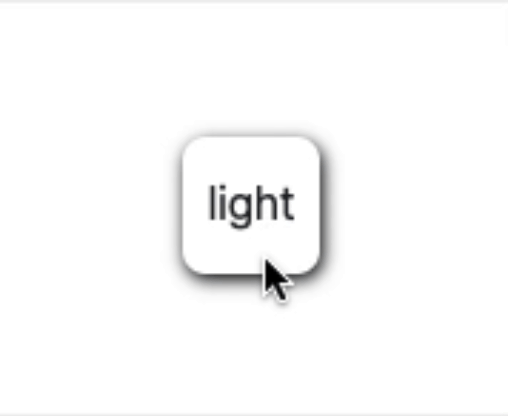
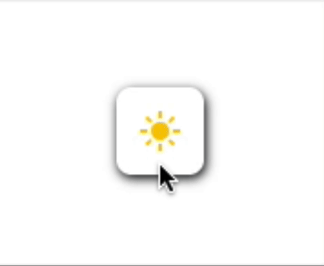
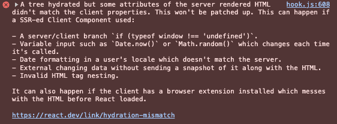

여러 사이트를 돌아다니다 보면, 다양한 사이트에서 다양한 방법으로 다크 테마가 구현되어 있다. 나도 최근에 이력서 페이지를 웹으로 개발하면서 다크 테마를 적용했다. 그래서 블로그에도 TailwindCSS를 활용해서 다크 테마를 적용하려고 했다.

그런데 이력서와 블로그 모두 `yarn create next-app` 을 사용해서 구현했는데, 그 사이에 패키지의 TailwindCSS 버전이 `3.4.1` 에서 `4` 로 올라가버렸다.

그래서 `TailwindCSS@4` 기준으로 테마를 적용하면서, 중간중간 이전 버전과의 차이를 함께 정리해서 글로 정리하려 한다.

### TailwindCSS Dark Theme

TailwindCSS에는 기본적으로 시스템의 설정이 다크 모드일 때, 스타일을 다르게 지정할 수 있는 `variant`가 정의되어 있다. 다크 모드에 대한 스타일을 설정하고 싶다면, `dark:` 뒤에 원하는 스타일을 추가하면 모드에 따라 스타일을 적용해준다.

```html
<p className="text-black dark:text-white">Toggle color</p>
```

CSS 파일에서도 `prefers-color-scheme` 미디어 쿼리를 사용하면 다크 모드에 대한 스타일을 별도로 정의할 수 있다. Nextjs 프로젝트를 초기화하면 `globals.css`에 모드별 변수를 정의해둔 것을 볼 수 있다.

```css
:root {
  --background: #ffffff;
  --foreground: #171717;
}

@theme inline {
  --color-background: var(--background);
  --color-foreground: var(--foreground);
}

@media (prefers-color-scheme: dark) {
  :root {
    --background: #0a0a0a;
    --foreground: #ededed;
  }
}
```

기본적으로 TailwindCSS는 미디어 쿼리를 사용하지만, 수동으로 전환하는 기능 역시 제공해준다.

```css
@custom-variant dark (&:where(.dark, .dark *));
```

해당 방식으로 다크 모드를 선언하면, `dark:` 유틸리티는 이제 미디어 쿼리를 따라가는 대신, HTML 태그 트리에서 `dark` 클래스가 적용된 요소의 하위 요소들이 해당 클래스를 참조해서 변경된다.

```html
<html class="dark">
  <body>
    <p className="text-black dark:text-white">Toggle color</p>
  </body>
</html>
```

<details>
<summary>이전 버전에서는?</summary>

이전 버전의 경우에는 `tailwind.config.ts`를 통해서 TailwindCSS의 설정을 관리할 수 있다. 테마의 경우 `@theme` 대신 해당 파일 내부에서 테마를 확장하는 방식으로 설정할 수 있다. 그리고 설정의 `darkMode` 속성에 `selector` 값을 할당하면 클래스 제어로 전환할 수 있고, 기본값은 `media`이다. 이력서 페이지를 만들 때에는 `class`를 적용했었는데, 문서에 따르면 `3.4.1` 버전 이후로는 `class`가 `selector`로 대체되었다고 한다.

```js
  // !mark(2)
  export default {
    darkMode: 'selector',
    theme: {
      extend: {
        colors: {
          background: "var(--background)",
          foreground: "var(--foreground)",
        },
      },
    }
    ...
  }
```

</details>

### 토글 구현하기

그럼 이제 테마를 토글하는 기능을 구현해보자. 테마 토글 버튼의 경우 디자인은 다양한데, 그냥 누르면 바뀌는 것 보다는 버튼에 애니메이션도 넣고, 색상이 변경될 때 트랜지션도 넣고 싶었다. 그래서 찾아보다가 [[CSS] 해와 달이 뜨고 지는 다크모드 버튼 만들기](https://sirius7.tistory.com/143) 글을 참고해서 버튼을 구현하기로 했다.

우선, `globals.css`의 내용을 미디어 대신 클래스를 참조하도록 수정했다. 그리고 텍스트와 배경색이 변경될 때 트랜지션을 주고싶어서 유틸리티 클래스도 작성했다. 일반 클래스로 선언해도 됬지만, 유틸리티로 추가할 경우 자동 완성을 지원해준다(VSCode에 Tailwind CSS IntelliSense를 설치한 기준). 유틸리티는 다양한 `variant`를 자동으로 지원해주고, 설명은 [ADDING CUSTOM UTILITIES](https://tailwindcss.com/docs/adding-custom-styles#adding-custom-utilities)에 잘 되어 있다.

```css
:root {
  --background: #ffffff;
  --foreground: #212529;
}

:root.dark {
  --background: #212529;
  --foreground: #dddddd;
}

@custom-variant dark (&:where(.dark, .dark *));

@utility linear-transition-colors {
  transition-duration: 0.2s;
  transition-timing-function: linear;
  transition-property: color, fill, background;
}
```

설정한 색상과 유틸리티를 `body`태그에 적용했다.

```tsx
export default function RootLayout({
  children
}: Readonly<{
  children: React.ReactNode;
}>) {
  ...
  return (
    ...
    <body className='bg-background text-foreground linear-transition-colors'>
      ...
    </body>
    ...
  )
}
```

<details>
  <summary>이전 버전에서는?</summary>

이전 버전에서는 유틸리티 클래스가 없는 대신, `@layer`를 사용해서 선언하면 동일하게 작동한다. 간단한 경우 그냥 일반 클래스로 작성해줘도 된다.

```css
@layer utilities {
  .linear-transition-colors {
    transition-duration: 0.2s;
    transition-timing-function: linear;
    transition-property: color, fill, background-color;
  }
}
```

하지만 이 방법의 경우 자동 완성을 지원해주지는 않는다. 자동 완성을 지원받고 싶은 경우에는 TailwindCSS 설정에 플러그인을 추가하는 방식으로 사용한다면 가능하다.

```ts
import plugin from 'tailwindcss/plugin';

export default {
  ...
  plugins: [
    plugin(({addUtilities}) => {
      addUtilities({
        '.linear-transition-color': {
          transitionDuration: '0.2s',
          transitionTimingFunction: 'linear',
          transitionProperty: 'color, fill, background-color',
        }
      })
    })
  ],
  ...
}
```

</details>

다음으로 토글하는 로직을 구현하기 위해 `useToggleTheme` 훅을 작성했다. 함수를 호출하면 HTML 태그의 클래스 목록에 `dark`가 있는지 체크한 후 목록에서 토글하도록 했다.

```tsx
"use client";

import { useCallback, useState } from "react";

function useToggleTheme() {
  const toggle = useCallback(() => {
    const isNextDark = !document.documentElement.classList.contains("dark");
    document.documentElement.classList.toggle("dark", isNextDark);
  }, []);

  return toggle;
}

export default useToggleTheme;
```

그리고 `ThemeWidget` 컴포넌트를 작성해서 기본적인 디자인과 기능을 구현했다. 라이트 테마일 때에는 `light` 텍스트가, 다크 테마일 때에는 `dark`가 출력되도록 했다.

```tsx
"use client";

import useToggleTheme from "@/hooks/useToggleTheme";

export interface ThemeWidgetProps {
  className?: string;
}

function ThemeWidget({ className }: ThemeWidgetProps) {
  const toggleTheme = useToggleTheme();

  return (
    <div
      className={
        "w-12 h-12 rounded-lg shadow-[1px_2px_6px_0px] shadow-black" +
        (className ? ` ${className}` : "")
      }
      onClick={toggleTheme}
    >
      <div className="absolute w-12 h-12 flex justify-center items-center dark:hidden">
        light
      </div>
      <div className="absolute w-12 h-12 hidden justify-center items-center dark:flex">
        dark
      </div>
    </div>
  );
}

export default ThemeWidget;
```

`layout.tsx`에 추가해서 돔에 삽입한 후 눌러보면 정상적으로 작동하는 것을 확인할 수 있다.



다음으로 [[CSS] 해와 달이 뜨고 지는 다크모드 버튼 만들기](https://sirius7.tistory.com/143)를 참고해서, 해와 달이 뜨고 지는 애니메이션을 적용해보았다.

TailwindCSS에서는 다양한 기본 애니메이션을 제공해주지만, 원하는 애니메이션은 직접 작성해야 한다. 기존 CSS에서 작성하던 방식과 동일하게 `keyframes`를 선언하고, 테마에 추가해서 사용하면 된다.

```css
@theme {
  ...
  --animate-rise: rise 0.6s forwards;
  --animate-set: set 0.6s forwards;
}

@keyframes rise {
  0% {
    transform: rotate(180deg);
  }

  100% {
    transform: rotate(360deg);
  }
}

@keyframes set {
  0% {
    transform: rotate(0);
  }

  100% {
    transform: rotate(180deg);
  }
}
```

그리고 `ThemeWidget` 컴포넌트의 각 `light`, `dark` 영역에 회전축을 중앙 아래로 설정하고 애니메이션을 적용했다.

```tsx
<div className="absolute w-12 h-12 flex justify-center items-center origin-[50%_100%] animate-rise dark:animate-set">
  light
</div>
<div className="absolute w-12 h-12 flex justify-center items-center origin-[50%_100%] animate-set dark:animate-rise">
  dark
</div>
```

<details>
  <summary>이전 버전에서는?</summary>

기본 클래스로는 `dark:` `variant`가 적용되지 않기 때문에, 이번에는 `@layer` 를 사용해야만 한다. 하지만 역시 자동 완성은 지원되지 않는다. 자동 완성을 지원받고 싶은 경우에는 TailwindCSS 설정에서 테마를 확장하는 방식으로 사용한다면 가능하다.

```ts
export default {
  ...
  theme: {
    ...
    extend: {
      ...
      keyframes: {
        rise: {
          "0%": {
            transform: "rotate(180deg)"
          },
          "100%": {
            transform: "rotate(360deg)"
          }
        },
        set: {
          "0%": {
            transform: "rotate(0)"
          },
          "100%": {
            transform: "rotate(180deg)"
          }
        }
      },
      animation: {
        rise: "rise 0.6s forwards",
        set: "set 0.6s forwards"
      },
      ...
    }
    ...
  }
  ...
}
```

</details>

다음으로 아이콘을 추가하려는데, 아이콘으로 SVG를 사용하고 싶었다. React에서 SVG를 쓰는 방법은 다양하지만, 나는 컴포넌트로 직접 선언하는 것 보다 SVG파일을 컴포넌트로 import 해서 사용하는 것을 선호한다. 그래서 `@svgr/webpack` 의존성을 추가하고, `next.config.ts`를 아래와 같이 수정했다.

```ts
const nextConfig: NextConfig = {
  ...
  webpack(config) {
    config.module.rules.push({
      test: /\.svg$/,
      use: [
        {
          loader: "@svgr/webpack"
        }
      ]
    });

    return config;
  }
  ...
}
```

그리고 적절한 아이콘을 찾아 컴포넌트에 추가했다.

```tsx
<div className="absolute w-12 h-12 flex justify-center items-center origin-[50%_100%] animate-rise dark:animate-set">
  <Sun className="fill-yellow-400" />
</div>
<div className="absolute w-12 h-12 flex justify-center items-center origin-[50%_100%] animate-set dark:animate-rise">
  <Moon className="fill-yellow-400" />
</div>
```

그리고 확인해보면 해가 달이 뜨고 지는 애니메이션이 적용되었고, 이렇게 토글 버튼을 구현할 수 있었다.



### 기본 테마를 시스템 설정에 맞추기

그런데 개발을 하고 보니, 기본 시스템 설정이 다크 모드일 때에도 기본적으로 라이트(기본) 테마가 적용 된다. 설정할 때 미디어 쿼리 대신 클래스를 따라라게 했는데, 첫 접속때에는 클래스가 설정되어 있지 않기 때문이다.

현재 시스템의 설정값은 `window.matchMedia` 메서드를 활용한다면 확인할 수 있다.

```ts
window.matchMedia("(prefers-color-scheme: dark)").matches; // true | false;
```

이를 활용해서 접속했을 때 시스템 테마가 다크 모드라면, 다크 테마가 적용되도록 구현했다.

우선 테마 관련 로직을 별도로 관리하기 위해 `utils/theme.ts` 파일로 분리했다.

```ts
export function isSystemDarkMode() {
  return (
    !!window.matchMedia &&
    window.matchMedia("(prefers-color-scheme: dark)").matches
  );
}

export function isDocumentDarkTheme() {
  return document.documentElement.classList.contains("dark");
}

export function toggleDarkTheme(flag?: boolean) {
  const next = flag ?? !isSystemDarkMode();

  document.documentElement.classList.toggle("dark", next);
  return next;
}
```

그리고 `useToggleTheme` 훅에서, 접속 시 시스템 테마를 식별해서 다크 모드라면 다크 테마가 적용되도록 `useEffect`를 활용해서 구현했다.

```tsx
"use client";

import {
  isDocumentDarkTheme,
  isSystemDarkTheme,
  toggleDarkTheme
} from "@/utils/theme";
import { useCallback, useEffect } from "react";

function useToggleTheme() {
  useEffect(() => {
    if (isSystemDarkTheme()) {
      toggleDarkTheme(true);
    }
  }, []);

  const toggle = useCallback(() => {
    const isNextDark = !isDocumentDarkTheme();
    toggleDarkTheme(isNextDark);
  }, []);

  return toggle;
}

export default useToggleTheme;
```

이렇게 해서 접속 시 시스템 설정이 다크 모드라면, 다크 테마가 적용이 되도록 구현했..는데 뭔가 이상하다. 새로 고침하거나 재접속하면, 처음에 라이트 테마였다가 다크 테마로 전환된다.

어떻게 보면 당연하다. `useToggleTheme` 내부의 `useEffect` 는 결국 React 코드로서 랜더링이 전부 끝난 후 실행된다. 그러니까 화면을 그릴 때에는 여전히 HTML 태그의 클래스에 `dark` 가 없기 때문에 흰색 화면이 그려지고, 이후에 `useEffect` 가 실행되어 토글되기 때문이다.

이 증상은 `useLayoutEffect`를 사용해도 조금 빠르게 전환될 뿐 깜빡거리는 것은 여전하다. [다크 모드 - 화면 깜빡임(FOUC) 이슈 해결 및 시스템 설정과 연동](https://bttrthn-ystrdy.tistory.com/95) 에서는 `useLayoutEffect`를 사용해서 깜빡거리는 증상은 해결됬다고 했는데, 나는 여전히 증상이 남아있었다. 이유는 정확히 파악하지 못했는데, 이력서든 블로그든 SSG로 생성되기 때문에, 미리 만들어진 화면을 보여주기 때문이라는 추측을 해본다.

아무튼, 위 글에서도 언급하는데, 해당 증상은 Nextjs 코드가 실행되기 전(화면을 그리기 전)에 미리 처리한다면 해결할 수 있을 것으로 생각했다. 브라우저는 HTML 문서를 파싱하면서 스크립트 태그를 만나면 별다른 설정을 하지 않는 이상 파싱을 멈추고 스크립트부터 실행한다. 그러니 `body` 태그 이전, 화면을 그리기 전에 로직을 실행하면 될 것 같았다.

Nextjs에서는 스크립트 태그를 위한 `Script` 컴포넌트를 지원해주는데, 아쉽게도 `head` 에 넣어주진 않는다. 그래서 `SyncThemeScript` 컴포넌트를 만들고 스크립트 태그를 직접 사용해 로직을 작성해줬다.

```tsx
import { isSystemDarkTheme, toggleDarkTheme } from "@/utils/theme";

const DANGEROUS_HTML = {
  __html: `
    (${toggleDarkTheme})((${isSystemDarkTheme})());
  `
};

function SyncThemeScript() {
  return (
    <script id="syn_theme_script" dangerouslySetInnerHTML={DANGEROUS_HTML} />
  );
}

export default SyncThemeScript;
```

함수의 `toString` 메서드는 함수의 내용을 그대로 문자열로 치환해준다. 이를 이용하면 문자열을 조합해 위의 방식으로 함수를 실행하는 스크립트 문자열을 만들 수 있다.

이후 `layout.tsx`에 추가해서 스크립트 태그가 `head` 태그에 들어갈 수 있도록 작성했다. 그리고 체크 로직을 스크립트로 실행하기 때문에 `useToggleTheme` 내부의 `useEffect`는 필요 없어져서 지워주었다.

```tsx
<html>
  <head>
    <SyncThemeScript />
  </head>
  ...
</html>
```

작업을 마치고 새로고침을 하니 화면이 깜빡이는 문제 없이 정상적으로 시스템 테마를 따라가는 것을 확인할 수 있었다. 그리고 새로운 이슈를 마주하게 된다.



이 에러는 `hydration mismatch`로, 서버에서 랜더링된 결과물과 클라이언트에서의 결과물이 다르다는 이야기이다. `hydration mismatch`에 대한 자세한 설명은 [공식 문서-hydration mismatch](https://nextjs.org/docs/messages/react-hydration-error)와 [React의 hydration mismatch](https://blog.hwahae.co.kr/all/tech/13604) 글을 참조하면 좋을 것 같다.

여기에서는 위의 스크립트가 브라우저에서 실행되면서 HTML 태그의 클래스를 변경시켰기 때문에 발생한 것이다. 하지만 화면이 깜빡이는 문제를 해결하기 위해서는 어쩔 수 없기 때문에, `suppressHydrationWarning` 을 HTML 태그에 추가해서 하이드레이션 경고를 끌 수 있어서 적용했다. 해당 옵션은 해당 태그에만 적용되고, 하위에서 발생할 경우 여전히 발생할 수 있다고 한다. 그래서 다른 원인으로 발생할 경우 에러가 재등장할 수 있다고 해서, 다른 곳에서 문제가 생겼을 때에는 알 수 있다는 것에 조금 안심하고 적용했다.

```tsx
<html>
  <head suppressHydrationWarning>
    <SyncThemeScript />
  </head>
  ...
</html>
```

# 테마 설정값을 유지하기

이제 접속 시 시스템 테마를 따라가는 것 까지 설정을 완료했다. 그러나 설정을 유지해주지는 않는다. 시스템 설정이 다크 모드여서 화이트 테마로 토글한 후 새로 고침을 하면 다크 테마로 돌아간다. 그래서 마지막으로 재접속시 테마를 토글한 적이 있다면, 마지막 상태를 적용하는 로직을 구현해보았다.

설정값을 저장하는 곳으로는 `localStorage`가 적당할 것 같다. `theme.ts` 파일에 `localStorage`를 사용해 테마를 관리하는 로직을 추가했다.

```ts
export function isSettingDark() {
  return localStorage.theme
    ? localStorage.theme === "dark"
    : isSystemDarkTheme();
}

export function toggleDarkTheme(flag?: boolean) {
  const next = flag ?? !isSettingDark();

  document.documentElement.classList.toggle("dark", next);
  localStorage.setItem("theme", next ? "dark" : "light");

  return next;
}
```

`localStorage`확인하고 값이 없다면 시스템 설정을 따라가게 하는 `isSettingDark` 함수를 정의하고, 원래 `isSystemDarkTheme` 함수가 하는 역할을 대신 하도록 했다. `toggleDarkTheme`은 다음 테마를 `localStorage`에 추가하도록 수정했다.

마지막으로, `SyncThemeScript` 의 HTML 컨텐츠를 수정해주었다. `isSystemDarkTheme` 대신 `isSettingDark` 가 실행되도록 변경하였다. 그리고 이 함수는 내부에서 `isSystemDarkTheme`를 사용하기 때문에, 참조할 수 있도록 내부에 추가했다.

```ts
import {
  isSettingDark,
  isSystemDarkTheme,
  toggleDarkTheme
} from "@/utils/theme";

const DANGEROUS_HTML = {
  __html: `
    ${isSystemDarkTheme}
    (${toggleDarkTheme})((${isSettingDark})());
  `
};
```

이를 통해, Nextjs에서 TailwindCSS를 활용해 다크 테마를 구현할 수 있게 되었다.

### 참고

- [[CSS] 해와 달이 뜨고 지는 다크모드 버튼 만들기](https://sirius7.tistory.com/143)
- [TailwindCSS 공식 문서 - ADDING CUSTOM UTILITIES](https://tailwindcss.com/docs/adding-custom-styles#adding-custom-utilities)
- [[tailwind] custom 해서 사용하기](https://velog.io/@kcs0702/tailwind-custom-해서-사용하기)
- [다크 모드 - 화면 깜빡임(FOUC) 이슈 해결 및 시스템 설정과 연동](https://bttrthn-ystrdy.tistory.com/95)
- [Nextjs 공식 문서 - hydration mismatch](https://nextjs.org/docs/messages/react-hydration-error)
- [React의 hydration mismatch](https://blog.hwahae.co.kr/all/tech/13604)
