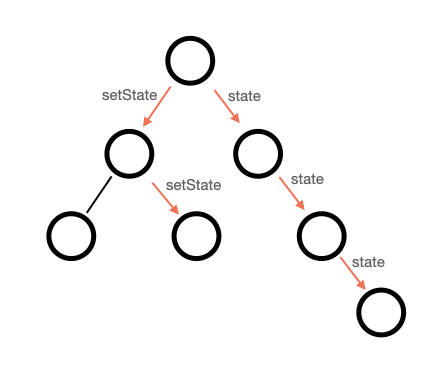
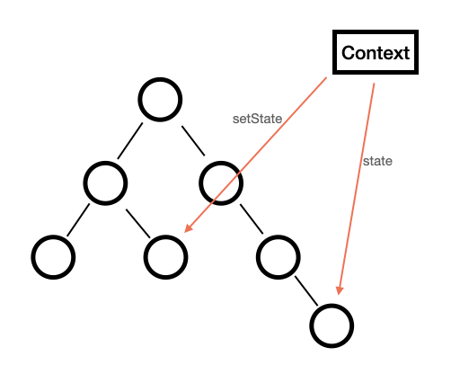
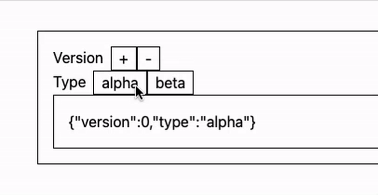
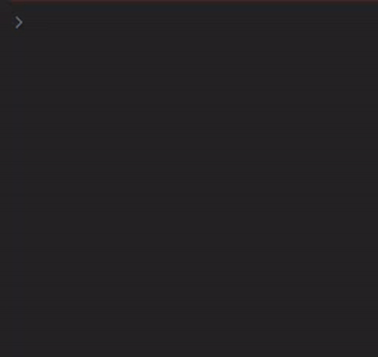
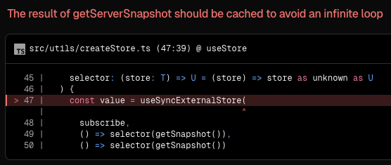

간혹 프로젝트를 진행하다 보면, 인접한 컴포넌트들이 상태를 공유해야 하는 순간이 있다. 이럴 때, 보통은 상태 선언 위치를 재조정하여 `props`를 통해 전달하도록 한다.

그러나 해당 방법은 컴포넌트 사이의 거리가 멀 때 등 어느 정도 한계가 존재하여, 프로젝트의 복잡성이 증가하게 된다. 이 경우 보통 전역 상태를 추가하여 각 컴포넌트들이 상태를 공유하도록 만들어 문제를 해결할 수 있다.

전역 상태는 React의 Context API 또는 다양한 외부 라이브러리를 통해 정의할 수 있다. 대표적으로 React, Zustand가 있으며, 라이브러리를 사용한다면 전역 상태를 손 쉽게 정의하고 관리할 수 있게 된다.

그런데 꼭 외부 상태 라이브러리를 사용해야 할까? React의 자체 기능만으로는 할 수 없을까? 같은 고민을 하던 도중, `useSyncExternalStore` API 를 접하게 되었다.

이 글에서는, 상태에 대한 고민과 `useSyncExternalStore`를 소개하고, 간단한 전역 상태 모듈을 구현해보고자 한다.

### React의 상태

React 컴포넌트는 자신만의 상태(state)를 가질 수 있다. 버튼의 클릭 횟수, 사용자가 입력한 값, 토글 상태 등 대부분의 UI 상태는 이 방식으로 관리된다.

React 컴포넌트는 클래스 컴포넌트와 함수형 컴포넌트 두 개로 나뉘고, 그 중 함수형 컴포넌트의 상태는 `useState` 라는 Hook을 통해 정의한다.

```tsx
const [state, setState] = useState(initialValue);
```

`useState` 에서 반환하는 배열의 첫 번째는 상태의 값을 나타내고, 두 번째는 해당 값을 업데이트 하는 `setter` 함수이다. `setter` 함수는 값을 전달하거나, 이전값을 참조하여 새 값을 반환하는 함수를 전달할 수 있다.

```tsx
setState(nextValue);
setValue((prev) => {
  /* process */
});
```

예를 들어, 아래 컴포넌트는 버튼을 눌러 숫자를 증감시키는 컴포넌트로, `useState`를 사용하여 `count` 라는 상태를 선언해 사용하고 있다. 그리고 버튼을 누를 때 마다 `setCount` 함수를 통해 1씩 더하거나 빼 상태를 업데이트 한다.

```tsx Counter.tsx
function Counter() {
  const [count, setCount] = useState(0);

  return (
    <div>
      <p>{count}</p>
      <div>
        <button type="button" onClick={() => setCount(count + 1)}>
          +
        </button>
        <button type="button" onClick={() => setCount(count - 1)}>
          -
        </button>
      </div>
    </div>
  );
}
```

이처럼 각 컴포넌트는 상태를 가질 수 있고, 해당 상태를 업데이트하며 이를 사용한다.

한편, React 프로젝트를 진행하며 다양한 상태를 정의하고 사용하는 과정에서, 특정 상태를 다른 컴포넌트들이 공유하여 사용해야 하는 경우가 생길 수 있다. 이는 React를 개발하면서 자주 접할 수 있는 상황이다.

위 `Counter` 컴포넌트의 상태 `count`를 보여주는 UI와 제어하는 버튼 UI를 `CounterViewer`와 `CounterController` 컴포넌트로 분리하고 싶다고 하자. `CounterViewer`는 상태값을, `CounterController`는 `setter` 함수를 필요로 한다. 당연하게도, 상태를 각각 선언하면 서로 공유되지 않는다.

```tsx
function CounterViewer() {
  const [count, setCount] = useState(0);
  return <p>{counter}</p>;
}

function CounterController() {
  const [count, setCount] = useState(0);
  return (
    <div>
      <button type="button" onClick={() => setCount(count + 1)}>
        +
      </button>
      <button type="button" onClick={() => setCount(count - 1)}>
        -
      </button>
    </div>
  );
}
```

동일한 이름으로 선언하더라도, 상태는 해당 컴포넌트의 상태이기 때문에 서로 독립된 값을 가진다. 그래서 `CounterController`의 `setCount`를 호출하더라도, `CounterViewer`의 `count`는 변경되지 않는다.

이 경우, 같은 부모로 해당 상태의 위치를 끌어올리고 `props`를 전달하는 방식으로 해결할 수 있다.

```tsx Counter.tsx
function Conter() {
  const [count, setCount] = useState(0);

  return (
    <div>
      <CounterViewer count={count} />
      <CounterController
        onIncrease={() => setCount(count + 1)}
        onDecrease={() => setCount(count - 1)}
      />
    </div>
  );
}
```

해당 방식은 컴포넌트들간의 거리가 가까울 경우에 쉽게 선택할 수 있는 선택지이다. 그런데 프로젝트의 구조가 복잡하거나, 공유해야 하는 컴포넌트 사이의 거리가 멀다면 조금 복잡해진다.

컴포넌트들이 상태(데이터)를 공유하기 위해서는, 공통 부모로 상태를 끌어올리면 가능하다고 했다. 하지만 컴포넌트의 거리가 멀다면, 상태를 정의하는 부모 컴포넌트와의 거리도 멀어질 수 있다.

이런 경우, 상태가 정의된 곳과 실제로 상태를 사용하는 곳의 트리의 깊이가 많이 멀어지고, 실제로 사용하는 컴포넌트로 전달하기 위해 `props`로 전달해주어야 한다. 그런데 중간에 해당 상태를 사용하지 않는 컴포넌트도 아래로 전달하기 위해 `props`로 전달받아야 하며, 몇 단계에 걸친 `props` drilling 이 발생한다.



해당 상황을 반복하다 보면, 어떤 상태가 어느 위치에서 관리되고 있는지, 실제로 어느 곳에서 필요한 것인지 관리하기 어려워진다. 그리고 `props` drilling 으로 인해 불필요한 리렌더링이 발생할 수 있다.

그래서, 다른 컴포넌트들 끼리 상태를 공유할 수 있는 효율적인 수단이 필요하게 되었다.

### 전역 상태

그래서, 이를 해결하기 위해 React의 Context API가 등장하게 되었다.

Context API는 React 16.3에 정식 지원된 기능으로, 컴포넌트 트리 전체에 걸쳐 데이터를 공유할 수 있는 방법이다. 상태나 값을 직접 `props`로 넘기지 않더라도, 트리 하위에 위치한 컴포넌트들이 이를 참조할 수 있는 수단을 제공해준다. 이를 활용하면, 동일한 상태를 `props` drilling 을 회피하며 여러 컴포넌트들이 참조할 수 있게 된다.

> 16.3 이전에도 Context API는 존재했지만, 안정적이지 않았고 실험적인 기능으로 제공되었기 때문에 사용이 권장되지 않았다. ( [공식 문서 - 16.3 Release note](https://legacy.reactjs.org/blog/2018/03/29/react-v-16-3.html?utm_source=chatgpt.com#official-context-api))

Context API를 간단히 알아보기 위해, 이전 `Counter` 컴포넌트의 `props`로 전달하는 방식을 Context로 변경해보자.

우선, Context는 `createContext` 함수를 호출해 정의한다.

```tsx CounterProvider.tsx
interface CounterContextType {
  count: number;
  setCount: React.Dispatch<React.SetStateAction<number>>;
}

const CounterContext = createContext<CounterContextType | undefined>(undefined);
```

Context에는 `Provider`와 `Consumer` 라는 개념이 존재한다. `Provider`는 데이터를 공급하는 역할을 하고, `Consumer`는 Context의 값을 참조할 때 사용한다.

> Context의 초기값을 `undefined`로 설정하지 않고, 실제로 기본 값을 할당해도 상관 없다. 하지만 기본 값을 할당할 경우, 이후 설명할 `Provider` 밖에서 참조를 시도하더라도 정상적으로 작동한다. 초기값을 `undefined`로 할당하면 참조할 때 예외 처리를 통해 문제를 빠르게 발견할 수 있다.

먼저 `Provider`는 컴포넌트 트리를 감싸는 방식으로 사용한다.

```tsx
<Provider>{children}</Provider>
```

사용할 데이터를 선언하고, `Provider`에 전달하는 `CounterProvider`를 작성한다.

```tsx CounterProvider.tsx
...
function CounterProvider({ children }: { children: React.ReactNode }) {
  const [count, setCount] = useState(0);

  return (
    <CounterContext.Provider value={{ count, setCount }}>
      {children}
    </CounterContext.Provider>
  )
}

export default CounterContext;
export { CounterProvider };
```

그리고 `Counter` 컴포넌트에서 상태를 제거하고, 데이터를 제공할 컴포넌트들을 작성한 `Provider`로 감싼다.

```tsx Counter.tsx
import { CounterProvider } from "CounterContext";

function Counter() {
  return (
    <div>
      <CounterProvider>
        <CounterViewer />
        <CounterController />
      </CounterProvider>
    </div>
  );
}
```

Context의 데이터를 참조하는 방법은 두 가지가 있는데, 하나는 `Consumer`를 사용하는 방법이다. `CounterViewer` 컴포넌트를 `Consumer`를 사용해 Context를 참조하도록 변경해 보았다.

```tsx CounterViewer.tsx
import CounterContext from "CounterContext";

function CounterViewer() {
  return (
    <CounterContext.Consumer>
      {(context) => {
        if (!context) {
          // 예외 처리를 통해, Provider의 트리 안에서 사용하는지 확인할 수 있다.
          throw new Error("CounterViewer must be used in CounterProvider.");
        }

        return <p>{context.count}</p>;
      }}
    </CounterContext.Consumer>
  );
}
```

`Consumer`는 `Provider`와 동일하게 컴포넌트 형식으로 사용하여, `render props`를 사용하여 Context의 데이터를 참조할 수 있다.

또 다른 방법으로는 `useContext`를 사용하는 방법이다. 이번엔 `CounterController` 컴포넌트가 `useContext`를 사용하도록 변경해보자.

```tsx CounterController.tsx
import { useContext } from "react";
import CounterContext from "CounterContext";

function CounterContext() {
  const context = useContext(CounterContext);
  if (!context) {
    // 예외 처리를 통해, Provider의 트리 안에서 사용하는지 확인할 수 있다.
    throw new Error("CounterViewer must be used in CounterProvider.");
  }

  const { setCount } = context;

  return (
    <div>
      <button type="button" onClick={() => setCount(count + 1)}>
        +
      </button>
      <button type="button" onClick={() => setCount(count - 1)}>
        -
      </button>
    </div>
  );
}
```

`useContext` Hook에 Context를 할당하여 이를 참조하는 방식이다. 이 방식은 기존 Hook 사용 방법과 비슷하여 익숙한 패턴으로 사용할 수 있다.

`Consumer`의 경우 `render props` 패턴을 사용하기 때문에, 일반 로직과 함께 사용하기(`useEffect`에서 참조하기 등) 까다롭고 코드의 가시성이 떨어질 수 있다. 또한, 컴포넌트와 강결합되어 Context를 참조하는 로직을 추상화 하거나 재사용하기 어렵다. 이 방식은 주로 클래스 컴포넌트에서 Context를 참조하기 위해 사용된다.

`useContext`는 함수형 컴포넌트 안에서 사용하는 Hook으로, 일반 상태처럼 Context에 쉽게 접근하여 사용할 수 있다. 직관적이고 일반 로직과 함께 사용하기 쉬워지며, Custom Hook으로 로직을 분리하면 재사용성도 확보할 수 있다.

참조하는 방식을 정리하자면, Context를 참조하는 방법은 두 가지가 있으며, 클래스 컴포넌트에서는 `Consumer`를, 그리고 함수형 컴포넌트에서는 수월한 Context 참조 및 로직 작성을 위해 `useContext`를 사용하는 것이 일반적이다.

이처럼, Context API 를 사용하면 멀리 떨어진 컴포넌트들이 상태를 공유할 수 있게 된다. 예제로 든 `Counter` 컴포넌트는 동일한 깊이의 컴포넌트라 `props`로 전달하는게 훨씬 간단하겠으나, 컴포넌트 사이의 거리가 멀어질 경우에 유용하다. 컴포넌트 트리의 구성과는 상관없이, `Provider` 하위에 위치한 컴포넌트라면 어디서든 참조가 가능하다.

그래서 테마 같은 서비스의 환경 설정이나 사용자 인증 정보 등, **트리의 깊이에 상관없이 여러 컴포넌트가 동일한 값에 접근해야 할 때** 유용하게 사용할 수 있다.



하지만 Context API는 단점도 존재한다. 우선, Context를 참조하는 모든 컴포넌트들은 상태가 바뀔 때 무조건 리렌더링 된다.

> 16.3 버전 이전의 Context API의 경우, Provider 내의 모든 자식 컴포넌트가 리렌더링 되었다. 16.3 이후에 정식으로 릴리즈된 현재 API는 해당 문제가 해결되었다.

예를 들어, Context가 단일 상태가 아닌, 여러 개의 데이터를 가진다고 생각해보자.

```tsx
interface GeneralContextType {
  theme: "dark" | "light";
  lang: "en" | "ko";
  toggleTheme: (theme: GeneralContextType["theme"]) => void;
  toggleLang: (lang: GeneralContextType["lang"]) => void;
}
```

Context에는 테마와 현재 언어를 표현하는 상태가 정의되어 있고, `ThemeManager`라는 컴포넌트에서는 `theme` 속성만 참조하고 있다.

```tsx
function ThemeManager() {
  const { theme } = useContext(GeneralContext);
}
```

이 때, `lang` 속성이 변경되어도 `ThemeManager` 컴포넌트는 리렌더링된다. `GeneralContext`의 상태는 객체로, 상태를 변경시키기 위해서는 새 객체를 전달해야 한다. Context는 내부적으로 `Object.is` 를 사용해 이전값과 새 값을 비교하기 때문이다([공식 문서 - Context.Provider](https://legacy.reactjs.org/docs/context.html#contextprovider)).

```tsx
function GeneralContextProvider({ children }: { children: React.ReactNode }) {
  const [state, setState] = useState<
    Pick<GeneralContextType, "theme" | "lang">
  >({ theme: "light", lang: "ko" });

  const toggleTheme: GeneralContext["toggleTheme"] = useCallback((theme) => {
    setState((prev) => ({ ...prev, theme }));
  }, []);
  ...
  const value = useMemo(() => ({
    ...state,
    toggleTheme,
    toggleLang,
  }), [state, toggleTheme, toggleLang]);

  return (
    <GeneralContext.Provider value={value}>
      {children}
    </GeneralContext.Provider>
  );
}
```

따라서, `ThemeManager`가 `theme` 속성을 읽는다고 해도, 참조하는 Context는 객체이므로, 다른 속성이 변경되면 객체가 변경되므로 해당 컴포넌트는 리렌더링 된다. 특정 속성만을 선택하여 구독하는(일명 Selector) 기능이 제공된다면 좋겠지만, Context는 해당 기능을 제공해주지 않는다. 그래서 단일 Context 상태의 속성이 많아질 경우, 불필요한 리렌더링이 자주 발생할 수 있다.

물론, 이것은 Context를 분리한다면 어느정도 해결할 수 있다. `theme`와 `lang`은 확실히 다른 속성이므로, 분리하여 표현이 가능하다.

```tsx
const ThemeContext = createContext<"light" | "dark" | undefined>(undefined);
const LangContext = createContext<"en" | "ko" | undefined>(undefined);
```

그런데 Context는 `Provider`의 자식 트리에 데이터를 제공하므로, 여러 Context를 사용할 경우 이를 중첩해서 감싸주어야 한다. 그래서 Context의 가짓수가 많아지면 조금은 보기 불편해질 수 있다.

```tsx App.tsx
function App() {
  return (
    <ThemeContextProvider>
      <LangContextProvider>
        <SomeContextProvider>
          <OtherContextProvider>...</OtherContextProvider>
        </SomeContextProvider>
      </LangContextProvider>
    </ThemeContextProvider>
  );
}
```

Context API의 대안으로는, 외부 상태 관리 도구들이 있다. 대표적으로 Redux, Zustand같은 라이브러리들이다. 이는 상태를 컴포넌트 트리와 분리하고, Selector를 통해 더욱 세밀하게 구독이 가능하다.

Redux는 상태를 중앙에서 일관되게 관리할 수 있고, action-dispatch 구조의 Flux 패턴으로 변경 흐름을 명확히 추적할 수 있다. Zustand의 경우에는 Redux에 비해 간단한 API를 제공하여, 전역 상태를 쉽게 정의하고 참조할 수 있는 수단을 제공한다.

이러한 도구들은 Context API의 한계를 잘 보완하지만, 한편으로는 프로젝트의 외부 라이브러리에 대한 의존성이 증가하게 된다. 그리고 별도의 설정과 러닝 커브에 대한 부담이 있을 수 있다.

그렇다면 React의 기능만으로 전역 상태를 정의하고 구독할 수 있는 방법은 없을까?

### useSyncExternalStore

React 18에서는 자체적으로 상태 공유를 안전하게 다룰 수 있도록 `useSyncExternalStore` Hook이 공식적으로 도입되었다. 이는 React 컴포넌트 외부에 존재하는 상태를 구독하고 동기화를 할 수 있도록 해주는 기능으로, 값이 변경되었을 때 React의 렌더링 흐름에 맞추어 컴포넌트를 정확하게 업데이트해준다.

기존에도 외부 상태를 수동으로 구독하고, 상태가 바뀌면 `useEffect`에서 업데이트 하는 방식이 있었으나, 이 방식은 `useEffect`가 렌더링 이후에 실행되는 특성 상, React의 Concurrent Mode나 Strict Mode에서는 안전하지 않을 수 있었다. Strict Mode에서는 두 번 호출되며 구독 해지를 빼먹을 경우 상태가 꼬일 수 있었고, Concurrent Mode에서는 실행이 지연되어, 도중에 상태가 변경되면 불일치가 발생할 수 있다. 그래서 동기화 타이밍이 엇갈리거나, 렌더링 후 보정이 필요해 의도치않은 리렌더링이 발생할 수 있다.

그래서 `useSyncExternalStore`는 이런 흐름을 구독과 스냅샷으로 분리해 외부 상태와 안전하게 동기화할 수 있는 기능을 제공한다.

```tsx
const snapshot = useSyncExternalStore(subscribe, getSnapshot, getServerSnapshot?);
```

`subscribe` 는 `callback` 함수를 받아 상태를 구독하는 함수이다. 상태가 변경될 때 해당 `callback`이 호출되도록 구성해야 하며, `callback`이 호출될 경우 React가 다음에 설명할 `getSnapshot`을 호출하여 필요할 경우 컴포넌트를 다시 렌더링하도록 한다.

주의할 점은, 이 함수는 구독을 정리하는 함수를 반환해야만 하며, `subscribe`함수가 변경될 경우 React는 상태를 재구독하여, 이로 인해 성능 문제가 발생할 수 있다. 따라서 `subscribe`는 불변하거나 memoization 되어야 한다.

`getSnapshot`은 필요한 상태의 스냅샷(실제 값)을 반환하는 함수이다. 상태가 변경되지 않았을 경우 항상 동일한 값(참조 포함)을 반환해야 하며, 상태가 변경될 경우에는 다른 값을 반환해야 한다. 반한된 값이 다르면 React는 리렌더링을 수행하고, 내부적으로 `Object.is`로 비교한다.

`getServerSnapshot`은 서버 렌더링 전용 옵션으로, 서버 렌더링 시점의 초기 상태를 반환하는 함수다. 클라이언트와 서버에서 실행될 때 동일한 값이 반환되어야 하이드레이션이 정상적으로 수행되며, 이 함수가 제공되지 않는다면 서버 렌더링 도중 오류가 발생할 수 있다.

이 Hook을 사용한다면, 외부 상태를 직접 구독하는 기능을 구현할 수 있다. 간단하게, 앞서 Context로 다루었던 카운터를 해당 Hook을 통해 구현해보자.

```ts counterStore.ts
// 상태 정의
let count = 0;
// callback 목록을 관리할 set 선언
const listeners = new Set<() => void>();

// 현재 상태를 반환
export function getSnapshot() {
  return count;
}

// 상태를 업데이트하는 함수
// 업데이트 후, callback들을 실행시켜 주어야 한다
export function setSnapshot(value: number) {
  count = value;
  listeners.forEach((listener) => listener());
}

// subscribe 함수
// 전달받은 callback을 목록에 추가하고, 뒷정리 함수를 반환해야 한다
export function subscribe(listener: () => void) {
  listeners.add(listener);
  return () => listeners.delete(listener);
}
```

`count`를 관리하는 간단한 전역 상태 `counterStore`를 작성했다. `useSyncExternalStore`에 필요한 함수들과, 상태를 업데이트하고 `callback`들을 실행시키는 `setSnapshot` 함수를 선언했다.

해당 상태를 구독하도록 `CounterViewer`와 `CounterController`를 리팩토링 해보자.

```tsx CounterViewer.tsx
import { useSyncExternalStore } from "react";
import { getSnapshot, subscribe } from "counterStore";

function CounterViewer() {
  const count = useSyncExternalStore(subscribe, getSnapshot, getSnapshot);
  return <p>{count}</p>;
}
```

```tsx CounterController.tsx
import { useSyncExternalStore } from "react";
import { getSnapshot, subscribe, setSnapshot } from "counterStore";

function CounterController() {
  const count = useSyncExternalStore(subscribe, getSnapshot, getSnapshot);

  return (
    <div>
      <button type="button" onClick={() => setSnapshot(count + 1)}>
        +
      </button>
      <button type="button" onClick={() => setSnapshot(count - 1)}>
        -
      </button>
    </div>
  );
}
```

리팩토링을 하고 보니, 두 컴포넌트에서 `useSyncExternalStore`를 사용해 동일한 방식으로 상태를 구독하여 코드 중복이 생긴다. 이를 Custom Hook으로 추상화하면 더 익숙한 형태로 작성하고 재사용할 수 있다.

```tsx useCounterStore.tsx
import { useSyncExternalStore } from "react";
import { getSnapshot, setSnapshot, subscribe } from "@/store/counterStore";

function useCounterStore() {
  const value = useSyncExternalStore(subscribe, getSnapshot, getSnapshot);

  return [value, setSnapshot] as const;
}
```

실행 결과, 정상적으로 작동하는 것을 확인헸다.


`useSyncExternalStore`는 외부 상태를 구독할 수 있다고 했는데, 동기화 되지 않는 브라우저의 API와도 연동하여 값을 구독할 수 있다.

예를 들어, 현재 네트워크에 연결된 상태인지 여부를 판단하고 싶다고 하자. 이는 브라우저의 `navigator.onLine` 속성을 통해 네트워크 상태를 판단할 수 있다. 해당 값을 `useEffect`로 구현하면 다음과 같을 것이다.

```tsx useIsOnline.tsx
function useIsOnline() {
  const [isOnline, setOnline] = useState(navigator.onLine);

  useEffect(() => {
    function setIsOnline() {
      setOnline(navigator.onLine);
    }

    window.addEventListener("online", setIsOnline);
    window.addEventListener("offline", setIsOnline);
    return () => {
      window.removeEventListener("online", setIsOnline);
      window.removeEventListener("offline", setIsOnline);
    };
  }, []);

  return isOnline;
}
```

이는 역시 `useSyncExternalStore`로 구현할 수 있다.

```tsx useIsOnline.tsx
function getSnapshot() {
  return navigator.onLine;
}

function subscribe(callback) {
  window.addEventListener("online", callback);
  window.addEventListener("offline", callback);
  return () => {
    window.removeEventListener("online", callback);
    window.removeEventListener("offline", callback);
  };
}

function useIsOnline() {
  const isOnline = useSyncExternalStore(subscribe, getSnapshot);
  return isOnline;
}
```

이처럼, `useSyncExternalStore`는 외부 상태를 React 컴포넌트와 안전하게 동기화해주는 훅이다. 상태의 변경 여부는 스냅샷의 비교를 통해 감지되며, React의 렌더링 흐름 안에서 작동하여 반영된다.

단순한 상태부터 브라우저의 네트워크 상태 같은 동기화 되지 않는 외부 환경 값까지, 다양한 상황에서 활용할 수 있다는 것을 알게 되었다.

### 전역 상태 구현해보기

앞서 `counterStore`와 `navigator.onLine` 예시를 통해, `useSyncExternalStore`를 사용해 React에서 외부 상태를 구독할 수 있다는 것을 알게 되었다.

이를 참조하여, 다른 상태 관리 라이브러리 처럼, 전역 상태를 선언하고 React에서 구독할 수 있는 전역 상태 관리 모듈을 만들어보자.

> 해당 섹션은 구현 순서대로 작성되어 있으며, 단계별로 진행된다. 결과는 해당 섹션의 마지막 '정리' 부분에 정리되어 있다.

#### 기본 구현

우선, 앞서 봤던 방법대로 구현한다. 관리할 상태의 구조를 먼저 정의한다.

```ts envStore.ts
export interface EnvStore {
  version: number;
  type: "alpha" | "beta";
}
```

그리고 기본 상태와 필요한 함수들을 선언한다.

```ts envStore.ts
let envStore: EnvStore = {
  version: 0,
  type: "alpha"
};

const listeners = new Set<() => void>();

export function getSnapshot() {
  return envStore;
}

export function setSnapshot<T extends keyof EnvStore>(
  value: Pick<EnvStore, T>
) {
  envStore = { ...envStore, ...value };
  listeners.forEach((listener) => listener());
}

export function subscribe(listener: () => void) {
  listeners.push(listener);
  return () => listeners.delete(listener);
}
```

정상 작동하는지 확인하기 위해, `useEnvStore` Hook과 `EnvController`, `EnvViewer` 컴포넌트를 작성한다.

```tsx useEnvStore.tsx
import { subscribe, getSnapshot } from "@/store/envStore";

function useEnvStore() {
  const store = useSyncExternalStore(subscribe, getSnapshot, getSnapshot);
  return store;
}
```

<details>

<summary>`EnvController.tsx`, `EnvViewer.tsx`</summary>

```tsx EnvController.tsx
"use client";
import useEnvStore from "@/hooks/useEnvStore";
import { setSnapshot } from "@/store/envStore";

function EnvController() {
  const store = useEnvStore();
  return (
    <div>
      <div className="flex">
        <p className="mr-2">Version</p>
        <button
          type="button"
          className="border px-2"
          onClick={() => setSnapshot({ version: store.version + 1 })}
        >
          +
        </button>
        <button
          type="button"
          className="border px-2"
          onClick={() => setSnapshot({ version: store.version - 1 })}
        >
          -
        </button>
      </div>

      <div className="flex">
        <p className="mr-2">Type</p>
        <button
          type="button"
          className="border px-2"
          onClick={() => setSnapshot({ type: "alpha" })}
        >
          alpha
        </button>
        <button
          type="button"
          className="border px-2"
          onClick={() => setSnapshot({ type: "beta" })}
        >
          beta
        </button>
      </div>
    </div>
  );
}
```

```tsx EnvViewer.tsx
"use client";
import useEnvStore from "@/hooks/useEnvStore";

function EnvViewer() {
  const env = useEnvStore();

  return <div className="p-4 border">{JSON.stringify(env)}</div>;
}
```

</details>

두 컴포넌트를 렌더링하여 정상 작동하는지 확인해보자.

```tsx
import EnvController from "@/components/EnvController";
import EnvViewer from "@/components/EnvViewer";

export default function Home() {
  return (
    <div className="p-4 border">
      <EnvController />
      <EnvViewer />
    </div>
  );
}
```



버전과 타입이 정상적으로 바뀌는 것을 확인할 수 있다.

추가적으로, `setSnapshot`을 호출하는 것은 가독성이 떨어질 수 있다. 그래서 특정 동작을 별도로 함수로 정의해 두는 방법도 있다.

```ts envStore.ts
...
export function increaseVersion() {
  const { version } = getSnapshot();
  setSnapshot({
    version: version + 1
  });
}
```

```tsx EnvController.tsx
function EnvController() {
  return (
    ...
      <button
        type="button"
        className="border px-2"
        onClick={increaseVersion}
      >
        +
      </button>
    ...
  )
}
```

`setSnapshot`을 직접 호출하는 것 보다, 동작을 함수로 별도로 선언하는 것이 가독성이 더 높은 것 같다.

#### Factory 함수로 모듈화

프로젝트에서 전역 상태가 복수개 필요할 수도 있다. 물론 한 객체 안에 모든걸 넣으면 되겠지만, 그러면 다양한 성격의 상태들이 섞이게 된다. 그래서 별도로 분리하는게 유지보수에 용이할 것이다. 그러나, 매번 필요할 때마다 동일한 작업(`setSnapshot`, `getSnapshot` 선언 등)을 반복하는 것은 번거롭다.

전역 상태를 생성해주는 Factory 함수 `createStore`를 작성해, 전역 상태를 쉽게 추가할 수 있도록 해보자.

```ts createStore.ts
function createStore<T>(initialStore: T) {
  let store: T = initialStore;
  const listeners = new Set<() => void>();

  function getSnapshot() {
    return store;
  }

  function setSnapshot<U extends keyof T>(value: Pick<T, U>) {
    store = { ...store, ...value };
    listeners.forEach((listener) => listener());
  }

  function subscribe(listener: () => void) {
    listeners.push(listener);
    return () => listeners.delete(listener);
  }
}
```

생성할 전역 상태의 초기값을 할당하면, 필요한 함수를 반환하는 Factory 함수이다. `envStore`에 적용하면 다음과 같다.

```ts envStore.ts
...
export const { subscribe, getSnapshot, setSnapshot } = createStore(envStore);
```

이제, `createStore` 함수를 통해 쉽고 간단하게 전역 상태를 선언할 수 있게 되었다.

#### useStore 내장

Factory 함수를 통해 쉽게 전역 상태를 선언할 수 있게 되었지만, 각 전역 상태마다 별도의 `useSyncExternalStore`를 사용하는 Custom Hook을 선언해야 하는 것은 여전해, 반복적인 작업이 필요하다.

Factory 함수에서 Hook 도 반환해주면 더 편해지지 않을까? 내부에서 선언된 각 함수들을 전달 받은 `useSyncExternalStore`를 감싸는, Hook 을 선언해 반환하도록 하자.

```ts createStore.ts
import { useSyncExternalStore } from "react";
...
function createStore<T>(initialStore: T) {
  ...
  function useStore() {
    const value = useSyncExternalStore(subscribe, getSnapshot, getSnapshot);
    return value;
  }
  ...
  return {
    ...
    useStore,
  }
}
```

```ts envStore.ts
export const {
  useStore: useEnvStore,
  ...
} = createStore(envStore);
```

그리고, `EnvViewer`에서 Custome Hook을 사용하는 대신, `envStore`에서 내보낸 Hook을 사용하도록 변경한다.

```tsx EnvViewer.tsx
"use client";
// import useEnvStore from "@/hooks/useEnvStore";
import useEnvStore from "@/store/envStore";

function EnvViewer() {
  const env = useEnvStore();
  ...
}
```

이제, 각 전역 상태별로 별도의 Custom Hook을 선언하는 것 대신, `createStore`에서 내보낸 Hook을 사용하여 전역 상태를 참조할 수 있게 되었다.

#### subscribe 확장

지금 선언한 전역 상태는 React 외부의 상태이다. 다르게 말하면 React 밖에서도 접근하여 사용하고 싶을 수 있다. 예를 들어, 상태가 바뀔 때 로깅을 하고싶은 경우이다.

현재 `subscribe`에서 로깅을 위해서는 아래와 같이 사용해야 한다.

```ts
subscribe(() => {
  const store = getSnapshot();
  console.log(store);
});
```

`subscribe`의 현재 명세상 `getSnapshot`을 호출해 상태를 받아와야 하고, 이전 상태를 확인할 수는 없는 구조다. 이를 조정하여, `subscribe`에서 이전 값과 현재 값을 확인할 수 있도록 확장해보자.

```ts createStore.ts
type Listener<T> = (prev: T, next: T) => unknown;

function createStore<T>(initialStore: T) {
  let store: T = initialStore;
  const listeners = new Set<Listener<T>>();
  ...
  function setSnapshot<U extends keyof T>(value: Pick<T, U>) {
    const prev = store;
    store = { ...store, ...value };
    listeners.forEach((listener) => listener(prev, store));
  }

  function subscribe(listener: Listener<T>) {
    ...
  }
}
```

`Listener<T>` 타입을 선언해주고 기존 `listener`의 타입을 변경한다. 그리고 `setSnapshot`에서 상태를 변경하기 전 이전 값을 분리하고, `callback`들을 호출할 때 이전 값과 현재 값을 전달하도록 한다.

그리고 아래와 같이 적용하면, `console.log`에 이전 값과 현재 값이 잘 출력되는 것을 확인할 수 있다.

```ts
subscribe((prev, next) => {
  console.log(prev, next);
});
```



#### selector

`envStore`의 역할이 확장되어, 다음과 같이 구조가 변경되었다.

```ts
export interface EnvStore {
  release: {
    version: number;
    name: string;
  };
  type: "alpha" | "beta";
}
```

`EnvViewer` 컴포넌트에서는 여전히 `version`, `type` 만 출력해야 해서, `EnvViewer`를 아래와 같이 수정했다.

```tsx EnvViewer.tsx
function EnvViewer() {
  const env = useEnvStore();
  const value = { version: env.release.version, type: env.type };

  return <div className="p-4 border">{JSON.stringify(value)}</div>;
}
```

현재 `EnvViewer`는 `envStore` 전체를 구독하고 있다. 그래서 실제 `version`, `type`만 필요한 상황에서, `name` 이 변경되어도 해당 컴포넌트는 리렌더링된다. 나중에 `envStore`에서 관리하는 상태가 많아질수록 불필요한 리렌더링이 발생하며, 성능을 저하시킬 수 있다.

원하는 데이터만 구독을 하고, 필요할 때에만 업데이트를 하는 기능이 필요하다. 아쉽게도 `useSyncExternalStore`는 원하는 상태만 고르는, 일종의 Selector 기능은 존재하지 않는다. `getSnapshot`에 전달하는 함수를 수정하면 가능할 수도 있을까?

`createStore`의 `useStore`의 명세를 변경해보자.

```ts createStore.ts
function createStore<T>(initialStore: T) {
  ...
  function useStore<U = T>(
    selector: (store: T) => U = (store) => store as unknown as U
  ) {
    const value = useSyncExternalStore(
      subscribe,
      () => selector(getSnapshot()),
      () => selector(getSnapshot()),
    );

    return value;
  }
  ...
}
```

그리고 `EnvViewer`에서 셀렉터를 작성해보았다.

```tsx EnvViewer.tsx
function EnvViewer() {
  const env = useEnvStore(
    (store) => {
      return {
        version: store.test.version,
        type: store.type
      };
    }
  );
  ...
}
```

실행 결과는?



에러 메세지의 내용을 직역하면, 무한 루프를 방지하기 위해 getServerSnapshot의 결과는 캐시되어야 한다고 한다. 앞에 `useSyncExternalStore`를 소개할 때, `getSnapshot`의 설명은 다음과 같았다.

> 상태가 변경되지 않았을 경우 항상 동일한 값(참조 포함)을 반환해야 하며, 상태가 변경될 경우에는 다른 값을 반환해야 한다.

지금은 `selector`를 통해 매번 새로운 객체를 생성하고 있어, 항상 다른 값을 반환하고 있기 때문에 발생한 에러이다. 이는 `selector`의 결과값을 memoization 해야 한다는 뜻이다.

다른 라이브러리에서는 어떻게 구현하고 있는지 참조하기 위해 Zustand의 레포지토리를 들어가 코드를 분석해봤는데, [zustand/src/traditional.ts](https://github.com/pmndrs/zustand/blob/main/src/traditional.ts) 에서 다음과 같은 코드를 확인했다.

```ts
import useSyncExternalStoreExports from "use-sync-external-store/shim/with-selector";
...
const { useSyncExternalStoreWithSelector } = useSyncExternalStoreExports;
```

`useSyncExternalStore` 대신, 다른 Hook을 사용하는 것을 확인했다. 해당 Hook은 React의 실험적인 기능으로, [React 18 discussion#86](https://github.com/reactwg/react-18/discussions/86)에서 관련 내용을 확인할 수 있었고, Hook의 소스 코드는 [react repository - useSyncExternalStoreWithSelector.js](https://github.com/facebook/react/blob/main/packages/use-sync-external-store/src/useSyncExternalStoreWithSelector.js)에서 볼 수 있었다. React의 패키지와는 분리되어 [npm - use-sync-external-store](https://www.npmjs.com/package/use-sync-external-store)로 배포되고 있다.

아무래도 직접 구현하는 것 보다는 해당 Hook을 사용하는게 나을 것 같다. 주간 다운로드도 1800만에 달하고, Zustand 역시 이를 쓰고 있기 때문이다.

타입 선언은 별도로 되어있기 때문에, 타입도 추가해주어야 한다.

```txt
yarn add use-sync-external-store
yarn add --dev @types/use-sync-external-store
```

`useSyncExternalStoreWithSelector` 의 명세는 `useSyncExternalStore`와 거의 동일한데, 추가로 두 개를 더 받는다.

```ts @types/use-sync-external-store/with-selector.d.ts
export function useSyncExternalStoreWithSelector<Snapshot, Selection>(
  subscribe: (onStoreChange: () => void) => () => void,
  getSnapshot: () => Snapshot,
  getServerSnapshot: undefined | null | (() => Snapshot),
  selector: (snapshot: Snapshot) => Selection,
  isEqual?: (a: Selection, b: Selection) => boolean
): Selection;
```

해당 Hook의 타입 선언 부분이다. `selector`와, 비교함수인 `isEqual`을 추가로 전달해야 한다. `isEqual`의 경우 선택적으로 받는데, 내부 소스 코드를 보아 전달하지 않으면 `Object.is`로 비교하는 것 같다([useSyncExternalStore.js#L83](https://github.com/facebook/react/blob/main/packages/use-sync-external-store/src/useSyncExternalStoreWithSelector.js#L83)).

Hook의 타입을 참고해서, `createStore`에 `selector`가 적용된 새 Hook을 추가해주도록 하자.

```ts createStore.ts
import { useSyncExternalStoreWithSelector } from "use-sync-external-store/with-selector";
...
type Selector<T, U> = (store:T) => U;

function createStore<T> {
  ...
  function useStoreWithSelector<U = T>(
    selector: Selector<T, U> = (store) => store as unknown as U,
    isEqual: (a: U, b: U) => boolean = (a, b) => a === b
  ) {
    const value = useSyncExternalStoreWithSelector(
      subscribe,
      getSnapshot,
      getSnapshot,
      selector,
      isEqual,
    );

    return value;
  }
  ...
  return {
    ...
    useStoreWithSelector
  }
}
```

`Selector` 타입을 선언해주고, `selector` 와 `isEqual`을 전달하도록 한다. `selector`의 기본값을 전체 상태를 반환하도록 해, `selector`를 전달하지 않으면 `useStore`와 동일하게 작동하도록 했다.

그리고 `envStore`에서 `useStoreWithSelector`도 내보내도록 추가하고, `EnvViewer`에서 이를 사용하도록 수정했다.

```ts envStore.ts
export const {
  useStoreWithSelector: useEnvStoreWithSelector,
  ...
} = createStore(envStore);
```

```tsx EnvViewer.tsx
import { useEnvStoreWithSelector } from "@/store/envStore";

function EnvViewer() {
  const value = useEnvStoreWithSelector(
    (store) => {
      return {
        version: store.release.version,
        type: store.type
      };
    },
    (a, b) => {
      return a.type === b.type && a.version === b.version;
    }
  );

  console.log("rendered");
  ...
}
```

리렌더링 확인을 위해 `console.log` 를 추가하고, 아래 로직을 컴포넌트 외부에 선언하여 `'rendered'` 가 출력되는지 확인해보았다.

```ts
setTimeout(() => {
  const snapshot = getSnapshot();
  console.log("executed");
  setSnapshot({
    ...snapshot,
    release: {
      ...snapshot.release,
      name: "123"
    }
  });
}, 3000);
```

3초 뒤에 `'executed'`가 출력이 되나, `'rendered'`는 다시 출력되지 않는 것을 확인할 수 있었다.

#### immer 연동

이전 테스트에서, `release`를 새 객체로 만들었는데, 그 이유는 불변성을 지키기 위해서였다. 물론, 기존 구현에서 하위 객체를 신경 쓰지 않기 때문도 있지만, 불변성을 지키기 위해서이기도 하다.

`release` 속성을 참조하는 컴포넌트가 있다고 하자.

```tsx ReleaseInfo.tsx
function ReleaseInfo() {
  const release = useEnvStoreWithSelector((store) => store.release);
  ...
}
```

별도의 `isEqual`을 할당하지 않았으므로, 기본적으로 참조 비교를 따라가게 될 것이다. 그런데, 만약 아래와 같은 수정을 진행한다면, `release`의 객체 참조값은 바뀌지 않게 된다.

```ts
const { release } = getSnapshot();
release.version += 1;
setSnapshot({
  ...snapshot,
  release: release
});
```

따라서, `ReleaseInfo` 컴포넌트가 참조하는 `release`는 참조값이 바뀌지 않았으므로, `getSnapshot`에서 반환하는 값이 동일하다고 판단해 React는 리렌더링을 수행하지 않는다.

그렇다면 업데이트할 때 매번 새 객체를 만들어서 전달해주어야 하는데, 조금 번거로울 수 있다. 객체의 깊이가 깊어질수록 더욱 심해질 것이다. 이를 위한 라이브러리가 있는데, 바로 `immer` 이다.

간단하게 설명하면, `immer`는 불변성을 신경쓰지 않고 객체를 수정해도 이를 반영해 새로운 객체를 생성해주는 라이브러리이다.

```ts
const obj1 = {
  number: 1,
  name: "obj1"
};
const obj2 = obj1;
obj2.name = "obj2";
console.log(obj1.name); // "obj2"
```

얕은 참조로 발생하는 문제를 설명하는 간단한 코드이다. 이를 피하기 위해서는 스프레드 연산자 등을 통해 새로운 객체를 선언해야 한다. 하지만 `immer`를 사용한다면, 간단하게 이를 수행할 수 있다.

```ts
import { produce } from "immer";
const obj1 = {
  number: 1,
  name: "obj1"
};
const obj2 = produce(obj1, (draft) => {
  draft.name = "obj2";
});
console.log(obj1.name); // "obj1"
```

`produce`의 첫 번째 파라미터로는 원본 객체, 두 번째 파라미터로는 해당 객체를 어떻게 수정할지에 대한 함수를 전달한다. 그러면 `immer`는 함수의 실행 결과를 원본 객체에 반영하고, 새로운 객체를 반환한다.

해당 라이브러리를 적용해보자.

```tsx createStore.ts
import { Draft, produce } from "immer";

function createStore<T>(initialStore: T) {
  ...
  function setSnapshot(setter: (draft: Draft<T>) => void) {
    const prev = store;
    store = produce(store, setter);
    listeners.forEach((listener) => listener(prev, store));
  }
  ...
}
```

`setSnapshot`의 파라미터로 값 대신 `setter` 함수를 전달받도록 수정하고, 새 전역 상태를 할당할 때 `produce`를 사용해 새 객체를 전달받도록 수정한다.

변경된 `setSnapshot`의 명세는 다음과 같이 사용할 수 있다. 변경된 명세를 바탕으로 `version` 속성을 1씩 증가시키는 `increaseVersion` 함수를 재작성해보자.

```ts envStore.ts
export function increaseVersion() {
  setSnapshot((draft) => {
    draft.release.version += 1;
  });
}
```

이제 객체의 깊이와 불변성을 신경쓰지 않고, 전역 상태를 편하게 수정할 수 있게 되었다.

#### 상태 변경 함수 명시적으로 선언하기

보통의 상태 관리 라이브러리들은, 전역 상태를 변경하는 행위를 전역 상태를 선언하면서 같이 선언하곤 한다. Redux는 Action과 reducer를 선언해 특정 Action에 대한 작업을 선언해두고, Zustand의 경우에는 상태와 동일한 위치에 함수로 선언하는 방식이다.

섹션의 도입부에서는, `increaseVersion` 처럼 분리하여 선언하는 것이 가독성이 좋을 것 같다고 했었다. 하지만 분리해서 선언하는 것 보단, 한 번에 묶어서 선언하는게 더 괜찮은 패턴이 아닌가 생각했다. 그래서 Zustand와 비슷하면서도, 상태와 행위는 구분하여 선언할 수 있도록 구현해보았다.

`createStore`의 첫 번째 파라미터로 초기 상태를, 두 번째 파라미터로 함수들을 정의해 받을 수 있도록 해보자.

```ts createStore.ts
// setSnapshot 타입 정의
type SetSnapshot<T> = (setter: (draft: Draft<T>) => void) => void;

// 함수를 값으로 갖는 객체 타입 정의
type FunctionMap = {
  [key: string]: (...args: any[]) => unknown;
};

// 객체를 변경하는 함수의 이름을 'Changer'로 정하고, Changers 함수 타입을 정의
type Changers<T, U> = (setSnapshot: SetSnapshot<T>) => U;

// 두 번째 파라미터로 changers 함수 추가
// Changers 함수의 반환 타입을 FunctionMap으로 한정
function createStore<T, U extends FunctionMap>(
  initialStore: T,
  changers: Changers<T, U>
) {
  ...
  // setSnapshot 함수를 넣어, Changers의 반환값인 FunctionMap을 할당
  const changerObject = changers(setSnapshot);

  // useStoreWithSelector의 제네릭을 U에서 V로 변경
  function useStoreWithSelector<V = T>(
    ...
  ) {
    ...
  }

  return (
    ...
    ...changerObject
  );
}
```

전역 상태를 변경하는 함수를 `changer`라 명칭하고, `changers` 라는 함수를 두 번째 파라미터로 받도록 했다. `changer`는 `setSubscribe`에 접근해야 하는데, `setSubscribe`는 `createStore` 함수의 실행 결과로 반환된다. 그래서 `changers`를 함수 형태로 구성하고 `setSubscribe`를 파라미터로 전달해, 함수 내부에서 참조할 수 있도록 구성했다.

`changers`는 함수를 값으로 갖는 객체를 반환하도록 타입을 한정했는데, 이는 `{[functionName]: function}` 형태로 구성하여 타입과 자동 완성이 더욱 수월하게 되도록 하기 위함이다.

`FunctionMap`의 함수 파라미터 타입이 `any`인데, 타입스크립트에서 매개변수는 역방향으로 타입이 작동하기 때문에, `unknown`으로 설정할 경우 파라미터를 정상적으로 설정할 수 없다.

`useStoreWithSelector`의 제네릭을 변경한 이유는 별 거 없는데, 개인적으로 최상단에서부터 `T->U->V` 순으로 선언하는 것을 선호하기 때문이다. 알파벳 순서로 가는 것이 찾기 쉬워서이다.

코드만 보아서는 어떻게 작동하는지 잘 안보일 수 있다. 변경된 `createStore`의 명세를 사용해 `envStore`를 재정의해보자. `version`을 증감시키는 함수와, `type`을 설정하는 함수를 선언했다.

```ts envStore.ts
export const {
  ...,
  increaseVersion,
  decreaseVersion,
  setType,
} = createStore(envStore, (setSnapshot) => ({
  increaseVersion: () => {
    setter((draft) => {
      draft.release.version += 1;
    });
  },
  decreaseVersion: () => {
    setter((draft) => {
      draft.release.version -= 1;
    });
  },
  setType: (next: EnvStore["type"]) => {
    setter((draft) => {
      draft.type = next;
    });
  }
}));
```

두 번째 파라미터로 함수를 선언하는데, `setSnapshot`을 제공해준다. 제공되는 함수를 통해 `setSnapshot`을 함수 내부에서 호출할 수 있게 된다. 이 함수는 `createStore`에서 `changers`로 명칭된 그 함수이다.

그래서 두 번째 파라미터인 `changers` 함수는 `setSnapshot`을 전달받아, `setSnapshot`을 호출하는 함수, 즉 상태를 변경하는 함수 `changer`를 값으로 가지는 객체를 반환하도록 구성하면 된다.

이 객체는 `createStore`의 반환값에 포함되어, 해당 반환값을 통해 `changer` 함수를 읽을 수 있다. 그래서 `setSnapshot`을 호출하는 대신 미리 선언한 `increaseVersion`, `decreaseVersion`, `setType`을 호출하여 상태를 변경할 수 있게 된다.

이제 `EnvController`에서 `setSnapshot`을 직접 호출하는 대신, `changer`를 호출하여 상태를 변경할 수 있다.

```tsx EnvController.tsx
function EnvController() {
  return (
    <div>
      <div className="flex">
        <p className="mr-2">Version</p>
        <button type="button" className="border px-2" onClick={increaseVersion}>
          +
        </button>
        <button type="button" className="border px-2" onClick={decreaseVersion}>
          -
        </button>
      </div>

      <div className="flex">
        <p className="mr-2">Type</p>
        <button
          type="button"
          className="border px-2"
          onClick={() => setType("alpha")}
        >
          alpha
        </button>
        <button
          type="button"
          className="border px-2"
          onClick={() => setType("beta")}
        >
          beta
        </button>
      </div>
    </div>
  );
}
```

#### 정리

지금까지 다양한 기능을 추가하면서 전역 상태 모듈을 구현해 보았다. 마지막으로, 구현한 모듈을 한 번에 정리해보고자 한다.

현재 전역 상태를 생성하는 모듈의 명세를 정리하면 이렇다.

- 상태와 상태를 변경하는 함수를 함께 선언할 수 있는 `createStore` 함수
- `subscribe` 함수를 통해 이전 상태와 현재 상태를 알 수 있는 기능
- `setSnapshot`내부에서 `immer`를 사용해 불변성을 신경쓰지 않고 상태를 변경할 수 있도록 구현
- 전역 상태를 가져오는 `getSnapshot` 함수
- React에서 상태를 구독하는 `useStore` Hook
- React에서 특정 상태를 구독하는 `useStoreWithSelector` Hook

구현된 `createStore`의 전체 코드는 다음과 같다.

```ts createStore.ts
import { Draft, produce } from "immer";
import { useSyncExternalStore } from "react";
import { useSyncExternalStoreWithSelector } from "use-sync-external-store/with-selector";

type SetSnapshot<T> = (setter: (draft: Draft<T>) => void) => void;

type Listener<T> = (prev: T, next: T) => unknown;

type Selector<T, U> = (store: T) => U;

type FunctionMap = {
  [key: string]: (...args: any[]) => unknown;
};

type Changers<T, U> = (setSnapshot: SetSnapshot<T>) => U;

function createStore<T, U extends FunctionMap>(
  initialStore: T,
  changers: Changers<T, U>
) {
  let store: T = initialStore;
  let listeners: Array<Listener<T>> = [];

  function getSnapshot() {
    return store;
  }

  function setSnapshot(setter: (draft: Draft<T>) => void) {
    const prevStore = store;
    store = produce(store, setter);
    listeners.forEach((listener) => listener(prevStore, store));
  }

  function subscribe(listener: Listener<T>) {
    listeners.push(listener);
    return () => {
      listeners = listeners.filter((fn) => fn !== listener);
    };
  }

  const changeFunction = changers(setSnapshot);

  function useStore() {
    const value = useSyncExternalStore(subscribe, getSnapshot, getSnapshot);
    return value;
  }

  function useStoreWithSelector<V = T>(
    selector: Selector<T, V> = (store) => store as unknown as V,
    isEqual: (a: V, b: V) => boolean = (a, b) => a === b
  ) {
    const value = useSyncExternalStoreWithSelector(
      subscribe,
      getSnapshot,
      getSnapshot,
      selector,
      isEqual
    );
    return value;
  }

  return {
    getSnapshot,
    setSnapshot,
    subscribe,
    useStore,
    useStoreWithSelector,
    ...changeFunction
  };
}

export default createStore;
```

전역 상태를 선언할 때에는 아래처럼 생성할 수 있다.

```ts someStore.ts
import createStore from "@/store/createStore";

interface SomeStore {
  version: number;
  type: "alpha" | "beta";
}

const initialStore: SomeStore = {
  version: 0,
  type: "alpha"
};

export const { ... } = createStore<SomeStore, SomeStore>(
  initialStore,
  (setSnapshot) => ({
    someChangeAction: () => {
      setSnapshot((draft) => { ... });
    }
  })
);
```

전역 상태 구독은 다양한 방식으로 가능하다.

```ts
// in somewhere
someStore.subscribe((prev, next) => {
  console.log(prev, next);
});

const store = someStore.getSnapshot();
```

```tsx
// in React Component
const store = someStore.useStore();

const store = someStore.useStoreWithSelector((store) => store.version);
```

### 마치며

이 글을 작성하며 React18 부터 제공되는 `useSyncExternalStore`를 알아보았고, 이를 통해 전역 상태를 구현하고 외부 API 와의 연동해 보았다. 또한, 상태 관리 라이브러리에서 제공하는 다양한 기능들을 직접 구현해보며 상태 관리 라이브러리의 동작 원리를 어느 정도 이해할 수 있었다.

해당 API를 들어는 봤으나 제대로 알아보가나 사용해본 적은 없었다. 사이드 프로젝트에서 상태 관리에 대한 고민을 하면서 알아보던 도중 다시 듣게 접하게 되었고, 이를 통해 어느 정도 해결할 수 있을것이라 판단했다. 그래서 API를 자세히 알아보고자 글을 작성하며 정리해 보았다.

React를 지원하는 다양한 상태 관리 라이브러리도 이 기능을 사용해 구현하지 않았을까 하는 생각이 든다. Zustand의 경우에는 실제로 `useSyncExternalStore`를 사용하고 있는 것을 확인했다.

이번 기회에 꽤 자세히 정리해볼 수 있는 좋은 기회였다고 생각한다. 다음에 간단한 전역 상태 관리나, Web API를 연동할 일이 생기면, 해당 API를 통해 시도해볼 수 있을 것 같다.
