react-query는 서버 상태를 관리하는 강력한 도구로, 데이터 페칭, 캐싱, 동기화 및 업데이트를 간편하게 처리할 수 있게 해준다.

사이드 프로젝트를 진행하면서 클라이언트에서의 데이터 패칭과 상태 제어를 위해 react-query를 도입하였다. 이 라이브러리를 학습하면서 작성한 [react-query로 데이터 페칭 제어하기](https://blog.yunji.kim/study_about_react_query) 에서는, react-query의 기본적인 개념과 사용법, 옵션들을 정리하였다.

하지만 react-query는 단순히 데이터 페칭과 상태 제어를 넘어 더 다양한 기능들을 제공한다. 이를 활용하면 병렬 요청을 수행하거나 낙관적 업데이트를 구현하는 등, 보다 복잡한 시나리오에서도 효과적으로 서버 상태를 관리할 수 있다.

이번 글에서는 이전 글에서 다루지 않은 react-query의 여러 기능들과 함께, 그 기능들을 활용하는 방법을 소개하고자 한다.

### Parallel Query

react-query의 `useQuery`는 데이터를 불러오는 훅이다. 특정 데이터를 불러오고 캐싱하고 최적화하며, 쿼리의 상태(로딩, 에러 등)를 제공해주어 UI를 쉽게 제어할 수 있게 해준다.

일반적인 상황에서는 한 컴포넌트에서 하나의 데이터를 불러오는 것으로 충분하지만, 여러 개의 데이터를 동시에 불러와야 하는 경우도 있다. 예를 들어, 한 컴포넌트에서 사용자 정보와 해당 사용자의 게시글 목록을 함께 불러와야 하는 경우이다.

이 경우 가장 단순한 방법은 `useQuery`를 여러 번 호출하여 각각의 쿼리를 실행하고 관리하는 것이다.

```ts
const {
  data: user,
  isLoading: isUserLoading,
  isError: isUserError
} = useQuery(["user", userId], fetchUser);

const {
  data: posts,
  isLoading: isPostsLoading,
  isError: isPostsError
} = useQuery(["posts", userId], fetchPosts);
```

하지만 이 방식은 각 쿼리를 개별적으로 다루며, 그 상태도 각각 관리된다. 그래서 필요한 경우 상태를 하나씩 확인하고 처리해야 한다.

```tsx
if (isUserLoading || isPostsLoading) {
  return <LoadingSpinner />;
}

if (isUserError || isPostsError) {
  return <ErrorMessage />;
}

// or

return (
  <div>
    {isUserLoading ? (
      <LoadingSpinner />
    ) : isUserError ? (
      <ErrorMessage />
    ) : (
      <UserProfile user={user} />
    )}

    {isPostsLoading ? (
      <LoadingSpinner />
    ) : isPostsError ? (
      <ErrorMessage />
    ) : (
      <PostsList posts={posts} />
    )}
  </div>
);
```

위 예시는 각 쿼리의 로딩과 에러 상태를 개별적으로 확인하고 처리하는 모습이다. 물론, 컴포넌트를 분리하여 각 쿼리를 독립적으로 관리할 수도 있지만, 그럴 수 없는 경우에는 각 쿼리의 상태를 일일이 확인하고 처리해야 한다.

그래서 쿼리의 개수가 늘어날수록 상태 분기문이 많아져 각 쿼리의 로딩과 에러 상태를 일관되게 관리하기 어려워진다. 그리고 여러 쿼리의 로딩이 동시에 일어나는 상황에서는 각 상태를 조합하여 처리해야 하는데, 모든 상태를 일일이 조합해야 하므로 코드가 복잡해지고, 화면 단위의 상태 판단도 까다로워진다. 그러면서 유지보수가 어려워지기 시작한다.

그래서 여러 개의 쿼리를 관리하기 위해, react-query는 `useQueries` 라는 훅을 제공한다.

#### useQueries

`useQueries`는 이름 그대로, 여러 개의 쿼리를 하나로 묶어 관리할 수 있게 해주는 훅이다. 각 쿼리의 설정을 전달하면 react-query가 이를 병렬로 실행하며, `useQuery`를 여러 번 호출하는 대신 쿼리들을 한 번에 선언하고 관리할 수 있다.

```ts
const results = useQueries({
  queries: [
    { queryKey: ["user", userId], queryFn: fetchUser },
    { queryKey: ["posts", userId], queryFn: fetchPosts }
  ]
});
```

`useQueries`는 객체를 인자로 받으며, 그 객체의 `queries` 속성에 쿼리 설정 객체들의 배열을 전달한다. 쿼리 설정 객체는 `useQuery`의 옵션 객체와 동일한 형태를 가진다. 즉, `queryKey`, `queryFn`, `enabled`, `staleTime` 등 `useQuery`에서 사용하는 모든 옵션을 사용할 수 있다.

반환되는 값은 각 쿼리의 상태를 담은 객체들의 배열이다. 그래서 배열의 인덱스를 통해 각 쿼리의 상태에 접근할 수 있는데, 각 요소 역시 `useQuery`가 반환하는 객체와 동일한 형태이다.

```ts
const [userResult, postsResult] = results;

if (userResult.isLoading || postsResult.isLoading) {
  return <LoadingSpinner />;
}

if (userResult.isError || postsResult.isError) {
  return <ErrorMessage />;
}
```

그래서 단순하게, `useQueries`는 `Promise.all`를 사용하는 것 처럼, 여러 개의 `useQuery` 호출을 병렬로 처리할 수 있게 해주는 훅이다.

그런데, 단순히 병렬 요청을 처리하는 것이고 배열로 상태를 반환하기 때문에, 각 쿼리의 상태를 개별적으로 확인하고 처리해야 한다는 점은 변함이 없다. 실제로 다른 글에서는 단순히 복수개의 `useQuery`와 동일하다는 이야기도 보았다.

그렇다면 왜 `useQueries`를 사용할까? `useQueries`의 `combine` 옵션을 활용한다면, 훅의 사용 이유를 더욱 명확하게 만들 수 있다.

> `combine` 옵션은 react-query v5에 추가된 기능이다.

`combine`은 `useQueries`의 실행 결과를 하나의 객체로 결합할 수 있는 옵션이다. `combine` 옵션에 함수를 전달하면, `useQueries`가 반환하는 각 쿼리의 결과를 인자로 받아 새로운 값을 반환한다.

```ts
const combinedResult = useQueries({
  queries: [
    { queryKey: ["user", userId], queryFn: fetchUser },
    { queryKey: ["posts", userId], queryFn: fetchPosts }
  ],
  combine: ([userResult, postsResult]) => ({
    data: {
      user: userResult.data,
      posts: postsResult.data
    },
    isLoading: userResult.isLoading || postsResult.isLoading,
    isError: userResult.isError || postsResult.isError
  })
});
```

위 예시는 `combine` 옵션을 사용하여, 각 쿼리의 결과를 묶어 하나의 `data`, `isLoading`, `isError` 속성을 가진 객체로 결합하는 모습이다. `combine` 함수에서 반환한 객체가 `useQueries`의 반환값이 된다.

즉, 각 쿼리를 하나의 상태로 관리할 수 있게 되며, `combinedResult.isLoading` 과 같은 형태로 사용할 수 있다.

```tsx
const { data, isLoading, isError } = combinedResult;

if (isLoading) {
  return <LoadingSpinner />;
}

if (isError) {
  return <ErrorMessage />;
}

return (
  <div>
    <UserProfile user={data.user} />
    <PostsList posts={data.posts} />
  </div>
);
```

그래서 `combine` 옵션을 사용한다면, 단순히 여러 쿼리를 병렬로 실행하는 것에 그치지 않고, 여러 쿼리의 결과를 하나로 묶어 관리할 수 있게 된다. 이를 통해 여러 쿼리의 상태를 일관되게 관리할 수 있으며, 화면 단위의 상태 판단도 훨씬 간단해진다.

`combine` 옵션으로 전달한 함수는 내부적으로 다음과 같은 경우에 다시 실행된다.

- 쿼리의 데이터가 변경될 때
- `combine` 함수가 변경될 때

즉, 위 코드처럼 인라인으로 작성된 `combine` 함수는 매 렌더링마다 새로 생성된다. 그래서 쿼리의 데이터가 변경되지 않더라도 매 렌더링마다 `combine` 함수가 변경되므로, `combine` 함수가 매번 다시 실행된다.

이를 방지하기 위해서는 `combine` 함수를 컴포넌트 외부로 분리하거나, `useCallback`으로 메모이제이션해야 한다.

```ts
const combine = useCallback((results) => { ... }, []);

const combinedResult = useQueries({
  queries: [ ... ],
  combine
});
```

정리하자면, `useQueries` 훅은 여러 쿼리를 병렬로 실행할 수 있고, `combine` 옵션은 그 결과를 하나의 상태로 통합해 관리할 수 있게 한다. 이를 활용한다면, 여러 데이터를 동시에 요청하면서도 코드의 가독성과 일관성을 높일 수 있다.

#### Dynamic multiple queries

상황에 따라 불러와야 하는 데이터의 개수가 일정하지 않은 경우가 있다. 예를 들어, 여러 개의 ID를 받아 각각의 데이터를 불러와야 하는 경우처럼, 요청의 개수가 런타임에 결정되는 상황이 존재한다.

이 경우, 복수개의 ID를 받아서 데이터를 반환하는 API가 있다면 단일 쿼리로 해결할 수 있다. 그러나, 그렇지 않은 경우 각 ID에 해당하는 데이터를 불러오는 쿼리를 생성해야 한다.

하지만 `useQuery`는 훅이고, 훅은 조건문이나 반복문 안에서 호출할 수 없는 조건이 있다. 따라서, `useQuery`를 동적으로 생성할 수 없다.

> React rules of hooks: https://react.dev/reference/rules/rules-of-hooks

이 때, `useQueries`의 진가가 발휘된다.

`useQueries`는 배열 형태로 쿼리 설정을 전달 받는데, 이 전달하는 배열을 동적으로 생성하여 전달할 수 있다. 즉, 쿼리의 개수를 런타임에 결정하고, 그에 따라 배열을 구성해 **동적으로 쿼리를 생성**할 수 있다.

```ts
const result = useQueries({
  queries: ids.map((id) => ({
    queryKey: ["item", id],
    queryFn: () => fetchItemById(id)
  }))
});
```

위 예시는 `ids` 배열을 기반으로 각 아이템 데이터를 요청하는 코드이다. `ids` 배열을 받아서, 각 ID마다 쿼리 설정 객체를 생성하여 `useQueries`에 전달한다. 그래서 `ids` 배열의 길이에 따라 쿼리의 개수가 결정되며, 각 쿼리는 해당 ID에 해당하는 데이터를 불러오게 된다.

물론 `combine` 옵션을 함께 사용할 수도 있다.

```ts
const combine = useCallback(
  (results: UseQueryResult<Awaited<ReturnType<typeof fetchItemById>>>[]) => ({
    data: results.map((result) => result.data),
    isLoading: results.some((result) => result.isLoading),
    isError: results.some((result) => result.isError)
  }),
  []
);

const combinedResult = useQueries({
  queries: ids.map((id) => ({
    queryKey: ["item", id],
    queryFn: () => fetchItemById(id)
  })),
  combine
});
```

이처럼 `useQueries`를 활용한다면 훅 규칙을 위반하지 않고 동적으로 쿼리를 생성할 수 있게 되어, 쿼리의 개수가 런타임에 달라지는 상황에서도 유연하게 대응할 수 있다.

단, 각 쿼리의 `queryKey`가 중복되지 않도록 주의해야 한다. 동일한 키를 사용하면 캐시가 충돌하거나, 의도치 않게 상태나 옵션(`placeholderData` 등)이 공유될 수 있다.

> Having the same query key more than once in the array of query objects may cause some data to be shared between queries, e.g. when using placeholderData and select. To avoid this, consider de-duplicating the queries and map the results back to the desired structure. - 공식 문서

react-query의 `useQueries`는 여러 쿼리를 병렬 처리하는 데 유용하게 사용할 수 있고, `combine` 옵션과 함께 사용한다면 여러 쿼리를 하나의 상태로 묶어 관리할 수 있다. 또한, 동적 쿼리 생성이 필요할 때 매우 유용하다.

이를 활용한다면 여러 쿼리를 하나의 패턴으로 묶거나, 동적으로 쿼리를 생성해야 하는 상황을 유연하게 제어할 수 있다. 다양한 시나리오에서 효과적으로 서버 상태를 관리할 수 있게 된다.

### Cancellation

데이터를 요청하는 것만큼, 더 이상 필요하지 않은 요청을 취소하는 것도 중요하다. 사용자가 화면을 이동할 경우 이전 요청은 더 이상 유효하지 않게 된다. 이 경우 필요하지 않은 데이터를 받아오는 데 리소스를 낭비하게 되므로, 이전 요청을 취소하여 불필요한 네트워크 요청을 방지해야 한다.

또한 데이터 변경을 요청에서도, 응답을 기다리는 도중에 요청을 취소해야 하는 상황이 있을 수 있다. 예를 들어, 사용자가 작업을 직접 취소하는 기능을 제공해야 하는 경우이다.

그래서 리소스 최적화나 사용자 경험 등을 위해, 특정 상황에서 쿼리와 뮤테이션 요청을 취소할 수 있는 방법이 필요할 수 있다.

#### Query

기본적으로 `useQuery` 훅은 컴포넌트가 언마운트될 때 자동으로 쿼리를 취소한다. 이는 더 이상 해당 데이터를 구독하지 않을 때, 불필요한 업데이트를 방지하기 위함이다.

그러나 수동으로 쿼리를 취소하고 싶은 경우도 있을 수 있다. 예를 들어, 요청 완료 시간이 오래 걸리는 쿼리가 있을 때, 사용자가 특정 작업을 수행하여 해당 쿼리를 더 이상 필요로 하지 않게 되는 상황이다.

이럴 때는 `QueryClient`의 `cancelQueries` 메서드를 사용하여 특정 쿼리를 직접 취소할 수 있다.

```ts
await queryClient.cancelQueries({ queryKey: ["search"] });
```

`cancelQueries`는 "아직 끝나지 않은 쿼리"를 명시적으로 중단시키는 메서드이다. 그래서 특정 쿼리가 진행 중일 때, 해당 쿼리를 취소하고 싶다면 이를 호출하여 처리할 수 있다. 다만, 이미 실행이 완료된 쿼리에는 영향을 미치지 않는다.

`queryKey` 옵션에는 취소하고자 하는 쿼리의 키를 전달해야 하는데, 이는 정확히 특정 쿼리를 지정하는게 좋다. 그렇지 않으면, 의도치 않게 다른 쿼리까지 취소될 수 있다.

`cancelQueries` 메서드는 전달하는 옵션에 따라 후속 동작이 달라진다.

- `silent`: 기본값은 `false`이며, `true`로 설정하면 쿼리가 취소될 때 에러를 발생시키지 않는다. 그래서 `onError` 콜백 등 관련한 후속 작업이 실행되지 않으며, 대신 쿼리의 재시도 `Promise`를 반환한다.
- `revert`: 기본값은 `true`이며, `true`로 설정하면 쿼리가 취소될 때 이전 상태를 복원한다. 그래서 쿼리가 취소되기 전의 상태로 돌아간다. 만약 이전 상태가 없다면 에러를 발생시킬 수 있다.

이처럼 `cancelQueries`를 호출하여 쿼리 진행을 명시적으로 중단할 수 있다.

단, react-query의 쿼리 취소는 **실제 네트워크 요청을 취소하지는 않는다**. 따라서, 네트워크 요청도 취소하기 위해서는 추가적인 처리가 필요하다.

react-query의 쿼리 함수 `queryFn`는 `AbortController`를 지원한다. `queryFn`에 파라미터로 전달되는 인스턴스인 `signal`는 쿼리가 취소될 때 `aborted` 상태로 변경된다. 이를 활용하면 네트워크 요청도 함께 취소할 수 있다.

`fetch` API는 `AbortController`를 지원하기 때문에, `signal`을 `fetch`에 전달할 수 있다.

```ts
useQuery({
  queryKey: ["todos"],
  queryFn: async ({ signal }) => {
    const response = await fetch(`/api/todos?page=${page}`, { signal });
    if (!response.ok) {
      throw new Error("Network response was not ok");
    }
    return response.json();
  }
});

useEffect(() => {
  setTimeout(() => {
    queryClient.cancelQueries({ queryKey: ["todos"] });
  }, 1000);
}, []);
```

쿼리가 취소될 때, `signal`이 `aborted` 상태로 변경되어 `fetch` 요청이 취소된다.

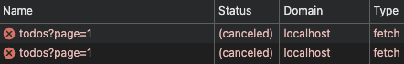

`axios`의 경우 0.22.0 버전부터 `AbortController`를 지원한다. 그래서 `signal`을 `axios` 요청에 전달하여 요청을 취소할 수 있다.

```ts
axios.get("/api/todos", { signal });
```

이전 버전에서는 `cancelToken`을 활용해 요청을 취소해야 한다.

```ts
useQuery({
  queryKey: ["todos"],
  queryFn: async ({ signal }) => {
    const source = axios.CancelToken.source();

    signal?.addEventListener("abort", () => {
      source.cancel("Query was cancelled");
    });

    const response = await axios.get("/api/todos", {
      params: { page },
      cancelToken: source.token
    });

    return response.data;
  }
});
```

쿼리가 취소되며 `signal`의 상태가 변경될 때 `abort` 이벤트가 발생하고, 이를 통해 `axios` 요청을 취소시킬 수 있다.

react-query는 `inactive`(구독하는 컴포넌트가 없는)상태가 되거나, `cancelQueries` 메서드를 직접 호출할 때 쿼리를 취소하여 최적화한다. 그리고 네트워크 요청을 취소할 수 있는 기능도 함께 제공하여, 불필요한 리소스 낭비를 줄일 수 있게 해준다. 이를 잘 활용한다면, 리소스를 절약하여 서비스의 성능을 향상시킬 수 있다.

다만, 다른 섹션에서 다시 언급하겠지만, 쿼리 캔슬은 `Suspense`와 함께 사용할 때에는 정상 작동하지 않으므로 유의해야 한다.

> Cancellation does not work when working with Suspense hooks: useSuspenseQuery, useSuspenseQueries and useSuspenseInfiniteQuery. - 공식 문서

#### Mutation

`useMutation`은 주로 데이터를 변경하는 요청을 처리할 때 사용한다. 이 훅은 전달받는 `mutate`, `mutateAsync` 함수를 호출하는 시점에 요청이 시작된다.

특정 상황에서는 이 요청을 취소해야 할 수도 있다. 예를 들어, 사용자가 작업을 취소하는 기능을 제공하는 경우이다.

그러나 `useMutation`는 `useQuery`와 달리 자동으로 요청을 취소하지 않으며, 요청을 취소하는 기능이 제공되지 않는다.

따라서, `useMutation`에서 요청을 취소하려면 `AbortController`를 활용하여 직접 구현해야 한다.

```ts
const controllerRef = useRef<AbortController | null>(null);

const mutation = useMutation({
  mutationFn: async (id: string) => {
    controllerRef.current = new AbortController();
    const response = await fetch(`/api/todos/${id}`, {
      method: "DELETE",
      signal: controllerRef.current.signal
    });
    if (!response.ok) {
      throw new Error("Network response was not ok");
    }
    return response.json();
  },
  onSettled: () => {
    controllerRef.current = null;
  }
});

const handleCancel = () => {
  controllerRef.current?.abort();
};
```

위 예시는 `useMutation`에서 `AbortController`를 활용하여 요청을 취소하는 코드이다. `mutationFn`에서 `AbortController` 인스턴스를 생성하고, 이를 `fetch` 요청에 전달한다. 그리고 요청이 완료되거나 실패했을 때, `onSettled` 콜백에서 컨트롤러를 초기화한다.

그리고 `handleCancel` 함수에서 컨트롤러의 `abort` 메서드를 호출한다.

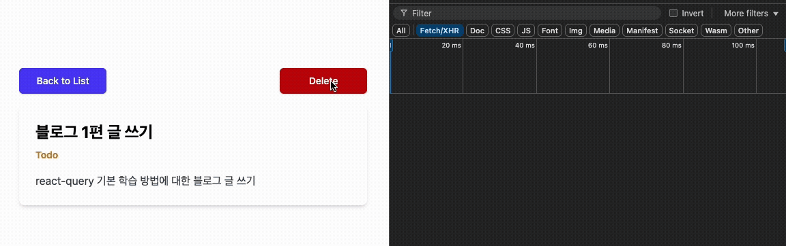

이렇게 하면 `AbortController`가 `signal`을 통해 요청을 취소하며 `fetch` 작업이 중단된다. 이 때, `fetch`는 `AbortError`를 발생시키고, 이 에러는 `onError` 콜백으로 전달된다. 이를 이용해 UI 상태를 처리할 수 있다.

`axios`는 버전이 낮은 경우 `AbortController`를 지원하지 않으므로, 역시 `cancelToken`을 활용하여 요청을 취소해야 한다.

```ts
const sourceRef = useRef<CancelTokenSource | null>(null);

const mutation = useMutation({
  mutationFn: async (id: string) => {
    sourceRef.current = axios.CancelToken.source();

    const response = await axios.delete(`/api/todos/${id}`, {
      cancelToken: sourceRef.current.token
    });

    return response.data;
  },
  onSettled: () => {
    sourceRef.current = null;
  }
});

const handleCancel = () => {
  sourceRef.current?.cancel("Mutation was cancelled");
};
```

뮤테이션 취소가 필요할 때마다 매번 동일한 작업을 반복하는 것은 번거로울 수 있다. 그래서 이를 커스텀 훅으로 추상화 한다면 더 편리하게 사용할 수 있겠다.

```ts
type Options<TData, TError, TVariables, TContext> = Omit<
  UseMutationOptions<TData, TError, TVariables, TContext>,
  "mutationFn"
> & {
  mutationFn: (variables: TVariables, signal: AbortSignal) => Promise<TData>;
};

function useCancellableMutation<TData, TError, TVariables, TContext>(
  options: Options<TData, TError, TVariables, TContext>
) {
  const controllerRef = useRef<AbortController | null>(null);

  const mutateResult = useMutation({
    ...options,
    mutationFn: (variables: TVariables) => {
      controllerRef.current = new AbortController();
      const { signal } = controllerRef.current;
      return options.mutationFn(variables, signal);
    },
    onSettled: (...args) => {
      controllerRef.current = null;
      options.onSettled?.(...args);
    }
  });

  const cancel = useCallback(() => {
    controllerRef.current?.abort();
  }, []);

  return { ...mutateResult, cancel };
}
```

이 훅을 사용한다면, `mutate` 함수와 함께 `cancel` 함수도 반환받아 사용할 수 있다.

```ts
const { mutate, cancel } = useCancellableMutation({ ... });
```

지금까지 쿼리와 뮤테이션을 취소하는 방법에 대해 알아보았다.

`useQuery`는 react-query가 자동으로 쿼리를 취소해주며, `cancelQueries` 메서드를 사용하여 수동으로 쿼리를 취소할 수도 있다. 그리고 전달받는 `AbortController`를 통해 쿼리가 취소될 때 네트워크 요청도 함께 취소할 수 있다.

`useMutation`은 취소 기능을 제공해주지 않는다. 따라서, 필요할 경우 `AbortController`를 활용하여 요청 취소 기능을 직접 구현해야 한다.

쿼리와 뮤테이션 요청을 취소하는 기능을 잘 활용한다면, 불필요한 네트워크 요청을 방지하여 리소스를 최적화하고, 취소 기능을 통해 사용자의 의도대로 작동하는 더 친절한 인터페이스를 제공할 수 있다.

### Prefetch Query

데이터를 빠르게 보여주는 것은 사용자 경험에서 매우 중요하다. 사용자는 클릭과 동시에 화면이 바뀌길 기대한다. 그러나 필요한 데이터를 서버에 요청하고 응답을 받아 화면을 출력하는 과정에서, 사용자는 아무런 피드백을 받지 못하는 경우 지연을 느낄 수 있다.

그래서 사용자에게 빠른 반응을 보여주기 위해 다양한 방법을 사용하는데, 데이터를 불러오는 동안 로딩 스피너나 스켈레톤 UI 등을 출력하여 체감 속도를 완화하는 경우도 있다. 하지만 너무 로딩 시간이 짧다면 화면이 깜빡이는 현상이 발생할 수 있어 오히려 혼란을 줄 수 있다. 이를 위해, 특정 시간 이하의 짧은 로딩 시간에는 로딩 UI를 생략하는 전략을 구성하기도 한다.

다른 방법 중 하나는 **프리패치**(Prefetch)이다. 프리패치는 사용자의 행동을 예측하여, 실제로 데이터가 필요하기 전에 미리 데이터를 불러오는 기법이다. 사용자가 링크에 마우스를 올렸을 때 해당 페이지의 리소스를 미리 불러오거나, 사용자가 특정 데이터를 필요할 것으로 예상되는 경우 미리 데이터를 요청하는 것이다.

이를 통해 사용자가 실제로 데이터를 필요로할 때, 이미 불러온 데이터를 즉시 보여줄 수 있어, 더 빠르고 부드러운 사용자 경험을 제공할 수 있다.

브라우저에서는 특정 페이지의 리소스를 미리 불러오는 프리패치 기능을 제공한다.

```html
<link rel="prefetch" href="/next-page" />
<link rel="prefetch" href="/app/style.css" />
```

`link` 태그를 사용하여 `rel="prefetch"` 속성을 적용하고, 다음 페이지 혹은 다음 페이지의 리소스를 지정하면, 브라우저가 백그라운드에서 해당 리소스를 미리 불러온다. 그래서 사용자가 실제로 해당 페이지로 이동할 때, 이미 불러온 리소스를 즉시 사용하게 되어 더 빠른 반응을 제공할 수 있다.

react-query에서도 데이터에 대한 프리패치를 지원한다. 사용자가 필요할 것으로 예상되는 데이터를 미리 불러와 캐시에 저장해두고, 실제로 해당 데이터가 필요할 때 즉시 사용할 수 있도록 동작한다.

react-query의 프리패치는 쿼리 단위로 동작하며, `QueryClient`의 `prefetchQuery` 메서드를 사용하여 특정 쿼리를 미리 불러올 수 있다.

```ts
import { QueryClient } from "react-query";

const queryClient = new QueryClient();

queryClient.prefetchQuery({
  queryKey: ["todo", 1],
  queryFn: () => getTodo(1)
});
```

해당 메서드는 `queryKey`와 `queryFn` 옵션을 인자로 받으며, 지정한 쿼리를 미리 불러온다. 그리고 미리 요청된 쿼리는 그 결과가 캐시에 저장되며, 이후 동일한 쿼리 키로 요청할 때 캐시된 데이터를 즉시 반환한다.

이를 활용하여, 사용자가 특정 작업을 수행할 때 필요한 데이터를 미리 불러올 수 있다. 가장 일반적인 패턴은 특정 요소에 마우스를 올렸을 때(hover) 데이터를 미리 불러오는 것이다.

```tsx
const handleMouseEnter = (id: number) => {
  queryClient.prefetchQuery({
    queryKey: ["todo", id],
    queryFn: () => getTodo(id)
  });
};

return (
  <Link to={`/todo/${id}`} onMouseEnter={() => handleMouseEnter(id)}>
    ...
  </Link>
);
```

위 예시는 링크에 마우스를 올렸을 때, 해당 투두 아이템의 데이터를 미리 불러오는 코드이다. `/todo/${id}` 페이지에는 `["todo", id]` 쿼리를 사용하는 `useQuery`가 있다. 이 경우, 사용자가 링크에 마우스를 올리면 쿼리를 미리 실행하며, 클릭하여 해당 페이지로 이동하면 데이터를 요청하지 않고 캐시된 데이터를 즉시 사용하게 된다.

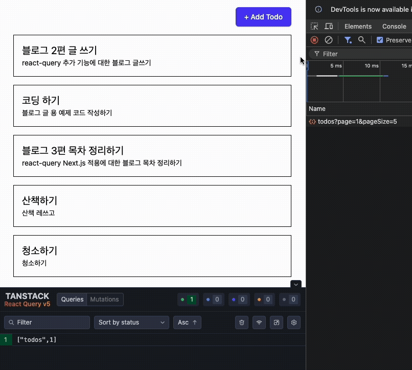

그래서 페이지 이동 시 데이터 요청이 발생하지 않고, 이미 불러온 데이터를 즉시 사용하여 더 빠른 반응을 제공할 수 있다.

`prefetchQuery` 메서드의 옵션은 `useQuery`의 옵션과 거의 동일하다. 그래서 `staleTime`, `gcTime` 을 설정하여 캐시의 유효 기간을 조절할 수도 있다.

```ts
queryClient.prefetchQuery({
  queryKey: ["todo", 1],
  queryFn: () => getTodo(1),
  staleTime: 1000 * 60 * 5 // 5분
});
```

위 예시는 프리패치된 쿼리가 5분 동안 신선한 상태로 유지되도록 한다. 그래서 5분 이내에 동일한 쿼리 키로 요청할 때, 캐시된 데이터를 즉시 반환하게 된다.

단, 해당 쿼리를 요청하는 `useQuery`의 `staleTime`이 더 짧다면, 그 시간이 우선 적용된다. 만약, `useQuery`에 `staleTime`이 설정되어 있지 않다면(기본값은 `0`이다.), `useQuery`가 호출되는 시점에 이미 오래된 데이터로 간주되어 재요청이 발생할 수 있다.

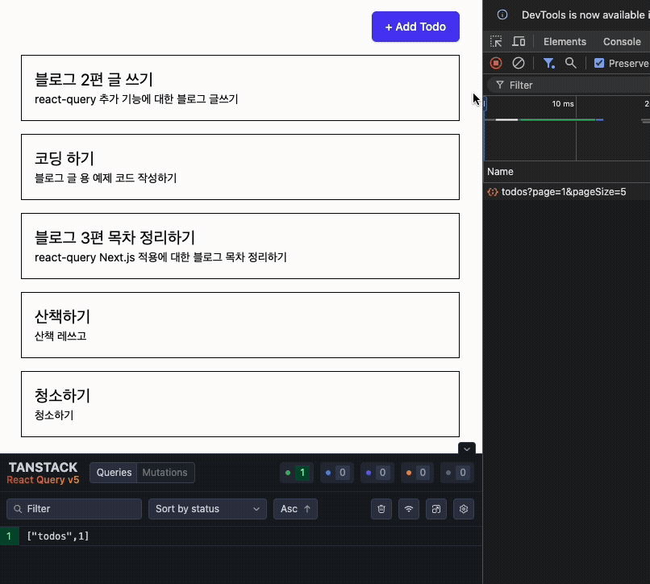

호버 시 데이터를 미리 불러왔지만, 페이지 이동 시 다시 요청이 발생하는 모습이다. 이는 페이지 이동 시점에 이미 오래된 데이터로 간주되기 때문이다. 따라서 `useQuery`에 적절한 `staleTime`을 설정하여 프리패치가 효과를 발휘할 수 있도록 해야 한다.

또한, 사전 요청된 쿼리는, 이를 사용하는 쿼리 인스턴스(`useQuery`)가 등장하지 않는다면 `inactive` 상태로 존재한다.

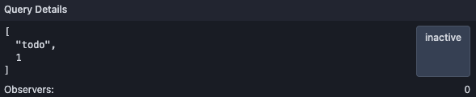

`inactive` 상태의 데이터는 `gcTime`이 지나면 캐시에서 제거되므로, `gcTime` 옵션을 통해 실제 사용 시점까지 데이터를 유지할 수 있게 조절할 수 있다.

`staleTime`과 `gcTime`을 너무 길게 설정하면 캐시가 불필요하게 오래 유지되어 메모리를 낭비할 수 있다. 따라서 적절한 값을 설정하여 캐시를 효율적으로 관리하는 것이 중요하다.

그 외에도 `useQuery`옵션을 대부분 사용할 수 있지만, `enabled`, `select` 등 일부 옵션은 적용되지 않는다. 적용되지 않는 옵션의 목록은 [공식 문서 - prefetchQuery](https://tanstack.com/query/v5/docs/reference/QueryClient#queryclientprefetchquery)에 나열되어 있다.

react-query의 프리패치는 사용자의 행동을 예측하여 데이터를 미리 불러오고 캐시에 저장함으로써, 실제로 데이터가 필요할 때 즉시 사용할 수 있게 한다. 이를 적절히 활용한다면, 체감 속도를 크게 향상시켜 더 빠르고 부드러운 사용자 경험을 제공할 수 있다.

다만, 모든 요청을 미리 불러오는 것은 리소스 낭비로 이어질 수 있다. 따라서 사용자의 행동을 신중하게 예측하고, 실제로 필요할 것으로 예상되는 데이터에 대해서만 프리패치를 적용하는 것이 바람직하다.

프리패치는 링크 호버 외에도, 특정 작업을 수행할 것으로 예상되는 시점에 데이터를 미리 불러오는 등 다양한 상황에서 활용할 수 있다. react-query에서는 컴포넌트 구성에서 하위 컴포넌트와의 워터폴 현상을 완화하기 위한 용도로도 활용한다. [공식 문서 - Prefetching](https://tanstack.com/query/v5/docs/framework/react/guides/prefetching) 에서 자세한 내용을 확인할 수 있다.

### Optimistic update

사용자의 요청은 다양하게 일어날 수 있다. 단순히 데이터를 가져오는게 아니라 댓글을 작성하거나, 좋아요 버튼을 누르거나, 게시글을 삭제하는 등의 작업이 있다. 이러한 작업은 일반적으로 서버에 요청을 보내고, 서버의 응답을 기다린 후 그 결과를 바탕으로 화면에 반영한다.

하지만, 네트워크 환경이 좋지 않거나 서버의 응답이 지연되는 경우, 사용자는 즉각적인 반응을 보지 못한다. 이 때 사용자는 자신의 요청이 제대로 처리되었는지 불안해할 수 있다. 로딩 스피너나 스켈레톤 UI 등을 사용한다면 빠르게 피드백을 제공할 수 있지만, 결국 서버의 응답을 기다려야 한다는 점은 변함이 없다.

그래서 사용자에게 더 빠르고 부드러운 경험을 제공하기 위해, **낙관적 업데이트**(Optimistic Update)라는 패턴을 사용할 수 있다. 낙관적 업데이트란, 사용자의 요청이 성공할 것이라고 **가정**(Optimistic assumption) 하고, 서버의 응답을 기다리지 않고 즉시 화면에 반영하는 패턴이다.

기본적으로, 동작에 대한 요청은 서버에 보내지고, 서버의 응답을 기다린 후 그 결과를 화면에 반영한다.

```text
User Action -> Request to Server -> Wait for Response -> Update UI
```

반면, 낙관적 업데이트는 다음과 같이 동작한다.

```text
User Action -> Update UI -> Request to Server -> Wait for Response -> Confirm or Rollback
```

사용자의 요청이 발생하면 서버의 응답을 기다리지 않고 예상되는 결과를 즉시 화면에 반영한다. 그리고 서버에 요청을 보내고, 서버의 응답이 도착하면 그 결과에 따라 화면을 유지하거나, 요청이 실패한 경우 이전 상태로 롤백한다.

이 방식은 사용자의 행동에 UI가 즉시 반응하도록 하여, **지연 없는 인터랙션을 제공**해 더 빠르고 부드러운 사용자 경험을 전달할 수 있다.

#### Concept

react-query 에서는 여러 기능을 조합하여 낙관적 업데이트를 구현할 수 있다.

먼저, react-query는 서버에서 데이터를 가져와 캐시에 저장하고, 이를 화면에 반영하는 방식으로 동작한다. 그리고 `QueryClient`에서는 그 캐시를 직접 제어할 수 있도록 `getQueryData`와 `setQueryData` 메서드를 제공한다. `getQueryData`는 캐시된 데이터를 조회하는 데 사용하고, `setQueryData`는 캐시된 데이터를 직접 수정하는 데 사용한다.

```ts
const todos = queryClient.getQueryData(["todos"]);
queryClient.setQueryData(["todos"], (oldData) => [...oldData, newTodo]);
```

`getQueryData` 메서드는 쿼리 키를 인자로 받아 해당 키에 캐시된 데이터를 반환한다. 이를 통해 현재 캐시된 데이터를 조회할 수 있다.

`setQueryData` 메서드는 첫 번째 인자로 쿼리 키를 받고, 두 번째 인자로는 해당 쿼리에 대한 새로운 데이터, 혹은 이전 데이터를 인자로 전달 받고 새로운 데이터를 반환하는 함수를 받는다. 이 때, 반환하는 데이터는 불변성을 유지해야 한다. 따라서 데이터가 객체일 경우, 새로 생성하여 반환해야 한다.

그래서 이 메서드들을 통해 캐시된 데이터를 조회하거나 직접 수정할 수 있으며, 캐시 데이터를 수정하면 react-query는 해당 데이터를 사용하는 모든 컴포넌트를 자동으로 리렌더링한다. 결과적으로, `setQueryData`를 사용하여 캐시된 데이터를 즉시 변경함으로써, 서버의 응답을 기다리지 않고도 화면에 변화를 반영할 수 있다.

```ts
const { mutate } = useMutation({
  mutationFn: (newTodo) => addTodo(newTodo)
});

const handleAddTodo = (newTodo) => {
  mutate(newTodo);
  queryClient.setQueryData(["todos"], (oldData) => [...oldData, newTodo]);
};
```

`mutate` 함수를 호출하여 서버에 새로운 투두를 추가하는 요청을 보내고, 동시에 `setQueryData`를 사용하여 캐시된 투두 목록에 새로운 투두를 즉시 추가한다. 그래서 서버의 응답을 기다리지 않고도 화면에 새로운 투두가 추가된 것처럼 보이게 된다.

하지만, 단순히 캐시를 수정하는 것만으로는 부족하다. 이렇게 수정된 데이터는 어디까지나 "예상된 상태" 이기 때문에, 실제 결과와 다를 수 있다. 실제로 서버의 요청이 성공했는지 실패했는지에 따라, 화면을 유지하거나 이전 상태로 롤백하는 작업이 필요하다.

이 때, `useMutation` 훅의 콜백을 활용할 수 있다. `useMutation` 훅은 여러 콜백을 제공하여 요청의 상태에 따라 후속 작업을 수행할 수 있다. 이 콜백들을 활용한다면 낙관적 업데이트의 흐름을 구성할 수 있다.

- `onMutate`: 뮤테이션이 시작되기 전에 호출되며, 캐시된 데이터를 미리 수정하고 이전 상태를 스냅샷으로 저장한다.
- `onError`: 뮤테이션이 실패했을 때 호출되며, 이전 상태로 롤백한다.
- `onSettled`: 뮤테이션이 성공하거나 실패한 후에 호출되며, 필요한 후속 작업을 수행한다.

`onMutate` 콜백은 뮤테이션이 시작되기 전에 호출된다. 이 콜백에서는 사용자가 요청을 보낸 시점에, 예상되는 결과를 바탕으로 캐시된 데이터를 즉시 수정한다. 또한, `onMutate`에서 반환된 값은 다른 콜백에 `context` 인자로 전달된다. 그래서 이를 활용한다면, 캐시 데이터를 바꾸기 전에 이전 상태를 스냅샷으로 저장하고 반환하여, 이후에 롤백할 때 사용할 수 있다.

```ts
const onMutate = (newTodo) => {
  const previousTodos = queryClient.getQueryData(["todos"]);

  queryClient.setQueryData(["todos"], (oldData) => [...oldData, newTodo]);

  return { previousTodos };
};
```

`getQueryData` 메서드를 사용하여 현재 캐시된 투두 목록을 조회하고, 이를 `previousTodos` 변수에 저장한다. 그리고 `setQueryData` 메서드를 사용하여 캐시된 투두 목록에 새로운 투두를 즉시 추가한다. 마지막으로, 이전 상태인 `previousTodos`를 객체로 반환한다.

`onError` 콜백은 뮤테이션이 실패했을 때 호출되며, 에러가 발생했을 때 캐시를 이전 상태로 롤백하는 작업을 수행한다.

```ts
const onError = (error, newTodo, context) => {
  if (context?.previousTodos) {
    queryClient.setQueryData(["todos"], context.previousTodos);
  }
};
```

`onMutate`에서 반환된 `context` 인자를 활용하여, 이전 상태인 `previousTodos`를 조회한다. 그리고 `setQueryData` 메서드를 사용하여 캐시된 투두 목록을 이전 상태로 롤백한다.

마지막으로 `onSettled` 콜백은 뮤테이션이 성공하거나 실패한 후에 호출된다. 이 콜백에서는 최종적으로 서버의 데이터와 캐시된 데이터를 동기화하는 작업을 수행한다.

```ts
const onSettled = () => {
  queryClient.invalidateQueries({ queryKey: ["todos"] });
};
```

`invalidateQueries` 메서드를 사용하여 `["todos"]` 쿼리를 무효화한다. 그래서 이 쿼리를 사용하는 모든 컴포넌트는 다시 데이터를 요청하게 된다. 이를 통해 서버의 데이터와 캐시된 데이터를 동기화할 수 있다.

그래서 `useMutation` 훅의 세 콜백을 조합하면 다음과 같은 뮤테이션을 선언할 수 있다.

```ts
const { mutate } = useMutation({
  mutationFn: (newTodo) => addTodo(newTodo),
  onMutate: (newTodo) => {
    const previousTodos = queryClient.getQueryData(["todos"]);

    queryClient.setQueryData(["todos"], (oldData) => [...oldData, newTodo]);

    return { previousTodos };
  },
  onError: (error, newTodo, context) => {
    if (context?.previousTodos) {
      queryClient.setQueryData(["todos"], context.previousTodos);
    }
  },
  onSettled: () => {
    queryClient.invalidateQueries({ queryKey: ["todos"] });
  }
});
```

이를 통해 서버의 응답을 기다리지 않고도 즉시 UI를 갱신하면서, 실패 시 이전 상태로 롤백하고, 최종적으로 서버와 데이터를 동기화하는 낙관적 업데이트 패턴을 구현할 수 있다.

다만, 앞서 구현한 내용만으로는 상태 불일치 문제가 발생할 여지가 있다. 예를 들어, 사용자가 기능을 연속적으로 수행할 때, 두 요청의 쿼리 데이터 설정과 무효화가 충돌할 수 있다. 이 경우 추가적인 처리가 필요하다.

이제 낙관적 업데이트를 실제로 구현해 보면서 더 자세히 살펴보자.

#### Implementation

Todo를 관리하는 앱이 있다. 이 앱은 투두 목록을 불러와 카드 형식으로 보여주며, 카드를 클릭하면 상세 페이지에 진입할 수 있다. 투두는 제목과 내용, 완료 여부를 가지고, 투두 상세 페이지에서 투두의 완료 여부를 토글할 수 있다.

그래서 특정 투두를 조회해 화면을 그리고, 완료 여부를 토글하는 기능이 상세 페이지에 구현되어 있다.

```tsx
const { data: todo } = useQuery({
  queryKey: ["todo", id],
  queryFn: () => getTodo(id),
  enabled: !!id
});

const { mutate: updateDone, isUpdatePending } = useMutation({
  mutationFn: (done: boolean) => updateTodoDone({ id, done }),
  onSuccess: () => {
    queryClient.invalidateQueries({ queryKey: ["todo", id] });
    queryClient.invalidateQueries({ queryKey: ["todos"] });
  }
});

...

return (
  <div>
    ...
    <ToggleSwitch
      label={todo.done ? "Done" : "Todo"}
      checked={todo.done}
      onChange={() => updateDone(!todo.done)}
      disabled={isUpdatePending}
    />
    ...
  </div>
);
```

`useQuery` 훅을 사용하여 `["todo", id]` 쿼리를 선언하여 투두를 가져오고, 그 데이터를 화면에 출력한다. 그리고 화면에는 완료 여부를 토글하는 스위치가 있다.

토글 스위치를 클릭하면 `updateDone` 함수가 호출되어, 서버에 완료 여부를 변경하는 요청을 보낸다. 요청이 진행 중일 때는 스위치를 비활성화한다. 그리고 요청이 성공하면 `["todo", id]`와 `["todos"]` 쿼리를 무효화하여, 상세 페이지와 투두 목록 페이지의 데이터를 더 이상 신선하지 않은 상태로 만든다. 그래서 이 쿼리를 사용하는 경우 다시 데이터를 요청하여 최신 상태를 유지하도록 한다.

구현된 토글 기능은 다음과 같이 동작한다.


요청이 처리되는 동안 스위치가 비활성화되기 때문에, 사용자는 요청이 처리 중임을 인지할 수 있다. 이는 일반적으로 간단하게 구현하는 방식으로, 사용자에게 로딩의 피드백을 전달하고 중복 요청을 방지할 수 있다.

그러나, 사용자 경험 측면에서는 다소 아쉬운 부분이 있다. 사용자는 인터랙션하는 즉시 반영되기를 바라지만, 요청이 처리되는 동안 로딩 상태를 기다려야 하며, 요청이 완료된 후에야 화면이 갱신된다. 이로 인해 사용자는 지연을 느낄 수 있으며, 네트워크 환경이 좋지 않거나 요청이 오래 걸리는 경우에는 그 체감이 더욱 커질 수 있다.

이 방식은 즉각적인 피드백을 제공하지 못한다. UI는 사용자 행동의 결과가 즉시 반영되지 않으며, 결국 인터렉션이 무겁고 느리게 느껴질 수 있다.

이제 낙관적 업데이트 패턴을 적용하여, 사용자의 인터랙션에 즉각적으로 반응하는 더 빠르고 부드러운 경험을 제공해 보자.

```ts
const { mutate: updateDone } = useMutation({
  mutationFn: (done: boolean) => updateTodoDone({ id, done }),
  onMutate: (done: boolean) => {
    const previousTodo = queryClient.getQueryData<Todo>(["todo", id]);

    if (previousTodo) {
      queryClient.setQueryData<Todo>(["todo", id], {
        ...previousTodo,
        done
      });
    }

    queryClient.setQueryData<Todo[]>(["todos"], (old) =>
      old?.map((todo) => (todo.id === id ? { ...todo, done } : todo))
    );

    return { previousTodo };
  },
  onError: (err, _, context) => {
    const previousTodo = context?.previousTodo;
    if (previousTodo) {
      queryClient.setQueryData(["todo", id], previousTodo);
      queryClient.setQueryData<Todo[]>(["todos"], (old) =>
        old?.map((todo) => (todo?.id === id ? previousTodo : todo))
      );
    }
    console.error("Failed to update todo:", err);
  },
  onSettled: () => {
    queryClient.invalidateQueries({ queryKey: ["todos"] });
    queryClient.invalidateQueries({ queryKey: ["todo", id] });
  }
});
```

뮤테이션이 실행되는 시점에 `getQueryData` 메서드를 사용하여 현재 캐시된 투두 데이터를 조회하고, 이를 저장한다. 그리고 `setQueryData` 메서드를 사용하여 해당 투두의 완료 여부를 즉시 변경한다. 또한, 투두 목록인 `["todos"]` 쿼리의 캐시도 함께 수정하여, 목록에서도 완료 여부가 즉시 반영되도록 한다. 마지막으로, 이전 상태인 `previousTodo`를 객체로 반환한다.

에러가 발생했을 때에는 이전 상태로 롤백하는 작업을 수행해야 한다. `onError` 콜백에서 `context` 인자를 참조하여 이전 상태인 `previousTodo`를 조회한다. 그리고 `setQueryData` 메서드를 사용하여 상세 페이지와 투두 목록의 캐시를 이전 상태로 롤백한다.

뮤테이션이 완료되면 `onSettled` 콜백을 통해 `invalidateQueries` 메서드를 사용하여 `["todos"]`와 `["todo", id]` 쿼리를 무효화한다. 그래서 이 쿼리를 사용하는 모든 컴포넌트는 다시 데이터를 요청하게 된다.

마지막으로, 토글 스위치의 `disabled` 속성을 제거하여, 로딩 표현을 제거한다.

이렇게 구현한 낙관적 업데이트는, 이제 사용자의 인터랙션에 즉각적으로 반응한다.

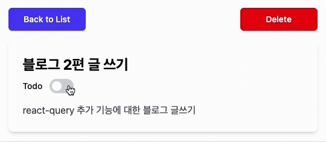

이정도만 구현해도 사용자 경험이 크게 향상된다. 요청이 완료되기를 기다리지 않고도 사용자의 행동에 즉시 화면이 반응하며, 지연 없는 인터랙션을 경험할 수 있다.

#### Inconsistency timing

다만, 이 구현에는 문제가 있다. 먼저, 해당 뮤테이션이 실행될 때, 관련한 쿼리가 실행되고 있었다면, **낙관적 업데이트된 상태가 무효화** 될 수 있다.

예를 들어, 상세 페이지에서 투두를 조회하는 쿼리에 `refetchOnWindowFocus` 옵션이 활성화되어 있다고 하자.

```ts
const { data: todo } = useQuery({
  ...
  staleTime: 1000 * 60, // 1 minute
  refetchOnWindowFocus: true
});
```

이 옵션은 쿼리의 갱신 타이밍을 제어하는 옵션으로, 앱에 포커스가 돌아올 때 `stale` 상태인 쿼리를 자동으로 다시 요청한다. 그래서 이 쿼리는 실행한지 1분이 지나면 `stale` 상태가 되고, 다른 탭에서 이 탭으로 돌아올 때 자동으로 다시 데이터를 요청한다.

이 때, 해당 쿼리가 실행되는 도중에 완료 여부를 토글하는 뮤테이션이 실행된다면, 앞선 쿼리가 완료될 때 낙관적 업데이트가 무효화되며 데이터의 불일치가 발생한다.

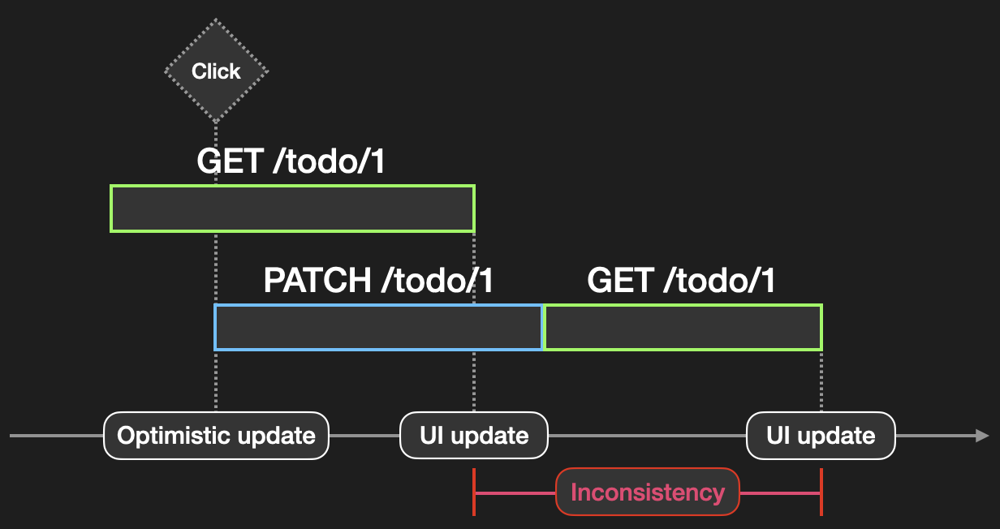

다른 탭에서 포커스가 돌아와 쿼리가 실행된다. 쿼리 실행 도중, 클릭 이벤트로 인해 뮤테이션이 실행되어 낙관적 업데이트가 반영되었다. 그러나 이전 쿼리가 완료된 후에 그 결과가 캐시에 반영되며 이전 상태로 롤백된다. 이후, 다시 쿼리를 무효화해 데이터를 동기화하며 다시 최신 상태가 된다.

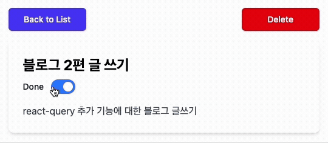

그래서 버튼을 클릭했을 때, 화면은 낙관적 업데이트로 한 번 바뀌고, 이전 쿼리에 의해서 이전 상태로 롤백되며, 쿼리 무효화에 의해 다시 한 번 바뀌게 된다. 그리고 이 과정에서 사용자는 상태가 앞뒤로 전환되는 불편한 경험을 하게 된다.

따라서, 뮤테이션이 실행되는 시점에 이미 실행중인 이전 쿼리를 취소하여, 낙관적 업데이트를 한 데이터가 덮어씌워지는 상황을 방지해야 한다.

```ts
useMutation({
  ...
  onMutate: async (done: boolean) => {
    await queryClient.cancelQueries({ queryKey: ["todo", id] });
    ...
  },
  ...
});
```

뮤테이션을 실행하는 시점에 `cancelQueries` 메서드를 사용하여 `["todo", id]` 쿼리를 취소하도록 한다. 그래서 이전 쿼리가 완료되어 캐시에 반영되는 상황을 방지한다.

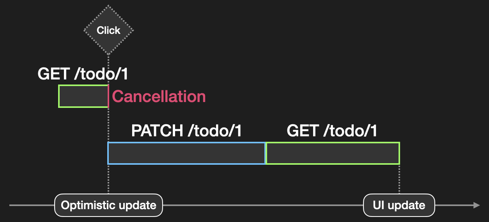

그래서 클릭하는 즉시 진행중인 쿼리를 취소하고, 낙관적 업데이트가 반영된다. 이후, 뮤테이션이 완료되면 쿼리를 무효화하여 서버의 데이터와 동기화한다. 이렇게 하면, 쿼리가 실행되고 있는 상황에서 낙관적 업데이트가 무효화되는 문제를 방지할 수 있다.

하지만, 쿼리 취소가 모든 상황을 해결해 주지는 않는다.

#### Multiple Mutation

즉각적인 반응을 제공하기 위해 토글 버튼에 `disabled` 속성을 제거했다. 그 결과, 이전 요청이 진행되는 도중에도 사용자는 토글 버튼을 계속 클릭할 수 있게 되었고, 여러 개의 뮤테이션이 연속해서 실행될 수 있는 상황이 되었다.

사용자가 Todo 상태를 완료로 변경한 직후, 빠르게 다시 미완료로 바꾸는 상황을 가정해보자. 이 때, 앞 뮤테이션이 완료되기 전에 뒤 뮤테이션이 실행된다면, 낙관적 업데이트가 또다시 무효화 될 수 있다.

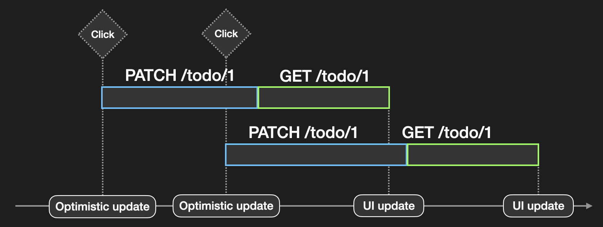

이전에는 뮤테이션이 실행될 때 `cancelQueries` 메서드를 사용하여 이전 쿼리를 취소하도록 작업했고, 쿼리가 진행중인 상황에서는 문제를 해결할 수 있었다. 그러나 쿼리는 뮤테이션이 완료되고 난 뒤에야 무효화되어 재실행되기 때문에, 앞 뮤테이션이 완료되기 전에 다음 뮤테이션이 바로 실행된다면, 그 시점에는 취소할 쿼리가 없다.

또한, 두 번째 뮤테이션이 첫 번째 뮤테이션에 의한 재요청 쿼리보다 늦게 완료될 경우, 역시 이미 쿼리가 완료되었기 때문에 취소할 쿼리가 없다.

따라서, 앞 뮤테이션이 완료된 이후에는 정상적으로 쿼리가 무효화되고 다시 실행되며, 그 결과가 캐시에 반영된다. 그래서 뒤 뮤테이션에서 적용된 낙관적 업데이트가 또 다시 덮어씌워진다.


그래서 빠르게 두 번 누르는 경우, 낙관적 업데이트들은 즉시 반영되고, 이후에 앞 뮤테이션이 완료되며 무효화한 쿼리로 인해 이전 상태로 롤백되며, 다시 뒤 뮤테이션이 완료되면서 최신 상태가 된다. 그래서 UI가 앞뒤로 전환되는 불일치 증상이 다시 발생한다.

이 문제는 과도한 `invalidateQueries` 호출로 인해 발생한다.

```ts
useMutation({
  ...
  onSettled: () => {
    queryClient.invalidateQueries({ queryKey: ["todos"] });
    queryClient.invalidateQueries({ queryKey: ["todo", id] });
  }
});
```

뮤테이션이 완료될 때 `onSettled` 콜백에서 쿼리를 무효화하고 있다. 그러나, 두 번째 뮤테이션이 실행되는 시점에서는, 첫 번째 뮤테이션이 완료될 때의 무효화는 필요가 없다. 이미 낙관적 업데이트 때문에 다음 상태로 업데이트 되었으며, 이후에 두 번째 뮤테이션이 완료될 때 무효화하면 충분하다. 하지만, `onSettled` 콜백은 뮤테이션이 성공하든 실패하든 항상 호출된다. 그래서 불필요한 시점에도 쿼리 무효화가 작동하여 낙관적 업데이트가 덮어씌워지는 상황이 발생하는 것이다.

이를 해결하기 위해서는, `onSettled` 콜백에서 쿼리 무효화를 조금 더 똑똑하게 처리해야 한다. 앞 뮤테이션이 완료될 때는 쿼리를 무효화하지 않고, 뒤 뮤테이션이 완료될 때만 쿼리를 무효화하도록 해야 한다. 다행히 생각보다 간단하게 처리할 수 있다.

```ts
const mutationCount = queryClient.isMutating();
```

`QueryClient`는 `isMutating` 메서드를 제공한다. 이 메서드는 현재 진행중인 뮤테이션의 개수를 반환한다. 이를 활용하여, `onSettled` 콜백에서 쿼리를 무효화하기 전에, 진행중인 뮤테이션이 더 이상 없는지 확인할 수 있다.

```ts
useMutation({
  ...
  onSettled: () => {
    const mutationCount = queryClient.isMutating();
    if (mutationCount === 1) {
      queryClient.invalidateQueries({ queryKey: ["todos"] });
      queryClient.invalidateQueries({ queryKey: ["todo", id] });
    }
  }
});
```

`isMutating` 메서드를 사용하여 현재 진행중인 메서드의 개수를 조회한다. `onSettled` 콜백이 호출되는 시점에는 해당하는 뮤테이션이 아직 "실행 중" 상태이기 때문에, 이 값이 `1`인 경우에만 쿼리를 무효화하도록 한다.

하지만, 현재는 확인하는 범위가 너무 넓다. `isMutating` 메서드는 모든 뮤테이션을 대상으로 개수를 반환하기 때문에, 현재 뮤테이션과는 다른 종류의 뮤테이션이 있다면 이 값이 `1`보다 커질 수 있다. 따라서, 이 메서드에 필터링 옵션을 전달하여, 특정 쿼리 키에 해당하는 뮤테이션만 개수를 세도록 해야 한다.

```ts
useMutation({
  ...
  mutationKey: ["todo", "updateDone", id],
  onSettled: () => {
    const mutationCount = queryClient.isMutating({
      mutationKey: ["todo", "updateDone", id]
    });
    if (mutationCount === 1) {
      queryClient.invalidateQueries({ queryKey: ["todos"] });
      queryClient.invalidateQueries({ queryKey: ["todo", id] });
    }
  }
});
```

`isMutating` 메서드는 `mutationKey` 옵션을 통해 특정 쿼리를 대상으로 개수를 셀 수 있다. 그래서 뮤테이션을 선언할 때 `mutationKey` 옵션을 설정하고, `isMutating` 메서드에도 동일한 키를 전달하여, 해당 뮤테이션만 개수를 세도록 한다.

이제 쿼리를 무효화 하기 전에 진행중인 뮤테이션의 개수를 확인하고, 더 이상 실행중인 뮤테이션이 없는 경우(자신을 제외하고)에만 쿼리를 무효화하게 된다.

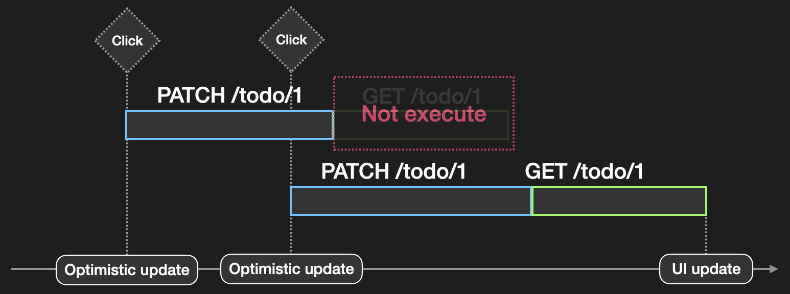

첫 번째 쿼리가 완료될 때, 진행중인 뮤테이션이 있기 때문에 쿼리 무효화를 건너뛴다. 이후, 두 번째 뮤테이션이 완료될 때, 더 이상 진행중인 뮤테이션이 없기 때문에 쿼리를 무효화한다. 그래서 낙관적 업데이트가 덮어씌워지는 상황을 방지할 수 있다.

#### 정리

지금까지 낙관적 업데이트에 대한 구현 방향성과 함께, 주의할 점들을 살펴보았다. 단순히 캐시를 수정하는 것만으로는 부족하며, 여러 상황에서 발생할 수 있는 문제들을 고려하여 적절히 대응해야 한다.

이제까지 살펴본 내용을 종합하면 다음과 같다.

```ts
const { mutate: updateDone } = useMutation({
  mutationKey: ["todo", "updateDone", id], // 특정 뮤테이션을 식별하기 위한 키
  mutationFn: (done: boolean) => updateTodoDone({ id, done }),
  onMutate: async (done) => {
    // 진행중인 쿼리를 취소하여 낙관적 업데이트가 무효화되는 상황 방지
    await queryClient.cancelQueries({ queryKey: ["todos"] });
    await queryClient.cancelQueries({ queryKey: ["todo", id] });

    // 이전 상태를 스냅샷으로 저장
    const previousTodo = queryClient.getQueryData<Todo>(["todo", id]);

    if (previousTodo) {
      // 낙관적 업데이트 적용
      queryClient.setQueryData<Todo>(["todo", id], {
        ...previousTodo,
        done
      });
    }
    // 낙관적 업데이트 적용
    queryClient.setQueryData<Todo[]>(["todos"], (old) =>
      old?.map((todo) => (todo.id === id ? { ...todo, done } : todo))
    );

    // 다른 콜백에서 사용하기 위해 이전 상태를 반환
    return { previousTodo };
  },
  onError: (err, _, context) => {
    const previousTodo = context?.previousTodo;
    if (previousTodo) {
      // 에러 발생 시 이전 상태로 롤백
      queryClient.setQueryData(["todo", id], previousTodo);
      queryClient.setQueryData<Todo[]>(["todos"], (old) =>
        old?.map((todo) => (todo?.id === id ? previousTodo : todo))
      );
    }
    console.error("Failed to update todo:", err);
  },
  onSettled: () => {
    // 뮤테이션이 더 이상 진행중이지 않은지 확인
    // 이 때, onSettled 콜백이 호출되는 시점에는 해당 뮤테이션이 아직 "실행 중" 상태
    // 따라서 자신을 제외한 다른 뮤테이션이 없다면 쿼리 무효화
    if (
      queryClient.isMutating({ mutationKey: ["todo", "updateDone", id] }) === 1
    ) {
      queryClient.invalidateQueries({ queryKey: ["todos"] });
      queryClient.invalidateQueries({ queryKey: ["todo", id] });
    }
  }
});
```

낙관적 업데이트는 사용자에게 즉각적인 반응을 제공하여, 더 빠르고 부드러운 경험을 전달할 수 있다. 사용자의 행동과 반응 사이의 지연이 사라지게 되어 직관적인 인터렉션을 제공할 수 있게 되며, 특히, 네트워크 속도가 느린 상황에서는 그 효과가 더욱 크다.

다만, 낙관적 업데이트는 "요청이 성공할 것"이라는 전제를 기반으로 한다. 그래서 요청이 실패할 경우 이전 상태로 롤백해야 하는데, 순간적인 깜빡임을 느낄 수 있다. 또한, 비교적 가벼운 작업에는 적합하나, 복잡한 작업에는 신중히 적용해야 한다. 사용자가 폼을 제출하는 상황 같은 경우에는 입력값 검증 등 여러 작업이 필요하기 때문에, 화면을 덮고 스피너를 표출하는 피드백이 더욱 적합할 수 있다.

그리고 코멘트 남기기 등 여러 사용자가 동시에 수정하는 환경에서는 오히려 헷갈리게 만들 수 있다. 낙관적 업데이트로 사용자의 코멘트가 즉시 등록되지만, 그 사이 다른 사용자가 코멘트를 남겼을 경우, 쿼리가 갱신되며 다시 한 번 UI가 변경된다. 이 경우 낙관적 업데이트와 실제 쿼리 갱신 사이에 UI 레벨에서 구분하여 UX에 신경써야 한다.

결국 낙관적 업데이트는 사용자 경험을 개선하기 위한 좋은 전략이지만, 모든 상황에 적합한 것은 아니다. 요청에 성격을 고려하여 신중하게 적용해야 하며, 적용할 때에는 사용자가 혼란을 느끼지 않도록 실패의 피드백이나 롤백 과정을 명확히 설계해야 한다.

이 균형을 잘 맞추고 적절히 사용한다면, 낙관적 업데이트는 사용자 경험을 크게 향상시키는 강력한 도구가 될 수 있다.

### Infinite Scroll

많은 양의 데이터를 받아오는 경우, 이를 페이지네이션으로 나누어 불러오는 경우가 있음.

그러나 페이지네이션은 사용자가 페이지를 이동해야 하므로, 사용자 경험이 떨어질 수 있음.

이를 해결하기 위해 무한 스크롤(Infinite Scroll) 패턴을 사용할 수 있다.

무한 스크롤에 대한 설명

react-query에서는 `useInfiniteQuery` 훅을 제공하여 무한 스크롤을 쉽게 구현할 수 있게 해준다.

#### useInfiniteQuery

useInfiniteQuery 구조

##### Options

useInfiniteQuery options

##### Returns

useInfiniteQuery returns

#### Implementation

무한 스크롤 구현

### Suspense & ErrorBoundary

react-query는 데이터를 가져오는 과정을 내부적으로 상태로 관리.

하지만 로딩과 에러 상태를 조건문으로 일일이 처리하는 것은 번거로울 수 있음.

이를 해결하기 위해 react-query는 `suspense` 모드와 `ErrorBoundary`를 지원.

#### Suspense

react-query 의 `suspense` 모드 설명

`suspense` 모드를 활성화하면, 쿼리가 로딩 중일 때 컴포넌트가 렌더링되지 않고, 대신 상위의 `Suspense` 컴포넌트가 렌더링됨.

(예시 코드)

위 코드에서 `suspense: true` 옵션을 설정하면, 쿼리가 로딩 중일 때 컴포넌트가 렌더링되지 않고, 대신 상위의 `Suspense` 컴포넌트가 렌더링됨.

#### ErrorBoundary

마찬가지로, 쿼리에서 발생한 에러는 `ErrorBoundary` 컴포넌트에서 처리할 수 있음.

`ErrorBoundary` 컴포넌트는 자식 컴포넌트에서 발생한 에러를 잡아 처리할 수 있는 컴포넌트임.

react-query는 suspense 모드와 함께 사용할 때, 쿼리 에러를 `throw`하여 `ErrorBoundary`에서 잡을 수 있게 해줌.

(예시 코드)

위 코드에서 `ErrorBoundary` 컴포넌트는 쿼리에서 발생한 에러를 잡아 처리함.

#### Caution

react-query의 `suspense`모드를 통해 데이터를 로딩하는 동안 컴포넌트가 렌더링되지 않도록 할 수 있음.

해당 모드에서는 에러를 상태로 관리하지 않고 `throw`하기 때문에, `ErrorBoundary`와 함께 사용하여 에러를 처리해야 함.

이 패턴을 활용하면, 로딩과 에러 상태를 컴포넌트 내부에서 조건문으로 일일이 처리하지 않고, 더 간결하고 명확한 코드로 서버 상태를 관리할 수 있음.

다만, 주의해야 할 사항이 있음.

우선, `suspense` 모드는 에러를 상태로 관리하지 않기 때문에, `ErrorBoundary`와 함께 사용해야 함. 그렇지 않으면 에러가 잡히지 않아 애플리케이션이 크래시될 수 있음.

또한, 한 컴포넌트에서 여러 개의 쿼리를 사용하는 경우에는 정상작동하지 않을 수 있음. 첫 번째 쿼리가 내부적으로 `Promise`를 반환하기 때문에, 다른 쿼리가 실행되기 전에 컴포넌트를 일시 중단하기 때문.

이 경우에는 `useQueries` 훅을 사용하여 여러 쿼리를 하나로 묶어 관리하는 것이 좋음. 혹은 별도의 컴포넌트로 분리하여 각각의 쿼리를 독립적으로 관리하는 것도 방법.

### 마치며

1편: 기초 & 옵션 → 2편: 확장/제어/UX 패턴

React Query는 “서버 상태 제어 도구”라는 메시지 강화

마무리 & 3편 예고

### 참고

- [Concurrent Optimistic Updates in React Query](https://tkdodo.eu/blog/concurrent-optimistic-updates-in-react-query)
- [[ TanStack Query ] TanStack Query로 Infinite scroll 기능 구현하기](https://programmerplum.tistory.com/205)
