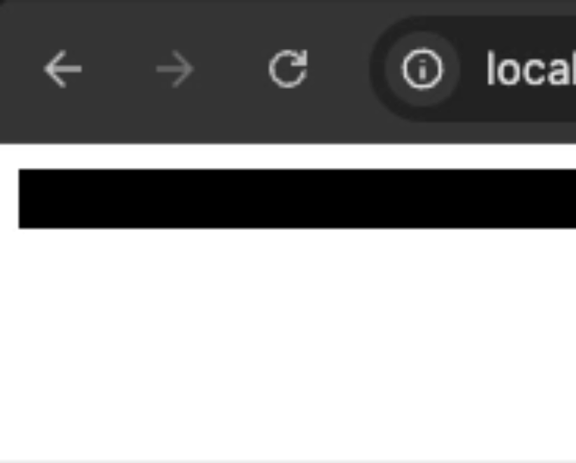
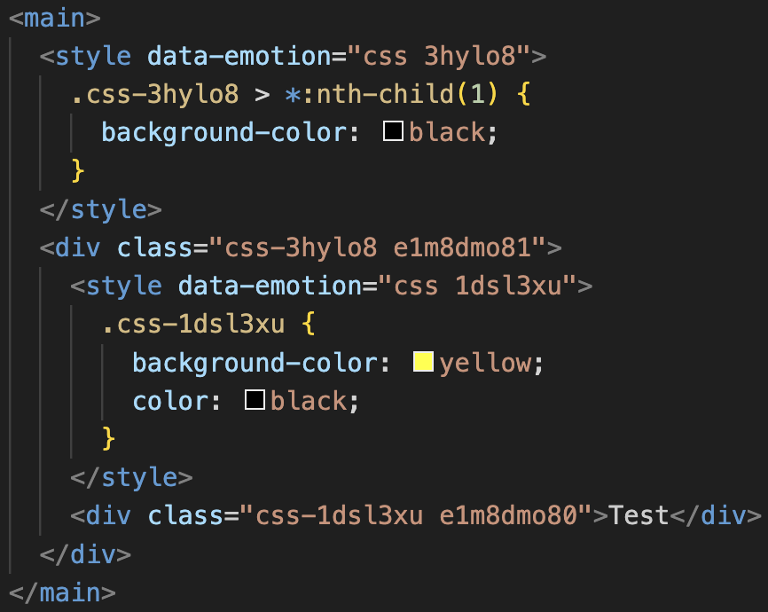
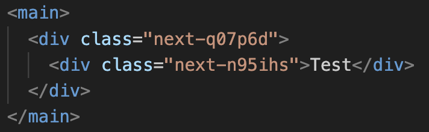
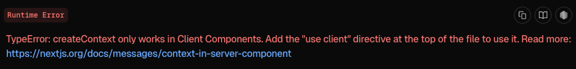
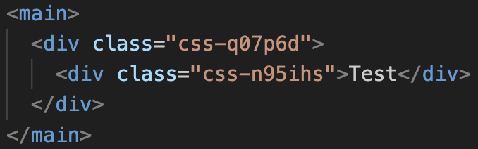

CSS-in-JS는 자바스크립트를 사용해서 스타일을 지정하는 방식으로, 대표적으로 styled-components, emotion 라이브러리가 존재한다. 나는 웹 개발을 하면서 스타일을 적용하기 위해 styled-components를 자주 사용해왔다.

그런데 최근에 styled-components 개발을 중단한다는 소식을 들었다( [Thank you.](https://opencollective.com/styled-components/updates/thank-you) ).

글의 내용중에는 CSS-in-JS는 요즘 생태계에서 벗어나고 있으며, TailwindCSS같은 다른 기술의 인기가 증가하고 있다고 한다. 하지만 댓글의 그래프를 보면 TailwindCSS의 인기가 증가하고 있지만 CSS-in-js가 완전히 대체되는 모습은 아니다.

자주 사용하던 라이브러리가 개발이 중단되었다고 CSS-in-JS를 떠나보낼 수도 없고 다른 라이브러리도 있기 때문에, 새로운 기술을 배울겸 emotion에 대해 알아보면서 기존에 사용하던 styled-components와 무엇이 다른지 정리하고자 한다.

### CSS-in-JS

기존의 CSS로 스타일을 작성하는 환경에서는, 기본적으로 CSS가 전역 범위를 가졌기 때문에 프로젝트가 커지면 클래스명이 충돌할 가능성이 높아졌다. 그래서 최대한 겹치지 않게 하는 것이 중요했다. 해당 문제를 해결하기 위해서 BEM과 같은 네이밍 컨벤션이 등장하고, CSS Module 방법이 등장하기도 했다.

그러나 다른 문제도 있었는데, CSS는 미리 정의된 스타일을 사용해야 하므로 동적 스타일링을 하기 번거로웠다. 사용하는 모든 스타일을 클래스로 정의해두고 클래스 이름을 변경하거나, 인라인 스타일 혹은 `document.style` 을 조작하는 방법을 사용해야 했다.

```css
.active {
  ...;
}
.inactive {
  ...;
}
```

```tsx
<button className={isActive ? "active" : "inactive"}>Button</button>
```

또한, CSS는 컴포넌트와 분리되어 있어서 특정 스타일을 찾기 위해 여러 파일을 탐색해야 했다. 컴포넌트를 위한 CSS파일을 선언하거나 CSS Module를 사용해도, 파일을 이동해야 하는것은 조금 번거로웠다.

```tsx
<button class="some_button">Button</button>
```

이렇게 작성된 코드는 `some_button` 클래스가 정의된 CSS파일로 이동해야 하고, 여러 개의 파일을 탐색해야 할 수도 있다.

이런 문제들을 해결하기 위해 CSS-in-JS가 등장하게 되었다. 자바스크립트 코드 안에서 스타일을 직접 정의하고, 이를 컴포넌트와 함께 관리할 수 있도록 하는 방식이다. 아래와 같은 장점을 나열해볼 수 있다.

- 컴포넌트가 선언된 파일 내부에서 스타일을 정의할 수 있어 컴포넌트와 함께 관리할 수 있다
- 자동으로 고유한 클래스명을 생성해 스타일을 컴포넌트로 한정하고 네이밍 충돌을 방지할 수 있다
- `props`를 전달하는 방식으로 동적인 스타일을 적용 할 수 있다

대표적인 라이브러리로 styled-components와 emotion이 존재한다.

### emotion

emotion은 CSS-in-JS 라이브러중 하나로, 빠른 성능과 유연하고 다양한 스타일링 방식을 지원한다고 한다. 프레임워크와 상관 없이 사용이 가능하며, 리액트와도 함께 사용할 수 있다. [공식 홈페이지](https://emotion.sh/docs/introduction)에서 다양한 정보를 얻을 수 있다. 다음과 같은 특징이 있다.

- 다양한 스타일링 방식을 지원한다
- 컴파일 시간에 스타일을 미리 계산해서 생성하는 기능을 제공한다
- SSR 환경에서의 성능을 위해 다양한 최적화 기능을 제공한다

#### @emotion/react

먼저 리액트에서 사용하기 위해서는 @emotion/react라이브러리를 설치해야 한다.

```bash
yarn add @emotion/react
```

라이브러리의 `css`를 사용해서 스타일을 선언할 수 있다. 자동으로 벤더 프리픽스를 지원하기 때문에, 브라우저 호환성은 신경쓰지 않고 css를 작성해주면 된다. 두 가지 방법이 존재한다.

```tsx
import { css } from "@emotion/react";

const inputStyle = css({
  width: "100%",
  height: "3rem",
  padding: "0 1rem",
  borderRadius: "4px",
  outline: "1px solid black"
});
// or
const inputStyle = css`
  width: 100%;
  height: 3rem;
  padding: 0 1rem;
  border-radius: 4px;
  outline: 1px solid black;
`;
```

객체 선언의 경우에는 인라인 스타일 문법을 사용하면 되고, 템플릿 리터럴의 경우 일반적인 스타일로 작성하면 된다. [공식 문서 - Best practice](https://emotion.sh/docs/best-practices#use-typescript-and-object-styles) 에서는 템플릿 리터럴 방식보다 객체 선언을 추천한다.

선택자와 미디어 쿼리도 사용할 수 있다.

```tsx
const wrapper = css({
  ...
  '& > p': {
    ...
  },
  '@media (min-width: 400px)': {
    ...
  }
});
// or
const wrapper = css`
  ...
  & > p {
    ...
  }

  @media (min-width: 400px) {
    ...
  }
`;
```

각 선언된 스타일을 병합할 수 있어 기존의 스타일을 재사용할 수 있다. 예를 들어 `inputStyle`과 함께 다른 스타일을 적용하고 싶을 때, 템플릿 리터럴의 경우 새 스타일 내부에 `inputStyle`을 삽입해주면 되고, 객체의 경우에는 함수 파라미터로 전달하면 된다.

```tsx
const inputStyle = css({ ... });

const buttonStyle = css(
  inputStyle,
  {
    backgroundColor: 'yellow',
  }
);
// or
const buttonStyle = css`
  ${inputStyle};
  background-color: yellow;
`;
```

이렇게 선언된 스타일들은 아래와 같이 태그의 `css`속성에 전달하는 것으로 적용할 수 있다.

```tsx
// !mark(1)
/** @jsxImportSource @emotion/react */
import { inputStyle } from './styles';

function Input({ ... }) {
  ...
  return (
    <input
      css={inputStyle}
      ...
    />
  );
}
```

하이라이트된 줄은 `jsx-pargma` 라는 것이다. 이게 뭘까?

기본적으로 사용되는 리액트의 `jsx`에는 `css`라는 속성이 없다. `css`가 있는건 emotion의 `jsx`이다. 그래서 트랜스파일러(babel)에게 리액트 대신 emotion의 `jsx`를 사용해야 한다고 알려주어야 한다([Emotion CSS prop 사용 설정하기](https://junglast.com/blog/react-new-jsx-transform-emotion)).

babel 설정을 직접 수정할 수 있다면 아래와 같이 적용하면 된다. CRA(참고로 `deprecated` 되었다)에서는 `eject`를 하거나, craco등을 사용해 수정해야 한다.

```json
{
  "presets": [
    [
      "@babel/preset-react",
      { "runtime": "automatic", "importSource": "@emotion/react" }
    ],
    ...
  ],
  ...
}
```

하지만 babel 설정을 직접 건들 수 없는 경우가 있다. 이럴 때 사용할 수 있는 것이 `jsx-pragma`이다. 위의 코드처럼 파일의 최상단에 `jsx-pragma`를 작성해서 babel에게 알려줄 수 있다. 그래서 babel 설정을 하지 않는다면 `jsx-pragma`를 작성해줘야만 `css`속성이 정상적으로 작동한다. 그런데 매번 컴포넌트를 생성할 때마다 작성하는 것은 귀찮을 수 있다. VSCode를 사용하고 있다면 스니펫을 추가해서 사용하면 조금 편할 것 같다.

자세한 설명은 [공식 문서 - Get started](https://emotion.sh/docs/css-prop#get-started)에서 확인할 수 있다.

만약 타입스크립트를 사용하고 있다면, 타입스크립트 컴파일러에게도 마찬가지로 알려줘야 한다. `tsconfig.json`에 추가적인 설정을 해야한다.

```json
{
  "compileOptions": {
    ...
    "jsxImportSource": "@emotion/react"
  },
  ...
}
```

다시 돌아와서, `css`속성에는 인라인 스타일처럼 직접 작성할 수도 있다. 이를 활용하면 동적인 스타일링도 가능하다.

```tsx
function Input({ color, ... }) {
  ...
  return (
    <input
      css={{
        border: '1px solid yellow',
        color: color,
      }}
    />
  );
}
```

개발을 진행하면서 한 태그에 여러 개의 스타일을 지정하고 싶을 수 있다. `css` 속성에는 복수 개의 스타일을 배열 형식으로 전달해서 한 번에 적용할 수 있다.

```tsx
function Input({ ... }) {
  return (
    <input
      css={[style1, style2]}
    />
  );
}
```

이 때, 스타일의 우선 순위는 사용된 순서를 따라간다. 일반적인 css에서는 클래스가 정의된 순서에 따라서 나중에 정의된 것이 우선된다. 그러나 emotion은 실제 사용하는 순서를 따라가도록 되어있어, 선언 순서를 신경 쓸 필요가 없다.

```tsx
const style1 = css({
  color: "red",
  backgroundColor: "black"
});

const style2 = css({
  color: "white"
});

function Div() {
  return <div css={[style1, style2]}>div tag</div>;
}
// { color: 'white', backgroundColor: 'black' }
```

이것은 emotion의 강력한 패턴 중 하나라고 설명하고 있다. 실제 동작하는 예제는 [공식 문서 - Composition](https://emotion.sh/docs/composition)에서 확인할 수 있다.

애니메이션은 `keyframes`를 사용해 keyframe을 정의하고, 스타일에 삽입하여 애니메이션을 작성하면 된다. 블로그 테마 버튼의 해와 달이 뜨는 애니메이션을 작성하면 아래와 같다.

```tsx
import { css, keyframes } from "@emotion/react";

const rise = keyframes`
  0% {
    transform: rotate(180deg);
  }

  100% {
    transform: rotate(360deg);
  }
`;

const riseAnimation = css`
  animation: ${rise} 0.6s forwards;
`;
// or
const riseAnimation = css({
  animation: `${rise} 0.6s forwards`
});
```

역시 [공식 문서 - keyframes](https://emotion.sh/docs/keyframes)에서 실제 동작하는 예제를 볼 수 있다.

#### @emotion/styled

emotion은 다양한 스타일링 방식을 지원한다고 했다. `css`를 사용한 스타일 선언이 아닌, 스타일이 적용된 이모션 컴포넌트를 직접 선언할 수도 있다. 아래 라이브러리를 설치하면 가능하다.

```bash
yarn add @emotion/styled
```

작성한 스타일이 적용된 컴포넌트를 직접 선언하는 방식으로, 마치 styled-components처럼 선언해서 사용할 수 있다. 스타일 선언 방법은 `css`와 비슷한데, `styled.{TAG_NAME}`을 대신 사용하고 그 외에는 동일하다.

```tsx
import styled from "@emotion/styled";

const Input = styled.input`
  width: 100%;
  height: 3rem;
  padding: 0 1rem;
  border-radius: 4px;
  outline: 1px solid black;
`;
// or
const Input = styled.input({
  width: 100%;
  height: 3rem;
  padding: 0 1rem;
  border-radius: 4px;
  outline: 1px solid black;
});

function Form({ ... }) {
  ...
  return (
    ...
      <Input />
    ...
  );
}
```

당연하게도 기존에 `css`로 선언된 스타일을 재사용할 수 있다. `css`를 병합하는 방식과 동일하다.

```tsx
const inputStyle = css({ ... });

const Button = styled.button`
  ${inputStyle};
  background-color: yellow;
`;
// or
const Button = styled.button(
  inputStyle,
  {
    backgroundColor: 'yellow',
  }
);
```

이미 선언된 이모션 컴포넌트의 스타일을 확장할 수도 있다.

```tsx
const PrimaryButton = styled(Button)`
  ...
`;
```

또한 일반 컴포넌트에도 스타일을 선언해서 전달할 수 있다. 단, 해당 컴포넌트가 `className`을 전달 받고 태그에 할당하도록 구현되어 있어야 적용된다.

```tsx
function Button({ className, ... }) {
  return <button className={className}>Button</button>
}

const PrimaryButton = styled(Button)`
  ...
`;
```

가끔 이미 선언된 이모션 컴포넌트의 태그를 변경하고 싶을 수 있다. `button` 태그로 선언된 `Button` 컴포넌트의 스타일과 동일한 `div` 태그 컴포넌트를 만들고 싶다고 하자. 이 때, `withComponent` 메서드나 컴포넌트의 `as` 속성을 사용한다면 원하는 태그로 변경할 수 있다.

```tsx
const Button = styled.button`
  ...
`;

const ButtonStyleDiv = Button.withComponent('div');
// or
function SomeComponent({ ... }) {
  ...
  return (
    ...
      <Button as='div' />
    ...
  );
}
```

`styled`로 이모션 컴포넌트를 선언할 때에는 `props`를 사용한다면 동적인 스타일을 적용할 수 있다.

```tsx
const Button = styled.button<{ size: string }>(inputStyle, (props) => ({
  fontSize: props.size
}));
// or
const Button = styled.button<{ size: string }>`
  ${inputStyle};
  font-size: ${(props) => props.size};
`;
```

`props`속성의 경우에는 `defaultProps`을 사용하여 기본값을 설정할 수 있다.

```tsx
const Button = styled.button<{ active?: boolean }>`
  ...
`;

Button.defaultProps = {
  active: false
};
```

`props`를 사용할 때 원하지 않는 값이 DOM에 노출될 수 있다. 기본적으로 emotion은 유효한 모든 `props`를 전달하는데, 이 때문에 스타일에 사용되는 변수가 DOM에 노출될 수 있다.

```tsx
const Button = styled.button<{ color: string }>`
  ...
`;

function Form({ ... }) {
  ...
  return (
    ...
      <Button color='black'>Submit<Button>
    ...
  );
}
```

이 경우 DOM에 다음과 같이 `color`속성이 노출될 수 있다.

```html
<button class="css-{hash}" color="black">Submit</button>
```

이 때, `shouldForwardProp`를 사용하여 DOM에는 전달되지 않도록 필터링할 수 있다. `shouldForwardProps` 함수의 파라미터로는 문자열로, 전달할 조건을 명시하는 함수를 작성하면 된다.

```tsx
const Button = styled("button", {
  shouldForwardProp: (key) => key !== "color"
})`
  ...
`;
```

실제 작동하는 예제는 [공식 문서 - Customizing prop forwarding](https://emotion.sh/docs/styled#customizing-prop-forwarding)에서 확인할 수 있다.

#### Global style

프로젝트를 진행하면서 `reset.css`를 적용하거나, 전역적인 스타일을 적용하는 경우가 있다. emotion에서는 `Global` 컴포넌트를 통해 적용할 수 있다.

```tsx
import { css } from "@emotion/react";

const defaultStyle = css`
  * {
    margin: 0;
    padding: 0;
    border: 0;
    box-sizing: border-box;
    vertical-align: baseline;
  }
  ...
`;

export default defaultStyle;
```

우선 `css`로 스타일을 선언하고, 선언된 스타일을 `Global` 컴포넌트의 `styles`속성으로 전달하면 스타일을 전역적으로 삽입한다. `css`속성의 명세와 동일하고, 마찬가지로 인라인 스타일 객체를 직접 받을수도 있다.

```tsx
root.render(
  <React.StrictMode>
    ...
    <Global styles={defaultStyle} />
    ...
  </React.StrictMode>
);
```

#### Theme

테마는 `ThemeProvider`를 사용해서 설정할 수 있다. 테마를 정의해 두고 `ThemeProvider`를 앱 최상단에 추가해 테마를 전달하면, 여러 방식으로 접근해서 사용할 수 있다.

```tsx
const theme = {
  color: {
    primary: "#379ad3"
  }
};

function App() {
  ...
  return (
    <ThemeProvider theme={theme}>
      ...
    </ThemeProvider>
  );
};
```

`css`속성에서 객체 대신 객체를 반환하는 함수를 할당하는것으로 테마에 접근할 수 있다.

```tsx
<div css={(theme) => ({ color: theme.color.primary })}>Theme</div>
```

`styled`의 경우에는 `props`를 읽는 방식과 동일하게 테마를 참조할 수 있다.

```tsx
const Div = styled.div`
  color: ${(props) => props.theme.color.primary};
`;
// or
const Div = styled.div((props) => ({
  color: props.theme.color.primary
}));
```

`useTheme` Hook을 이용해서 함수형 컴포넌트에서 테마를 가져올 수도 있다.

```tsx
import { useTheme } from '@emotion/react';

function SomeComponent({ ... }) {
  const theme = useTheme();
  ...
  return (
    <div css={{color: theme.color.primary}}>Some component</div>
  );
};
```

기본적으로 `theme`객체의 타입은 빈 객체이다. 그래서 타입스크립트를 사용한다면 타입을 확장하여 테마에 대한 타입을 선언해주어야 한다.

```ts
import "@emotion/react";

declare module "emotion/react" {
  export interface Theme {
    color: {
      primary: string;
    };
  }
}
```

#### Label

CSS-in-JS는 클래스명의 충돌을 방지하기 위해 고유한 클래스명을 생성하기 때문에, 클래스명만 보고는 어떤 스타일인지 알기 어렵다. emotion은 `label`을 클래스명에 추가하여 가독성을 높이는 기능을 제공한다.

```tsx
const PrimaryButton = styled.button`
  label: primary-buutton;
  ...
`;
// or
const PrimaryButton = styled('button', {
  label: 'primary-button',
})`
  ...
`;

function SomeComponent({ ... }) {
  return (
    <PrimaryButton>Button</PrimaryButton>
  );
};
```

`PrimaryButton`이 돔에 삽입됬을 때 아래와 같이 보인다.

```html
<button class="css-{HASH}-primary-button">Button</button>
```

### @emotion/babel-plugin

emotion은 추가적인 기능 제공 및 빌드 타임에 클래스를 생성하는 등의 최적화를 위한 babel 플러그인을 지원한다. 사용하고 싶다면 @emotion/babel-plugin을 설치하고 babel 설정에 플러그인을 추가하면 된다.

```bash
yarn add --dev @emotion/babel-plugin
```

```json
{
  "plugins": [
    ...
    [
      "@emotion",
      {
        ...options
      }
    ]
  ],
  ...
};
```

#### Components as selector

우선 @emotion/babel-plugin을 사용하면, emotion에서 일반적인 CSS의 선택자처럼 이모션 컴포넌트를 대상으로 지정할 수 있게 된다. 이를 활용하면 더욱 정밀하게 스타일을 작성할 수 있다.

```tsx
const Button = styled.button`
  ...
`;

const Wrapper = styled.div`
  ${Button} {
    ...
  }
`;
// or
const Wrapper = styled.div({
  [Button]: {
    ...
  }
});
```

#### `autoLabel`

emotion에서는 `label`을 추가해서 클래스명의 가독성을 높일 수 있다고 했다. @emotion/babel-plugin은 `css`나 `styled`가 선언되어 할당되는 변수의 이름을 자동으로 `label`로 설정하는 옵션을 제공한다.

```tsx
const buttonStyle = css({ color: "blue" });

const Button = styled.button({
  color: "blue";
});
```

위 코드는 아래와 같이 변경된다.

```tsx
const buttonStyle = css({ color: "blue" }, "label: buttonStyle;");

const Button = styled.button({ label: "Button" }, { color: "blue" });
```

- `dev-only`: 기본값으로, 개발 환경에서만 자동으로 추가하도록 한다.
- `always`: 환경을 따지지 않고 항상 추가하도록 한다.
- `never`: 기능을 비활성화한다.

#### `labelFormat`

`autoLabel`옵션이 `dev-only`나 `always`일 때에만 동작하는 옵션으로, 자동으로 생성되는 `label`의 포멧을 설정할 수 있다. 문자열로 졍의할 수 있으며, 대괄호를 통해 제공되는 변수를 표현하면 대체되어 표현된다. 제공되는 변수는 아래와 같다.

- `[local]`: `css`나 `styled`표현식이 할당되는 변수의 이름을 나타낸다.
- `[filename]`: `css`나 `styled`표현식이 위치하는 파일의 이름을 나타낸다.
- `[dirname]`: `css`나 `styled`표현식이 위치한 파일을 담고있는 디랙토리의 이름을 나타낸다.

```tsx
// component/Button.tsx
// labelFormat: '[dirname]--[filename]--[local]'
const PrimaryButton = styled.button`
  color: blue;
`;
```

위 코드의 클래스명은 아래와 같이 지정된다.

```html
<button class="css-{hash}-component--Button--PrimaryButton">...</button>
```

이 외에 `sourceMap`등의 옵션이 존재하며, [공식 문서 - @emotion/babel-plugin](https://emotion.sh/docs/@emotion/babel-plugin)문서에서 자세한 내용을 확인할 수 있다.

### 우당탕탕 Nextjs에서 emotion 적용해보기

글을 쓰는 현재 Nextjs를 공부하고 있어서, emotion 사용법에 이어 Nextjs에서 emotion을 사용하는 방법도 정리해보려고 알아보았다. emotion은 기본적으로 SSR을 지원해주지만 완벽하게 지원하지는 않는다고 한다. 런타임 기반의 CSS-in-JS 라이브러리라, SSR 환경에서는 페이지 로드 직후 화면이 깜빡이는 증상(FOUC)이 나타나거나, 서버사이드에서 랜더링 된 결과물과 달라지는 문제가 발생할 수 있어서 설정을 해주어야 한다고 한다.

그런데 알아보면서 다양한 문제들이 있고, 정보가 뭔가 조금 파편화되어 있다는 느낌을 받았다. Nextjs버전에 따라 설정 방식이 다른 것 같고, Page Router와 Nextjs13버전에서 등장한 App Router의 설정도 다르고, App Router는 아직 지원을 잘 해주지 않는다는 글도 보았다. 공식 예제 [Nextjs - with emotion](https://github.com/vercel/next.js/tree/canary/examples/with-emotion) 에서도 Page router 기준으로 설명하고 있다. emotion도 버전에 따라 여러 방법이 있다는 것 같아서 문서를 봐도 혼란스러운 부분이 있다. 아마 CSS-in-JS의 특성상 런타임에 스타일을 처리하는 방식이 SSR과 완전히 맞지 않는 부분이 있어서 그런게 아닌가 추측된다.

우선 다양한 이슈가 존재한다는 것만 인지하고, 이 글은 Nextjs@15, emotion@11 기준으로 직접 설정해보며, 설정하는 법을 정리해보려고 한다.

> Nextjs는 12버전 부터 babel에서 SWC로 넘어갔다. babel 설정을 할 수는 있지만 SWC 컴파일이 비활성화되어, Nextjs에 대한 babel 설정을 직접 작성해주어야 한다고 한다. 대신, `next.config.ts`의 `compiler`옵션에서 @emotion/babel-plugin과 동일한 설정을 수행할 수 있다. [Nextjs - compiler/emotion](https://nextjs.org/docs/architecture/nextjs-compiler#emotion)

[공식 문서 - SSR](https://emotion.sh/docs/ssr)에 따르면 SSR을 적용하는 데에 총 두 가지 접근 방식이 있다고 한다. 첫 번째 방식은 각 요소 위에 태그를 삽입하는 방식이고, 두 번째는 추가적인 설정을 해주는 방식이다. 그 중 첫 번째 방식이 기본적으로 적용되어 있다고 한다.

#### Page Router

일단 먼저 Page Router에서 emotion을 적용해보기 위해 `yarn create next-app` 을 실행해 Page Router 사용, TailwindCSS 미사용을 하고 프로젝트를 초기화한 후 필요한 라이브러리를 설치했다.

```bash
yarn create next-app
yarn add @emotion/react @emotion/styled
```

그리고 아무런 설정을 하지 않고 이모션 컴포넌트를 선언하고 바로 출력을 시도해봤다.

```tsx
import styled from "@emotion/styled";

export const Test = styled.div`
  background-color: yellow;
  color: black;
`;
```

```tsx
import Head from "next/head";

import { Test } from "@/components/Test";

export default function Home() {
  return (
    <>
      <Head>
        <title>Page router with emotion</title>
      </Head>
      <div>
        <main>
          <Test>Test</Test>
        </main>
      </div>
    </>
  );
}
```

코드를 작성하고 실행해보았는데 이상 없이 작동하는것 같다. 첫 번째 방법이 자동으로 적용된 것이다. 추가적인 설정이 필요 없는걸까?

다음으로 첫 번째 자식의 배경색을 검은색으로 적용하는 컴포넌트를 작성해 적용해보았다.

```tsx
export const FirstBlack = styled.div`
  & > *:nth-child(1) {
    background-color: black;
  }
`;
```

```tsx
import { FirstBlack, Test } from "@/components/Test";


export default function Home() {
  return (
    ...
      <FirstBlack>
        <Test>Test</Test>
      </FirstBlack>
    ...
  );
}
```

첫 번째 방식은 스타일을 적용하면 `style`태그가 `head`로 들어가지 않고 해당 태그의 바로 위에 삽입한다는 말이다. 그래서 `nth-child`같은 선택자가 정상적으로 작동하지 않을 수 있다고 한다.

문서의 말대로라면, `Test` 컴포넌트의 위에 `style`태그가 들어가므로 `FirstBlack`의 선택자가 정상적으로 작동하지 않아야 한다. 코드를 작성하고 빌드를 한 후 실행시켜 확인해보았다.



실행 결과, 설명과는 조금 다르긴 한데 실제로 `style`태그가 위에 삽입되기는 한다. 그리고 곧바로 `head`태그로 이동하면서, 잠깐이나마 검정색 적용이 되지 않는것을 확인할 수 있었다. 그래서 새로 고침을 반복하면 깜빡인다.

빌드를 하고 `.next/server/page/index.html`을 확인해보면, 실제로 해당 태그 위에 스타일이 삽입된 것을 확인할 수 있다. 클라이언트에서 랜더링될 때, 이를 수집하고 `head`로 이동하는 방식으로 보인다.



문서상에서는 선택자를 안 쓰면 문제될 것이 없다고 한다. 뭐, 안쓰면 되긴 한데 없으면 조금 불편하기도 하고, 해당 태그의 상단에 삽입하는것과 `head`로 이동하면서 DOM이 변경되는 것이 개인적으로 무언가 찝찝하다.

두 번째 방법은 조금 복잡한데, 이해한대로라면 랜더링한 결과물에서 스타일 태그를 수집하고, html을 만들 때 `head`에 삽입하는 방식으로 보인다. Nextjs에서는 SSR을 사용하기 위해서는 `Document` 컴포넌트를 커스텀해서 스타일을 랜더링하고 `head`에 삽입하도록 만들면 된다고 하며 [Nextjs - with emotion](https://github.com/vercel/next.js/tree/canary/examples/with-emotion) 예제 링크를 걸어두었다.

선택자 때문에 깜빡이는 것도 별로고 해서, 링크의 예제를 참고하면서 두 번째 방법을 사용해 SSR을 적용해보기로 했다.

그런데, 가서 봤더니 `Document`가 없다.


혹시 최신 버전에서는 `Document` 설정을 안해도 되는건가? 싶어서 예제를 따라 `next.config.ts`를 수정하고, `_app.tsx`에 `CacheProvider`를 적용해 봤다.

```tsx
import createCache from "@emotion/cache";
import { CacheProvider } from "@emotion/react";

const key = "next";
const cache = createCache({ key });

export default function App({ Component, pageProps }: AppProps) {
  return (
    <CacheProvider value={cache}>
      <Component {...pageProps} />
    </CacheProvider>
  );
}
```

```ts
const nextConfig: NextConfig = {
  ...
  compiler: {
    emotion: true
  }
};
```

그러나 깜빡이는 증상은 여전히 남아있었다.

그래서 구글링을 하며 Page Router에서 `Document`를 확장하는 방법에 대해 검색해보았고, 결국 `Document` 컴포넌트를 확장하는 코드를 [Implementing Next.js Emotions in Your Project](https://www.dhiwise.com/post/implementing-nextjs-emotions-in-your-project)글에서 찾을 수 있었다.

이를 참고해서, `_document.tsx`의 `Document`컴포넌트를 아래와 같이 작성하였다.

```tsx
import createEmotionServer from "@emotion/server/create-instance";
import { CacheProvider } from "@emotion/react";
import createCache from "@emotion/cache";

const key = "next";
const cache = createCache({ key });
const { extractCritical } = createEmotionServer(cache);

export default class MyDocument extends Document {
  static async getInitialProps(ctx: DocumentContext) {
    const originalRenderPage = ctx.renderPage;

    ctx.renderPage = () =>
      originalRenderPage({
        enhanceApp: (App) => (props) =>
          (
            <CacheProvider value={cache}>
              <App {...props} />
            </CacheProvider>
          )
      });

    const initialProps = await Document.getInitialProps(ctx);
    const styles = extractCritical(initialProps.html);

    return {
      ...initialProps,
      styles: (
        <>
          {initialProps.styles}
          <style
            data-emotion={`${key} ${styles.ids.join(" ")}`}
            dangerouslySetInnerHTML={{ __html: styles.css }}
          />
        </>
      )
    };
  }

  render() {
    return (
      <Html lang="en">
        <Head />
        <body>
          <Main />
          <NextScript />
        </body>
      </Html>
    );
  }
}
```

코드를 해석해보면 다음과 같다. 해석은 [Nextjs - Custom Document](https://nextjs.org/docs/pages/building-your-application/routing/custom-document) 문서와 [공식 문서 - SSR](https://emotion.sh/docs/ssr)을 참고했다.

1. emotion의 캐시를 생성하고 서버를 생성한다.
2. `renderPage`를 오버라이딩해서 리액트 앱을 `CacheProvider`로 감싸고 캐시를 전달한다.
3. 부모(원본 `Document`)의 `getInitialProps` 메서드를 통해 기존 `props`를 받아온다.
4. `extractCritical`메서드를 통해 기존 html에서 emotion 스타일을 추출한다.
5. emotion 스타일을 정리해서 스타일 태그로 만들어 반환한다.

위 코드를 작성하고 나서, 기존에 공식 예제를 따라서 `_app.tsx`에 작성했던 `CacheProvider`를 제거하고 빌드 후 실행해보았다. 결과적으로는 깜빡이는 증상이 사라졌고, 위의 설정을 통해 CSS 선택자 사용에 대한 제약이 사라졌다.



이렇게 해서, Page Router에서 SSR과 관련해 아무런 설정을 안해도 작동하는 첫 번째 방식과 두 번째 방식을 적용해보았다. 첫 번째는 별도의 설정은 필요 없으나 CSS 선택자에 대한 제약이 존재하고, 두 번째는 설정이 복잡하지만 CSS 선택자에 대한 제약이 없다. 단, 두 번째 방식의 경우에는 스트리밍 API에서는 정상적으로 작동하지 않는다고 한다.

그런데 어디에서는 첫 번째 방법으로도 SSR을 잘 지원한다고 하고, 또 다른 곳에서는 추가적인 설정을 해주어야 한다고 한다. 참고한 문서에서도 해당 방식을 적용할 경우 SSR을 잘 지원한다고 언급하고 있다.

결국, 스트리밍 API 지원 여부와 CSS 선택자 사용 유무에 따라서 적절한 방식을 적용해주면 될 것 같다.

#### App Router

다음으로 App Router에서 emotion을 적용해보기 위해 `yarn create next-app` 을 실행해 App Router 사용, TailwindCSS 미사용을 하고 프로젝트를 초기화한 후 Page Router때와 동일한 작업을 했다.

그리고 첫 번째 방법을 사용하기 이해 아무런 설정을 하지 않고 Page Router와 동일한 이모션 컴포넌트를 선언하고 출력을 시도해보았다.

```tsx
import { Test, FirstBlack } from "@/components/Test";

export default function Home() {
  return (
    <div>
      <main>
        <FirstBlack>
          <Test>Test</Test>
        </FirstBlack>
      </main>
    </div>
  );
}
```

바로 에러가 발생했다.



해당 에러는 `React.Context` 관련 에러로, 이를 사옹하기 위해서는 "use client" 를 작성해서 클라이언트 컴포넌트임을 명시해주어야 한다고 한다. 그래서 스타일을 선언한 파일에 "use client" 를 작성해주면 작동하긴 한다.

```tsx
"use client";
import styled from "@emotion/styled";
...
```

그러나 이전 Page Router에서 첫 번째 방법을 적용했을 때와 동일하게 깜빡이는 증상이 발생한다. 그리고 이렇게 하면 스타일을 선언한 모든 파일에 "use client"를 해야 한다는건데, 스타일이 적용된 모든 컴포넌트가 클라이언트 컴포넌트가 되버린다. App Router 역시 두 번째 방법을 선택해야 할 것 같다고 생각했다. 그러나 App Router에는 `_document` 문서가 없다. 그러면 어떻게 해야할까?

[Nextjs - css-in-js](https://nextjs.org/docs/app/building-your-application/styling/css-in-js)에 나와있는 목록에서는, emotion의 경우 `app` 디랙토리에 대해 아직 지원을 위한 작업중이라고 나와있다. 문서의 다른 항목을 보니, 다른 라이브러리의 경우 `useServerInsertedHTML`을 활용해서 구현하고 있는 듯 하다. 하지만 emotion의 문서를 아무리 뒤져봐도, 관련한 내용을 찾을 수 없다. emotion 레포지토리의 이슈에는 [Plans to support Next.js 13 - /app directory](https://github.com/emotion-js/emotion/issues/2928)가 22년부터 등록되어 있고, 아직 **열려있는 상태**다. 즉, **emotion은 아직 App Router를 잘 지원하지 않는다**는 뜻으로 볼 수 있다.

그러면 emotion이 아직 지원을 해주지 않으므로, Nextjs에서 emotion을 사용하기 위해서는 기능을 직접 구현하는 것 외에는 방법이 없나?

열심히 구글링 해보던 도중, emotion 레포지토리의 이슈 중 [Make it easyer to integrate with Next.js](https://github.com/emotion-js/emotion/issues/3054) 를 찾을 수 있었다. emotion에서 App Router와 Page Router가 함께 작동하도록 구성하는것은 복잡할 수 있는데 tss-react에서 이를 쉽게 할 수 있는 도구를 제공하고 있고, emotion에서 관련 기능을 직접 제공하길 바란다는 내용이다. 그러니까, tss-react를 사용한다면 App Router에서 SSR 설정을 쉽게 할 수 있다는 말이다. 실제 이슈에서 첨부한 사진을 보면, App Router는 물론 Page Router도 쉽게 설정하는것을 볼 수 있다.

tss-react는 emotion 기반의 type-safe한 스타일 라이브러리로, MUI와의 통합을 염두해두고 만들어졌다고 한다. 하지만 MUI 없이도 emotion의 대체제로 사용이 가능하고, SSR 대응이 가능하다고 한다. 단, 서버 컴포넌트를 지원하지 않기 때문에 **클라이언트 컴포넌트를 권장**한다. 자세한 설명은 [tss-react 공식 문서](https://www.tss-react.dev/)에 작성되어 있다. 아무튼, 해당 라이브러리에서 App Router를 위한 emotion 설정만 적용하면 일단 사용은 가능할 것 같다.

바로 한번 시도해보았다.

```bash
yar add tss-react
```

그리고 다음과 같이 `layout.tsx`를 수정해 SSR 설정 컴포넌트를 적용했다.

```tsx
import { NextAppDirEmotionCacheProvider } from "tss-react/next/appDir";

export default function RootLayout({
  children
}: Readonly<{
  children: React.ReactNode;
}>) {
  return (
    <html>
      <body>
        <NextAppDirEmotionCacheProvider options={{ key: "css" }}>
          {children}
        </NextAppDirEmotionCacheProvider>
      </body>
    </html>
  );
}
```

그냥 `tes-react/next`에서 가져오면 `module-not-found` 에러가 발생한다. 그래서 정확한 경로를 명시해서 가져와야 한다.

설정을 마치고 빌드를 한 후 실행해본 결과 깜빡이는 증상이 사라졌다. 빌드 과정에서 스타일을 추출하여, `head`태그에 정상적으로 삽입한다는 뜻이다. `.next/server/app/index.html` 을 확인해보면 style 태그가 사라진 것을 볼 수 있다.



[tss-react/src/next/appDir.tsx](https://github.com/garronej/tss-react/blob/main/src/next/appDir.tsx)의 코드를 간단히 분석해보았다.

1. 캐시를 생성해 클로저를 활용해 삽입된 목록을 직접 관리하고, `insert`, `flush` 함수를 구현해서 반환한다.
2. `useServerInsertedHTML`에서 캐시를 비우고 값을 가져와 스타일을 조합해 스타일 태그를 생성해 반환한다.
3. `CacheProvider`로 자식 컴포넌트를 감싼다.

코드의 구조는 다르지만, Page Router 때 처럼 스타일을 추출해서 태그를 생성해 반환하는 흐름은 동일한 것 같다.

이렇게 해서, 하나는 라이브러리를 추가해서 쓰기는 했으나, App Router에서도 SSR과 관련한 두 가지 설정을 적용해 보았다. 첫 번째 방식과 두 번째 방식 모두 "use client"를 명시해주어야 해서 완전히 지윈하지는 않는다고 생각한다. 그리고 첫 번째 방식은 역시 CSS 선택자를 사용하는 데에 문제가 있고, 두 번째 방식은 직접 구현하거나 외부 라이브러리 의존성을 추가해주어야 한다.

어차피 두 가지 방식 모두 서버 컴포넌트를 지원해주지 않으므로, CSS 선택자 사용 유무에 따라서 선택하면 될 것 같다.

#### Nextjs에서 emotion

Nextjs에서 emotion이 접근하는 두 가지 방법에 대해 Page Router와 App Router에서 각각 적용해 보았다.

Page Router에서는 별도의 설정이 필요 없으나, 스타일 태그가 각 요소 바로 위에 삽입되기 때문에 CSS 선택자 사용에 제약이 존재했다. 이를 해결하기 위한 방법으로는 `_document.tsx`를 커스텀하여 스타일을 추출해 `head`에 삽입하는 방식으로 적용할 수 있었다. 하지만 이 경우 선택자 문제나 깜빡임 현상은 해결되지만, 추가적인 설정이 필요했고 스트리밍 랜더링에는 정상적으로 작동하지 않는다고 한다.

App Router에서도 기본적으로 emotion을 사용할 수 있었으나 동일한 제약이 있었고, 추가적으로 스타일을 선언한 파일에 "use client"를 명시해야 했다. 또한 App Routerdpsms `_document.tsx`가 존재하지 않기 때문에, 앞서 Page Router에서 사용했던 방식은 적용이 어려웠다. 이것의 대안으로는 tss-react를 사용해서 설정하는 방식이 있었는데, 서버 컴포넌트를 지원되지 않아서 스타일을 선언한 모든 파일에 "use client"를 명시해 클라이언트 컴포넌트를 사용해야 했다.

정리하자면 Page Router의 경우에는 공식 문서를 통해 어느 정도 가이드를 제공하고 있었고 지원을 해주는 것 처럼 보여졌다. 반면 App Router의 경우에는 Nextjs 공식 문서 기준으로 아직 완전히 지원되지 않으며, 관련 이슈도 열려있는 상태임을 확인할 수 있었다. 다양한 문서들을 보면, CSS-in-JS 특성상 서버 컴포넌트를 지원하기 어렵다는 지적이 있었고, 다른 대안을 고려할 것을 권장하는 내용들이 보였다.

> Nextjs 공식 문서 : "If you want to style Server Components, we recommend using CSS Modules or other solutions that output CSS files, like PostCSS or Tailwind CSS."

따라서 Nextjs에서 emotion을 사용하는 것에는 어느 정도의 제약 사항들이 존재한다는 것을 인지하고, 상황에 따라 적절한 방식을 선택하는 것이 필요하다고 느껴졌다.

### emotion과 styled-components

emotion의 사용 방법에 대해서 대략적으로 정리해 보았다. 이제 emotion과 styled-component를 비교해보자.

우선 styled-components의 경우에는 타입이 분리되어 있어 타입스크립트 환경에서는 `@types/styled-components`를 추가로 설치해주어야 한다. emotion의 경우에는 타입이 내장되어 있기 때문에 emotion만 설치하면 됬다.

하지만 styled-components는 설치하고 별다른 설정 없이 바로 사용할 수 있는 반면, emotion의 경우에는 `css`속성을 사용하기 위해서 babel 설정을 변경하거나, `jsx-prigma`를 파일마다 작성해주어야 한다. 사실 `css`속성을 사용하지 않고 `styled`만 사용한다면 emotion도 별다른 설정을 하지 않고 사용할 수 있다.

기본적인 스타일 선언 및 사용 방식에는 별 다른 차이가 없는 것 처럼 느껴졌다. `css`, `styled`, `keyframes` 모두 styled-components에서도 동일한 방식으로 사용 가능하다. 공식 문서에서도 `styled`의 경우 styled-components에서 많은 영감을 받았다고 한다.

다른 점은 emotion의 경우 템플릿 리터럴 외에 인라인 스타일 객체도 지원하기 때문에 더 다양한 방식으로 스타일을 정의할 수 있다. 그리고 태그에 `css` 속성이 있고 거기에 생성한 스타일을 전달한다는 점이다. 이것이 무엇이 이점이 있는지는 잘 모르겠어서 알게 되면 추후에 포스트를 업데이트 하도록 하겠다. 원래 emotion은 프레임워크와 상관 없이 사용할수 있고, `css`를 `className`에 할당하는 방식으로 사용이 가능하다고 문서에 작성되어 있다. 지금은, 아마도 리액트에서도 그 명세를 유지하기 위해 `css`속성을 추가한 것이 아닐까 정도로 이해된다.

```tsx
import scStyled from "styled-components";
import eStyled from "@emotion/styled";

const SCButton = styled.button``;
const EButton = styled.button``;
```

styled-components에는 `attrs`이라는 기능이 있다. 해당 기능을 사용하면 스타일 컴포넌트의 `props`을 마치 전처리하듯 기본값을 부여하거나 동적으로 속성을 설정할 수 있다.

```tsx
const Button = styled.button.attrs((props) => ({
  type: props.type ?? "button"
}))`
  ...
`;
```

하지만 emotion에서는 기본값을 설정할 때 `props`를 참조할 수 없고, 그냥 `defaultProps`를 통해 기본값을 정의할 수 있다. 그래서 `props`를 기반으로 무언가 동적으로 작업을 하고싶을 때에는 제약 사항이 존재한다. 대신, `shouldForwardProp`을 통해 DOM에 전달하지 않도록 제어할 수 있는 기능이 있다.

```tsx
Button.defaultProps = {
  type: "button"
};
```

스타일의 확장 역시 emotion, styled-components 모두 가능하고, 비슷한 방식으로 적용할 수 있다. `className`를 제어하는 일반 컴포넌트에도 스타일을 입힐 수 있다는 점도 동일하게 작동한다.

emotion과 styled-components는 모두 내부에서 CSS 셀렉터를 지원한다. 단, styled-components에서는 스타일 컴포넌트 셀렉터를 별 다른 설정 없이 사용할 수 있지만, emotion의 경우 @emotion/babel-plugin을 설치해야만 컴포넌트 셀렉터를 사용할 수 있다.

테마 설정도 별 다른 차이는 없다. `ThemeProvider` 컴포넌트를 앱 최상단에 배치하고 테마를 선언해서 전달하면 된다. 테마를 참조하는 방법과 제공되는 기능(`useTheme` 등)도 비슷하다. 타입스크립트의 경우 `styled.d.ts`를 선언해 타입을 확장해주어야 한다.

emotion에서 전역 상태를 설정하는 방법은, `css`로 스타일을 정의하고 `Global`을 배치한 후 해당 컴포넌트의 `styles`속성으로 전달하는 것으로 설정할 수 있다. styled-components의 경우에는 `createGlobalStyle`로 스타일을 정의하고, 반환된 컴포넌트를 적절한 위치에 배치하면 되서 조금 더 간단할 수 있다.

```tsx
import { createGlobalStyle } from 'styled-components';

const GlobalStyle = createGlobalStyle`
  ...
`
...
<GlobalStyle />
```

성능 비교를 안해볼 순 없다. 그래서 외부 자료를 좀 인용해보려고 했는데, 최신 데이터를 찾을 수 없다. 그나마 찾은건 3년전의 글인 [Stitches - Benchmarks](https://stitches.dev/docs/benchmarks)이다. 다른 라이브러리의 문서이지만 그래서 더욱 emotion과 styled-components를 비교하는건 객관적일 수 있지 않을까. 그래서 확인해 보면 emotion이 조금 더 빠르다고 한다. 다른 조금 오래된 자료들에서도 근소하게 emotion이 빠르다고 말하고 있다.

트랜드는 다른걸 찾을 필요 없이 글의 처음에 언급한 [Thank you.](https://opencollective.com/styled-components/updates/thank-you)의 코멘트에 달린 그래프를 보면 될 것 같다. 2023년 이후로 emotion가 추월했고, 2024년에는 emotion은 살짝 올라갔으나 styled-components는 유지되었고, 2025년에는 둘 다 상승세를 보이긴 했다. 그러나 styled-components는 개발 중단 소식 이후로 아마 하향세를 타지 않을까 싶다.

차이점에 대해서 정리하면 다음과 같다.

- **타입스크립트 지원**

  - styled-components: 타입 분리, `@types/styled-components` 추가 설치 필요
  - emotion: 타입 내장, 별도 설치 없이 바로 사용 가능

- **초기 설정**

  - styled-components: 별도 설정 없이 바로 사용 가능
  - emotion: `css` prop 사용 시 Babel 설정 또는 `jsx-pragma` 필요 (`styled`만 사용 시에는 설정 불필요)

- **스타일 선언 방식**

  - styled-components: 템플릿 리터럴 사용 (`styled`, `css`, `keyframes` 등)
  - emotion: 동일하게 사용 가능 + 인라인 스타일 객체도 지원

- **스타일 적용 방식**

  - styled-components: 선언한 컴포넌트 사용
  - emotion: 선언한 컴포넌트 사용 + 태그의 `css`속성에 직접 전달 가능

- **스타일 확장**

  - styled-components: `css` 조합 가능 + `styled(SomeComponent)` 방식으로 확장 가능
  - Emotion: 동일하게 확장 가능

- **컴포넌트 셀렉터**

  - styled-components: 기본적으로 지원
  - Emotion: `@emotion/babel-plugin` 설치 필요

- **기본 Props 설정**

  - styled-components: `.attrs()`로 props 기반 동적 설정 가능
  - Emotion: `defaultProps`만 지원 (props 기반 동적 설정은 불가)

- **Prop 전달 제어**

  - styled-components: 제한적 (대부분의 props가 DOM에 전달됨)
  - Emotion: `shouldForwardProp`으로 세밀한 제어 가능

- **테마 설정**

  - styled-components: `ThemeProvider`, `useTheme`, 타입 확장 등 지원
  - Emotion: 거의 동일하게 지원

- **전역 스타일**

  - styled-components: `createGlobalStyle`로 컴포넌트처럼 선언
  - Emotion: ` <Global styles={css``} /> ` 형태로 사용

### 마치며

emotion을 알아보면서 styled-components와 비교를 해봤는데, 생각보다 많은 부분이 비슷했고 거의 동일한 부분도 있다고 느꼈다. `styled`의 경우 styled-components의 영감을 많이 받았다고 하니 당연한 걸 수도 있다. 실제로 작업하다 그만둔 토이 프로젝트에서 styled-components를 emotion으로 변경해봤는데 별 문제가 없었다. 조금 더 공부해봐야 되겠지만 아마 사용하는 데에는 큰 지장이 없을 것 같다. [공식 문서 - Best practice](https://emotion.sh/docs/best-practices)에서 사용에 대한 권장 사항들이 있기 때문에 참고하면서 사용하면 될 것 같다. `styled`와 `css`속성 둘 중 하나만 사용하는 것을 권장하는데, 익숙한 `styled`가 마음에 든다.

Nextjs 설정의 경우에는 직접 실행해보면서 작성해보였다. 코드는 [nextjs-emotion-setting-test](https://github.com/Normaltic/nextjs-emotion-setting-test)에서 확인할 수 있다. Nextjs를 아직 공부하고 있어서 그런지 Nextjs와 관련된 설명이 조금은 미흡한 것 같다. 나중에 Nextjs에 익숙해지고 나서 기회가 된다면 Nextjs쪽 글을 보충해야겠다.

웹 개발을 하면서 개인적으로 쉽고 빠르게 개발할 수 있다고 느껴서 styled-components를 애용해왔는데, 개발이 중단된다는 소식을 듣고 뭔가 조금 아쉽다는 생각이 들었다. 뭐, 그래도 새로운 기술을 접해보는 계기가 됬다고 생각할 수도 있겠다.

어느덧 기술 스택중에 두 개가 벌써 레거시가 되어버렸다. 다른 하나는 꽤 예전에 쓰긴 했지만 recoil이었는데, 메타에서 개발한다고 해서 써봤는데 간단한 설정과 작은 단위의 전역 상태가 마음에 들었었다. [Recoil Repository](https://github.com/facebookexperimental/Recoil)는 현재 아카이브 처리되었다.

개발자는 지속해서 공부하면서 발전해야 한다고 하는데, 맞는 말인 것 같다. 물론 다른 직업들도 마찬가지지만, 새로운 것이 나오고 있던 것이 사라지고 하는 시간이 다른 기술에 비해서 주기가 짧다고 느껴진다. 어차피 이런 경우가 아니더라도 매번 사용하던 기술만 사용할 수는 없으니, 이것 저것 다양하게 사용해보고 경험해보는게 중요한 것 같다.

앞으로도 다양한 경험을 쌓을 수 있도록 노력해야겠다.

### 참고

- [Thank you.](https://opencollective.com/styled-components/updates/thank-you)
- [emotion 공식 문서](https://emotion.sh/docs/introduction)
- [Nextjs 공식 문서](https://nextjs.org/docs)
- [tss-react 공식 문서](https://www.tss-react.dev/)
- [Emotion 소개 및 사용하기](https://velog.io/@favorcho/Emotion-소개-및-사용하기)
- [Emotion CSS prop 사용 설정하기](https://junglast.com/blog/react-new-jsx-transform-emotion)
- [Implementing Next.js Emotions in Your Project](https://www.dhiwise.com/post/implementing-nextjs-emotions-in-your-project)
- [Plans to support Next.js 13 - /app directory](https://github.com/emotion-js/emotion/issues/2928)
- [Make it easyer to integrate with Next.js](https://github.com/emotion-js/emotion/issues/3054)
- [Stitches - Benchmarks](https://stitches.dev/docs/benchmarks)

#### 참고하면 좋을 것

- [Emotion이 CSS를 생성하는 방법](https://mitchell-up.github.io/mitchell-dictionary/blog/emotion/emotion-mechanism/)
- [css-in-js 라이브러리 코드로 파악해보는 css-in-js의 이모저모](https://ideveloper2.dev/blog/2022-01-25--emotion으로-파악해보는-css-in-js의-이모저모/)
