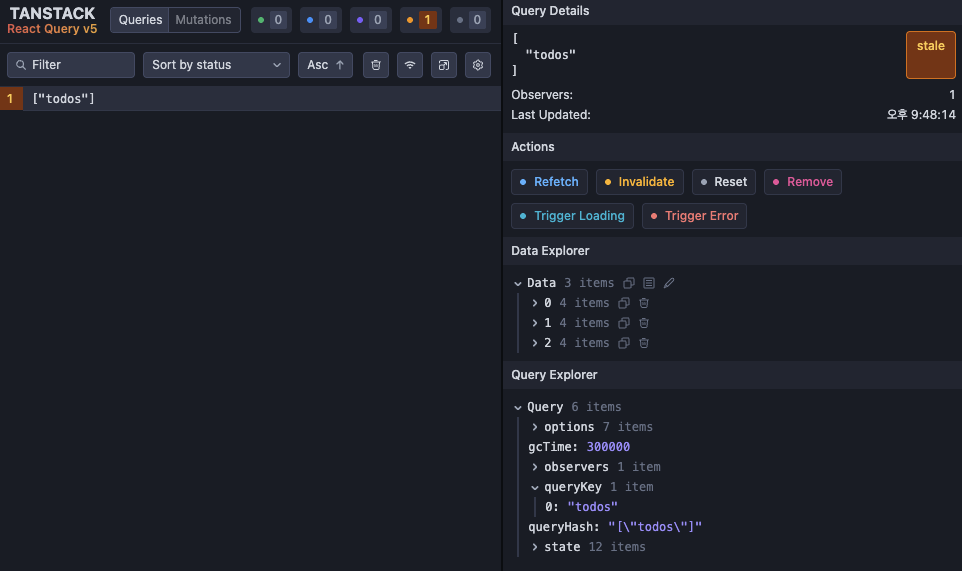
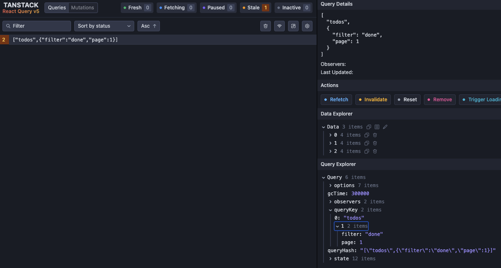
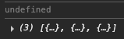
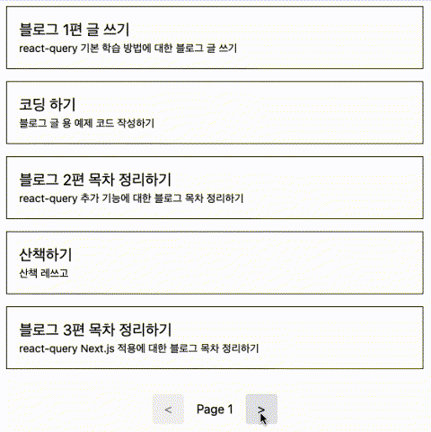
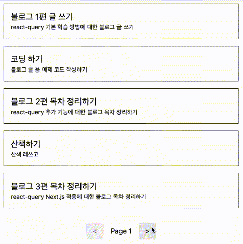
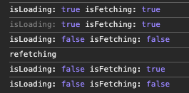

진행하고 있던 사이드 프로젝트를 고도화하기 위해 다양한 작업을 진행하고 있었다. 프로젝트는 Next.js 기반으로, 데이터를 API로 요청하는 구간은 상황에 따라서 서버, 클라이언트 컴포넌트를 적절히 섞어서 사용하고 있었다.

Next.js는 `fetch`를 확장하여 캐싱 기능을 제공한다. 그래서 서버 렌더링 과정에서의 불필요한 중복 요청을 줄이고자 요청 함수들을 axios에서 `fetch`로 변경하는 작업을 진행했다. 하지만 클라이언트 컴포넌트에서는 Next.js의 `fetch`를 사용할 수 없기 때문에, 클라이언트 컴포넌트에서의 API 요청 최적화는 별도로 진행해야 했다.

또한, 클라이언트 컴포넌트에서는 `useEffect`와 `useState`를 조합하여 API 요청을 처리하고 있었는데, 로딩이나 에러 처리를 위해 상태를 추가하며 점점 복잡해지고 있던 상황이었다.

그러다 react-query 라이브러리가 떠올랐고, 이를 활용하면 API 요청을 훨씬 간결하게 처리할 수 있고 캐싱을 통한 최적화가 가능하다는 것이 생각났다. 그래서 사이드 프로젝트에 도입하게 되었는데, 학습하는 과정에서 생각보다 많은 기능과 활용도가 있다는 것을 알게 되었다.

이 글에서는 react-query의 기본적인 개념과 그 사용법에 대해 정리해 보고자 한다.

### react-query?

리엑트의 컴포넌트에서 API를 호출할 때에는 주로 `useEffect`를 사용하여 데이터를 패칭하고, `useState`를 사용하여 상태를 관리하는 패턴을 많이 사용한다. 그리고 그 과정에서 로딩을 표현하고 싶거나, 에러를 처리하고 싶을 때에는 상태를 추가하여 핸들링하는 경우가 많다.

```ts
useEffect(() => {
  async function fetchData() {
    setIsLoading(true);
    setError(null);
    try {
      const response = await fetch("/api/data");
      const result = await response.json();
      setData(result);
    } catch (error) {
      setError(error);
    } finally {
      setIsLoading(false);
    }
  }

  fetchData();
}, []);
```

위 코드는 `useEffect`를 사용하여 컴포넌트가 마운트될 때 API를 호출하고, 로딩 상태와 에러 상태를 관리하는 간단한 예시이다. 단순한 API 호출 정도는 이 방식으로 충분히 처리할 수 있다.

하지만, 한 컴포넌트 안에서 여러 개의 API를 호출하는 경우에는 각 API마다 로딩, 에러, 데이터 상태를 관리해야 하므로 상태가 늘어나게 되어 코드가 복잡해지기 시작한다. 이 경우 커스텀 훅을 정의하여 상태 관리를 어느 정도 해결할 수 있다.

```ts
const [data, isLoading, error] = useFetch("/api/data");
```

커스텀 훅을 정의해 API 호출 처리를 추상화할 수는 있다. 하지만 필요한 기능들을 계속 추가하다 보면, API 하나를 처리하는데 너무 많은 상태를 관리하게 되거나, 원하는 기능을 직접 구현하기에는 너무 복잡해질 수 있다.

- 캐싱 : 동일한 요청에 대해 중복 요청을 방지하고 싶다.
- 리페칭 : 특정 시점에 데이터를 다시 가져오고 싶다.
- 조건부 요청 : 특정 조건에서만 요청을 보내고 싶다.

이렇게 프론트엔드에서 API를 처리하는 데에 여러 요구사항이 생기게 되면서, 그 처리 역시 복잡해지기 시작했다. 이런 다양한 상황을 해결하고자 react-query가 등장하게 되었다.

react-query는 API 처리 과정에서 필요할 수 있는 상태를 제공하는 것 부터, 요청에 대한 응답을 캐싱해 재사용하는 기능까지 다양한 기능을 제공한다. 그래서 이를 활용한다면 API 요청을 훨씬 간결하게 처리할 수 있고, 불필요한 네트워크 요청을 줄이는 데에도 도움을 줄 수 있다.

### react-query 기본 설정

react-query는 다음과 같이 설치할 수 있다. Tanstack으로 프로젝트가 이전되었기 때문에 `@tanstack/react-query` 패키지를 설치해야 한다.

```bash
npm install @tanstack/react-query
```

사용하기에 앞서, react-query의 기본 설정을 해주어야 한다.

react-query는 동일한 요청을 캐싱하고 재사용한다. 이를 위해 내부적으로 React의 Context API를 활용하는데, 따라서 앱의 루트에 Provider를 설정해주어야 한다.

먼저 `QueryClient`라는 객체를 생성하고, 앱을 `QueryClientProvider`로 감싸고 객체를 하위 컴포넌트에 전달해주도록 해야 한다.

```tsx
import { QueryClient, QueryClientProvider } from "@tanstack/react-query";

const queryClient = new QueryClient();

function App() {
  return (
    <QueryClientProvider client={queryClient}>
      {/* 앱 컴포넌트 */}
    </QueryClientProvider>
  );
}
```

`QueryClient`는 react-query의 핵심 객체로, 다음과 같은 역할을 담당한다.

- 캐시 관리 : 쿼리 데이터를 캐싱하고 관리하며, 필요할 때 재사용한다.
- 무효화, 재요청 : 특정 쿼리를 무효화하거나 다시 데이터를 가져올 수 있다.
- 전역 설정 : 쿼리의 기본 설정을 지정할 수 있다.

예를 들어, 특정 옵션을 설정해 전역적으로 적용할 수 있다.

```ts
const queryClient = new QueryClient({
  defaultOptions: {
    queries: {
      staleTime: 1000 * 60 * 5 // 캐시를 5분 동안 유지한다.
    }
  }
});
```

이렇게 설정하면, 다음에 설명할 `useQuery` 훅을 사용할 때, 별도로 `staleTime`을 지정하지 않으면 기본적으로 5분 동안 캐시가 유지된다. 이 외에도 쿼리와 뮤테이션에 대한 다양한 기본 옵션을 지정할 수 있다.

`QueryClient`는 앱 전체에서 하나만 생성하여 사용하는 것이 일반적이다. 여러 개를 생성하여 사용할 수도 있지만, 그렇게 할 경우 캐시가 분리되어 관리되므로 주의해야 한다.

react-query는 개발자 도구도 제공한다. 개발자 도구를 활용하면, 현재 캐시된 쿼리와 상태를 쉽게 확인할 수 있어 디버깅에 용이하다. 별도의 패키지로 분리되어 있으며, 추가로 설치해야 한다.

```bash
npm install @tanstack/react-query-devtools
```

설정법은 간단한데, `QueryClientProvider` 하위에 `ReactQueryDevtools` 컴포넌트를 추가해주면 된다.

```tsx
import { ReactQueryDevtools } from "@tanstack/react-query-devtools";

function App() {
  return (
    <QueryClientProvider client={queryClient}>
      {/* 앱 컴포넌트 */}
      <ReactQueryDevtools initialIsOpen={false} />
    </QueryClientProvider>
  );
}
```

그러면 앱 우측 하단에 개발자 도구 아이콘이 표시된다. 클릭하면 개발자 도구가 열리며, 현재 캐시된 쿼리와 상태를 확인할 수 있다.



`initialIsOpen` 옵션을 통해 개발자 도구의 초기 열림 상태를 지정할 수 있으며, 기본값은 `false`이다. 기타 옵션은 [공식 문서 - DevTool](https://tanstack.com/query/v5/docs/framework/react/devtools)를 참고하면 된다.

기본적인 설정은 끝났고, 이제 react-query의 주요 기능들에 대해 알아보자.

### useQuery

`useQuery`는 react-query에서 가장 기본이 되는 훅이자, 라이브러리를 사용할 때 가장 많이 접하게 되는 기능이다.

단순히 API 요청을 처리해 데이터를 가져오는 역할만 하는 것이 아니라, 로딩, 에러, 데이터 상태를 자동으로 관리해준다. 그래서 앞서 봤던 `useEffect`와 `useState`를 직접 조합하는 것보다 훨씬 간결하게 사용할 수 있다.

```tsx
const getTodos = async (): Promise<Todo[]> => {
  const response = await fetch("/api/todos");
  if (!response.ok) {
    throw new Error("Failed to fetch todos");
  }
  return response.json();
};

function TodoList() {
  const { data: todos = [], isLoading } = useQuery({
    queryKey: ["todos"],
    queryFn: () => getTodos()
  });

  if (isLoading) return <div>Loading...</div>;

  return (
    <section>
      <ul>
        {todos.map((todo) => (
          <li key={todo.id}>{todo.text}</li>
        ))}
      </ul>
    </section>
  );
}
```

위 코드는 `useQuery`를 사용해 `/api/todos`에서 데이터를 가져오는 예시이다. API를 호출해 데이터를 반환하는 `getTodos` 함수를 정의하고, `useQuery` 훅에 전달해 데이터를 가져오고 있다. 그리고 반환된 상태를 활용해 로딩을 표현하고, 데이터를 화면에 렌더링한다.

`useQuery` 훅을 적절히 활용한다면 API 요청을 훨씬 간결하게 처리할 수 있고, 필요한 상태를 참조하여 다양한 동작을 수행할 수 있다. `useEffect`와 `useState`를 조합하는 것보다 훨씬 깔끔해진다.

또한, react-query는 API 핸들링을 간결하게 표현하는 것에 그치지 않고, 내부적으로 요청에 대한 응답을 캐싱하고 제어하는 기능을 수행한다. 그래서 동일한 요청에 대해 이미 가져온 데이터를 재사용하여 불필요한 네트워크 요청을 줄여준다.

react-query에서는 이 캐시를 **쿼리(Query)** 단위로 관리한다. react-query에서 말하는 **쿼리**는 단순한 API 호출이 아니라, 특정 데이터를 가져오기 위한 요청 단위를 의미한다. 그래서 react-query는 쿼리를 기준으로 데이터를 캐싱하고 재사용하거나 무효화한다.

그래서 `useQuery` 훅은 쿼리를 정의하고 관리하는 역할을 하며, 그 쿼리에 대한 상태를 다루는 훅이라고 할 수 있다.

쿼리는 다양한 옵션을 통해 제어할 수 있으며, `useQuery` 훅은 옵션들을 인자로 받아 쿼리의 동작을 정의한다. 대표적으로 다음과 같은 옵션들이 있다.

- `queryKey`: 쿼리를 식별하는 고유한 키
- `queryFn`: 쿼리가 실행될 때 호출되는 함수
- `select`: 쿼리 결과를 가공하는 함수
- `enabled`: 쿼리의 활성화 여부를 제어하는 불리언

`queryKey`는 react-query에서 쿼리를 식별하는 고유한 키이다. 같은 `queryKey`를 가지는 쿼리는 동일한 쿼리로 간주되며, 이 키를 기준으로 캐싱하여 재사용하거나 무효화한다. 따라서 `queryKey`는 쿼리를 구분하는 중요한 역할을 한다.

```ts
const { ... } = useQuery({
  queryKey: ["todos"],
  ...
});
```

`queryKey`는 배열 형식으로 정의할 수 있고, 배열의 각 요소는 쿼리를 구분하는 데 사용된다. 위 예시에서는 `["todos"]`라는 배열을 사용하여 `todos` 쿼리를 정의하고 있다.

react-query는 이 `queryKey`에 전달된 배열을 통해서 각 쿼리를 식별하고 구분한다. 그래서 동일한 키를 가진 쿼리가 다른 위치에서 호출되더라도, 중복 호출을 막고 동일한 데이터를 바라보게 된다.

```ts
// component A
const { ... } = useQuery({
  queryKey: ["todos"],
  ...
});

// component B
const { ... } = useQuery({
  queryKey: ["todos"],
  ...
});
```

이 경우, `component A`와 `component B`에서 동일한 `queryKey`를 사용하고 있으므로, react-query는 이를 동일한 쿼리로 인식한다. 따라서, 두 컴포넌트가 마운트될 때 각각 API를 호출하는 것이 아니라, 한 번만 호출하여 데이터를 가져오고, 두 컴포넌트 모두 동일한 데이터를 바라보게 된다.

`queryKey` 배열은 복수개의 아이템이 포함될 수 있으며, 이를 통해 쿼리를 더욱 세분화 할 수 있다. `["todos", "create"]`와 같이 배열에 여러 개의 요소를 포함하여 쿼리를 상세하게 구분할 수 있다.

`queryKey`를 조금 자세히 설명해보자면, 우선 배열의 순서 역시 식별의 기준이 된다. 예를 들어, `["todos", "create"]`와 `["create", "todos"]`는 서로 다른 쿼리로 간주된다. 따라서, 동일한 API를 호출하더라도, `queryKey`의 순서가 다르면 별도의 캐시가 관리된다.

배열의 각 요소에는 문자열 뿐만 아니라 숫자, 불리언, 객체 등 다양한 타입을 사용할 수 있다. 그래서 동적인 값을 포함해 쿼리를 구분하여, 특정 변수의 값에 따라 세분화할 수 있다. 이 때, `queryKey`에 포함된 값이 변경되면, react-query는 이를 새로운 쿼리로 인식하고, `queryFn`을 다시 실행하여 데이터를 가져온다.

```ts
const { ... } = useQuery({
  queryKey: ["todos", todoId],
  queryFn: () => getTodo(todoId),
});
```

위 예시에서는 `todoId`라는 변수를 `queryKey`에 포함하여, 특정 ID에 해당하는 TODO 아이템을 가져오는 쿼리를 정의하고 있다. 이 경우 `todoId`가 변경될 때마다 서로 다른 쿼리로 인식되며 별도의 캐시가 관리된다. 그러므로 동적인 값을 포함한 쿼리를 정의(동적인 변수를 참조해 API를 호출)할 때에는 `queryKey`에 해당 변수를 포함시켜야 캐시가 올바르게 분리된다.

또한, `queryKey`는 객체를 포함할 수 있어 아래와 같은 형태로도 정의할 수 있다.

```ts
const { ... } = useQuery({
  queryKey: ["todos", { filter: "done" }],
  queryFn: () => getTodos({ filter: "done" }),
});
```

이 때, 객체의 속성 순서는 상관없다. react-query에서는 `queryKey`를 직렬화된 형태로 해시를 만들고, 이 해시를 기준으로 쿼리를 구분한다고 한다. 따라서, `["todos", { filter: "done", page: 1 }]`와 `["todos", { page: 1, filter: "done" }]`는 동일한 쿼리로 인식된다.

실제로 다음과 같은 코드를 작성하고 DevTool에서 확인해보면, 동일한 쿼리로 인식되어 하나의 쿼리만 보이는 것을 알 수 있다.

```ts
useQuery({
  queryKey: ["todos", { filter: "done", page: 1 }],
  queryFn: () => getTodos()
});

useQuery({
  queryKey: ["todos", { page: 1, filter: "done" }],
  queryFn: () => getTodos()
});
```



> 정확히 어떤 비교를 수행하는지 찾아보려 했으나, 추측하기로는 [@tanstack/react-query - hashKey](https://github.com/TanStack/query/blob/main/packages/query-core/src/utils.ts#L216) 함수를 통해 문자열로 변환 후 비교하는 것으로 보인다.

[공식문서 - Query Keys](https://tanstack.com/query/latest/docs/framework/react/guides/query-keys)에서도 `queryKey`에 대한 설명을 확인할 수 있다.

`queryFn`은 쿼리가 실행될 때 실제로 데이터를 가져오는 함수이다. 이 함수는 비동기여야 하며, 반드시 Promise를 반환해야 한다. react-query는 이 함수의 결과를 기다렸다가 성공/실패 여부에 따라 상태를 업데이트 한다.

```ts
const getTodos = async (): Promise<Todo[]> => {
  const response = await fetch("/api/todos");
  if (!response.ok) {
    throw new Error("Failed to fetch todos");
  }
  return response.json();
};

const { data: todos = [] } = useQuery({
  queryKey: ["todos"],
  queryFn: () => getTodos()
});
```

`queryFn` 내부에서 에러가 발생한다면, react-query는 이를 감지하여 반환하는 `isError`, `error` 상태를 업데이트 한다.

`queryFn`은 `context`객체를 인자로 받을 수 있는데, 이 객체에는 `queryKey`와 `AbortController`의 신호인 `signal`이 포함되어 있다. 이를 활용해 동적인 쿼리를 정의하거나, 쿼리가 취소될 때 요청을 중단할 수 있다.

```ts
const getTodo = async ({
  queryKey,
  signal
}: {
  queryKey: string[];
  signal: AbortSignal;
}): Promise<Todo[]> => {
  const [, todoId] = queryKey;
  const response = await fetch(`/api/todos/${todoId}`, { signal });
  if (!response.ok) {
    throw new Error("Failed to fetch todos");
  }
  return response.json();
};

const { data: todos = [] } = useQuery({
  queryKey: ["todos", todoId],
  queryFn: getTodo
});
```

쿼리 취소는 `useQuery`가 언마운트되거나 `queryKey`가 변경될 때, 혹은 `QueryClient`를 통해 쿼리를 직접 취소할 때 발생한다. 쿼리를 직접 취소하는 방식은 기회가 될 때 다뤄보고자 한다.

`select`는 쿼리의 결과 데이터를 가공하는 함수이다. 쿼리 결과를 컴포넌트에서 필요한 형태로 가공하는데에 사용된다.

```ts
const { data: todoTitles = [] } = useQuery({
  queryKey: ["todos"],
  queryFn: () => getTodos(),
  select: (data) => data.map((todo) => todo.title)
});
```

정확히는, `select` 함수는 `queryFn`이 반환한 값을 직접 받는 것이 아니라, 해당 쿼리 키에 대응하는 캐시에 저장된 데이터를 받아 가공한다.

물론 `queryFn`에서도 데이터를 가공할 수 있겠지만, 쿼리 캐시는 `queryFn` 에서 반환된 데이터를 기준으로 관리된다. 그래서 데이터 가공은 `select` 사용이 권장되며, 이를 통해 캐시된 원본 데이터를 유지하면서 컴포넌트에서 필요한 형태로 데이터를 가공하여 사용할 수 있다.

`select` 함수는 쿼리 데이터가 바뀔 때마다 다시 실행된다. 그래서 해당 쿼리의 캐시가 갱신될 경우 `select`가 다시 실행되어 최신 데이터를 가공하여 반환한다. 또한, 해당 함수에서 반환한 값은 메모이제이션되어, 쿼리 데이터가 변경되지 않는 한 동일한 참조를 유지한다. 따라서, `select`를 통해 가공된 데이터를 의존성 배열에 포함하여도 불필요한 업데이트가 발생하지 않는다.

`useQuery`는 컴포넌트가 마운트될 때 자동으로 쿼리를 실행한다. 하지만, 특정 조건에서만 쿼리를 실행하고 싶을 때가 있다. 이 때 `enabled` 옵션을 활용할 수 있다.

```ts
const { data: todos = [] } = useQuery({
  queryKey: ["todos", todoId],
  queryFn: getTodo,
  enabled: !!todoId
});
```

위 코드는 `enabled`를 활용해 `todoId`가 존재할 때에만 쿼리를 실행하도록 설정한 예시이다.

`enabled` 옵션은 boolean 값으로, `false`인 경우 쿼리는 실행되지 않으며, `true`로 변경되는 시점에 쿼리가 실행된다. 그래서 이를 활용한다면 조건부 요청을 간단하게 구현할 수 있다.

`placeholderData`는 쿼리가 실제 데이터를 가져오기 전까지 사용할 수 있는 임시 데이터를 지정하는 옵션이다. 이 데이터를 지정하면, 쿼리가 로딩 중일 때에 `data`에 해당 값이 들어오게 된다.

```ts
const { data: todos } = useQuery({
  queryKey: ["todos"],
  queryFn: () => getTodos()
});

useEffect(() => {
  console.log(todos);
}, [todos]);
```

`data`의 기본값은 `undefined`이다. 그래서 위 코드를 실행시키면 `todos`가 처음에는 `undefined`로 출력되고, 데이터가 로딩된 후에야 실제 데이터가 출력된다.



`placeholderData`는 이 로딩되기 전의 임시 상태를 지정하는데에 사용된다.

```ts
const { data: todos } = useQuery({
  ...
  placeholderData: []
});
```

위와 같이 `placeholderData`를 빈 배열로 지정하면, 쿼리가 로딩 중일 때에도 `todos`는 빈 배열이 된다. 그래서 컴포넌트가 처음 렌더링될 때에도 `todos`가 항상 배열 형태를 유지하게 된다.

그런데 `placeholderData`가 `data`의 기본 값을 지정하는 것이라면, `data = []` 처럼 사용할 수도 있다. 그렇다면 `placeholderData`는 왜 필요한 것인가?

`data = []`는 `undefined`를 방지하기 위해 값을 지정하는 것으로, 자바스크립트 문법일 뿐이다. 그래서 react-query 입장에서는 여전히 해당 쿼리에 대한 데이터가 없는 상태로 취급된다. 반면, `placeholderData`에 할당된 값은 쿼리의 데이터를 불러오기 전까지 임시로 반환되는 값이다. 따라서 react-query 입장에서 임시 데이터를 전달 받기 때문에 `select` 같은 데이터 가공 로직도 즉시 동작할 수 있다.

정리하자면, `data = []`는 자바스크립트 문법으로 `undefined`를 방지하는 것이고, `placeholderData`는 해당하는 쿼리의 임시 값을 설정하는 것이다.

한편, 다음과 같은 쿼리가 있다고 해보자.

```ts
const [page, setPage] = useState(1);

const { data: { todos, totalPages } = { todos: [], totalPages: 0 } } = useQuery(
  {
    queryKey: ["todos", page],
    queryFn: () => getTodos({ page }),
    placeholderData: { todos: [], totalPages: 0 }
  }
);
```

이는 페이지네이션을 구현하기 위한 쿼리이고, `page`라는 변수를 기준으로 페이지의 데이터를 가져오고 있다. `queryKey`에는 `page`가 포함되어 있어, 페이지가 변경될 때마다 새로운 쿼리가 생성되고, `queryFn`이 다시 실행되어 데이터를 가져오게 된다.

컴포넌트가 마운트되고 첫 쿼리가 실행될 때에는 페이지 1의 데이터를 가져오게 된다. 이 때, `placeholderData`가 빈 배열로 지정되어 있으므로, 페이지 1의 기본 값은 빈 배열이 된다.

페이지 1을 보고 있는 상황에서, 페이지 2로 넘어가고 싶어 버튼을 클릭했다고 해보자. `page`가 1에서 2로 변경되면서 새로운 쿼리가 생성되고, `queryFn`이 다시 실행되어 페이지 2의 데이터를 가져오게 된다. 이 때, 페이지 2의 기본 값 역시 `placeholderData`에 의해 빈 배열이 된다.

이 경우, `todos`는 페이지 1의 데이터에서 페이지 2의 데이터로 바로 변경된다. 그래서 페이지 2의 데이터가 로딩되는 동안에는 `todos`가 빈 배열이 된다. 마운트 시점부터의 `todos`의 값은 이렇게 바뀐다.

```text
[] -> [page 1 데이터] -> [] -> [page 2 데이터]
```

페이지가 변경될 때 해당 페이지에 대한 캐시가 없다면 `todos`는 빈 배열로 바뀌게 되며, 페이지가 바뀔 때마다 화면이 깜빡이는 현상이 발생할 수 있다.



이 때, `keepPreviousData`라는 함수를 사용할 수 있겠다. `keepPreviousData`는 react-query에서 제공하는 유틸 함수로, 새 요청이 진행되는 동안에도 이전 데이터가 유지된다. 즉, 다음 페이지 데이터를 불러오는 동안에도 이전 페이지의 데이터가 화면에 표시되다가, 새로운 데이터가 도착하면 교체되는 방식이다.

```tsx
import { keepPreviousData, useQuery } from "@tanstack/react-query";

const { ... } = useQuery({
  placeholderData: keepPreviousData,
});
```

`keepPreviousData` 함수를 불러와 `placeholderData`에 할당하는 방식으로 적용할 수 있다. 이렇게 설정하면, 페이지가 변경될 때에도 이전 페이지의 데이터가 유지되므로 화면이 깜빡이지 않고 전환된다.

> react-query@5 부터 유틸 함수로 분리되었으며, 이전에는 `keepPreviousData` 옵션을 직접 `true`로 지정하는 방식이었다.



`initialData`는 쿼리의 초기 데이터를 지정하는 옵션이다. 이를 설정하면 해당 값이 쿼리의 데이터로 사용되며, 쿼리가 즉시 데이터를 가진 상태로 시작한다.

```ts
const { data: todos } = useQuery({
  ...
  initialData: []
});
```

단순히 설명만 들어서는 `placeholderData`와 비슷해 보이지만, 차이가 있다.

`placeholderData`는 쿼리의 임시 데이터 역할을 한다. 그래서 쿼리가 실행되어 실제 데이터가 도착하면 교체된다. 반면, `initialData`는 해당 값 자체를 쿼리의 **실제 초기 데이터**로 간주한다. 따라서 `initialData`는 쿼리의 캐시에 저장되며, 최신 상태로 취급되어 쿼리가 즉시 데이터를 가진 상태로 시작한다. 즉, `placeholderData`는 쿼리가 데이터를 가져오기 전까지 임시로 사용하는 값이고, `initialData`는 쿼리의 실제 초기 데이터로 캐시에 저장되는 값이라는 점에서 구분된다.

그래서 `initialData`는 해당 쿼리의 결과를 미리 알고 있을 때, 이를 초기 데이터로 지정하여 쿼리가 즉시 데이터를 가진 상태로 시작하고자 할 때 유용하다.

`initialData`로 설정한 데이터는 최신 상태로 취급되기 때문에, `queryFn`이 실행되지 않고 캐시된 데이터를 사용하게 된다. 그리고 다음에 설명할 `staleTime` 옵션과 함께 사용한다면, `staleTime`이 지난 후에 `queryFn`이 실행되어 최신 데이터를 가져오게 된다. `staleTime`의 기본값은 0이기 때문에, 별도의 설정이 없다면 `initialData`를 지정하더라도 즉시 `queryFn`이 실행되어 데이터를 다시 가져오게 된다.

이 설정값은 해당 쿼리의 캐시에 이미 데이터가 존재하는 경우에는 적용되지 않는다. 그래서 쿼리가 이미 캐시에 데이터를 가지고 있다면, `initialData`는 적용되지 않고 캐시된 데이터가 사용된다.

쿼리의 결과는 캐시되어 재사용된다. 그런데 저장된 캐시는 특정 시점이 지난 이후에 최신 상태가 아니게 될 수 있다. 그래서 이 쿼리의 유효 기간을 지정하는 `staleTime` 옵션이 있다.

`staleTime`은 쿼리의 데이터가 최신 상태로 간주되는 기간을 밀리초 단위로 지정하는 옵션이다. 이 시간이 지나면 해당 쿼리의 데이터는 오래된 상태로 간주되어, 필요에 따라 `queryFn`이 다시 실행되어 최신 데이터를 가져오게 된다.

```ts
const { data: todos } = useQuery({
  ...
  staleTime: 1000 * 60 * 5 // 5분
});
```

위 예시 처럼 `staleTime`을 5분으로 지정하면, 쿼리가 데이터를 가져온 후 5분 동안은 해당 데이터가 최신 상태로 간주된다. 이 시간 동안 동일한 `queryKey`를 사용하는 다른 쿼리가 실행되더라도 네트워크 요청이 발생하지 않고 캐시된 데이터를 재사용한다. 그리고 5분이 지나면 해당 쿼리의 데이터는 오래된 상태로 간주되어, 필요에 따라 `queryFn`이 다시 실행되어 최신 데이터를 가져오게 된다.

이 설정을 활용하면 불필요한 네트워크 요청을 줄이고 캐시를 재사용해 성능을 최적화할 수 있다. 예를 들어, 자주 변경되지 않는 데이터를 가져오는 쿼리에는 긴 `staleTime`을 설정하여 캐시를 오래 유지하고, 자주 변경되는 데이터를 가져오는 쿼리에는 짧은 `staleTime`을 설정하여 최신 상태를 유지할 수 있다.

이 외에도, 윈도우에 포커스가 돌아왔을 때 재요청을 하도록 하는 `refetchOnWindowFocus` 등 다양한 옵션이 존재한다. 더 많은 옵션은 [공식 문서 - useQuery reference](https://tanstack.com/query/latest/docs/framework/react/reference/useQuery)에서 확인할 수 있다.

`useQuery`의 반환값에 대해 알아보면, 대표적으로 다음과 같은 상태들을 반환한다.

- `data`: 쿼리의 결과 데이터
- `isLoading`: 쿼리가 로딩 중인지 여부
- `isFetching`: 쿼리가 패칭 중인지 여부
- `refetch`: 쿼리를 다시 실행하는 함수
- `error`: 쿼리에서 발생한 에러 정보

`data`는 쿼리의 결과 데이터를 담고 있다. 쿼리가 성공적으로 완료되면, 이 값에 API에서 반환된 데이터가 들어오게 된다. 만약 쿼리가 아직 완료되지 않았거나, 에러가 발생한 경우에는 `undefined`가 될 수 있다. 이 값의 타입은 `queryFn`에서 반환하는 데이터의 타입으로, 제네릭을 통해 지정할 수도 있다.

```ts
const { ... } = useQuery<Todo[]>({
  ...
});
```

또한, `select` 옵션에 의해 가공된 형태로 사용할 수 있으며, `placeholderData`, `initialData` 옵션으로 쿼리가 완료되기 전까지의 `data`의 초기값을 지정할 수도 있다.

`useQuery`에서 반환하는 상태 중 `isLoading`과 `isFetching`이 있다. 이름만 보아서는 비슷해 보이지만, 약간의 차이가 있다.

`isLoading`은 쿼리가 처음 로딩되는 상태를 나타낸다. 즉, 앱 내부에서 쿼리가 처음 실행되어 데이터를 가져오는 중일 때 `true`가 된다. 다르게 표한한다면, 캐시에 데이터가 없어서 네트워크 요청을 보내 데이터를 가져오는 중일 때 `true`가 된다.

`isFetching`은 쿼리가 패칭되는 상태를 나타낸다. 즉, 이미 데이터를 불러온 상태에서 최신 데이터를 가져오는 중일 때 `true`가 된다. 이 상태는 쿼리가 이미 성공적으로 완료된 후에, 수동으로 `refetch`를 호출하거나, 쿼리가 자동으로 다시 패칭되는 경우에 해당한다.

만약, 컴포넌트가 마운트 되었고, 특정 시점에 `refetch`를 호출해 데이터를 다시 불러온다면, `isLoading`과 `isFetching`은 다음과 같다.



초기 로딩 시점에는 `isLoading`과 `isFetching`이 모두 `true`가 된다. 그리고 `refetch`로 데이터를 다시 받아오는 시점에는 `isLoading`은 `false`가 되고, `isFetching`은 `true`가 된다. 따라서, 첫 로딩 상태를 표현하고 싶다면 `isLoading`을, 이미 데이터를 받아온 상태에서 다시 데이터를 가져오는 중임을 표현하고 싶다면 `isFetching`을 사용할 수 있다.

반환값 몇 개 설명(isLoading, isError, data, error, refetch )

이를 활용한다면, API를 호출해 데이터를 가져오는 작업을 훨씬 깔끔하게 선언할 수 있고, 필요한 상태를 쉽게 활용할 수 있음.

### useMutation

`useQuery`가 데이터를 조회하는데 사용된다면, `useMutation`은 데이터를 생성, 수정, 삭제하는데 사용됨.

`useQuery`와 달리 `useMutation`은 호출 시점에 데이터를 가져오는 것이 아니라, 반환되는 함수를 호출해 데이터를 처리함.

또한, 생성, 수정, 삭제의 경우에는 일반적으로 서버의 데이터를 변경하는 작업이므로, 요청에 대한 캐싱은 수행되지 않는다는 특징이 있다.

(예제 코드 - useMutation 사용 예시)

반환값 설명

- mutate, mutateAsync 및 두 개의 차이점
- isLoading, isError, isSuccess, data, error, isIdle

`useMutation`은 다음과 같은 인자를 받음

- variables
- onSuccess, onError, onSettled

이를 활용해, API를 호출하는 행위를 훨씬 간결하게 선언할 수 있고, 필요한 상태를 쉽게 활용할 수 있음.

### 캐싱

캐싱은 동일한 요청을 반복적으로 호출할 때, 이미 가져온 데이터를 재사용하는 기능임. 이를 활용한다면 불필요한 네트워크 요청을 줄이는 데에 도움을 줌.

react-query는 요청에 대한 응답을 자동으로 캐싱하며, 동일한 요청에 대해 캐시된 데이터를 반환하는 기능을 가지고 있다.

캐싱은 queryClient 단위로 관리되며, queryClient를 제공한 Provider 하위 컴포넌트에 공유된다.

캐싱은 `queryKey`를 기준으로 관리되며, 동일한 `queryKey`에 대해 캐시된 데이터를 재사용함.

캐싱 상태 및 기본 개념( fresh, stale, inactive, garbage collected )

추가로 stale 일 때 refetch 되는 타이밍

- stale 상태에서 컴포넌트 마운트
- stale 상태에서 윈도우 포커스/네트워크 재연결
- 수동 호출(refetch)

staleTime, gcTime(cacheTime) 설명

(캐싱 다이어그램 - fresh, stale, inactive, garbage collected 상태 변화)

데이터 받아오면 fresh, 시간 지나면 stale, refetch되면 다시 fresh됨

이 때, 스테일이 된 데이터를 요청하면 바로 캐시된 데이터 반환 + 백그라운드에서 refetch 실행해 데이터를 갱신

(캐싱 다이어그램 - 스테일타임이 지나기 전과, 지난 후의 작동 방식)

이는 이전 데이터라도 빠르게 보여주면서, 백그라운드에서 최신 데이터를 가져와 갱신하는 UX를 제공함

그리고 모든 컴포넌트의 구독이 끊기면 inactive, 일정 시간 지나면 garbage collected

캐싱을 이해하면 react-query의 동작을 이해하는데 많은 도움이 됨.

react-query는 단순히 데이터를 저장하는데 그치지 않고, 신선도를 관리하면서 네트워크 요청을 최적화한다는 점을 알 수 있음

하지만 캐시된 데이터는 서버의 데이터와 다를 수 있음. 새로운 데이터가 서버에 반영되었을 때, 캐시된 데이터는 여전히 이전 상태일 수 있음.

그래서 필요에 따라 캐시를 무효화하거나 다시 데이터를 가져오는 전략이 필요함.

### 쿼리 무효화 전략

앞서 살펴본 것 처럼, react-query는 데이터를 캐싱함. 하지만 서버의 데이터가 변경되었을 때, 캐시된 데이터는 더 이상 유효하지 않을 수 있음.

그래서 react-query는 쿼리의 캐시를 무효화하거나, 직접 다시 호출하는 기능을 제공함.

이를 적절히 활용한다면, 서버와 클라이언트의 데이터 일관성을 유지하는데 도움을 줄 수 있음.

invalidateQueries는 특정 쿼리 키에 해당하는 캐시를 무효화시킴. 즉, stale 상태로 전환시킴

그리고 다음번에 해당 쿼리를 사용하는 컴포넌트가 마운트되거나 refetch가 발생할 때 때 다시 데이터를 가져오도록 함.

(예제 코드)

DevTool을 확인해보면, 버튼을 누른 시점에 캐시가 stale 상태로 바뀌는 것을 확인할 수 있음.

(gif - 버튼 딸깍 하면 stale 상태로 바뀌는 것)

refetchQueries는 특정 쿼리 키에 해당하는 쿼리를 즉시 다시 호출함

그래서 invalidateQueries와 달리, 즉시 데이터를 갱신하고자 할 때 사용됨.

(예제 코드)

버튼을 누르면 즉시 데이터를 다시 가져오는 것을 확인할 수 있음.

(gif - 버튼 딸깍 하면 네트워크 요청이 다시 발생하는 것)

정리하자면, invalidateQueries는 캐시를 무효화시키고, 다음번에 다시 데이터를 가져오도록 함. refetchQueries는 즉시 데이터를 다시 가져오도록 함.

따라서 변경된 정보를 빠르게 반영하고자 할 때는 refetchQueries를, 다음번에 데이터를 다시 가져오도록 하고 싶을 때는 invalidateQueries를 사용하는 것이 적절함.

이 두 가지 전략을 상황에 맞게 활용한다면 캐싱된 데이터와 실제 서버 데이터를 효과적으로 일치시킬 수 있음.

### 핵심 사용 흐름

지금까지 react-query의 주요 기능들을 살펴 보았다.

useQuery를 통해 데이터를 조회하고, useMutation을 통해 데이터를 생성, 수정, 삭제할 수 있다는 것을 알게 되었다. 그리고 react-query의 캐싱 메커니즘과 함께 이를 무효화할 수 있는 전략도 알아보았다.

이들은 각각의 기능만으로 충분히 유용한 기능을 제공한다. 하지만 함께 조합해서 사용할 경우 더욱 강력한 기능을 발휘할 수 있다.

특정 데이터를 불러오는 쿼리가 있고, 이 데이터를 수정하는 뮤테이션이 있다고 가정해보자.

(예제 코드 - useQuery와 useMutation이 함께 사용되는 예시)

데이터를 수정하는 뮤테이션이 성공적으로 완료되면, 위의 쿼리를 업데이트하여 최신 상태를 반영하고 싶을 수 있음.

이런 경우 갱신 하고 싶은 `useQuery`에서 반환된 `refetch` 함수를 호출해 데이터를 다시 가져오도록 할 수 있음.

(예제 코드 - 뮤테이션 성공 시 refetch 호출)

하지만 `refetch`를 직접 호출할 수 없는 경우, 예를 들어 `useQuery`와 `useMutation`이 서로 다른 컴포넌트에 있을 때는 어떻게 해야 할까? 아니면 여러 개의 쿼리를 한 번에 갱신하고 싶을 때는?

이 때 바로 invalidateQuery와 refetchQueries를 활용할 수 있다.

(예제 코드 - 뮤테이션 성공 시 invalidateQueries 호출)

뮤테이션이 완료됬을 때, queryClient의 invalidateQueries를 호출해 특정 쿼리를 무효화시킨다. 그러면 해당 쿼리의 캐시는 stale 상태가 되고, 특정 시점에 업데이트 되며 최신 데이터를 반영하게 된다. 혹은 refetchQueries를 호출해 즉시 데이터를 다시 가져오도록 할 수도 있다.

결국 `useQuery`, `useMutation`, 그리고 쿼리 무효화는 하나의 사이클을 형성해 서로 연동될 수 있다. `useQuery`는 데이터를 가져와 화면에 보여주고, `useMutation`은 사용자의 동작을 서버에 반영하며, 쿼리 무효화는 변경된 결과가 다시 조회되도록 하는 역할을 한다.

이 세가지가 맞물려 동작할 때, 데이터를 불러오고 수정하고 최신 상태를 반영하는 과정이 매끄럽게 이어지며 클라이언트와 서버 간 데이터 일관성을 자연스럽게 유지할 수 있는 흐름을 만들어준다.

실제로 간단한 TODO 리스트를 통해서 실제 흐름을 한 번 확인해보자.

TODO 리스트를 불러오는 쿼리가 `/`에 있다.

(예제 코드 - TODO 리스트 불러오는 컴포넌트)

TODO 아이템을 추가하는 뮤테이션이 `/add`에 있다. 이 페이지에서 작업을 완료하면 `/`로 돌아가도록 한다.

(예제 코드 - TODO 아이템 추가하는 컴포넌트)

`/add`에서 아이템을 추가하고 나면, `/`로 돌아왔을 때 최신 상태가 반영되어야 한다. 하지만, TODO 목록의 캐시는 여전히 이전 상태일 수 있다.

(gif - TODO 아이템 추가 후 돌아왔을 때, 이전 상태가 보이는 것)

이를 해결하기 위해, `/add`에서 아이템을 추가하는 뮤테이션이 성공적으로 완료되면, queryClient의 invalidateQueries를 호출해 TODO 리스트 쿼리를 무효화시킨다.

(예제 코드 - 뮤테이션 성공 시 invalidateQueries 호출)

이제 아이템을 추가하고 `/`로 돌아오면, TODO 리스트 쿼리가 stale 상태가 되고, 컴포넌트가 마운트되면서 다시 데이터를 가져오게 된다. 그 결과, 최신 상태가 반영된 TODO 리스트를 볼 수 있다.

(gif - TODO 아이템 추가 후 돌아왔을 때, 최신 상태가 반영되는 것)

### 마무리

이번 글에서는 react-query를 공부하면서 알게 된 내용을 정리해보았음.

처음에 react-query는 단순하게 API 처리를 편하게 하는 도구로만 생각했음. 사이드 프로젝트에 도입하기도 했는데, 그 때에도 단순히 캐싱 기능을 활용하는 정도로만 사용했음

그런데 생각보다 많은 기능과 활용도가 있다는 것을 알게 되었고, 엄청 유용한 도구라는 생각을 하게 되었음. 특히 서버와 클라이언트의 데이터 일관성을 유지하는데 많은 도움을 줄 수 있다는 점이 인상적이었음.

react-query에 대한 기능을 사용해볼 수 있는 기회가 있었으면 좋겠음

시간이 된다면, 이 글에서 다루지 못했던 react-query를 활용한 더 다양한 기능에 대해서도 정리해보고 싶음
