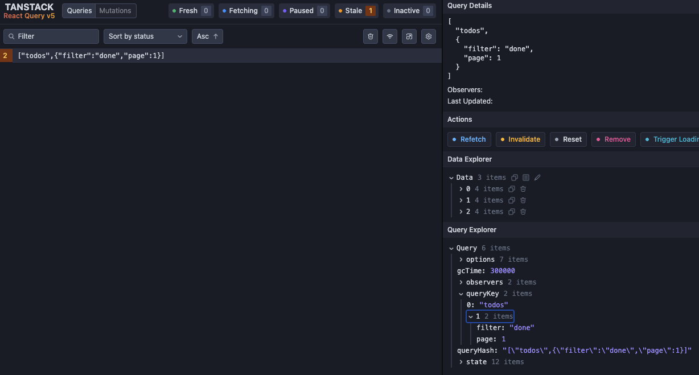
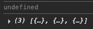
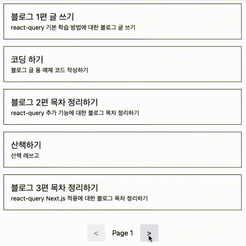
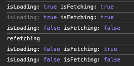

진행하고 있던 사이드 프로젝트를 고도화하기 위해 다양한 작업을 진행하고 있었다. 프로젝트는 Next.js 기반으로, 데이터를 API로 요청하는 구간은 상황에 따라서 서버, 클라이언트 컴포넌트를 적절히 섞어서 사용하고 있었다.

Next.js는 `fetch`를 확장하여 캐싱 기능을 제공한다. 그래서 서버 렌더링 과정에서의 불필요한 중복 요청을 줄이고자 요청 함수들을 axios에서 `fetch`로 변경하는 작업을 진행했다. 하지만 클라이언트 컴포넌트에서는 Next.js의 `fetch`를 사용할 수 없기 때문에, 클라이언트 컴포넌트에서의 API 요청 최적화는 별도로 진행해야 했다.

또한, 클라이언트 컴포넌트에서는 `useEffect`와 `useState`를 조합하여 API 요청을 처리하고 있었는데, 로딩이나 에러 처리를 위해 상태를 추가하며 점점 복잡해지고 있던 상황이었다.

그러다 react-query 라이브러리가 떠올랐고, 이를 활용하면 API 요청을 훨씬 간결하게 처리할 수 있고 캐싱을 통한 최적화가 가능하다는 것이 생각났다. 그래서 사이드 프로젝트에 도입하게 되었는데, 학습하는 과정에서 생각보다 많은 기능과 활용도가 있다는 것을 알게 되었다.

이 글에서는 react-query의 `useQuery`, `useMutation`같은 기본적인 사용법과 캐시 관리 개념 등에 대해 정리해 보고자 한다.

### React에서의 API 처리

React의 컴포넌트에서 API를 호출할 때에는 주로 `useEffect`를 사용하여 데이터를 패칭하고, `useState`를 사용하여 상태를 관리하는 패턴을 많이 사용한다. 그리고 그 과정에서 로딩을 표현하고 싶거나, 에러를 처리하고 싶을 때에는 상태를 추가하여 핸들링하는 경우가 많다.

```ts
useEffect(() => {
  async function fetchData() {
    setIsLoading(true);
    setError(null);
    try {
      const response = await fetch("/api/data");
      const result = await response.json();
      setData(result);
    } catch (error) {
      setError(error);
    } finally {
      setIsLoading(false);
    }
  }

  fetchData();
}, []);
```

위 코드는 `useEffect`를 사용하여 컴포넌트가 마운트될 때 API를 호출하고, 로딩 상태와 에러 상태를 관리하는 간단한 예시이다. 단순한 API 호출 정도는 이 방식으로 충분히 처리할 수 있다.

하지만, 한 컴포넌트 안에서 여러 개의 API를 호출하는 경우에는 각 API마다 로딩, 에러, 데이터 상태를 관리해야 하므로 상태가 늘어나게 되어 코드가 복잡해지기 시작한다. 이 경우 커스텀 훅을 정의하여 상태 관리를 어느 정도 해결할 수 있다.

```ts
const [data, isLoading, error] = useFetch("/api/data");
```

커스텀 훅을 정의해 API 호출 처리를 추상화할 수는 있다. 하지만 필요한 기능들을 계속 추가하다 보면, API 하나를 처리하는데 너무 많은 상태를 관리하게 되거나, 원하는 기능을 직접 구현하기에는 너무 복잡해질 수 있다.

- 캐싱 : 동일한 요청에 대해 중복 요청을 방지하고 싶다.
- 리페칭 : 특정 시점에 데이터를 다시 가져오고 싶다.
- 조건부 요청 : 특정 조건에서만 요청을 보내고 싶다.

이렇게 프론트엔드에서 API를 처리하는 데에 여러 요구사항이 생기게 되면서, 그 처리 역시 복잡해지기 시작했다. 이런 다양한 상황을 해결하고자 react-query가 등장하게 되었다.

### react-query

> TanStack Query (formerly known as React Query) is often described as the missing data-fetching library for web applications, but in more technical terms, it makes fetching, caching, synchronizing and updating server state in your web applications a breeze. - 공식 문서

react-query는 React 애플리케이션에서 **서버 상태**를 관리하기 위한 라이브러리라고 한다. 여기서 서버 상태란 서버에서 가져오는 데이터를 의미하며, 서버에서 받아온 TODO 리스트, 사용자 정보, 게시글 목록 등이 이에 해당한다.

일반적으로 클라이언트 상태 관리는 사용자의 입력이나 UI 동작처럼 클라이언트 내부에서 발생하는 이벤트에 의해 변경된다. 반면에 서버 상태는 항상 네트워크 요청과 응답을 거쳐야 한다. 또한, 서버의 데이터는 언제든 변경될 수 있어 특정 시점에 동기화가 필요하다.

이 서버 상태를 다루는 일은 조금 복잡해질 수 있는데, 데이터를 가져오는 시점과 방법을 결정해야 하고, 그 과정을 표현하기 위해 로딩, 에러 상태를 관리해야 한다. 그리고 만약 불필요한 요청을 줄이고자 한다면 캐시가 필요하고, 데이터가 변경되었을 때 이를 반영하기 위한 리페칭 전략도 필요하다.

react-query는 API 처리 과정에서 필요할 수 있는 다양한 상태를 관리하고 제공한다. 그래서 개발자가 직접 상태 관리를 하지 않아도 다양한 제어를 할 수 있고, API 요청을 훨씬 간결하게 처리할 수 있게 만들어준다.

```ts
const { data, isLoading, error, ... } = useQuery({
  queryKey: ["todos"],
  queryFn: fetchTodos,
  ...
});
```

또한, 요청에 대한 응답을 캐싱해 재사용하여 불필요한 네트워크 요청을 줄여준다. 더 나아가 서버 상태를 어떻게 불러오고, 어떤 조건에서 다시 불러올지에 대한 옵션을 제공하여, 서버 상태를 관리할 수 있는 다양한 전략을 제공한다.

즉, react-query는 단순한 데이터 페칭 라이브러리가 아니라, 서버 상태를 효과적으로 관리하는 도구라고 할 수 있다.

#### 설정

react-query는 다음과 같이 설치할 수 있다. Tanstack으로 프로젝트가 이전되었기 때문에 `@tanstack/react-query` 패키지를 설치해야 한다.

```bash
npm install @tanstack/react-query
```

react-query의 기능들을 사용하기에 앞서, 기본 설정을 해주어야 한다.

react-query는 요청에 대한 응답을 캐싱하고 재사용한다. 이를 위해 내부적으로 React의 Context API를 활용하는데, 따라서 앱의 루트에 Provider를 설정해주어야 한다.

먼저 `QueryClient`라는 객체를 생성하고, 앱을 `QueryClientProvider`로 감싸고 객체를 하위 컴포넌트에 전달해주도록 해야 한다.

```tsx
import { QueryClient, QueryClientProvider } from "@tanstack/react-query";

const queryClient = new QueryClient();

function App() {
  return (
    <QueryClientProvider client={queryClient}>
      {/* 앱 컴포넌트 */}
    </QueryClientProvider>
  );
}
```

`QueryClient`는 react-query의 핵심 객체로, 다음과 같은 역할을 담당한다.

- 캐시 관리 : 쿼리 데이터를 캐싱하고 관리하며, 필요할 때 재사용한다.
- 무효화, 재요청 : 특정 쿼리를 무효화하거나 다시 데이터를 가져올 수 있다.
- 전역 설정 : 쿼리의 기본 설정을 지정할 수 있다.

예를 들어, 특정 옵션을 설정해 전역적으로 적용할 수 있다.

```ts
const queryClient = new QueryClient({
  defaultOptions: {
    queries: {
      staleTime: 1000 * 60 * 5 // 캐시를 5분 동안 유지한다.
    }
  }
});
```

이렇게 설정하면, 다음에 설명할 `useQuery` 훅을 사용할 때, 별도로 `staleTime`을 지정하지 않으면 기본적으로 5분 동안 캐시가 유지된다. 이 외에도 쿼리와 뮤테이션에 대한 다양한 기본 옵션을 지정할 수 있다.

`QueryClient`는 앱 전체에서 하나만 생성하여 사용하는 것이 일반적이다. 여러 개를 생성하여 사용할 수도 있지만, 그렇게 할 경우 캐시가 분리되어 관리되므로 주의해야 한다.

#### 개발자 도구

react-query는 개발자 도구도 제공한다. 개발자 도구를 활용하면, 현재 캐시된 쿼리와 상태를 쉽게 확인할 수 있어 디버깅에 용이하다. 별도의 패키지로 분리되어 있으며, 추가로 설치해야 한다.

```bash
npm install @tanstack/react-query-devtools
```

설정법은 간단한데, `QueryClientProvider` 하위에 `ReactQueryDevtools` 컴포넌트를 추가해주면 된다.

```tsx
import { ReactQueryDevtools } from "@tanstack/react-query-devtools";

function App() {
  return (
    <QueryClientProvider client={queryClient}>
      {/* 앱 컴포넌트 */}
      <ReactQueryDevtools initialIsOpen={false} />
    </QueryClientProvider>
  );
}
```

그러면 앱 우측 하단에 개발자 도구 아이콘이 표시된다. 클릭하면 개발자 도구가 열리며, 현재 캐시된 쿼리와 상태를 확인할 수 있다.


`initialIsOpen` 옵션을 통해 개발자 도구의 초기 열림 상태를 지정할 수 있으며, 기본값은 `false`이다. 기타 옵션은 [공식 문서 - DevTool](https://tanstack.com/query/v5/docs/framework/react/devtools)를 참고하면 된다.

기본적인 설정은 끝났고, 이제 react-query의 주요 기능들에 대해 알아보자.

### useQuery

`useQuery`는 react-query에서 가장 기본이 되는 훅이자, 라이브러리를 사용할 때 가장 많이 접하게 되는 기능이다.

단순히 API 요청을 처리해 데이터를 가져오는 역할만 하는 것이 아니라, 로딩, 에러, 데이터 상태를 자동으로 관리해준다. 그래서 앞서 봤던 `useEffect`와 `useState`를 직접 조합하는 것보다 훨씬 간결하게 사용할 수 있다.

```tsx
const getTodos = async (): Promise<Todo[]> => {
  const response = await fetch("/api/todos");
  if (!response.ok) {
    throw new Error("Failed to fetch todos");
  }
  return response.json();
};

function TodoList() {
  const { data: todos = [], isLoading } = useQuery({
    queryKey: ["todos"],
    queryFn: () => getTodos()
  });

  if (isLoading) return <div>Loading...</div>;

  return (
    <section>
      <ul>
        {todos.map((todo) => (
          <li key={todo.id}>{todo.text}</li>
        ))}
      </ul>
    </section>
  );
}
```

위 코드는 `useQuery`를 사용해 `/api/todos`에서 데이터를 가져오는 예시이다. API를 호출해 데이터를 반환하는 `getTodos` 함수를 정의하고, `useQuery` 훅에 전달해 데이터를 가져오고 있다. 그리고 반환된 상태를 활용해 로딩을 표현하고, 데이터를 화면에 렌더링한다.

`useQuery` 훅을 적절히 활용한다면 API 요청을 훨씬 간결하게 처리할 수 있고, 필요한 상태를 참조하여 다양한 동작을 수행할 수 있다. `useEffect`와 `useState`를 조합하는 것보다 훨씬 깔끔해진다.

또한, react-query는 API 핸들링을 간결하게 표현하는 것에 그치지 않고, 내부적으로 요청에 대한 응답을 캐싱하고 제어하는 기능을 수행한다. 그래서 동일한 요청에 대해 이미 가져온 데이터를 재사용하여 불필요한 네트워크 요청을 줄여준다.

```tsx
<TodoList />
<TodoList />
```

위와 같이 `TodoList` 컴포넌트를 여러 번 렌더링하더라도, `useQuery` 훅에서 동일한 `queryKey`를 사용하고 있으므로, react-query는 이를 동일한 쿼리로 인식한다. 따라서, 첫 번째 컴포넌트가 마운트될 때 API를 호출하여 데이터를 가져오고, 두 번째 컴포넌트가 마운트될 때에는 이미 캐시된 데이터를 재사용한다. 그래서 네트워크 요청은 한 번만 발생하게 된다.


react-query에서는 이 캐시를 **쿼리(Query)** 단위로 관리한다. react-query에서 말하는 **쿼리**는 단순한 API 호출이 아니라, 특정 데이터를 가져오기 위한 요청 단위를 의미한다. 그래서 react-query는 쿼리를 기준으로 데이터를 캐싱하고 재사용하거나 무효화한다.

그래서 `useQuery` 훅은 쿼리를 정의하고 관리하는 역할을 하며, 그 쿼리에 대한 상태를 다루는 훅이라고 할 수 있다.

#### Options

쿼리는 다양한 옵션을 통해 제어할 수 있으며, `useQuery` 훅은 옵션들을 인자로 받아 쿼리의 동작을 정의한다. 대표적으로 다음과 같은 옵션들이 있다.

- `queryKey`: 쿼리를 식별하는 고유한 키
- `queryFn`: 쿼리가 실행될 때 호출되는 함수
- `select`: 쿼리 결과를 가공하는 함수
- `enabled`: 쿼리의 활성화 여부를 제어하는 불리언

##### `queryKey`

`queryKey`는 react-query에서 쿼리를 식별하는 고유한 키이다. 같은 `queryKey`를 가지는 쿼리는 동일한 쿼리로 간주되며, 이 키를 기준으로 캐싱하여 재사용하거나 무효화한다. 따라서 `queryKey`는 쿼리를 구분하는 중요한 역할을 한다.

```ts
const { ... } = useQuery({
  queryKey: ["todos"],
  ...
});
```

`queryKey`는 배열 형식으로 정의할 수 있고, 배열의 각 요소는 쿼리를 구분하는 데 사용된다. 위 예시에서는 `["todos"]`라는 배열을 사용하여 `todos` 쿼리를 정의하고 있다.

react-query는 이 `queryKey`에 전달된 배열을 통해서 각 쿼리를 식별하고 구분한다. 그래서 동일한 키를 가진 쿼리가 다른 위치에서 호출되더라도, 중복 호출을 막고 동일한 데이터를 바라보게 된다.

```ts
// component A
const { ... } = useQuery({
  queryKey: ["todos"],
  ...
});

// component B
const { ... } = useQuery({
  queryKey: ["todos"],
  ...
});
```

이 경우, `component A`와 `component B`에서 동일한 `queryKey`를 사용하고 있으므로, react-query는 이를 동일한 쿼리로 인식한다. 따라서, 두 컴포넌트가 마운트될 때 각각 API를 호출하는 것이 아니라, 한 번만 호출하여 데이터를 가져오고, 두 컴포넌트 모두 동일한 데이터를 바라보게 된다.

`queryKey` 배열은 복수개의 아이템이 포함될 수 있으며, 이를 통해 쿼리를 더욱 세분화 할 수 있다. `["todos", "create"]`와 같이 배열에 여러 개의 요소를 포함하여 쿼리를 상세하게 구분할 수 있다.

`queryKey`를 조금 자세히 설명해보자면, 우선 배열의 순서 역시 식별의 기준이 된다. 예를 들어, `["todos", "create"]`와 `["create", "todos"]`는 서로 다른 쿼리로 간주된다. 따라서, 동일한 API를 호출하더라도, `queryKey`의 순서가 다르면 별도의 캐시가 관리된다.

배열의 각 요소에는 문자열 뿐만 아니라 숫자, 불리언, 객체 등 다양한 타입을 사용할 수 있다. 그래서 동적인 값을 포함해 쿼리를 구분하여, 특정 변수의 값에 따라 세분화할 수 있다. 이 때, `queryKey`에 포함된 값이 변경되면, react-query는 이를 새로운 쿼리로 인식하고, `queryFn`을 다시 실행하여 데이터를 가져온다.

```ts
const { ... } = useQuery({
  queryKey: ["todos", todoId],
  queryFn: () => getTodo(todoId),
});
```

위 예시에서는 `todoId`라는 변수를 `queryKey`에 포함하여, 특정 ID에 해당하는 TODO 아이템을 가져오는 쿼리를 정의하고 있다. 이 경우 `todoId`가 변경될 때마다 서로 다른 쿼리로 인식되며 별도의 캐시가 관리된다. 그러므로 동적인 값을 포함한 쿼리를 정의(동적인 변수를 참조해 API를 호출)할 때에는 `queryKey`에 해당 변수를 포함시켜야 캐시가 올바르게 분리된다.

또한, `queryKey`는 객체를 포함할 수 있어 아래와 같은 형태로도 정의할 수 있다.

```ts
const { ... } = useQuery({
  queryKey: ["todos", { filter: "done" }],
  queryFn: () => getTodos({ filter: "done" }),
});
```

이 때, 객체의 속성 순서는 상관없다. react-query에서는 `queryKey`를 직렬화된 형태로 해시를 만들고, 이 해시를 기준으로 쿼리를 구분한다고 한다. 따라서, `["todos", { filter: "done", page: 1 }]`와 `["todos", { page: 1, filter: "done" }]`는 동일한 쿼리로 인식된다.

실제로 다음과 같은 코드를 작성하고 DevTool에서 확인해보면, 동일한 쿼리로 인식되어 하나의 쿼리만 보이는 것을 알 수 있다.

```ts
useQuery({
  queryKey: ["todos", { filter: "done", page: 1 }],
  queryFn: () => getTodos()
});

useQuery({
  queryKey: ["todos", { page: 1, filter: "done" }],
  queryFn: () => getTodos()
});
```



> 정확히 어떤 비교를 수행하는지 찾아보려 했으나, 추측하기로는 [@tanstack/react-query - hashKey](https://github.com/TanStack/query/blob/main/packages/query-core/src/utils.ts#L216) 함수를 통해 문자열로 변환 후 비교하는 것으로 보인다.

[공식문서 - Query Keys](https://tanstack.com/query/latest/docs/framework/react/guides/query-keys)에서도 `queryKey`에 대한 설명을 확인할 수 있다.

##### `queryFn`

`queryFn`은 쿼리가 실행될 때 실제로 데이터를 가져오는 함수이다. 이 함수는 비동기여야 하며, 반드시 Promise를 반환해야 한다. react-query는 이 함수의 결과를 기다렸다가 성공/실패 여부에 따라 상태를 업데이트 한다.

```ts
const getTodos = async (): Promise<Todo[]> => {
  const response = await fetch("/api/todos");
  if (!response.ok) {
    throw new Error("Failed to fetch todos");
  }
  return response.json();
};

const { data: todos = [] } = useQuery({
  queryKey: ["todos"],
  queryFn: () => getTodos()
});
```

`queryFn` 내부에서 에러가 발생한다면, react-query는 이를 감지하여 반환하는 `isError`, `error` 상태를 업데이트 한다.

`queryFn`은 `context`객체를 인자로 받을 수 있는데, 이 객체에는 `queryKey`와 `AbortController`의 신호인 `signal`이 포함되어 있다. 이를 활용해 동적인 쿼리를 정의하거나, 쿼리가 취소될 때 요청을 중단할 수 있다.

```ts
const getTodo = async ({
  queryKey,
  signal
}: {
  queryKey: string[];
  signal: AbortSignal;
}): Promise<Todo[]> => {
  const [, todoId] = queryKey;
  const response = await fetch(`/api/todos/${todoId}`, { signal });
  if (!response.ok) {
    throw new Error("Failed to fetch todos");
  }
  return response.json();
};

const { data: todos = [] } = useQuery({
  queryKey: ["todos", todoId],
  queryFn: getTodo
});
```

쿼리 취소는 `useQuery`가 언마운트되거나 `queryKey`가 변경될 때, 혹은 `QueryClient`를 통해 쿼리를 직접 취소할 때 발생한다. 쿼리를 직접 취소하는 방식은 기회가 될 때 다뤄보고자 한다.

##### `select`

`select`는 쿼리의 결과 데이터를 가공하는 함수이다. 쿼리 결과를 컴포넌트에서 필요한 형태로 가공하는데에 사용된다.

```ts
const { data: todoTitles = [] } = useQuery({
  queryKey: ["todos"],
  queryFn: () => getTodos(),
  select: (data) => data.map((todo) => todo.title)
});
```

정확히는, `select` 함수는 `queryFn`이 반환한 값을 직접 받는 것이 아니라, 해당 쿼리 키에 대응하는 캐시에 저장된 데이터를 받아 가공한다.

물론 `queryFn`에서도 데이터를 가공할 수 있겠지만, 쿼리 캐시는 `queryFn` 에서 반환된 데이터를 기준으로 관리된다. 그래서 데이터 가공은 `select` 사용이 권장되며, 이를 통해 캐시된 원본 데이터를 유지하면서 컴포넌트에서 필요한 형태로 데이터를 가공하여 사용할 수 있다.

`select` 함수는 쿼리 데이터가 바뀔 때마다 다시 실행된다. 그래서 해당 쿼리의 캐시가 갱신될 경우 `select`가 다시 실행되어 최신 데이터를 가공하여 반환한다. 또한, 해당 함수에서 반환한 값은 메모이제이션되어, 쿼리 데이터가 변경되지 않는 한 동일한 참조를 유지한다. 따라서, `select`를 통해 가공된 데이터를 의존성 배열에 포함하여도 불필요한 업데이트가 발생하지 않는다.

##### `enabled`

`useQuery`는 컴포넌트가 마운트될 때 자동으로 쿼리를 실행한다. 하지만, 특정 조건에서만 쿼리를 실행하고 싶을 때가 있다. 이 때 `enabled` 옵션을 활용할 수 있다.

```ts
const { data: todo = {} } = useQuery({
  queryKey: ["todos", todoId],
  queryFn: getTodo,
  enabled: !!todoId
});
```

위 코드는 `enabled`를 활용해 `todoId`가 존재할 때에만 쿼리를 실행하도록 설정한 예시이다.

`enabled` 옵션은 boolean 값으로, `false`인 경우 쿼리는 실행되지 않으며, `true`로 변경되는 시점에 쿼리가 실행된다. 그래서 이를 활용한다면 조건부 요청을 간단하게 구현할 수 있다.

##### `placeholderData`

`placeholderData`는 쿼리가 실제 데이터를 가져오기 전까지 사용할 수 있는 임시 데이터를 지정하는 옵션이다. 이 데이터를 지정하면, 쿼리가 로딩 중일 때에 `data`에 해당 값이 들어오게 된다.

```ts
const { data: todos } = useQuery({
  queryKey: ["todos"],
  queryFn: () => getTodos()
});

useEffect(() => {
  console.log(todos);
}, [todos]);
```

`data`의 기본값은 `undefined`이다. 그래서 위 코드를 실행시키면 `todos`가 처음에는 `undefined`로 출력되고, 데이터가 로딩된 후에야 실제 데이터가 출력된다.



`placeholderData`는 이 로딩되기 전의 임시 상태를 지정하는데에 사용된다.

```ts
const { data: todos } = useQuery({
  ...
  placeholderData: []
});
```

위와 같이 `placeholderData`를 빈 배열로 지정하면, 쿼리가 로딩 중일 때에도 `todos`는 빈 배열이 된다. 그래서 컴포넌트가 처음 렌더링될 때에도 `todos`가 항상 배열 형태를 유지하게 된다.

그런데 `placeholderData`가 `data`의 기본 값을 지정하는 것이라면, `data = []` 처럼 사용할 수도 있다. 그렇다면 `placeholderData`는 왜 필요한 것인가?

`data = []`는 `undefined`를 방지하기 위해 값을 지정하는 것으로, 자바스크립트 문법일 뿐이다. 그래서 react-query 입장에서는 여전히 해당 쿼리에 대한 데이터가 없는 상태로 취급된다. 반면, `placeholderData`에 할당된 값은 쿼리의 데이터를 불러오기 전까지 임시로 반환되는 값이다. 따라서 react-query 입장에서 임시 데이터를 전달 받기 때문에 `select` 같은 데이터 가공 로직도 즉시 동작할 수 있다.

정리하자면, `data = []`는 자바스크립트 문법으로 `undefined`를 방지하는 것이고, `placeholderData`는 해당하는 쿼리의 임시 값을 설정하는 것이다.

한편, 다음과 같은 쿼리가 있다고 해보자.

```ts
const [page, setPage] = useState(1);

const { data: { todos, totalPages } = { todos: [], totalPages: 0 } } = useQuery(
  {
    queryKey: ["todos", page],
    queryFn: () => getTodos({ page }),
    placeholderData: { todos: [], totalPages: 0 }
  }
);
```

이는 페이지네이션을 구현하기 위한 쿼리이고, `page`라는 변수를 기준으로 페이지의 데이터를 가져오고 있다. `queryKey`에는 `page`가 포함되어 있어, 페이지가 변경될 때마다 새로운 쿼리가 생성되고, `queryFn`이 다시 실행되어 데이터를 가져오게 된다.

컴포넌트가 마운트되고 첫 쿼리가 실행될 때에는 페이지 1의 데이터를 가져오게 된다. 이 때, `placeholderData`가 빈 배열로 지정되어 있으므로, 페이지 1의 기본 값은 빈 배열이 된다.

페이지 1을 보고 있는 상황에서, 페이지 2로 넘어가고 싶어 버튼을 클릭했다고 해보자. `page`가 1에서 2로 변경되면서 새로운 쿼리가 생성되고, `queryFn`이 다시 실행되어 페이지 2의 데이터를 가져오게 된다. 이 때, 페이지 2의 기본 값 역시 `placeholderData`에 의해 빈 배열이 된다.

이 경우, `todos`는 페이지 1의 데이터에서 페이지 2의 데이터로 변경되고, 페이지 2의 데이터가 로딩되는 동안에는 `todos`가 빈 배열이 된다. 마운트 시점부터의 `todos`의 값은 이렇게 바뀐다.

```text
[] -> [page 1 데이터] -> [] -> [page 2 데이터]
```

페이지가 변경될 때 해당 페이지에 대한 캐시가 없다면 `todos`는 빈 배열로 바뀌게 되며, 페이지가 바뀔 때마다 화면이 깜빡이는 현상이 발생할 수 있다.



이 때, `keepPreviousData`라는 함수를 사용할 수 있겠다. `keepPreviousData`는 react-query에서 제공하는 유틸 함수로, 새 요청이 진행되는 동안에도 이전 데이터가 유지되도록 한다. 즉, 다음 페이지 데이터를 불러오는 동안에도 이전 페이지의 데이터가 화면에 표시되다가, 새로운 데이터가 도착하면 교체되는 방식이다.

```tsx
import { keepPreviousData, useQuery } from "@tanstack/react-query";

const { ... } = useQuery({
  placeholderData: keepPreviousData,
});
```

`keepPreviousData` 함수를 불러와 `placeholderData`에 할당하는 방식으로 적용할 수 있다. 이렇게 설정하면, 페이지가 변경될 때에도 이전 페이지의 데이터가 유지되므로 화면이 깜빡이지 않고 전환된다.

> react-query@5 부터 유틸 함수로 분리되었으며, 이전에는 `keepPreviousData` 옵션을 직접 `true`로 지정하는 방식이었다.


##### `initialData`

`initialData`는 쿼리의 초기 데이터를 지정하는 옵션이다. 이를 설정하면 해당 값이 쿼리의 데이터로 사용되며, 쿼리가 즉시 데이터를 가진 상태로 시작한다.

```ts
const { data: todos } = useQuery({
  ...
  initialData: []
});
```

단순히 설명만 들어서는 `placeholderData`와 비슷해 보이지만, 차이가 있다.

`placeholderData`는 쿼리의 임시 데이터 역할을 한다. 그래서 쿼리가 실행되어 실제 데이터가 도착하면 교체된다. 반면, `initialData`는 해당 값 자체를 쿼리의 **실제 초기 데이터**로 간주한다. 따라서 `initialData`는 쿼리의 캐시에 저장되며, 최신 상태로 취급되어 쿼리가 즉시 데이터를 가진 상태로 시작한다. 즉, `placeholderData`는 쿼리가 데이터를 가져오기 전까지 임시로 사용하는 값이고, `initialData`는 쿼리의 실제 초기 데이터로 캐시에 저장되는 값이라는 점에서 구분된다.

그래서 `initialData`는 해당 쿼리의 결과를 미리 알고 있을 때, 이를 초기 데이터로 지정하여 쿼리가 즉시 데이터를 가진 상태로 시작하고자 할 때 유용하다.

`initialData`로 설정한 데이터는 최신 상태로 취급되기 때문에, `queryFn`이 실행되지 않고 **전달한 데이터를 캐시에 저장하고 이를 사용**하게 된다. 그리고 다음에 설명할 `staleTime` 옵션과 함께 사용한다면, `staleTime`이 지난 후에 `queryFn`이 실행되어 최신 데이터를 가져오게 된다. 다만, `staleTime`의 기본값은 `0`이기 때문에, 별도의 설정이 없다면 `initialData`를 지정하더라도 즉시 `queryFn`이 실행되어 데이터를 다시 가져오게 된다.

이 설정값은 해당 쿼리의 캐시에 이미 데이터가 존재하는 경우에는 적용되지 않는다. 그래서 쿼리가 이미 캐시에 데이터를 가지고 있다면, `initialData`는 적용되지 않고 캐시된 데이터가 사용된다.

##### `staleTime`

쿼리의 결과는 캐시되어 재사용된다. 그런데 저장된 캐시는 특정 시점이 지난 이후에 최신 상태가 아니게 될 수 있다. 그래서 이 쿼리의 유효 기간을 지정하는 `staleTime` 옵션이 있다.

`staleTime`은 쿼리의 데이터가 최신 상태로 간주되는 기간을 밀리초 단위로 지정하는 옵션이다. 이 시간이 지나면 해당 쿼리의 데이터는 오래된 상태로 간주되어, 필요에 따라 `queryFn`이 다시 실행되어 최신 데이터를 가져오게 된다.

```ts
const { data: todos } = useQuery({
  ...
  staleTime: 1000 * 60 * 5 // 5분
});
```

위 예시 처럼 `staleTime`을 5분으로 지정하면, 쿼리가 데이터를 가져온 후 5분 동안은 해당 데이터가 최신 상태로 간주된다. 이 시간 동안 동일한 `queryKey`를 사용하는 다른 쿼리가 실행되더라도 네트워크 요청이 발생하지 않고 캐시된 데이터를 재사용한다. 그리고 5분이 지나면 해당 쿼리의 데이터는 오래된 상태로 간주되어, 필요에 따라 `queryFn`이 다시 실행되어 최신 데이터를 가져오게 된다.

이 설정을 활용하면 불필요한 네트워크 요청을 줄이고 캐시를 재사용해 성능을 최적화할 수 있다. 예를 들어, 자주 변경되지 않는 데이터를 가져오는 쿼리에는 긴 `staleTime`을 설정하여 캐시를 오래 유지하고, 자주 변경되는 데이터를 가져오는 쿼리에는 짧은 `staleTime`을 설정하여 최신 상태를 유지할 수 있다.

이 외에도, 윈도우에 포커스가 돌아왔을 때 재요청을 하도록 하는 `refetchOnWindowFocus` 등 다양한 옵션이 존재한다. 더 많은 옵션은 [공식 문서 - useQuery reference](https://tanstack.com/query/latest/docs/framework/react/reference/useQuery)에서 확인할 수 있다.

#### Returns

`useQuery`는 다양한 옵션을 전달받고, 또 데이터와 그 데이터(캐시)의 상태를 반환한다. 그래서 데이터와 다양한 상태를 참조해 UI를 구성할 수 있다. 대표적으로 다음과 같은 상태들을 반환한다.

- `data`: 쿼리의 결과 데이터
- `isLoading`: 쿼리가 로딩 중인지 여부
- `isFetching`: 쿼리가 패칭 중인지 여부
- `refetch`: 쿼리를 다시 실행하는 함수
- `error`: 쿼리에서 발생한 에러 정보

##### `data`

`data`는 쿼리의 결과 데이터를 담고 있다. 쿼리가 성공적으로 완료되면 그 결과가 반환된다. 만약 쿼리가 아직 완료되지 않았거나, 에러가 발생한 경우에는 `undefined`가 될 수 있다.

조금 더 정확하게 설명하자면, `data`는 캐시에 저장된 해당 쿼리의 데이터를 참조하는 것이다. 쿼리가 완료되면 `queryFn`의 반환한 값이 캐시에 저장되고, `data`가 이 값을 참조하게 된다. 그렇기 때문에 처음 실행 시에는 캐시에 해당 쿼리 데이터가 없으므로 `undefined`가 되는 것이다.

`data`는 앞서 설명했던 `select` 옵션을 사용해 캐시 데이터를 가공한 형태로 사용할 수 있으며, `placeholderData`, `initialData` 옵션으로 쿼리가 완료되기 전까지의 초기값을 지정할 수도 있다.

##### `isLoading`, `isFetching`

`isLoading`은 쿼리가 처음 로딩되는 상태를 나타낸다. 캐시에 데이터가 없어서 쿼리가 처음 실행되고, 네트워크 요청을 보내 데이터를 가져오는 중일 때 `true`가 된다.

`isFetching`은 쿼리가 데이터를 패칭 중인 상태를 나타낸다. 이 상태는 쿼리가 실행되어 네트워크 요청이 진행 중일 때 `true`가 된다.

`isLoading`과 `isFetching`은 모두 쿼리의 상태를 나타내는 값이지만, 약간의 차이가 있다. `isLoading`은 쿼리의 **초기 로딩 상태**를 나타내고, `isFetching`은 쿼리가 **패칭 중인 상태**를 나타낸다. 즉, `isLoading`은 해당 쿼리의 캐시 데이터를 처음 설정 할 때, `isFetching`은 쿼리가 실행중일 때를 의미한다고 볼 수 있다. 그래서, `isLoading`은 `isFetching && !data`로 표현할 수도 있다.

다음과 같은 상황을 가정해보자. 만약, 컴포넌트가 마운트 되었고, 특정 시점에 데이터를 다시 불러온다면, `isLoading`과 `isFetching`은 다음과 같다.



초기 로딩 시점에는 `isLoading`과 `isFetching`이 모두 `true`가 된다. 그리고 데이터를 다시 받아오는 시점에는 `isLoading`은 `false` 이고, `isFetching`은 `true`가 된다. 따라서, 첫 로딩 상태를 표현하고 싶다면 `isLoading`을, 데이터를 가져오는 중임을 표현하고 싶다면 `isFetching`을 사용할 수 있겠다.

##### `error`

`error`객체는 쿼리에서 발생한 에러 정보를 담고 있다. 쿼리가 실패하여 에러가 발생하면, 이 객체에 에러 정보가 담기게 된다. 기본적으로 `queryFn`에서 던진 값이 들어온다. 이를 참조하여 쿼리에 대한 예외 처리를 할 수 있다.

##### `refetch`

`refetch`는 쿼리를 다시 실행하는 함수이다. 이 함수를 호출하면 해당 쿼리가 다시 실행되어 데이터를 다시 가져오게 된다. 특정 시점에 수동으로 데이터를 갱신하고 싶을 때 사용할 수 있다.

```tsx
const { data, refetch } = useQuery({
  ...
});

return <button onClick={() => refetch()}>Refetch</button>;
```

이 외에도 `isError`, `isSuccess`, `isIdle`, `status` 등 다양한 상태를 반환한다. 더 많은 상태는 [공식 문서 - useQuery reference](https://tanstack.com/query/latest/docs/framework/react/reference/useQuery)에서 확인할 수 있다.

`useQuery`는 데이터(`data`)와 그 데이터의 상태(`isLoading`, `isFetching`, `error`) 및 제어 함수(`refetch`)를 제공한다. 이를 적절히 조합하면 네트워크의 상태에 따라 다양한 UI를 구성할 수 있다.

### useMutation

`useQuery`는 서버에서 데이터를 조회하는데 사용된다. 그러나 데이터는 조회뿐만 아니라 생성, 수정, 삭제 등의 작업도 필요하다. 이 때 사용하는 훅이 `useMutation`이다.

```tsx
import { useMutation } from "@tanstack/react-query";

const addTodo = async (payload: AddTodoPayload): Promise<Todo> => {
  const response = await fetch("/api/todos", {
    method: "POST",
    headers: {
      "Content-Type": "application/json"
    },
    body: JSON.stringify(payload)
  });
  if (!response.ok) {
    throw new Error("Failed to add todo");
  }
  return response.json();
};

function AddTodo() {
  const [title, setTitle] = useState("");
  const [description, setDescription] = useState("");
  const [done, setDone] = useState(false);

  const { mutate, isPending } = useMutation({
    mutationFn: addTodo,
    onSuccess: (data) => {
      console.log("Todo added:", data);
    },
    onError: (error) => {
      console.error("Error adding todo:", error);
    }
  });

  const handleSubmit = (e: React.FormEvent) => {
    e.preventDefault();
    mutate({ title, description, done });
  };

  return (
    <form onSubmit={handleSubmit}>
      {...}
    </form>
  )
}
```

위 코드는 `useMutation`을 사용해 새로운 TODO 아이템을 추가하는 예시이다. API를 호출해 데이터를 생성하는 `addTodo` 함수를 정의하고, `useMutation` 훅에 전달해 뮤테이션을 정의하고 있다. 그리고 폼 제출 시 `mutation.mutate` 함수를 호출하여 뮤테이션을 실행한다.

`useMutation`은 설정을 통해 뮤테이션을 정의하고, 필요할 때 해당 뮤테이션을 실행하는 방식으로 동작한다. `useQuery`와 달리 자동으로 실행되지 않으며, 반환받는 함수를 호출해서 실행하는 방식이다. 이를 통해 특정 시점에 선언한 작업을 수행할 수 있다.

그래서 `useMutation` 훅은 데이터 요청을 관리한다는 점에서 `useQuery`와 유사하지만, 요청의 목적이 데이터를 조회하는 것이 아니라 생성, 수정, 삭제하는 것이라는 점에서 차이가 있다. 또한, 생성, 수정, 삭제의 경우는 일반적으로 서버의 데이터를 변경하는 작업이므로, 요청에 대한 캐싱은 수행되지 않는다는 특징이 있다.

이 훅을 적절히 활용한다면 `useQuery`와 마찬가지로 API 요청을 간결하게 처리할 수 있다. 필요한 후속 동작이나 예외 처리를 진행하거나, 반환하는 상태를 참조해 UI를 구성할 수 있다.

#### Options

뮤테이션은 `useMutation`에 다양한 옵션을 전달하여 제어할 수 있다. 대표적으로 다음과 같은 옵션들이 있다.

- `mutationFn`: 뮤테이션이 실행될 때 호출되는 함수
- `onMutate`: 뮤테이션이 실행되기 직전에 호출되는 콜백 함수
- `onSuccess`: 뮤테이션이 성공적으로 완료되었을 때 호출되는 콜백 함수
- `onError`: 뮤테이션이 실패했을 때 호출되는 콜백 함수
- `onSettled`: 뮤테이션의 성공,실패와 상관없이 항상 호출되는 콜백 함수

##### `mutateFn`

`mutationFn`은 뮤테이션이 생성될 때 실제로 호출되는 비동기 함수를 정의한다.

```ts
const addTodo = async (payload: AddTodoPayload): Promise<Todo> => {
  ...
};
const { mutate } = useMutation({
  mutationFn: addTodo
});
```

이 함수는 `useMutation`에서 반환된, 나중에 설명할 `mutate`, `mutateAsync` 함수를 호출할 때 실행된다. 함수는 반드시 비동기여야 하며, Promise를 반환해야 한다.

함수의 시그니처는 단일 인자를 받는 형태이다.

```ts
type MutationFunction<TData, TVariables> = (
  variables: TVariables
) => Promise<TData>;
```

따라서 `mutationFn`에 전달하는 함수는 하나의 인자를 받아야 하며, 그렇지 않을 경우 타입 에러가 발생할 수 있다.

```ts
const updateTodoDone = async (
  id: number,
  payload: UpdateTodoDonePayload
): Promise<Todo> => { ... };

const { mutate } = useMutation({
  mutationFn: updateTodoDone // TypeError
});
```


따라서 여러 인자를 받아야 한다면 하나의 객체로 묶어서 전달하는 방식이 일반적이다.

##### `onMutate`

`onMutate`는 뮤테이션이 실행되기 직전에 호출되는 콜백 함수이다. 이 함수는 뮤테이션이 시작되기 전에 추가로 수행할 작업을 정의하는데에 사용된다.

```ts
const { mutate } = useMutation({
  ...
  onMutate: (variables) => {
    console.log("Adding todo:", variables);
  }
});
```

`mutate`를 호출했을 때 전달된 인자가 `onMutate`의 인자로 전달된다. 그리고 이 함수는 비동기일 수 있으며, Promise를 반환할 수 있다. 만약 Promise를 반환한다면, 뮤테이션은 이 Promise가 해결될 때까지 대기한다.

이 함수에서의 반환한 값은 `context`객체로 불리며, 이후 설명할 `onSuccess`, `onError`, `onSettled` 콜백 함수에 전달된다. 그래서 이 값을 활용해 뮤테이션의 상태를 관리하는데에 사용할 수 있다.

##### `onSuccess`

`onSuccess`는 뮤테이션이 성공적으로 완료되었을 때 호출되는 콜백 함수이다. 이 함수는 뮤테이션이 성공했을 때 추가로 수행할 작업을 정의하는데에 사용된다.

```ts
const { mutate } = useMutation({
  ...
  onSuccess: (data, variables, context) => {
    console.log("Todo added:", data);
  }
});
```

`onSuccess` 함수는 세 개의 인자를 받는다.

- `data`: 뮤테이션이 성공적으로 완료되었을 때 `mutationFn`이 반환한 값
- `variables`: `mutate` 함수에 전달된 인자
- `context`: `onMutate` 함수에서 반환된 값

이를 활용해 뮤테이션이 성공했을 때 후속 작업을 수행할 수 있다. 예를 들어, 성공적으로 데이터를 생성한 후에 해당 데이터를 화면에 표시하거나, 성공 메시지를 보여주는 등의 작업을 수행할 수 있다.

##### `onError`

`onError`는 뮤테이션이 실패했을 때 호출되는 콜백 함수이다. 이 함수는 뮤테이션이 실패했을 때 추가로 수행할 작업을 정의하는데에 사용된다.

```ts
const { mutate } = useMutation({
  ...
  onError: (error, variables, context) => {
    console.error("Error adding todo:", error);
  }
});
```

`onError` 함수 역시 세 개의 인자를 받는데, `variables`와 `context`는 `onSuccess`와 동일하고, `error`는 뮤테이션이 실패했을 때 발생한 에러 객체이다. 이를 활용해 에러 처리를 수행할 수 있다.

##### `onSettled`

`onSettled`는 뮤테이션의 성공, 실패와 상관없이 항상 호출되는 콜백 함수이다. 이 함수는 뮤테이션이 완료된 후에 추가로 수행할 작업을 정의하는데에 사용된다.

```ts
const { mutate } = useMutation({
  ...
  onSettled: (data, error, variables, context) => {
    console.log("Mutation settled");
  }
});
```

인자는 `onSuccess`와 `onError`의 인자를 모두 포함한다. 그래서 뮤테이션이 성공했을 때와 실패했을 때 모두 공통으로 수행할 작업을 정의할 수 있다. 예를 들어, react-query 외부의 로딩 상태를 해제하거나, 요청에 대한 뒷정리를 수행하는 등의 작업을 할 수 있다.

지금까지 설명한 작업에 대한 콜백 외에도, 실패 시 재시도 횟수를 지정하는 `retry`, 재시도 간격을 지정하는 `retryDelay` 옵션 등 다양한 옵션을 제공한다. 더 많은 옵션은 [공식 문서 - useMutation reference](https://tanstack.com/query/latest/docs/framework/react/reference/useMutation)에서 확인할 수 있다.

#### Returns

`useMutation` 훅은 정의한 뮤테이션에 대한 다양한 값을 반환한다. 뮤테이션을 실행하는 함수와, 뮤테이션의 상태 및 결과를 반환하여, 이를 기반으로 요청을 수행하거나 UI를 제어할 수 있다. 대표적으로 다음과 같다.

- `mutate`, `mutateAsync`: 뮤테이션을 실행하는 함수
- `status`: 뮤테이션의 현재 상태
- `isPending`: 뮤테이션이 진행 중인지 여부
- `isSuccess`: 뮤테이션이 성공했는지 여부
- `isError`: 뮤테이션이 실패했는지 여부
- `data`: 뮤테이션이 성공했을 때의 결과 데이터
- `error`: 뮤테이션이 실패했을 때의 에러 정보

##### `mutate`, `mutateAsync`

`mutate`와 `mutateAsync`는 뮤테이션을 실행하는 함수이다. 이 함수들을 호출하면 정의한 `mutationFn`이 실행되며, 실행 시 전달한 인자가 `mutationFn`에 전달된다.

```ts
const { mutate, mutateAsync } = useMutation({ ... });

function handle() {
  mutate(variables);
  mutateAsync(variables);
}
```

또한, 두 함수의 호출 시점에 `onSuccess`, `onError`, `onSettled` 콜백 함수를 전달할 수도 있다.

```ts
mutate(variables, {
  onSuccess: (data) => { ... },
  onError: (error) => { ... },
  onSettled: (data, error) => { ... }
});
```

`mutate`와 `mutateAsync` 두 함수는 모두 같은 역할을 하지만, 반환 방식에서 차이가 있다. `mutate`는 반환값이 없는 반면, `mutateAsync`는 Promise를 반환하여 비동기적으로 실행된다.

그래서 `mutateAsync`는 `await` 키워드와 함께 사용할 수 있으며, Promise 체이닝을 구성하거나 `try/catch` 구문을 활용해 에러 처리를 할 수 있다.

```ts
const { mutateAsync } = useMutation({ ... });

async function handle() {
  try {
    await mutateAsync(variables);
  } catch (error) {
    console.error("Error adding todo:", error);
  }
}
```

정리하면, 두 함수 모두 뮤테이션을 실행하지만, `mutate`는 콜백 기반으로, `mutateAsync`는 Promise 기반으로 동작한다는 점에서 차이가 있다. 그래서 상황에 따라 적절한 함수를 선택하여 사용할 수 있다.

##### `status`

`status` 상태를 통해 현재 뮤테이션의 상태를 문자열로 알 수 있다. 상태는 다음과 같다.

- `idle`: 뮤테이션이 아직 실행되지 않은 상태
- `pending`: 뮤테이션이 실행되어 네트워크 요청이 진행 중인 상태
- `success`: 뮤테이션이 성공적으로 완료된 상태
- `error`: 뮤테이션이 실패한 상태

##### `isIdle`, `isPending`, `isSuccess`, `isError`

`isIdle` 상태는 뮤테이션이 아직 한 번도 실행되지 않은 상태를 나타낸다. 초기값은 `true`이고, 뮤테이션이 실행되면 `false`가 된다.

`isPending`은 뮤테이션이 진행 중인지 여부를 나타내는 상태이다. 뮤테이션이 실행되어 네트워크 요청이 진행 중일 때 `true`가 된다. 이를 활용한다면, 뮤테이션이 진행 중일 때 로딩 스피너를 표시하거나, 버튼을 비활성화하는 등의 UI 제어가 가능하다.

```tsx
const { isPending } = useMutation({ ... });

return (
  <button disabled={isPending}>
    {isPending ? "Loading..." : "Add Todo"}
  </button>
);
```

`isSuccess`는 뮤테이션이 성공적으로 완료되었는지 여부를 나타내는 상태이다. 초기값은 `false`이고, 뮤테이션이 성공적으로 완료되면 `true`가 된다. 완료 상태를 나타내기 때문에, 뮤테이션이 다시 실행될 때에는 다시 `false`가 된다.

`isError`는 뮤테이션이 실패했는지 여부를 나타내는 상태이다. 초기값은 `false`이고, 뮤테이션이 실패하면 `true`가 된다. 역시 뮤테이션이 다시 실행될 때에는 다시 `false`가 된다.

##### `data`, `error`

`data`는 뮤테이션이 성공했을 때의 결과 데이터를 담고 있다. 뮤테이션이 성공적으로 완료되면 `mutationFn`이 반환한 값이 이 상태에 저장된다. 만약 뮤테이션이 아직 완료되지 않았거나, 실패한 경우에는 `undefined`가 될 수 있다.

`error`는 뮤테이션이 실패했을 때의 에러 정보를 담고 있다. 뮤테이션이 실패하면 이 상태에 에러 객체가 저장된다. 만약 뮤테이션이 아직 완료되지 않았거나, 성공한 경우에는 `null`이 된다.

추가로 뮤테이션의 모든 상태를 초기화하는 `reset` 함수도 제공하며, 이를 통해 뮤테이션을 초기 상태로 되돌릴 수도 있다. 그 외 반환값은 [공식 문서 - useMutation reference](https://tanstack.com/query/latest/docs/framework/react/reference/useMutation)에서 확인할 수 있다.

`useMutation` 훅은 생성, 수정, 삭제 등의 작업을 간결하게 정의하고, 그 결과를 상태로 관리할 수 있도록 도와준다. 이를 활용한다면, API 요청을 보다 쉽게 처리하고, 그에 따른 UI 제어도 간단하게 구현할 수 있다.

### 캐시 메커니즘

`useQuery`와 `useMutation` 훅을 통해 서버 데이터를 조회하고, 생성, 수정, 삭제하는 방법을 알아보았다. react-query는 이 기능들을 제공하여 API 요청을 간결하게 표현하고 쉽게 제어할 수 있도록 도와준다.

react-query는 단순히 API 요청을 처리하는 것에 그치지 않고, 불필요한 중복 요청을 줄이고 데이터를 효율적으로 재사용할 수 있도록 최적화하는데, 바로 **캐시 메커니즘**을 제공한다.

일반적으로 캐싱(Caching)은 요청에 대한 응답 데이터를 저장해두고, 동일한 요청이 다시 발생했을 때 저장된 데이터를 재사용하는 기법을 의미한다. 이를 통해 불필요한 네트워크 요청을 줄이고 리소스를 효과적으로 관리할 수 있다.

앞(특히 `useQuery`)에서 캐시라는 단어가 자주 등장했던 것처럼, react-query는 요청에 대한 응답을 자동으로 캐싱하여 이를 관리하고, 동일한 요청에 대해 캐시된 데이터를 반환하는 방식으로 최적화한다. 그래서 이를 이해하는 것은 react-query를 효과적으로 활용하는데에 매우 중요하다.

react-query에서 캐시는 `QueryClient` 인스턴스 단위로 관리된다. `QueryClient`는 react-query에서 캐시를 관리하는 핵심 객체이다. 그리고 이 `QueryClient`는 Context API를 기반으로 동작하며, 그래서 앞서 기본 설정을 할 때 `QueryClientProvider` 컴포넌트를 사용해 제공했던 것이다.

```tsx
import { QueryClient, QueryClientProvider } from "@tanstack/react-query";

const queryClient = new QueryClient();

function App() {
  return (
    <QueryClientProvider client={queryClient}>
      <YourComponent />
    </QueryClientProvider>
  );
}
```

각 쿼리의 캐시는 **`queryKey`를 기준으로 식별되며 관리**된다. `useQuery`에서는 "캐시는 쿼리 단위로 관리한다, `queryKey`를 통해 구분한다"고 했는데, 결국 `queryKey`는 캐시를 관리하기 위한 기준이라는 의미이다. 따라서 동일한 `queryKey`를 사용하는 쿼리가 여러 개 존재하더라도, 캐시는 하나만 생성되고 재사용된다.

`queryKey`는 그만큼 캐시 메커니즘의 핵심 역할을 수행하며, 그래서 `useQuery` 섹션에서 `queryKey`의 중요성을 강조했던 것이다. 이 캐시 메커니즘을 잘 활용하려면 `queryKey`를 적절히 설계하는 것이 중요하다.

캐시는 단순히 데이터를 저장하는것에 그치지 않는다. react-query는 각 캐시가 얼마나 최신 상태인지, 사용되고 있는지 등 캐시의 **신선도**를 관리한다. 이를 통해 캐시된 데이터가 유효한지 여부를 판단하고, 필요에 따라 데이터를 다시 가져오거나 제거하는 등의 작업을 수행한다.

이를 위해 react-query는 4가지 주요 캐시 상태를 정의한다.

- `fresh`: 캐시된 데이터가 최신 상태이며, 유효한 상태
- `stale`: 캐시된 데이터가 오래되어 최신 상태가 아닌 상태
- `inactive`: 캐시된 데이터가 더 이상 사용되지 않는 상태
- `garbage collected`: 캐시된 데이터가 일정 시간 동안 사용되지 않아 메모리에서 제거된 상태

데이터는 처음 받아오거나 갱신된 직후에는 `fresh` 상태가 된다. 이 상태에서는 캐시된 데이터가 최신 상태로 간주된다. 그래서 동일한 `queryKey`를 사용하는 쿼리가 실행될 때, 해당 쿼리의 캐시가 `fresh` 상태라면, 네트워크 요청이 발생하지 않고 캐시된 데이터를 재사용한다.

`fresh` 상태는 `staleTime` 옵션으로 전달된 시간동안 유지되며, 이는 `QueryClient`를 통해 전역 설정을 하거나 각 쿼리마다 별도로 설정할 수 있다.

```ts
const queryClient = new QueryClient({
  defaultOptions: {
    queries: {
      staleTime: 1000 * 60 * 5 // 5분
    }
  }
});
```

`staleTime`이 지난 후에는 캐시가 `stale` 상태로 전환된다. `stale` 상태는 캐시된 데이터가 오래되었다는 것을 의미하며, 이 상태에서는 캐시된 데이터가 존재하지만 더 이상 최신 상태로 간주하지 않는다. 그래서 쿼리의 캐시가 `stale` 상태라면, 이를 최신 데이터로 갱신하기 위해 네트워크 요청이 발생할 수 있다.

`stale` 상태에서 네트워크 요청이 발생하는 시점은 여러가지가 있다. 기본적으로 `stale` 상태에서는 다음과 같은 상황에서 네트워크 요청이 발생한다.

- 컴포넌트가 마운트 되어 쿼리를 실행했을 때, 쿼리의 캐시가 `stale` 상태인 경우
- 윈도우 포커스가 돌아오거나 네트워크가 재연결됐을 때, 현재 화면에서 사용중인 쿼리의 캐시가 `stale` 상태인 경우
- 수동으로 `refetch` 함수를 호출한 경우

즉, `staleTime`이 지나 `stale` 상태가 되었다고 해도 즉시 네트워크 요청이 발생하는 것은 아니며, 필요에 따라 데이터를 갱신하는 시점에 요청이 발생한다는 의미이다. 그리고 이 동작은 `refetchOnWindowFocus`, `refetchOnReconnect` 옵션 등을 통해 제어할 수 있다.

정리하자면 데이터가 최신 상태일 때에는 `fresh` 상태를 유지하고, `staleTime`이 지나면 `stale` 상태로 전환되며, 필요에 따라 데이터를 갱신하고 다시 `fresh` 상태로 돌아오게 된다고 볼 수 있다.

이 때 중요한 것은, `stale` 상태의 캐시를 조회한다면, react-query는 네트워크 요청이 완료될 때까지 기다리지 않고 우선 `stale`상태의 **캐시된 데이터를 즉시 반환**한다. 그와 동시에 백그라운드에서 데이터를 다시 가져오는 작업을 수행하여 최신 데이터로 갱신한다.


첫 번째 `ComponentA`가 마운트 되었을 때, 쿼리가 실행되어 네트워크 요청이 발생하고, 데이터가 캐시에 저장된다. 이 시점에는 캐시가 `fresh` 상태이다. 그리고 `staleTime`이 지나기 전 `ComponentB`에서 동일한 쿼리를 실행하면, 캐시가 `fresh` 상태이므로 네트워크 요청이 발생하지 않고 캐시된 데이터를 재사용한다.

하지만 `staleTime`이 지난 후 `ComponentC`에서 동일한 쿼리를 실행하면, 캐시가 `stale` 상태이므로 네트워크 요청이 발생한다. 그러나 이 때 응답을 기다리지 않고 캐시된 데이터를 즉시 반환하며, 백그라운드에서 데이터를 다시 가져와 캐시를 갱신한다.

이 동작 방식은 사용자 경험 측면에서 큰 장점을 제공할 수 있다. 예를 들어, `stale`상태에서 최신 데이터를 가져오는 작업을 기다릴 경우, 사용자에게 빈 화면이나 로딩 스피너를 보여주어야 한다. 이는 사용자가 정보를 확인하는 과정이 지연되어 불편함을 유발할 수 있다.

그러나 `stale` 상태라도 데이터를 즉시 보여준다면, 사용자는 빠르게 이전 데이터를 확인할 수 있어 일관된 피드백을 제공한다. 또한 최신 데이터가 준비되는 즉시 화면이 갱신되어, 사용자는 정보를 확인하는 데 끊김이 없어진다. 그래서 사용자에게 안정적이고 부드러운 UX를 제공할 수 있다.

데이터를 가져온 쿼리가 더 이상 어떤 컴포넌트에서도 사용되지 않는다면, 해당 쿼리는 `inactive` 상태가 된다. 모든 컴포넌트에서 구독이 해제되면(해당 쿼리를 사용하는 컴포넌트가 모두 언마운트되면) 쿼리는 더 이상 사용되지 않는 상태가 되며, 이 시점부터 `inactive` 상태로 관리된다.

`inactive` 상태는 해당 쿼리가 최신인지 여부와는 무관하다. 즉, `fresh` 상태이든 `stale` 상태이든 상관없이, 모든 컴포넌트에서 구독이 해제되면 `inactive` 상태가 된다. 이후 동일한 `queryKey`를 사용하는 쿼리가 다시 실행되면, 해당 쿼리의 캐시 데이터는 다시 활성화되고 `fresh` 또는 `stale` 상태로 전환된다.

`inactive` 상태가 되었다고 해서 즉시 캐시가 제거되는 것은 아니다. 일정 시간 동안 `inactive` 상태로 유지되다가, 시간이 지나면 캐시에서 제거된다. 이를 `gcTime`이라고 부르며, 기본값은 5분이다. `gcTime` 역시 `QueryClient`를 통해 전역 설정을 하거나 각 쿼리마다 별도로 설정할 수 있다.

> react-query@5 이전에는 `cacheTime`이라는 이름이었으나, react-query@5부터 `gcTime`으로 변경되었다.

```ts
const queryClient = new QueryClient({
  defaultOptions: {
    queries: {
      gcTime: 1000 * 60 * 10 // 10분
    }
  }
});
```

`gcTime`이 지난 후에는 해당 데이터는 더 이상 보관되지 않고 캐시에서 제거되며, 이 시점을 `garbage collected` 상태라고 한다. 이후 해당 캐시의 `queryKey`를 사용하는 쿼리가 실행되면, 새로운 네트워크 요청이 발생하여 데이터를 다시 가져오게 된다.

이처럼 react-query는 캐시의 상태를 `fresh`, `stale`, `inactive`, `garbage collected`로 구분하여 상황에 따라 상태를 전환한다. 그리고 각 상태에 따라 캐시된 데이터를 어떻게 활용할지, 네트워크 요청을 언제 발생시킬지 등을 결정한다.


캐시 메커니즘을 이해한다면 react-query의 동작 방식을 보다 명확히 파악할 수 있다. 캐시를 어떻게 관리하고 제어하는지, 어떤 조건에 따라 상태가 전환되는지를 충분히 이해하고 사용한다면, 불필요한 네트워크 요청을 줄이고 앱의 성능과 사용자 경험을 최적화할 수 있다.

하지만, 캐시된 데이터는 서버의 데이터와 항상 일치하는 것은 아니다. 요청에 의해 서버의 데이터가 변경되었을 때, 캐시된 데이터는 여전히 이전 상태일 수 있다. 따라서 특정 시점에 캐시를 무효화하고 다시 데이터를 가져오는 전략이 필요하다.

### 캐시 무효화 전략

앞서 살펴본 것처럼 react-query는 데이터를 캐싱하고, 이를 효율적으로 관리하는 메커니즘을 제공한다. 하지만 서버의 데이터는 변경될 수 있는데, 이 때 캐시된 데이터는 유효하지 않은 이전 데이터를 유지할 수 있다.

```ts
const { data: item } = useQuery({
  queryKey: ["item"],
  queryFn: fetchItem,
  staleTime: 1000 * 60 * 5
});
```

특정 `item`을 불러오는 쿼리를 사용하고 있다고 가정해보자. `staleTime`이 5분으로 설정되어 있으므로, 쿼리가 처음 실행되고 나서 5분 동안은 캐시된 데이터를 재사용한다.

그리고 이 데이터를 업데이트하는 뮤테이션이 추가되었다.

```ts
const { mutate: updateItem } = useMutation({
  mutationFn: updateItem,
  onSuccess: (data) => {
    console.log("Item updated:", data);
  }
});
```

이 뮤테이션이 성공적으로 완료되면, 위의 쿼리를 업데이트하여 최신 상태를 반영하고 싶을 수 있다. 이 경우, `useQuery`에서 전달받은 `refetch` 함수를 호출하여 쿼리를 다시 실행할 수 있다.

```ts
const { ... } = useMutation({
  ...,
  onSuccess: (data) => {
    console.log("Data updated:", data);
    refetch();
  }
});
```

하지만, `refetch`를 직접 호출할 수 없는 경우가 있다. 쿼리와 뮤테이션이 서로 다른 컴포넌트에 존재하거나, 심지어 서로 다른 페이지에 존재할 수도 있다. 다른 컴포넌트에 존재하는 경우에는 `useQuery`의 위치를 조정하는 방식으로 어떻게 해결해볼 수는 있다. 그러나 다른 페이지에 있는 경우에는 복잡해진다.

해당 페이지에서 뮤테이션을 실행하고 다시 `item`을 보여주는 페이지로 돌아왔을 때에는 최신 상태가 반영되어야 한다. 하지만 `staleTime`이 지나지 않았다면 캐시가 `fresh` 상태로 유지되고 있기 때문에, 쿼리가 다시 실행되더라도 네트워크 요청이 발생하지 않고 캐시된 데이터를 재사용한다. 그래서 `item`이 업데이트 되었음에도 불구하고, 캐시의 데이터는 갱신되지 않는다.

때문에, 쿼리의 위치와 상관없이 서버의 데이터가 변경되었을 때 캐시된 데이터를 무효화시키고, 최신 데이터를 불러와 반영하도록 하는 전략이 필요하다.

이를 위해 react-query는 특정 쿼리의 캐시를 무효화하거나, 즉시 갱신하는 기능을 제공한다. 이 기능은 `QueryClient` 인스턴스를 통해 제공되며, 컴포넌트에서 `useQueryClient` 훅을 사용해 접근할 수 있다.

```tsx
import { useQueryClient } from "@tanstack/react-query";

function Component() {
  const queryClient = useQueryClient();
  ...
}
```

`QueryClient` 객체의 `invalidateQueries` 메서드는 특정 쿼리 키에 해당하는 캐시를 무효화시킨다.

```ts
queryClient.invalidateQueries({
  queryKey: ["item"]
});
```

여기서 무효화란 데이터를 삭제하는 것이 아니라, 캐시가 더 이상 최신이 아니라고 표시하는 것을 의미한다. 그래서 이 메서드를 호출하면 해당 쿼리의 캐시는 즉시 `stale` 상태로 전환된다.

메서드에 전달하는 `queryKey`는 `useQuery`와 동일한 역할을 수행한다. 그래서 무효화 할 캐시의 쿼리 키를 지정하면 된다. 하지만, 조금 차이점이 있다.

`invalidateQueries`의 `queryKey`는 특정 쿼리를 정확히 지정하는 것이 아니라, **해당 키를 포함하는 모든 쿼리를 대상**으로 한다. 즉, `queryKey`가 부분적으로 일치하는 모든 쿼리가 무효화된다. 위의 코드는 `['item']`, `['item', 1]`, `['item', 'active']` 등 `['item']`을 포함하는 모든 쿼리를 무효화시킨다. 따라서, 네임스페이스처럼 쿼리를 그룹화하고 한 번에 무효화할 수도 있다.

만약 특정 쿼리만 무효화하고 싶은 경우, `exact: true` 옵션을 함께 전달하면 된다.

```ts
queryClient.invalidateQueries({
  queryKey: ["item"],
  exact: true
});
```

`invalidateQueries`를 호출했을 때 해당 쿼리를 사용하는 컴포넌트가 현재 렌더링되고 있다면, 무효화 즉시 네트워크 요청을 수행하며 데이터를 가져온다. 그래서 동일한 페이지에서 호출할 경우 쿼리를 갱신하고 최신 데이터를 보여줄 수 있다. 그렇지 않다면 상태만 전환하며, 이후 해당 캐시에 접근하려고 할 때 데이터를 다시 가져오게 된다.

즉, `invalidateQueries`는 캐시를 직접 삭제하거나 즉시 데이터를 갱신하는 것이 아니라, 해당 쿼리를 더 이상 최신으로 보지 않도록 표시하는 방식으로 동작한다. 이를 통해 불필요한 네트워크 요청을 줄이면서도, 필요한 시점에 최신 데이터를 가져올 수 있도록 유도한다.

그래서 특정 데이터를 업데이트하는 뮤테이션이 성공적으로 완료되었을 때, `invalidateQueries`를 호출해 해당 쿼리를 무효화시키는 패턴이 자주 사용된다.

```tsx
const { mutate: updateItem } = useMutation({
  ...,
  onSuccess: (data) => {
    console.log("Item updated:", data);
    queryClient.invalidateQueries({
      queryKey: ["item"]
    });
  }
});
```

하지만 어떤 경우에는 단순히 무효화가 아니라, 즉시 데이터를 다시 가져오고 싶을 수도 있다. 이 때에는 `refetchQueries` 메서드를 사용할 수 있다.

`invalidateQueries`가 캐시를 단순히 `stale`상태로 전환시키고 이후 특정 상황에서 네트워크 요청을 발생시키는 반면, 이 메서드는 호출 즉시 바로 네트워크 요청을 발생시킨다는 점에서 차이가 있다.

```ts
queryClient.refetchQueries({
  queryKey: ["item"]
});
```

`refetchQueries` 역시 `queryKey`를 통해 특정 쿼리를 지정하며, 이 키를 포함하는 모든 쿼리를 대상으로 한다. 그리고 `exact: true` 옵션을 통해 특정 쿼리만 지정할 수도 있다.

이는 뮤테이션 직후, 데이터가 즉시 갱신되어야 할 때 유용하다. 특히, 화면에 보이지 않는 데이터라도 최신 상태로 유지해야 하는 경우에 적합하다.

정리하자면, `invalidateQueries`와 `refetchQueries`는 모두 캐시된 데이터를 최신 상태로 유지하기 위한 전략이지만, 동작 방식에서 차이가 있다.

`invalidateQueries`는 캐시를 `stale` 상태로 전환하고, 이후 특정 상황에서 네트워크 요청을 발생시킨다. 이 방식은 불필요한 네트워크 요청을 줄이고, 필요한 시점에만 갱신하도록 유도한다.

반면, `refetchQueries`는 캐시를 무효화하는 동시에 즉시 네트워크 요청을 실행한다. 그래서 뮤테이션 직후 데이터를 강제로 갱신해야 하는 상황에서 적합하다.

이 두 가지 전략을 상황에 맞게 활용한다면, 캐싱된 데이터와 실제 서버 데이터를 효과적으로 일치시킬 수 있다.

### 기본 사용 흐름

지금까지 react-query의 기본적인 기능들을 살펴 보았다.

`useQuery`는 서버 데이터를 불러오는 역할을 하며, 네트워크 요청과 로딩, 에러 처리까지 포함해 데이터를 조회하는 과정을 단순화한다.

`useMutation`은 데이터를 생성, 수정, 삭제하는 작업을 다루며, 결과에 따른 콜백을 통해 후속 작업을 수행할 수 있도록 한다.

또한 캐시 메커니즘을 통해 react-query가 데이터를 효과적으로 관리하는 방법을 알아보았다. 데이터의 상태를 구분하고 이를 제어하여, 불필요한 네트워크 요청을 줄이고 효율적으로 데이터를 재사용할 수 있도록 한다. 그리고 서버 데이터가 변경됐을 때 이를 무효화하고 갱신하는 전략도 살펴보았다.

이 각각의 기능들은 독립적으로도 충분히 유용한 기능을 제공한다. 하지만 이 기능들이 서로 연동되어 함께 사용될 때, 더욱 강력한 효과를 발휘한다.

간단한 예제를 통해, 이러한 기능들이 실제 사용 흐름 속에서 어떻게 맞물려 동작하는지 살펴보자.

TODO 목록을 관리하는 앱을 구현하려고 한다. 이 앱의 `/` 페이지에서는 TODO 목록을 불러와 보여주어야 한다.

```ts
const [page, setPage] = useState(1);

const { data: { todos, totalPages } = { todos: [], totalPages: 0 } } = useQuery(
  {
    queryKey: ["todos", page],
    queryFn: () => getTodos({ page }),
    placeholderData: keepPreviousData,
    staleTime: 1000 * 60 * 5
  }
);
```

TODO 목록을 불러오기 위해 `useQuery` 훅을 사용해 쿼리를 정의했다. 추가적으로 페이지네이션이 구현되어야 했고, 그래서 `queryKey`에 `page`를 포함시켜 페이지가 변경될 때마다 쿼리가 다시 실행되도록 했다.

그러나 앞서 `useQuery`에서 설명했듯이, 페이지가 변경되어 쿼리가 다시 실행될 때 해당 페이지에 대한 캐시가 없다면 페이지 전환시에 화면이 깜빡거릴 수 있다.


그래서 `placeholderData` 옵션에 `keepPreviousData`를 적용하여 이전 데이터를 유지해 깜빡임 현상을 방지하도록 적용했다.

이 쿼리의 `staleTime`은 5분으로 설정하였다. 따라서 쿼리가 처음 실행되고 나서 5분 동안은 `fresh`상태를 유지해 캐시된 데이터를 재사용하게 된다.

다음으로, `/add` 페이지에서는 새로운 TODO 아이템을 추가하는 기능을 작성했다.

```ts
const { mutate: addTodo } = useMutation({
  mutationFn: createTodo,
  onSuccess: (data) => {
    navigate("/");
  }
});

const handleSubmit = (e: React.FormEvent<HTMLFormElement>) => {
  e.preventDefault();
  addTodo({ title, description, done });
};
```

이 페이지에서는 `useMutation` 훅을 사용해 새로운 아이템을 추가하는 뮤테이션을 정의했다. 이 뮤테이션이 성공적으로 완료되면 `/` 페이지로 돌아가도록 했다.

`/add` 페이지에서 새로운 아이템을 추가하고 나면, `/` 페이지로 돌아왔을 때 최신 상태가 반영되어야 한다. 하지만, TODO 목록은 여전히 이전 상태일 수 있다.


`['todos']` 쿼리의 `staleTime`은 5분으로 설정되어 있다. 이 시간이 지나지 않았을 경우 캐시가 `fresh` 상태로 유지되고 있기 때문에, 쿼리가 다시 실행되더라도 네트워크 요청이 발생하지 않고 캐시된 데이터를 재사용한다. 그래서 새로운 아이템이 추가되었음에도 불구하고, TODO 목록은 갱신되지 않는다.

따라서, TODO 아이템이 추가되었을 때, `['todos']` 쿼리를 무효화시키고 최신 데이터를 불러와 반영하도록 해야 한다.

이는 `invalidateQueries` 또는 `refetchQueries` 메서드를 활용한다면 해결할 수 있다.

```ts
const queryClient = useQueryClient();

const { mutate: addTodo } = useMutation({
  ...,
  onSuccess: (data) => {
    queryClient.invalidateQueries({
      queryKey: ["todos"]
    });
    navigate("/");
  }
});
```

`invalidateQueries`를 호출해 뮤테이션이 성공적으로 완료되었을 때, `['todos']` 쿼리를 무효화시켰다. 이제 아이템을 추가하면 TODO 목록 데이터를 `stale` 상태로 전환시키고 `/` 페이지로 돌아가게 된다.


`/` 페이지로 돌아왔을 때, `['todos']` 의 상태는 `stale`이므로 쿼리가 다시 실행되며 네트워크 요청이 발생하고, 최신 데이터를 불러와 화면에 반영된다. 그래서 새로운 아이템이 추가된 최신 상태의 TODO 목록을 확인할 수 있다.

### 마무리

이번 글에서는 react-query의 기본적인 기능과 개념, 사용법에 대해 알아보았다.

처음에 react-query는 단순하게 API 처리를 편하게 만드는 도구로만 생각했다. 사이드 프로젝트에 도입할 때만 해도 그저 네트워크 통신을 줄여준다는 이유만으로 사용했었다.

하지만 공부하면서 생각보다 많은 기능과 활용도가 있다는 것을 알게 되었고, 엄청 유용한 도구라는 생각을 하게 되었다. API 요청을 간결하게 정의할 수 있고, 그에 따른 상태 관리와 UI 제어도 쉽게 구현할 수 있다. 또한 캐시 메커니즘을 통해 불필요한 네트워크 요청을 줄이고, 데이터를 효율적으로 재사용할 수 있도록 돕는다. 그리고 서버와 클라이언트의 데이터 일관성을 유지하는데 많은 도움을 줄 수 있다는 점이 인상적이었다.

react-query를 충분히 이해한다면 실무에서도 안정적이고 효율적인 데이터 관리에 도움이 될 것 같아, 매우 유용하게 사용할 수 있을 것 같다. 그러한 기회가 있었으면 좋겠다.

시간이 된다면, 이 글에서 다루지 못했던 react-query를 활용한 더 다양한 기능에 대해서도 정리해보고 싶다.

### 참고

- [React Query 공식 문서](https://tanstack.com/query/latest/docs/framework/react/overview)
- [[React Query] stale & cache 동작원리](https://www.timegambit.com/blog/digging/react-query/03)
