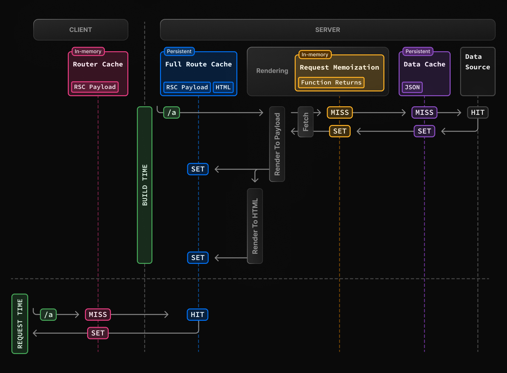
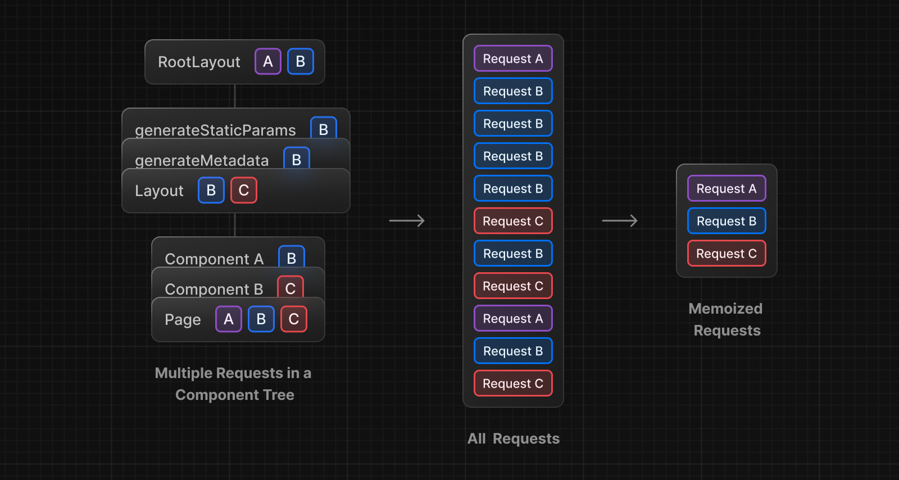
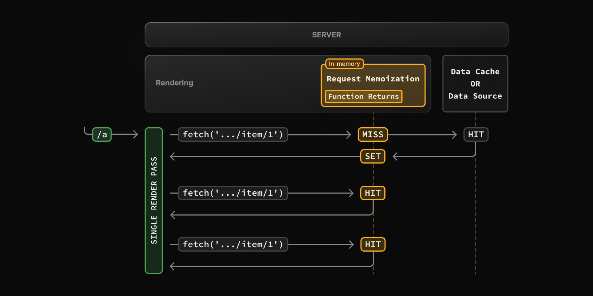
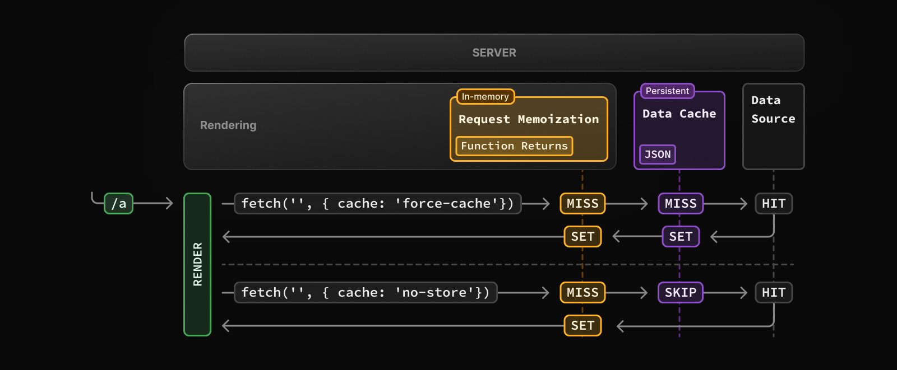
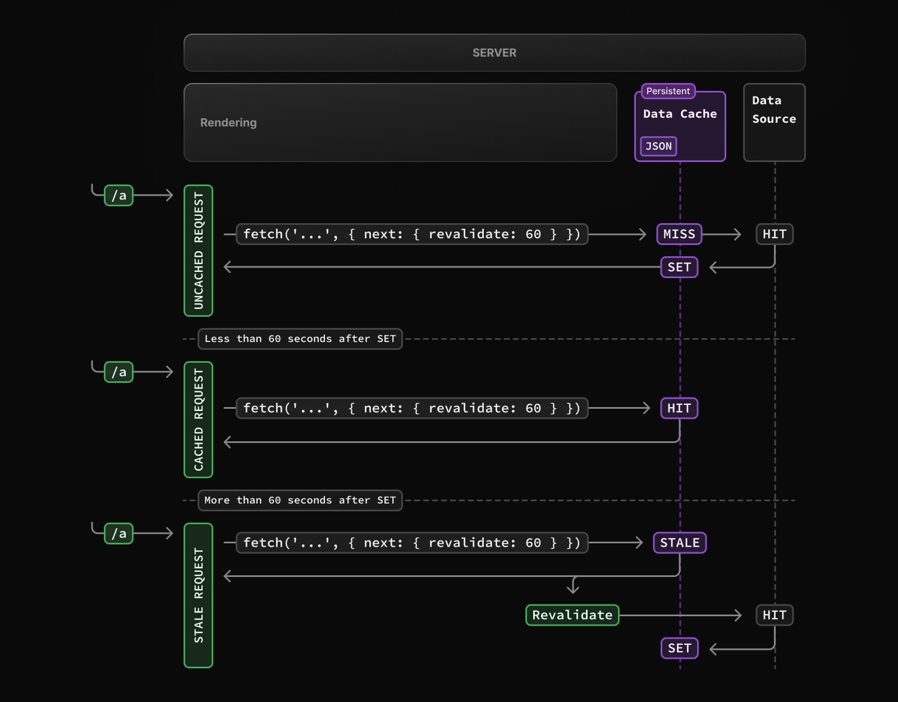
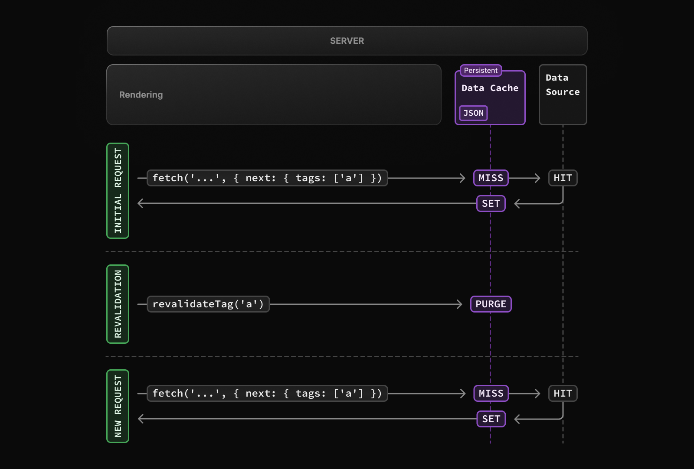

최근 강의를 듣거나, 지인의 사이드 프로젝트에 합류하여 개발을 진행하면서 Next.js를 학습하고 있다.

그 과정에서 Next.js에서는 다양한 캐싱 전략이 내부에 구현되어 있다는 것을 알게 되었는데, 벨로그에서 캐싱에 대해 잘 정리된 [Next.js의 캐싱 쉽게 이해하기](https://velog.io/@clydehan/Next.js의-캐싱-쉽게-이해하기) 글을 접하게 되었다.

읽으면서 생각보다 중요한 것이 아닌가 싶어서, 그냥 알고 넘어가는 것 보다 한 번 쯤 정리해보는게 도움이 될 것 같다는 생각이 들었다. 물론 Next.js의 공식 문서에서 이를 설명하는 페이지에는, 필수적인 지식은 아니라고 한다.

> 알아두면 좋은 정보: 이 페이지는 Next.js의 내부 작동 방식을 이해하는 데 도움이 되지만, Next.js를 생산적으로 사용하는 데 필수적인 지식은 아닙니다. 대부분의 Next.js 캐싱 휴리스틱은 API 사용에 의해 결정되며, 최소한의 구성으로도 최상의 성능을 발휘하도록 기본값이 설정되어 있습니다. ( 공식 문서 한글 번역 )

하지만 내부 작동 방식을 이해하는 데 도움이 된다고 하니, 공식 문서와 벨로그의 글을 읽으면서 Next.js의 캐싱 메커니즘에 대해 정리해보고자 한다.

### 캐싱

캐싱(Caching)은 자주 사용하는 데이터를 특정 위치에 보관해 두었다가, 이후 다시 요청할 때 이를 재사용해 빠르게 불러오기 위해 사용하는 기법이다. 이를 통해서 재요청에 대한 리소스를 줄이고, 사용자에게 더 빠른 응답을 제공할 수 있게 된다.

예를 들어 어떤 블로그의 글을 열었을 때, 글의 데이터를 서버에서 받아와 화면에 표시한다. 그런데 같은 사용자가 다시 방문했을 때 마다 매번 새 요청을 하는 것은 비효율적일 수 있다. 대신 한 번 받은 리소스를 저장해두었다가, 사용자가 다시 방문했을 때 글이 바뀌지 않았다면, 저장한 리소스를 재사용하여 불필요한 요청을 줄이고 빠르게 화면을 보여줄 수 있다. 이를 위한 방법이 바로 캐싱이다.

캐시는 다양한 상황에서 여러 방식으로 사용된다.

- 브라우저 캐시 : 이미지, HTML, JS파일 등을 브라우저에 저장
- 서버 캐시 : 서버에서 계산된 데이터나 API 응답을 인메모리에 저장
- 어플리케이션 레벨 메모이제이션 : 동일한 작업에 대한 계산 결과를 내부에 저장

### Next.js에서의 캐싱

Next.js는 내부에서 다양한 자체 캐싱 전략을 사용하고 있다. 공식 문서상 가능한 많이 캐싱한다고 하고, 이를 통해 랜더링과 데이터 요청을 효율적으로 진행하여 성능을 향상시키고 비용을 절감시킨다. 서버 랜더링 과정 등 서버에서의 캐싱 뿐만 아니라, 클라이언트 환경에서도 캐싱 기능을 제공하여 그 목적을 달성한다.

Next.js에서는 다음과 같은 4개의 캐싱 메커니즘이 존재하며, 각 메커니즘은 각각의 역할과 목적이 있다.

| Mechanism           | What                                    | Where  | Duration                                   | Purpose                                                  |
| ------------------- | --------------------------------------- | ------ | ------------------------------------------ | -------------------------------------------------------- |
| Request Memoization | 서버에서의 fetch 요청 결과              | Server | 단일 랜더링 동안 유지                      | 단일 랜더링에서 중복 요청을 방지하기 위해                |
| Data Cache          | 서버에서의 fetch 요청 결과              | Server | 지속적으로 보관(일정 시간, 수동 갱신 가능) | 같은 요청에 대해서 중복 요청을 방지하기 위해             |
| Full Route Cache    | 페이지의 랜더링 결과(HTML, RSC Payload) | Server | 지속적으로 보관(일정 시간, 수동 갱신 가능) | 동일한 경로의 페이지 요청시 다시 랜더링을 하지 않기 위해 |
| Router Cache        | 서버에서 전달받은 RSC Payload           | Client | 사용자 세션 또는 일정 시간동안 유지        | 페이지 이동시 서버에 요청하는 횟수를 줄이기 위해         |

캐싱은 여러 레이어에서 작동하고 있으며, 아래 다이어그램을 통해 확인할 수 있다. 빌드 타임과, 정적 경로에 처음 요청이 들어왔을 때의 동작이다.



빌드 타임에 `/a`페이지에 대해, 각 Full Route Cache, Request Memoization, Data Cache 단계를 거쳐 페이지를 생성하며 캐시에 저장한다. 그리고 요청이 들어오면 Full Route Cache에서 HIT 되어 캐싱된 페이지를 응답하고, 클라이언트에서 전달받은 데이터를 Router Cache에 저장한다.

캐싱 동작은 페이지가 정적인지 동적인지, 데이터가 캐싱되는지, 그리고 요청이 초기 방문인지 아닌지 등에 따라 달라진다. Next.js는 대부분의 캐싱을 자동으로 구성해주는데, 필요할 경우 비활성화 하거나 재검증을 수행하게 하는 등, 직접 제어할 수도 있다고 한다.

Next.js의 4개의 캐싱 메커니즘을 알아보도록 하자.

### Request Memoization

Request Memoization은 서버 컴포넌트를 랜더링하는 동안 요청에 대한 응답을 메모이제이션하여, 동일한 URL과 옵션으로 `fetch` 요청을 할 경우 한 번만 수행하도록 하는 메커니즘이다. 이는 React Component tree의 여러 컴포넌트에서 동일한 데이터를 위해 `fetch`를 호출한다면, 한 번만 실행된다는 것을 의미한다.

> Reuqest Memoization은 Next.js의 기능이 아니라, React의 최적화 기능이다. React 18에서는 서버 컴포넌트 랜더링 도중 발생하는 동일한 fetch 요청에 대해 내부적으로 응답을 메모이제이션 하여 중복 요청을 방지한다. 공식 문서에서는 다른 캐싱 메커니즘과 어떻게 상호 작용하는지를 설명하기 위해 포함했다고 한다.



예를 들어, 사용자의 정보를 받아오는 API가 있다고 하자. `Layout` 컴포넌트에서는 기본 정보를 보여주기 위해, `Profile` 컴포넌트에서는 상세한 정보를 보여주기 위해, `page` 컴포넌트에서는 특정 작업을 수행하기 위해 각각 호출한다면, 한 렌더링에서 동일한 요청이 세 번 발생할 수 있다.

이렇게 동일한 데이터를 중복 요청하게 되면 불필요하게 리소스를 낭비할 수 있다. 이를 해결하기 위해서는 컴포넌트의 구조를 변경하여 부모 컴포넌트에서 단 한번만 호출하게 하여, `props`를 전달하는 방식으로도 해결할 수는 있다. 하지만 구조를 변경할 수 없거나, props drill-down 문제가 발생할 수 있다.

그래서 Next.js에서는 서버 랜더링 도중 발생하는 `fetch`요청에 대한 결과를 메모리에 저장하여, 동일한 요청이 발생할 경우 참조하여 재사용한다. 이것이 바로 Request Memoization이다.



- 페이지를 랜더링하는 도중 컴포넌트 A에서 `/item/1` 에 대한 요청이 발생하면, 해당 결과가 메모리에 없으므로 데이터 요청을 수행하고, 결과값을 메모리에 저장한다.
- 동일한 랜더링에서 컴포넌트 B가 `/item/1`에 대해 다시 요청할 경우, 메모리에 기존 결과가 있으므로 캐시 HIT 가 되어, 요청 없이 메모리의 데이터를 재사용한다.
- 동일한 랜더링에서 컴포넌트 C가 요청하는 `/item/1` 역시 동일한 동작을 한다.
- 랜더링이 완료되면, 모든 Request Memoization 을 제거한다.

Request Memoization은 `GET` 요청에만 적용되는데, 데이터 읽기만 수행하여 데이터가 변경되지 않기 때문이다. `POST`, `PUT` 등은 요청시 데이터가 변경될 수 있기 때문에 캐싱에 포함되지 않는다.

그리고 React의 최적화 기능이기 때문에, Request Memoization은 React 컴포넌트의 트리에서만 적용된다. 즉 `generateMetadata`나 서버 컴포넌트의 `fetch` 요청에 적용되며, 컴포넌트 트리가 아닌 Route Handler나 Middleware에서의 fetch 요청에는 적용되지 않는다.

또한, Request Memoization은 React의 **서버 컴포넌트** 랜더링 도중 작동하는 최적화 메커니즘으로, Page Router에서는 지원하지 않는다.

#### Duration

Request Memoization은 서버 요청을 처리하는 도중에 적용되며, React 컴포넌트 트리의 랜더링이 완료될 때 까지 유지된다. 렌더링과 요청 처리가 완료되면 캐시도 초기화된다. 즉, 단일 요청에 대한 사이클동안 유지된다.

#### Revalidating

캐싱은 요청 사이에 공유되지 않으며, 각 랜더링 도중에만 유지되고 랜더링이 끝난 후 제거된다. 따라서 재검증을 할 필요가 없다.

#### Opt-out

이 동작은 React의 기본 최적화 동작이며, 이를 해제하는 것은 권장하지 않는다고 한다. 그래서 명시적으로 비활성화 할 수 있는 설정은 존재하지 않는다.

### Data Cache

Next.js에서는 서버 요청을 처리(랜더링)하는 동안만 사용하는 일시적인 캐시 뿐만 아니라, 그 이후에도 데이터를 재사용할 수 있도록 지속적으로 유지되는 내장 캐시가 존재한다. 즉, 서버에서 `fetch`로 가져온 데이터를 요청 처리 이후에도 서버에 저장해두고, 동일한 요청이 발생했을 때 재사용할 수 있게 하는 캐시이다. 이를 Data Cache라 한다.

예를 들어, 사용자의 정보는 설정을 하지 않는 이상 자주 변경되지 않는다. 이 때, A 페이지와 B 페이지에서 사용자의 정보를 받아오는 API를 호출하여 매번 동일한 데이터를 외부에서 받아온다면, 리소스를 낭비하게 된다. Data Cache는 데이터를 서버에 저장하고, 동일한 요청이 발생하면 저장된 데이터를 반환하여 API 서버로의 요청 횟수를 줄일 수 있다.

Next.js는 `fetch` API를 확장해서, 각 데이터 요청에 대해서 자체 캐싱 메커니즘을 설정할 수 있게 하였다. 기본적으로 `fetch`의 데이터 요청은 캐싱되지 않으나, `cache`, `next.revalidate` 옵션을 통해 캐싱 동작을 구성할 수 있다. 기본 `fetch`의 `cache` 옵션은 브라우저의 캐시와 상호 작용하는 방식을 나타내지만, Next.js에서는 서버에서의 요청이 서버 캐시와 상호 작용하는 방식을 나타낸다.

> 공식 문서상에는 기본적으로 캐싱되지 않는다고 나와있다. 하지만 Next.js 14에서는 `cache`의 기본값이 `force-cache`가 적용되며, 자동으로 캐싱이 적용된다. Next.js 15부터 기본값이 `no-store`로 변경되어 자동으로 캐싱되지 않는다. 공식 문서는 최신 버전을 기준으로 작성되어 있다.



- 캐시 옵션(`force-cache`)이 있는 `fetch`요청이 처음 호출되면, Data Cache에서 캐싱된 응답이 있는지 확인한다.
- 발견되지 않았다면 요청이 정상적으로 수행되고, 결과를 Data Cache에 저장하고 Memoization한다.
- 이후 동일한 옵션으로 요청이 온다면, 캐싱된 결과를 즉시 반환하고 Memoization한다.
- 캐시 옵션을 지정하지 않은 경우(`cache` 옵션이 없거나 `no-store` 인 경우), Data Cache를 스킵하고 항상 요청을 수행한다.
- 단, 캐시 옵션과 캐싱되어 있는지와는 상관없이, 요청은 항상 Memoization되어, 동일한 데이터는 중복 요청을 하지 않는다.

Request Memoization과 Data Cache 모두 캐시된 데이터를 재사용함으로써 성능을 향상시키는 역할을 하지만, 동작 범위와 목적이 다르다.

Request Memoization은 React에서 제공하는 기능으로 **단일 요청 내에서만 유지**되며, 랜더링 도중 발생하는 중복된 `fetch` 요청 수를 줄여 한 번만 실행되도록 최적화 하는 메커니즘이다. 이를 통해 Data Cache의 조회나 실제 API 요청 횟수를 줄일 수 있다.

Data Cache는 Next.js가 서버에 `fetch` 결과를 저장해주는 **장기 캐싱 계층**으로, 중복 요청 횟수를 줄이는건 같지만 랜더링 범위를 넘어 여러 요청 간에도 재사용될 수 있다. 한 번 저장되면 Revalidating을 수행하거나 앱이 재배포될때까지 유지되며, 다른 사용자의 요청이나 다른 요청 컨텍스트에서도 재사용된다.

#### Duration

Data Cache는 여러 요청 간에 지속된다. 재검증을 수행하거나 비활성화, 혹은 재배포 하지 않는 이상 유지된다.

#### Revalidating

Data Cache에 저장된 캐시는 재검증을 통해 갱신할 수 있다.

##### Time-based Revalidation

우선 일정 시간이 지난 후 새 요청이 있을 때, 데이터를 재검증할 수 있다. 이는 데이터가 자주 변경되지 않고, 최신 데이터가 그렇게 중요하지 않을 때 유용하다.

날씨 정보가 있다고 하자. 이 데이터는 보통 일정 주기마다 업데이트되며, 실시간일 필요는 없으나 하루 전 날씨 정보를 보여주는건 문제가 될 수 있다. 이 때 매 요청마다 새로운 데이터를 요청하는 대신, 이전에 받아둔 데이터를 일정 시간 동안 저장해두고 재사용할 수 있다. 그리고 일정 시간이 지나면 캐시를 만료시키고, 새로운 요청으로 데이터를 불러와 다시 저장하여 활용한다. 이처럼 일정 주기로 캐시를 재검증하고 갱신하는 방식이 Time-based Revalidation이다.

정해진 시간 간격으로 재검증을 수행하려면, `fetch`의 `next.revalidate` 옵션을 사용하여 결과값의 캐시 수명을 초 단위로 설정할 수 있다.

```ts
// 한 시간마다 재검증
fetch("https://...", { next: { revalidate: 3600 } });
```

또한, Route Segment Config option 을 사용하면 세그먼트 안의 모든 `fetch` 요청에 대해 구성할 수 있으며, `fetch`를 사용할 수 없는 경우에도 구성할 수 있다.



- `revalidate`가 있는 `fetch`요청이 처음 호출되면, 요청은 정상적으로 수행되고 결과를 Data Cache에 저장한다.
- 지정된 시간(60초) 사이에 호출되는 모든 요청은 캐시된 데이터를 반환한다.
- 지정된 시간 이후, 다음 요청은 **여전히 캐시된 데이터를 반환**한다.
  - Next.js는 해당 시점에 백그라운드에서 데이터 재검증을 트리거한다.
  - 요청에 성공하면 Data Cache를 업데이트하고, 실패하면 유지된다.

##### On-demand Revalidation

재검증은 일정 시간 뿐만 아니라, 경로나 태그에 따라 온디맨드 방식으로 재검증을 수행할 수 있다. 이는 데이터가 업데이트됬을 때, 가능한 빨리 최신 데이터를 제공하고 싶은 경우에 유용하다.

사용자 정보는 특정 작업을 수행(설정에서 수정하는 등)하면 변경된다. 사용자 정보 요청 결과에 대한 캐시를 시간을 기준으로 갱신한다면 일정 시간동안 이전 정보를 보여주게 된다. 이 경우, 특정 작업을 수행한 후 해당 데이터에 대한 캐시를 직접 무효화하면, 다음 요청에서는 최신 데이터를 받을 수 있다. 이렇게 캐시를 직접 무효화 하는 방식이 On-demand Revalidation이다.

캐시는 `revalidatePath` 또는 `revalidateTag`을 사용하여 온디맨드로 재검증할 수 있다.



- 첫 번째 `fetch`요청(태그가 `a`로 설정된)이 호출되면, 요청은 정상적으로 수행되고 결과를 Data Cache에 저장한다.
- 온디멘드 재검증(`a`태그에 대한 `revalidateTag`)이 트리거되면 해당하는 항목이 캐시에서 제거된다.
- 다음 요청 시 캐시 MISS가 되며 요청을 수행하고 결과를 Data Cache에 저장한다.

#### Opt-out

기본적으로 Next.js 15에서는 데이터 요청은 캐싱되지 않으므로 해제할 필요가 없다. 다만, Next.js의 이전 버전에서는 기본 설정이 `force-cache`이므로, `no-store`를 적용하여 데이터 캐시를 해제할 수 있다.

### Full Route Cache

Full Route Cache는 정적 라우트의 랜더링 결과물인 HTML과 React Server Component Payload를 서버에 저장하여, 이후 서버 요청에서 재사용 하는 매커니즘이다.

동적 페이지에는 작동하지 않는다.

#### Duration

기본적으로 Full Route Cache는 지속적으로 유지된다.

#### Invalidation

Full Route Cache를 무효화하는 방법은 두 가지가 있다.

- Data Cache 재검증
- 재배포

#### Opt-out

메커니즘을 옵트아웃 하거나, 모든 요청에 대해 동적으로 랜더링하려면 다음과 같은 방법을 사용할 수 있다.

- Dynamic Function
- Route Segment
- Data Cache Opt-out

### Router Cache

Next.js의 캐싱 메커니즘은 서버에서 이루어지는 것 뿐만 아니라, 클라이언트에도 존재한다. 레이아웃, 로딩, 페이지로 나뉜 React Server Component Payload를 클라이언트의 메모리에 저장하는 Router Cache를 가지고 있다.

페이지를 탐색할 때 마다 RSC Payload를 메모리에 저장하고, 동일한 경로로 이동하면 서버에 요청하지 않고 메모리를 참조해 재사용한다.

#### Full Router Cache와의 차이점

두 개는 다르다. 상호 보완적인 역할을 수행한다.

#### Duration

캐시는 브라우저 메모리에 저장된다. 페이지 탐색 간에는 유지되지만 새로 고침을 할 경우 사라진다.

#### Invalidation

- 서버 액션에서 온디멘드로 페이지나 데이터를 재검증할 경우
- router.refresh를 수행하면 Router Cache를 무효화하고 서버에 새 요청을 보낸다.

### 참고

- [Next.js의 캐싱 쉽게 이해하기](https://velog.io/@clydehan/Next.js의-캐싱-쉽게-이해하기)
- [공식 문서 - Caching in Next.js](https://nextjs.org/docs/app/deep-dive/caching#cache-interactions)
