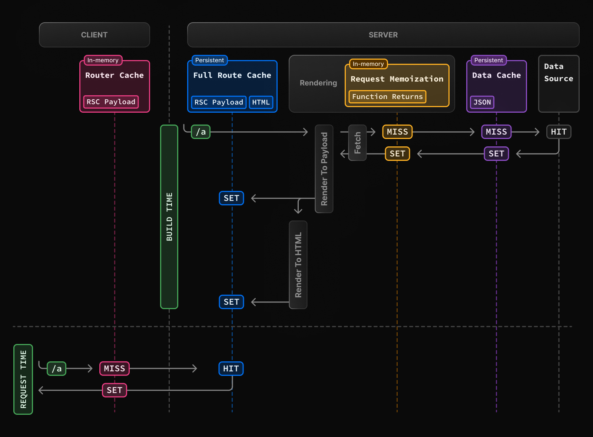
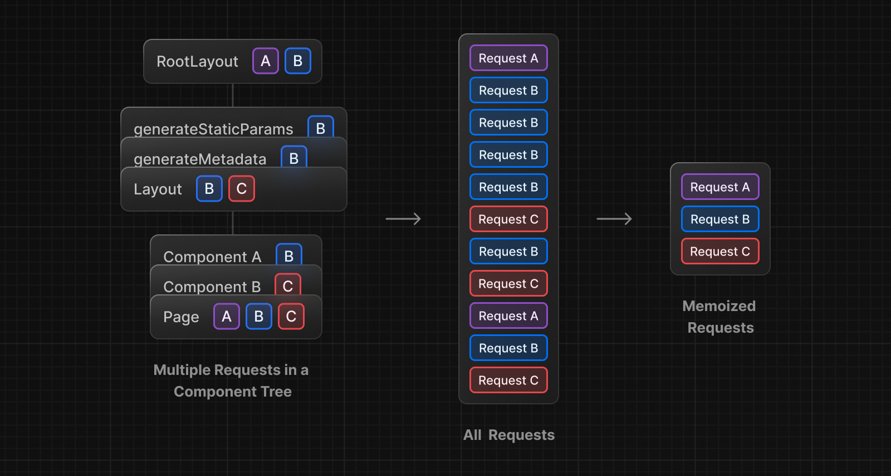
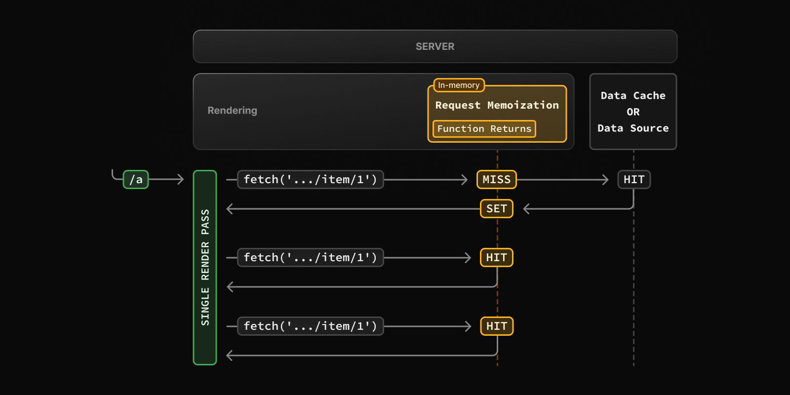
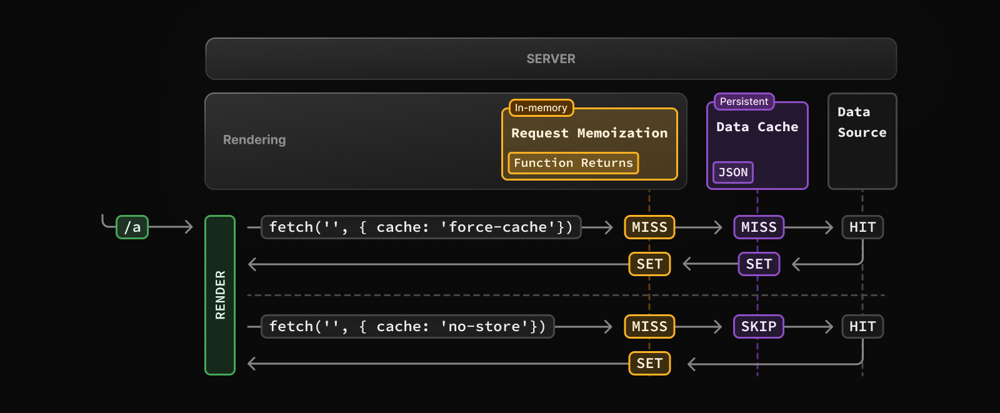
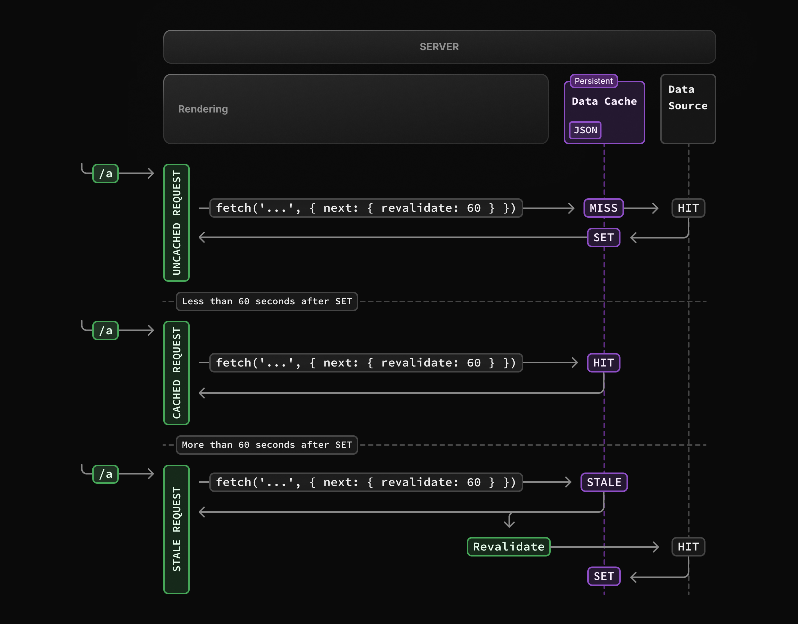
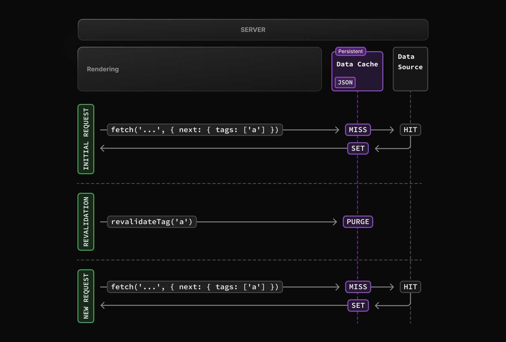
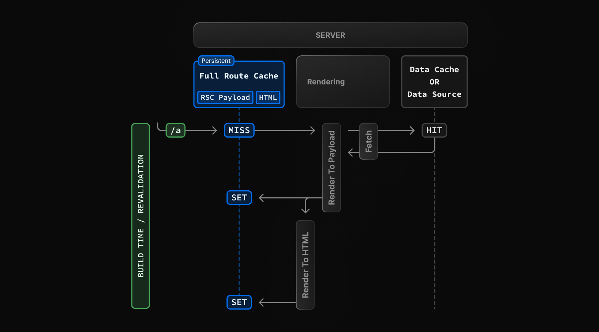
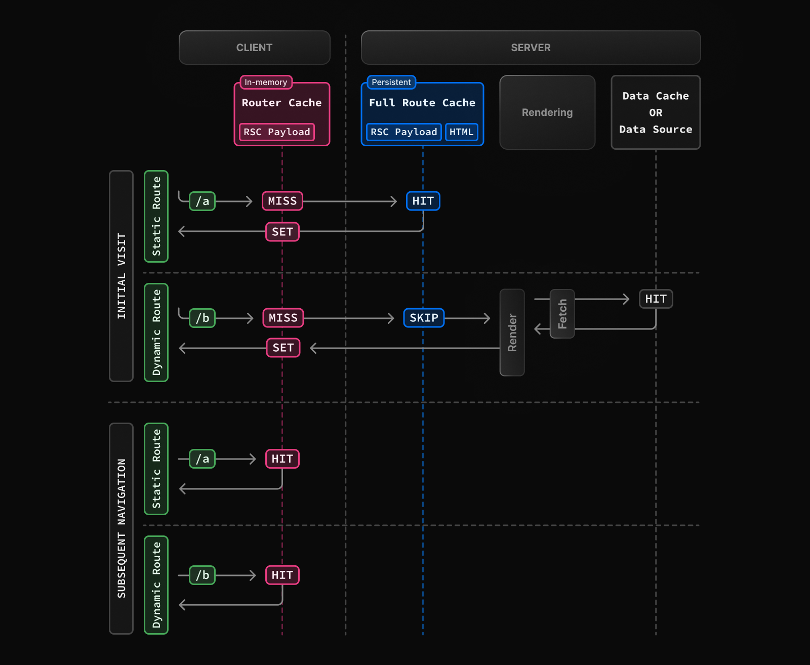

최근 강의를 듣거나 사이드 프로젝트를 하면서 Next.js를 계속해서 학습하고 있다.

그 과정에서 Next.js에서는 다양한 캐싱 전략이 내부에 구현되어 있다는 것을 알게 되었는데, 벨로그에서 캐싱에 대해 잘 정리된 [Next.js의 캐싱 쉽게 이해하기](https://velog.io/@clydehan/Next.js의-캐싱-쉽게-이해하기) 글을 접하게 되었다.

읽으면서 생각보다 중요한 것이 아닌가 싶어서, 그냥 알고 넘어가는 것 보다 한 번 쯤 정리해보는게 도움이 될 것 같다는 생각이 들었다. 물론 Next.js의 공식 문서에서 이를 설명하는 페이지에는, 필수적인 지식은 아니라고 한다.

> 알아두면 좋은 정보: 이 페이지는 Next.js의 내부 작동 방식을 이해하는 데 도움이 되지만, Next.js를 생산적으로 사용하는 데 필수적인 지식은 아닙니다. 대부분의 Next.js 캐싱 휴리스틱은 API 사용에 의해 결정되며, 최소한의 구성으로도 최상의 성능을 발휘하도록 기본값이 설정되어 있습니다. ( 공식 문서 한글 번역 )

하지만 내부 작동 방식을 이해하는 데 도움이 된다고 하니, 공식 문서와 벨로그의 글을 읽으면서 Next.js의 캐싱 메커니즘에 대해 정리해보고자 한다.

> 이 글에서 다루는 캐싱 전략들은 모두 서버 컴포넌트 기반( 서버 컴포넌트 내의 `fetch`, RSC Payload )이며, **Next.js 의 App Router 기준**으로 설명하고 있다. Page Router의 경우에는 여기서 다루는 캐싱 메커니즘들은 작동하지 않는다. 대신 `getStaticProps`, `getServerSideProps`, `revalidate` 등의 API를 통해 정적 생성이나 서버 사이드 랜더링을 구현하게 되며, 일부 유사한 흐름을 구성할 수 있다.

### 캐싱

캐싱(Caching)은 자주 사용하는 데이터를 특정 위치에 보관해 두었다가, 이후 다시 요청할 때 이를 재사용해 빠르게 불러오기 위해 사용하는 기법이다. 이를 통해서 재요청에 대한 리소스를 줄이고, 사용자에게 더 빠른 응답을 제공할 수 있게 된다.

예를 들어 어떤 블로그의 글을 열었을 때, 글의 데이터를 서버에서 받아와 화면에 표시한다. 그런데 같은 사용자가 다시 방문했을 때 마다 매번 새 요청을 하는 것은 비효율적일 수 있다. 대신 한 번 받은 리소스를 저장해두었다가, 사용자가 다시 방문했을 때 글이 바뀌지 않았다면, 저장한 리소스를 재사용하여 불필요한 요청을 줄이고 빠르게 화면을 보여줄 수 있다. 이를 위한 방법이 바로 캐싱이다.

캐시는 다양한 상황에서 여러 방식으로 사용된다.

- 브라우저 캐시 : 이미지, HTML, JS파일 등을 브라우저에 저장
- 서버 캐시 : 서버에서 계산된 데이터나 API 응답을 인메모리에 저장
- 어플리케이션 레벨 메모이제이션 : 동일한 작업에 대한 계산 결과를 내부에 저장

### Next.js에서의 캐싱

Next.js는 내부에서 다양한 자체 캐싱 전략을 사용하고 있다. 공식 문서상 가능한 많이 캐싱한다고 하고, 이를 통해 렌더링과 데이터 요청을 효율적으로 진행하여 성능을 향상시키고 비용을 절감시킨다. 서버 렌더링 과정 등 서버에서의 캐싱 뿐만 아니라, 클라이언트 환경에서도 캐싱 기능을 제공하여 그 목적을 달성한다.

Next.js에서는 다음과 같은 4개의 캐싱 메커니즘이 존재하며, 각 메커니즘은 각각의 역할과 목적이 있다.

| Mechanism           | What                                    | Where  | Duration                                   | Purpose                                                  |
| ------------------- | --------------------------------------- | ------ | ------------------------------------------ | -------------------------------------------------------- |
| Request Memoization | 서버에서의 fetch 요청 결과              | Server | 단일 렌더링 동안 유지                      | 단일 렌더링에서 중복 요청을 방지하기 위해                |
| Data Cache          | 서버에서의 fetch 요청 결과              | Server | 지속적으로 보관(일정 시간, 수동 갱신 가능) | 같은 요청에 대해서 중복 요청을 방지하기 위해             |
| Full Route Cache    | 페이지의 렌더링 결과(HTML, RSC Payload) | Server | 지속적으로 보관(일정 시간, 수동 갱신 가능) | 동일한 경로의 페이지 요청시 다시 렌더링을 하지 않기 위해 |
| Router Cache        | 서버에서 전달받은 RSC Payload           | Client | 사용자 세션 또는 일정 시간동안 유지        | 페이지 이동시 서버에 요청하는 횟수를 줄이기 위해         |

캐싱은 여러 레이어에서 작동하고 있으며, 아래 다이어그램을 통해 확인할 수 있다. 빌드 타임과, 정적 경로에 처음 요청이 들어왔을 때의 동작이다.



빌드 타임에 `/a` 경로에 대해, 각 Full Route Cache, Request Memoization, Data Cache 단계를 거쳐 보여줄 페이지를 생성하며 캐시에 저장한다. 그리고 요청이 들어오면 Full Route Cache에서 HIT 되어 캐싱된 데이터를 응답하고, 클라이언트에서는 전달받은 데이터를 Router Cache에 저장한다.

캐싱 동작은 해당 경로가 정적인지 동적인지, 데이터가 캐싱되는지, 그리고 요청이 초기 방문인지 아닌지 등에 따라 달라진다. Next.js는 대부분의 캐싱을 자동으로 구성해주는데, 필요할 경우 비활성화 하거나 재검증을 수행하게 하는 등, 직접 제어할 수도 있다고 한다.

위 표에서 보았던, Next.js에서 다루는 4개의 캐싱 메커니즘을 하나씩 알아보도록 하자.

### Request Memoization

Request Memoization은 서버 컴포넌트를 렌더링하는 동안 요청에 대한 응답을 메모이제이션하여, 동일한 URL과 옵션으로 `fetch` 요청을 할 경우 한 번만 수행하도록 하는 메커니즘이다. 이는 React Component tree의 여러 컴포넌트에서 동일한 데이터를 위해 `fetch`를 호출한다면, 한 번만 실행된다는 것을 의미한다.

> Request Memoization은 Next.js의 기능이 아니라, React의 최적화 기능이다. React 18에서는 서버 컴포넌트 렌더링 도중 발생하는 동일한 fetch 요청에 대해 내부적으로 응답을 메모이제이션 하여 중복 요청을 방지한다. 공식 문서에서는 다른 캐싱 메커니즘과 어떻게 상호 작용하는지를 설명하기 위해 포함했다고 한다.



예를 들어, 사용자의 정보를 받아오는 API가 있다고 하자. `Layout` 컴포넌트에서는 기본 정보를 보여주기 위해, `Profile` 컴포넌트에서는 상세한 정보를 보여주기 위해, `Page` 컴포넌트에서는 특정 작업을 수행하기 위해 각각 호출한다면, 한 렌더링에서 동일한 요청이 세 번 발생할 수 있다.

이렇게 동일한 데이터를 중복 요청하게 되면 불필요하게 리소스를 낭비할 수 있다. 이를 해결하기 위해서는 컴포넌트의 구조를 변경하여 부모 컴포넌트에서 단 한번만 호출하게 하여, `props`를 전달하는 방식으로도 해결할 수는 있다. 하지만 구조를 변경할 수 없거나, props drill-down 문제가 발생할 수 있다.

그래서 Next.js에서는 서버 렌더링 도중 발생하는 `fetch`요청에 대한 결과를 메모리에 저장하여, 동일한 요청이 발생할 경우 참조하여 재사용한다. 이것이 바로 Request Memoization이다.



- 경로를 렌더링하는 도중 컴포넌트 A에서 `/item/1` 에 대한 요청이 발생하면, 해당 결과가 메모리에 없으므로 데이터 요청을 수행하고, 결과값을 메모리에 저장한다.
- 동일한 렌더링에서 컴포넌트 B가 `/item/1`에 대해 다시 요청할 경우, 메모리에 기존 결과가 있으므로 캐시 HIT 가 되어, 요청 없이 메모리의 데이터를 재사용한다.
- 동일한 렌더링에서 컴포넌트 C가 요청하는 `/item/1` 역시 동일한 동작을 한다.
- 렌더링이 완료되면, 모든 Request Memoization 을 제거한다.

Request Memoization은 `GET` 요청에만 적용되는데, 데이터 읽기만 수행하여 데이터가 변경되지 않기 때문이다. `POST`, `PUT` 등은 요청시 데이터가 변경될 수 있기 때문에 캐싱에 포함되지 않는다.

그리고 React의 최적화 기능이기 때문에, Request Memoization은 React 컴포넌트의 트리에서만 적용된다. 즉 `generateMetadata`나 서버 컴포넌트에서의 `fetch` 요청에 적용되며, 컴포넌트 트리가 아닌 Route Handler나 Middleware에서의 `fetch` 요청에는 적용되지 않는다.

#### Duration

Request Memoization은 서버 요청을 처리하는 도중에 적용되며, React 컴포넌트 트리의 렌더링이 완료될 때 까지 유지된다. 렌더링과 요청 처리가 완료되면 캐시도 초기화된다. 즉, 단일 요청에 대한 사이클동안 유지된다.

#### Revalidating

캐싱은 요청 사이에 공유되지 않으며, 각 렌더링 도중에만 유지되고 렌더링이 끝난 후 제거된다. 따라서 재검증을 할 필요가 없다.

#### Opt-out

이 동작은 React의 기본 최적화 동작이며, 이를 해제하는 것은 권장하지 않는다고 한다. 그래서 명시적으로 비활성화 할 수 있는 설정은 존재하지 않는다.

### Data Cache

Next.js에서는 서버 요청을 처리(렌더링)하는 동안만 사용하는 일시적인 캐시 뿐만 아니라, 그 이후에도 데이터를 재사용할 수 있도록 지속적으로 유지되는 내장 캐시가 존재한다. 즉, 서버에서 `fetch`로 가져온 데이터를 요청 처리 이후에도 서버에 저장해두고, 동일한 `fetch` 요청이 발생했을 때 재사용할 수 있게 하는 캐시이다. 이를 Data Cache라 한다.

예를 들어, 사용자의 정보는 설정을 하지 않는 이상 자주 변경되지 않는다. 이 때, A 페이지와 B 페이지에서 사용자의 정보를 받아오는 API를 호출하여 매번 동일한 데이터를 외부에서 받아온다면, 리소스를 낭비하게 된다. Data Cache는 데이터를 서버에 저장하고, 동일한 요청이 발생하면 저장된 데이터를 반환하여 API 서버나 데이터 소스에 대한 요청 횟수를 줄일 수 있다.

Next.js는 `fetch` API를 확장해서, 각 데이터 요청에 대해서 자체 캐싱 메커니즘을 설정할 수 있게 하였다. 기본적으로는 `fetch`의 데이터 요청은 캐싱되지 않으나, `cache`, `next.revalidate` 옵션을 통해 캐싱 동작을 구성할 수 있다. 기본 `fetch`의 `cache` 옵션은 브라우저의 캐시와 상호 작용하는 방식을 나타내지만, Next.js에서는 서버에서의 요청이 서버 캐시와 상호 작용하는 방식을 나타낸다. 상세 옵션은 [공식 문서 - fetch](https://nextjs.org/docs/app/api-reference/functions/fetch) 에 설명되어 있다.

> 공식 문서상에는 기본적으로 캐싱되지 않는다고 나와있다. 하지만 Next.js 14에서는 `cache`의 기본값이 `force-cache`가 적용되며, 자동으로 캐싱이 적용된다. Next.js 15부터 기본값이 `no-store`로 변경되어 자동으로 캐싱되지 않는다. 공식 문서는 최신 버전을 기준으로 작성되어 있다.



- 캐시 옵션(`force-cache`)이 있는 `fetch`요청이 처음 호출되면, Data Cache에서 캐싱된 응답이 있는지 확인한다.
- 발견되지 않았다면 요청이 정상적으로 수행되고, 결과를 Data Cache에 저장하고 Memoization한다.
- 이후 동일한 옵션으로 요청이 발생하면, 캐싱된 결과를 즉시 반환하고 Memoization한다.
- 캐시 옵션을 지정하지 않은 경우(`cache` 옵션이 없거나 `no-store` 인 경우), Data Cache를 스킵하고 항상 요청을 수행한다.
- 단, 캐시 옵션과 캐싱되어 있는지와는 상관없이, 요청은 항상 Memoization되어, 동일한 데이터는 중복 요청을 하지 않는다.

Request Memoization과 Data Cache 모두 캐시된 데이터를 재사용함으로써 성능을 향상시키는 역할을 하지만, 동작 범위와 목적이 다르다.

Request Memoization은 React에서 제공하는 기능으로 **단일 요청 내에서만 유지**되며, 렌더링 도중 발생하는 중복된 `fetch` 요청 수를 줄여 한 번만 실행되도록 최적화 하는 메커니즘이다. 이를 통해 Data Cache의 조회나 실제 API 요청 횟수를 줄일 수 있다.

Data Cache는 Next.js가 서버에 `fetch` 결과를 저장해주는 **장기 캐싱 계층**으로, 중복 요청 횟수를 줄이는건 같지만 렌더링 범위를 넘어 여러 요청 간에도 재사용될 수 있다. 한 번 저장되면 Revalidating을 수행하거나 앱이 재배포될때까지 유지되며, 다른 사용자의 요청이나 다른 요청 컨텍스트에서도 재사용된다.

#### Duration

Data Cache는 여러 요청 간에 지속된다. 재검증을 수행하거나 비활성화, 혹은 재배포하지 않는 이상 유지된다.

> Vercel에서 Next.js를 배포할 경우, Data Cache가 빌드 산출물과 분리된 저장소에 보관되기 때문에, 앱을 재배포하더라도 기존 캐시가 유지될 수 있다.

#### Revalidating

Data Cache에 저장된 캐시는 재검증을 통해 갱신할 수 있다.

##### Time-based Revalidation

우선 일정 시간이 지난 후 새 요청이 있을 때, 데이터를 재검증할 수 있다. 이는 데이터가 자주 변경되지 않고, 최신 데이터가 그렇게 중요하지 않을 때 유용하다.

날씨 정보가 있다고 하자. 이 데이터는 보통 일정 주기마다 업데이트되며, 실시간일 필요는 없으나 하루 전 날씨 정보를 보여주는건 문제가 될 수 있다. 이 때 매 요청마다 새로운 데이터를 요청하는 대신, 이전에 받아둔 데이터를 일정 시간 동안 저장해두고 재사용할 수 있다. 그리고 일정 시간이 지나면 캐시를 만료시키고, 새로운 요청으로 데이터를 불러와 다시 저장하여 활용한다. 이처럼 일정 주기로 캐시를 재검증하고 갱신하는 방식이 Time-based Revalidation이다.

정해진 시간 간격으로 재검증을 수행하려면, `fetch`의 `next.revalidate` 옵션을 사용하여 결과값의 캐시 수명을 초 단위로 설정할 수 있다.

```ts
// 한 시간마다 재검증
fetch("https://...", { next: { revalidate: 3600 } });
```

또한, [Route Segment Config option](https://nextjs.org/docs/app/building-your-application/caching#segment-config-options) 을 사용하면 세그먼트 안의 모든 `fetch` 요청에 대해 구성할 수 있으며, `fetch`를 사용할 수 없는 경우에도 구성할 수 있다.



- `revalidate`가 있는 `fetch`요청이 처음 호출되면, 요청은 정상적으로 수행되고 결과를 Data Cache에 저장한다.
- 지정된 시간(60초) 사이에 호출되는 모든 요청은 캐시된 데이터를 반환한다.
- 지정된 시간 이후, 다음 요청은 **여전히 캐시된 데이터를 반환**한다.
  - Next.js는 해당 시점에 백그라운드에서 데이터 재검증을 트리거한다.
  - 요청에 성공하면 Data Cache를 업데이트하고, 실패하면 유지된다.

##### On-demand Revalidation

재검증은 일정 시간 뿐만 아니라, 경로나 태그에 따라 온디맨드 방식으로 재검증을 수행할 수 있다. 이는 데이터가 업데이트됬을 때, 가능한 빨리 최신 데이터를 제공하고 싶은 경우에 유용하다.

사용자 정보는 특정 작업을 수행(설정에서 수정하는 등)하면 변경된다. 사용자 정보 요청 결과에 대한 캐시를 시간을 기준으로 갱신한다면 일정 시간동안 이전 정보를 보여주게 된다. 이 경우, 특정 작업을 수행한 후 해당 데이터에 대한 캐시를 직접 무효화하면, 다음 요청에서는 최신 데이터를 받을 수 있다. 이렇게 캐시를 직접 무효화 하는 방식이 On-demand Revalidation이다.

캐시는 `revalidatePath` 또는 `revalidateTag`을 사용하여 온디맨드로 재검증할 수 있다.



- 첫 번째 `fetch`요청(태그가 `a`로 설정된)이 호출되면, 요청은 정상적으로 수행되고 결과를 Data Cache에 저장한다.
- 온디멘드 재검증(`a`태그에 대한 `revalidateTag`)이 트리거되면 해당하는 항목이 캐시에서 제거된다.
- 다음 요청 시 캐시 MISS가 되며 요청을 수행하고 결과를 Data Cache에 저장한다.

#### Opt-out

기본적으로 Next.js 15에서는 데이터 요청은 캐싱되지 않으므로 해제할 필요가 없다. 다만, Next.js의 이전 버전에서는 기본 설정이 `force-cache`이므로, `no-store`를 적용하여 데이터 캐시를 해제할 수 있다.

### Full Route Cache

Full Route Cache는 정적 경로의 렌더링 결과물인 HTML과 React Server Component Payload를 서버에 저장하여, 이후 서버 요청에서 재사용 하는 매커니즘이다. 즉, 매 요청마다 서버에서 렌더링하는 대신 캐시된 데이터를 제공하는 최적화로, 특정 경로에 대한 응답을 더 빠르게 만든다.

<details>

<summary>React Server Component Payload(RSC Payload)란?</summary>

React Server Component Payload는 React가 렌더링한 React Server Components 트리의 결과물로, 압축된 데이터 형식이다. 이는 클라이언트에서 React가 브라우저의 DOM을 업데이트하는데 사용된다. 다음 정보를 포함하고 있다.

- 서버 컴포넌트의 렌더링 결과
- 클라이언트 컴포넌트의 위치와 해당 자바스크립트 파일에 대한 참조
- 서버 컴포넌트에서 클라이언트 컴포넌트로 전달되는 모든 `props`

</details>

서비스의 랜딩 페이지처럼 한 번 생성하면 내용이 자주 바뀌지 않는 페이지가 있다고 하자. 이 페이지를 매번 요청할 때마다 새로 렌더링 한다면 불필요하게 리소스를 낭비한다. 그 대신 렌더링된 결과를 서버에 저장해두었다가, 이후 요청이 들어오면 이를 재사용한다면 서버의 부하를 줄이고 응답 속도를 향상시킬 수 있다. 이처럼 렌더링 결과 자체를 캐싱해 재사용하는 방식이 바로 Full Route Cache 이다.



렌더링이 처리되는 방식을 살펴보면서 Full Route Cache의 작동 방식을 이해해보자. 서버에서 렌더링을 할 때, Next.js는 React의 API를 사용하여 렌더링한다. 렌더링은 페이지의 각 부분과 Suspense 경계를 기준으로 청크로 나누어 처리한다. 각 청크는 두 단계를 거쳐 렌더링된다.

1. React는 서버 컴포넌트를 스트리밍에 최적화된 RSC Payload로 렌더링한다.
2. Next.js는 RSC Payload와 클라이언트 컴포넌트의 초기화 정보를 사용해 서버에서 HTML을 렌더링한다.

이 때, Next.js Full Route Cache의 기본 동작은 경로에 대한 렌더링 결과인 HTML과 RSC Payload를 서버에 캐시하며, 정적 경로 렌더링이나 재검증 도중에 적용된다.

그리고 클라이언트에게 HTML을 전달하여, 정적인 컨텐츠와 초기 화면을 즉시 보여주도록 한다. RSC Payload는 클라이언트와 서버의 렌더링된 트리를 일치시키고 DOM을 업데이트하는데 사용되며, 하이드레이션 과정을 거쳐 페이지를 상호작용 가능하게 만든다.

브라우저에서는 요청에 대한 응답을 받으면서, RSC Payload를 다음 섹션에서 설명할 클라이언트 캐싱인 Router Cache에 저장하여 이후 페이지를 네비게이션할 때 참조한다.

정리하면, Full Route Cache는 경로를 렌더링하는 과정에서 작동하며, 렌더링 결과를 저장하여 재사용하는 메커니즘이다. Data Cache는 `fetch`로 가져온 데이터를 캐싱하는 것이라면, Full Route Cache는 렌더링 결과 전체를 저장하는 것이다.

페이지가 렌더링될 때 캐시되는지 여부는 페이지가 정적 페이지인지 동적 페이지인지에 따라 다르다. 정적 페이지는 기본적으로 렌더링 결과를 캐싱하지만, 동적 페이지는 요청 시에 렌더링되며 캐싱되지 않는다.

아래 다이어그램은 정적 경로와 동적 경로의 요청에 대한 차이를 보여준다. 초기 방문 시 둘의 차이를 비교할 수 있다.



- 정적 경로인 `/a`는 빌드 시 렌더링하고 결과물을 캐시에 저장하여, 요청이 들어왔을 때 Full Route Cache에 HIT 되어 결과를 즉시 반환한다.
- 동적 경로인 `/b`는 Full Route Cache를 SKIP하고, 요청이 들어왔을 때 렌더링하여 그 결과를 반환한다.

#### Duration

기본적으로 Full Route Cache는 지속적으로 유지되어, 렌더링 결과가 캐싱되고 다른 사용자들간의 요청에 사용된다.

#### Invalidation

Full Route Cache는 자체적으로 재검증 기능을 지원하지는 않는다. 다만, 캐시를 무효화 하는 방법은 아래와 같다.

- Data Cache 재검증: 해당 페이지에서의 `fetch` 결과에 대한 Data Cache가 재검증되면, 해당 페이지를 다시 렌더링하게 되며 그 결과를 캐싱한다.
- 재배포: Full Route Cache는 새 버전을 배포할 경우 전부 삭제되고, 이후 요청이 들어올 경우 렌더링하여 캐싱한다.
- Route Segment 구성: 예로 `export const revalidate = 3600` 처럼 세그먼트 레벨에서 재검증 주기를 설정하면, 일정 시간이 지나고 페이지 요청이 들어오면 캐시를 갱신한다.

#### Opt-out

메커니즘을 옵트아웃 하거나, 모든 요청에 대해 동적으로 렌더링하도록 하려면 다음과 같은 방법을 사용할 수 있다.

- [Dynamic Function](https://nextjs.org/docs/app/building-your-application/caching#dynamic-functions): 동적 함수나, 페이지 컴포넌트의 `searchParams` 등은 런타임에서 들어오는 정보이다. 따라서 이를 사용하면, Full Route Cache에서 제거되며 동적으로 렌더링된다.
- Route Segment 구성: `dynamic = 'force-dynamic'` 이나 `revalidate = 0`는 Full Route Cache와 Data Cache를 모두 건너뛴다. 즉, 모든 요청에 대해 동적으로 렌더링된다.
- Data Cache Opt-out: 페이지에 캐시되지 않는 `fetch`요청이 있는 경우, Full Route Cache에서 옵트아웃된다.

### Router Cache

Router Cache는 클라이언트 사이드에서 적용되는 Next.js의 캐싱 메커니즘이다. 레이아웃, 로딩, 페이지로 나뉜 RSC Payload를 브라우저 메모리에 보관하는 인메모리 캐시이다.

Next.js는 사용자가 여러 경로를 탐색할 때 서버로부터 받아온 RSC Payload를 클라이언트 메모리에 저장하고, 이후 동일한 경로로 다시 이동할 때 서버에 요청하지 않고 이를 재사용한다. 또한, 사용자가 탐색할 가능성이 있는 경로의 데이터를 미리 `prefetch`( `Link` 컴포넌트의 `prefetch` 옵션 등을 통해 )하여 캐싱을 하기도 한다.

이는 사용자가 뒤로/앞으로 탐색할 때, 이전 경로에 대해 다시 요청하지 않고 즉시 페이지를 복원할 수 있으며, 전체 페이지 리로드를 없애고 React와 브라우저의 상태를 유지할 수 있다.

Router Cache를 사용하게 되면:

- 레이아웃은 캐시되고, 탐색 시 재사용된다(partial rendering).
- 로딩 상태는 캐시되고, 탐색 시 재사용된다(instant navigation).
- 페이지는 기본적으로 **캐시되지 않지만**, 브라우저의 뒤로/앞으로 탐색할 때에는 재사용된다.


- 정적, 동적 경로인 `/a`와 `/b` 는 첫 방문시, Full Route Cache 여부와 상관없이 Router Cache에 RSC Payload가 저장된다.
- 후속 탐색 또는 `prefetch` 과정에서 Router Cache를 조회한다. 필요한 데이터가 있다면 서버에 요청하지 않고 이를 재사용한다.

RSC Payload를 저장한다는 점에서 Full Route Cache와 비슷해 보이지만, Request Memoization과 Data Cache의 차이 처럼 그 목적이 다르다.

Full Route Cache는 서버에서 렌더링된 HTML과 RSC Payload를 저장하여, 동일한 경로의 요청에 대해서 다시 렌더링을 하지 않고 빠르게 응답할 수 있게 하는 **서버 측 최적화 수단**이다. 하지만 이 캐시는 서버에 존재하기 때문에, 서버의 렌더링 횟수를 줄여줄 뿐 클라이언트는 페이지를 이동할 때 마다 매번 서버에 요청을 보낸다.

그렇다면 클라이언트 측에서도 RSC Payload를 직접 저장해두고 이를 참조한다면, 서버에 요청을 보내지 않더라도 이전 페이지를 렌더링할 수 있게 된다. 그래서 Router Cache는 클라이언트 메모리에 RSC Payload를 저장하여, 이미 방문한 페이지에 대해서는 서버 요청 없이도 페이지를 복원할 수 있게 한다. 즉, Router Cache는 **서버에 요청하는 횟수를 줄이기 위한** 클라이언트 캐싱 메커니즘이다.

#### Duration

Router Cache는 브라우저 메모리에 저장되며, 사용자가 서비스를 탐색하면서 방문하는 각 페이지의 RSC Payload를 저장한다. 인메모리 캐시이기 때문에 페이지를 새로 고침하면 모두 제거되며, 탭을 닫았다가 다시 열 경우 유지되지 않는다.

단순한 페이지 탐색 중에는 유지되지만, 레이아웃과 로딩 상태에 대한 캐시는 특정 시간이 지나면 자동으로 무효화 된다. 이 시간은 리소스가 `prefetch`된 방법에 따라 달라진다.

- 기본 프리패칭( `prefetch={null}` 혹은 미지정 ): 0초(즉시 만료)
- 명시적 프리패칭( `prefetch={true}` 또는 `router.prefetch` ): 5분

페이지 새로 고침은 모든 캐시된 리소스를 지우지만, 자동 무효화는 개별 세그먼트 단위로 적용되며, 일부 리소스만 만료될 수 있다.

#### Invalidation

Router Cache는 자동으로 만료되지만, 특정 작업을 통해 즉시 무효화할 수 있다.

##### router.refresh()

클라이언트 컴포넌트에서 `router.refresh` 메서드를 호출할 경우, 현재 라우트에 대한 클라이언트 캐시를 무효화한다.

```tsx
"use client";
import { useRouter } from "next/navigation";

function RefreshButton() {
  const router = useRouter();

  return (
    <button type="button" onClick={() => router.refresh()}>
      새로 고침
    </button>
  );
}
```

이 경우, 브라우저는 서버에 요청을 보내고, 새로운 RSC Payload를 받아 다시 렌더링한다. 단, Data Cache나 Full Route Cache에는 영향을 주지 않고, 클라이언트 측 캐시만 무효화한다.

##### cookies.set, cookies.delete

Server Action 등에서 쿠키를 수정할 경우, 해당 라우트의 클라이언트 캐시를 무효화한다.

예로 인증 상태에 따라 페이지가 달라져야 하는 경우, 쿠키를 사용하는 라우트의 리소스가 오래되지 않도록 하기 위함이다.

##### revalidatePath, revalidateTag

특정 경로나 태그를 기준으로 데이터를 온디맨드로 재검증하면, 해당 라우트의 Data Cache 뿐만 아니라 Router Cache까지도 무효화 된다.

데이터가 변경되면 그에 대한 결과인 화면도 바뀌어야 하기 때문이다.

##### Opt-out

Router Cache는 명시적으로 비활성화 할 수는 없다.

Next.js 14까지는 모든 세그먼트에 대해서 Router Cache를 사용하였으나, Next.js 15부터 페이지 세그먼트에 대해서는 기본적으로 옵트아웃된다.

### Cache Interactions

Next.js 에는 이렇게 다양한 캐싱 메커니즘이 구성되어 있는데, 이들은 상호작용하며 서로에게 영향을 줄 수 있다.

글의 앞에서 다뤘던 다이어그램을 다시 보면, 요청이 들어올 때 각 캐시는 다음 순서로 저장된다.


1. Request Memoization: 서버 컴포넌트가 렌더링되면서 발생하는 `fetch` 요청을 메모이제이션 하고 재사용하여, 렌더링 도중 중복 요청을 방지한다.
2. Data Cache: `fetch` 결과가 서버에 저장된다. 이후 동일한 요청에 대해 네트워크 통신 없이 결과를 반환한다.
3. Full Route Cache: 렌더링된 HTML과 RSC Payload가 서버에 저장되어, 다음 동일한 경로 요청 시 렌더링 결과를 재사용한다.
4. Router Cache: 클라이언트로 전달된 RSC Payload가 브라우저 메모리에 저장되어, 이후 같은 경로로 이동하면 서버 요청 없이 이를 재사용한다.

이 관계를 한 줄로 표현하면, 이런 느낌일 것이다.

```
Browser <-> Router Cache <-> Full Route Cache <-> (rendering) <-> Request Memoization <-> Data Cache <-> Data source
```

#### Data Cache - Full Route Cache

우선, Data Cache와 Full Route Cache는 상호 작용한다.

`fetch`로 가져온 데이터는 경로를 렌더링하는데 사용된다. 사용되는 데이터가 변경이 될 경우 해당 경로를 다시 렌더링해야 한다. 따라서, Data Cache의 특정 데이터가 무효화(재검증)된다면, 해당 데이터를 사용하는 경로의 Full Route Cache도 함께 무효화된다.

반대로, 특정 경로를 리렌더링 하더라도 데이터는 변경되지 않았을 수 있다. 그리고 그 데이터가 Data Cache에 캐싱되어 있고 유효하다면, 재사용한다. 따라서, Full Route Cache가 무효화되더라도, 그 과정에서 사용하는 Data Cache는 재사용되고, 무효화 되지 않는다.

정리하면, Data Cache가 무효화 되면 Full Route Cache도 같이 무효화 되지만, 반대는 성립하지 않는다. 이를 활용하면 한 경로 안에서 일부 `fetch`만 캐시를 끄고, 나머지는 캐시를 사용하는 방식의 유연한 캐싱 구조를 구성할 수 있다.

#### Full Route Cache - Router Cache

Full Route Cache 와 Router Cache는 각각 서버와 클라이언트에 위치하지만, 어느 정도 연결되어 있다.

Router Cache는 서버 렌더링의 RSC Payload를 가져온다. 이 때, 정적 경로의 경우에는 Full Route Cache를 통해 전달 받게 된다. 따라서, 상황에 따라 Full Route Cache 기반으로 생성된다.

서버의 Full Route Cache가 무효화 되면, 클라이언트에서 해당 경로를 다시 방문할 때 서버에서 새로운 Router Cache를 받아오게 된다. 하지만, 이미 클라이언트에 저장된 Router Cache가 존재하고 뒤로/앞으로 탐색하는 경우에는 기존 내용을 먼저 보여준다. 이후 자동 무효화가 발생하거나 `router.refresh`가 호출되면 갱신된다.

반대로 Router Cache가 무효화 되었을 경우에는 Full Route Cache는 영향을 받지 않는다.

#### Data Cache - Router Cache

Data Cache와 Router Cache 역시 서로 다른 계층의 캐시지만, 결과적으로는 연결되어 있다. 서버에서 페이지를 렌더링할 때, `fetch`요청은 Data Cache의 영향을 받는다. 그리고 그 결과 값은 RSC Payload로 구성되어 Router Cache에 저장된다.

Router Cache는 클라이언트 메모리 기반으로, 새로고침이나 탐색을 통해 갱신될 수 있다. Router Cache가 만료되더라도, Data Cache에는 영향이 가지 않는다.

다만, Data Cache 재검증 시 Router Cache는 무효화 될 수도 있고, 아닐수도 있다.

우선, Server Action 내부에서 `revalidatePath` 또는 `revalidateTag`를 호출하면, 해당 경로에 대한 모든 캐시가 무효화 된다.

```ts
"use server";

import { revalidatePath } from "next/cache";

export async function submit() {
  await updateInfo();
  revalidatePath("/posts");
}
```

해당하는 코드를 실행할 경우, `/posts` 경로에 대한 Data Cache, Full Route Cache, Router Cache 모두 무효화 되어, 다음에 방문할 경우 서버에서 새로 RSC Payload가 생성되고 이를 받아와 캐시를 구성한다.

그러나 만약 동일한 함수를 Route Handler(`app/api/...`) 내부에서 호출할 경우, Data Cache와 Full Route Cache는 무효화 되지만 **Router Cache는 무효화되지 않는다**. Route Handler는 여러 경로에서 사용하는 API일 수 있어, 특정 경로와 1:1로 연결된 것이 아니기 때문이다.

#### Request Memoization

Request Memoization은 서버에서 렌더링하는 도중 발생하는 중복 `fetch`를 제거하는 일시적인 캐시이기 때문에, 다른 캐시들과는 직접적인 상호작용은 없다. 단일 요청 처리 중에만 동작하며, 요청이 끝나면 메모이제이션도 제거되기 때문이다.

하지만, 같은 `fetch`가 중복되어 호출되면, Data Cache를 조회하는 횟수를 감소시켜 간접적으로 기여한다.

#### 다양한 API

[공식 문서 - Caching - APIs](https://nextjs.org/docs/app/building-your-application/caching#apis) 에서는, Next.js의 다양한 API가 캐싱 메커니즘에 미치는 영향에 대해 자세히 설명하고 있다.

### 마치며

Next.js의 App Router에서의 캐싱 메커니즘을 이해하고자, 블로그 글과 공식 문서를 읽어가면서 나름대로 이해한 내용을 정리해 보았다. 이번 글을 통해서 각 캐시가 어떤 역할을 하는지와, 어떤 동작을 하는지 잘 이해할 수 있었다. 그리고 헷갈리던 용어들이 있었는데 글을 다듬으면서 보다 명확해졌는데, 예를 들어 문서를 읽으며 "페이지"와 "경로(라우트)" 라는 단어는 명확히 구분해야 한다는 점이다. 페이지는 `page.tsx` 파일을 뜻할 수 있고, 경로는 URL의 라우트를 나타내기 때문이다.

Next.js에서는 해당 지식이 생산적으로 사용하는 데에는 필수적인 지식은 아니라고 했다. 하지만, 알고 하는것과 모르고 하는것은 많이 차이날 것 같은 내용이었다. 확실히 공식 문서의 말대로 Next.js의 내부 작동 방식을 이해하는 데에 많은 도움이 된 것 같다. 캐싱 메커니즘을 잘 사용한다면 Next.js의 강점을 잘 이용해서 더 좋은 서비스를 만들 수 있을 것 같다는 생각이 들었다.

꼭 모든 메커니즘을 기억하지는 못하더라도, 실제로 적용해보며 최적화를 해볼 수 있는 기회가 있으면 좋겠다.

### 참고

- [Next.js의 캐싱 쉽게 이해하기](https://velog.io/@clydehan/Next.js의-캐싱-쉽게-이해하기)
- [공식 문서 - Caching in Next.js](https://nextjs.org/docs/app/deep-dive/caching#cache-interactions)
