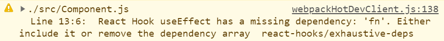

> Hooks는 React v16.8 에 도입된 기능으로, 상태 관리와 같은 다양한 기능들을 함수형 컴포넌트에서도 사용할 수 있게 해준다.
> 자주 사용하는 공용 로직의 경우, Custom Hook을 작성하여 재사용을 쉽게 할 수 있다.
> ( 참고 : [공식 홈페이지](https://ko.reactjs.org/docs/hooks-intro.html) )

`useEffect` 는 기본적으로 제공되는 훅 중에 하나로, 컴포넌트의 사이드 이펙트를 관리할 수 있다. 의존성에 포함된 값이 변경될때 마다 정의된 이팩트를 일으킨다. 뒷정리가 필요한 이팩트라면, 반환받은 함수를 통해 뒷정리를 수행하기도 한다.

공식 문서에서는, 클래스 컴포넌트에 익숙하다면 `componentDidMount`, `componentDidUpdate`, `componentWillUnmount` 가 합쳐진 것으로 생각해도 좋다고 한다. 많은 훅 관련 글에서도 역시 `useEffect`를 주로 세 라이프사이클 메서드와 연관지어서 설명한다.

그래서 그런지 `useEffect`를 그저 라이프사이클 메서드를 대체하는 훅으로만 생각하는 사람들이 가끔씩 있는것 같다. 그리고 그런 사람들은, 라이프사이클 메서드 구현에 집착하다 여러 가지 문제를 직면하곤 한다.

### useEffect === Lifecycle ?

훅에 익숙하지 않은 한 개발자가 있다. 개발자는 설명들을 보고 사용법을 익혀, 마운트 시점에서만 작동할 로직을 `useEffect` 내부에 작성했다.

```js
function Component() {
  ...
  useEffect( () => {
    ...
  }, []);
  ...
}
```

이후 `useEffect` 내부 로직에서 부모 컴포넌트에서 전달하는 `data`를 사용해야 하고, 로직을 외부에서도 실행 가능해야 했다. 그래서 해당 로직을 함수로 분리하고, **"이 함수는 마운트 시점에만 호출되어야 해."** 라는 의도로 코드를 아래와 같이 수정하였다.

```js
function Component({data}) {
  ...
  const fn = useCallback( () => {
    ...
  }, [data]);

  useEffect( () => {
    fn();
  }, []);
  ...
}
```

함수가 마운트 시점에만 호출되고, 의도대로 동작하는 코드를 작성하여 만족하지만, 곧 다음과 같은 메세지를 마주친다.



코드가 잘 동작함에도 출력되는 warning에 묘한 기분을 느끼며, 메세지를 제거하기 위해 여기저기 수정을 해본다. `fn`을 의존성 배열에 추가하니 원하는 방식대로 작동하지 않는다. 간단한 수정으로 메세지가 사라진다면 정말 좋겠지만, 고칠 방법이 떠오르지 않거나 잘 작동하는 코드를 수정하는데에 점차 실증을 느낀다.

결국, 메세지가 출력되도 못 본 척 하거나 메세지의 원인인 코드의 위에 조심스레 주석을 작성한다.

```js
// eslint-disable-next-line react-hooks/exhaustive-deps
```

### 잘 돌아가는데요?

맞다. 잘 돌아간다. 앞서 설명한 사례에서 눈에 보이는 오류는 없을 것이다. 그저 원하는대로 잘 돌아가는 코드와, 문법 관련 warning 콘솔만 있다. 그마저도 ESlint를 비활성화 하면 오롯이 코드만 남는다.

그러나 위의 코드는 의존성을 속여서, 그저 의도대로 돌아가는 것 처럼 보일 뿐이다. 의존성을 속이고 코드를 작성하는 개발자는 대부분 `useEffect` 를 잘못 생각하고 있을 확률이 높다.

잘못 생각하고 있는 개발자는, 클린업(cleanup)을 역시 `componentWillUnmount` 로만 생각하고 있을 것이다(실제로 그렇게 알고 있는 사람을 봤다). 그래서 아마, 언마운트 시점에 `fn` 을 호출하려고 할 때에는 아래와 같이 작성할 것이다.

```js
function Component({data}) {
  ...
  const fn = useCallback( () => {
    ...
  }, [data]);

  useEffect( () => {
    return fn;
  }, []);
  ...
}
```

컴포넌트가 마운트-언마운트 되는동안 `data`가 한번이라도 바뀌었다면, 대부분 의도한대로 동작하지 않을 것이다. 언마운트 시점엔 처음 선언되었던 `fn`을 호출할 것이다. 의존성에 `fn`을 명시하더라도, `fn` 이 재정의 될 때마다 호출되며 슬슬 머리가 아프기 시작한다. 결국 개발자는 구글에게 물어보고, 이것 저것 시도해보며 고통을 받을 것이다.

의존성에 대해 거짓말을 할 경우, 종종 의도와는 다른 결과가 발생한다. 그리고 의존성을 속이는 대부분의 사람들은 클래스 컴포넌트에 익숙하거나, 생명 주기에 집중하여 `useEffect`를 사용한다. 물론, 공식 문서에서도 라이프사이클 메서드를 예로 들고, 동작하는게 마치 라이프사이클 메서드의 그것과 같아보이긴 한다.

`useEffect`의 의존성을 속이면 안되는 이유가 무엇일까? 과연 라이프사이클 메서드와 `useEffect`가 완전히 같은 것일까?

### useEffect

공식 문서에서 `useEffect`를 설명할 때 `side effects`(effect) 와 `cleanup` 라는 단어로 설명한다. "데이터 가져오기, 구독(subscription) 설정하기, 수동으로 리액트 컴포넌트의 DOM을 수정하는 것까지 이 모든 것이 side effects입니다." 라고 한다. 그리고 그 이팩트에 대한 뒷정리를 클린업 이라고 표현하고 있다.

```js
componentDidMount() {
  Product.subscribe(this.props.productId);
};

componentDidUpdate(prevProps) {
  if( this.props.productId !== prevProps.productId ) {
    Product.unsubscribe(prevProps.productId);
    Product.subscribe(this.props.productId);
  };
};

componentWillUnmount() {
  Product.unsubscribe(this.props.productId);
};
```

클래스 컴포넌트에서, `productId`를 가지고 특정 상품을 구독하는 코드이다. 컴포넌트 마운트 시점에 상품을 구독하고, `productId`가 변경되면 기존의 상품 구독을 취소하고 다른 상품을 구독한다. 그리고 언마운트시 상품 구독을 취소한다. 이 코드를 `useEffect`로 작성하면 다음과 같다.

```js
useEffect(() => {
  Product.subscribe(productId);
  return () => Product.unsubscribe(productId);
}, [productId]);
```

"이팩트"는 복잡할 것 없이 그냥 어떤 작업이라고 할 수 있다. 이 코드에서는 `productId`로 상품을 구독하는 행위가 바로 이팩트이다.

"클린업"은 "이팩트"에 대한 뒷정리이다. 이팩트 함수의 실행에서 함수를 반환하면 컴포넌트가 변경되기 전에 작동하며, **직전에** 일어났던 이팩트(이 뒷정리 함수를 반환한)에 대한 정리를 한다. 여기에서는 앞에서 일어났던 특정 `productId`에 대한 구독을 취소하는 것이 클린업이다.

의존성 배열에는, 이팩트 함수 내부에서 사용하는 의존 데이터들을 작성해야 한다. 그리고 `useEffect`는 선언된 이팩트를 일으키는 훅이다. 이팩트는 처음 선언됬을 때, 의존성 배열에 있는 데이터가 변경될 때마다 일어난다. 그리고 일어난 이팩트에서 클린업을 반환한다면, 해당 이팩트에 대한 클린업 수행을 보장한다.

```js
// did-mount, productId = 1
Product.subscribe(1); // 상품(1)을 구독함 ( 작업함 )
// productId = 2
Product.unsubscribe(1); // 상품(1)에 대한 구독을 취소함 ( 앞의 작업을 취소함 )
Product.subscribe(2); // 상품(2)를 구독함 ( 작업함 )
// will-unmount
Product.unsubscribe(2); // 상품(2)에 대한 구독을 취소함 ( 앞의 작업을 취소함 )
```

`useEffect` 를 써본 적이 있다면 다 아는 이야기일 것이다. 이정도만 알아도 문제 없이 사용할 수 있다.

그나저나, 우리는 이팩트 함수 내부에서 외부에 있는 변수를 사용한다. 어떻게 이팩트가 최신의 데이터를 참조할까? 뭐 그저 외부에 선언되어 있으니, 값이 변경되는걸 그대로 참조할 수 있다고 치자. 클린업 함수는 업데이트되기 이전의 데이터에 접근하고 있다. 클린업은 어떻게 이전 데이터를 볼 수 있을까?

결론부터 얘기하자면, "이팩트 함수는 그대로고 안의 값이 지속적으로 바뀌는게 아니라, 이팩트 함수 자체가 **매번 바뀐다.**" 상품 1 을 구독하는 이팩트와 상품 2를 구독하는 이팩트는 아예 다른 함수라는 말이다.


리액트의 랜더링에 대해서 간단히 이야기 해보자. 버튼을 누를 때마다 카운트를 증가시키는 컴포넌트가 있다.

```js {6}
function CountButton() {
  const [count, setCount] = useState(0);

  return (
    <div>
      <p>Counter : {count}</p>
      <button type="button" onClick={() => setCount(count + 1)}>
        Click!
      </button>
    </div>
  );
}
```

하이라이트 된 라인을 보자. `count`를 관찰하며 값이 바뀔때마다 리액트가 자동으로 업데이트 하는것일까?

여기에서 `count`는 그저 **숫자**이다. 묶어둔다거나 관찰하는 그런 복잡한게 아니고, 그냥 단순한 숫자에 불과하다. 처음으로 컴포넌트가 랜더링 될 때, `useState`에서 반환하는 `count`값은 `0` 이다. 버튼을 클릭하면 `state`가 변하고, 컴포넌트를 다시 호출한다. 이 때의 `count`값은 1 이다.

```js
// 처음 랜더링, 즉 마운트 시 CountButton 이 호출된다.
function CountButton() {
  const count = 0 // useState에서 반환
  ...
      <p>Counter : {count}</p>
  ...
};

// 클릭하면 CountButton 이 다시 호출된다
function CountButton() {
  const count = 1 // useState에서 반환
  ...
      <p>Counter : {count}</p>
  ...
};

// 또 클릭하면, CountButton 이 다시 호출된다
function CountButton() {
  const count = 2 // useState에서 반환
  ...
      <p>Counter : {count}</p>
  ...
}
```

`state`가 변경될 때마다 리액트는 컴포넌트를 호출한다. 매 랜더링의 결과물은 `count`의 값을 본다. 그리고 그 값은 함수 내부에서 **상수**로 존재한다. 명심해야 할것은 어느 특정 랜더링 시의 `count` 값이 시간이 지나면 변경되는게 아니라는 것이다. 각각의 랜더링마다 고유의 `count` 값이 있는 것이다.

```js
<p>Counter : {count}</p>
```

즉, 위 코드는 그저 랜더링 결과물에 그 랜더링 고유의 숫자를 내장하는 것에 불과하다.

> 컴포넌트를 업데이트 해야할 때마다, 리액트는 해당 컴포넌트를 호출한다. 그리고 랜더링 결과물을 가지고 돔과 비교하여, 변경된 부분을 반영한다. 이 때, 모든 랜더링은 **고유의 상태**를 가진다.
> 이것에 대해 조금 더 자세히 알고싶다면, [UI 런타임으로서의 React](https://overreacted.io/ko/react-as-a-ui-runtime/) 를 추천한다.

그리고 이것은 `useEffect` 에도 적용된다. 이전의 `CountButton` 컴포넌트에 에 `useEffect`를 추가하였다.

```js
function CountButton() {
  const [count, setCount] = useState(0);

  useEffect(() => {
    console.log(count);
    return () => console.log(count);
  }, [count]);

  return (
    <div>
      <p>Counter : {count}</p>
      <button type="button" onClick={() => setCount(count + 1)}>
        Click!
      </button>
    </div>
  );
}
```

어떻게 이팩트가 최신의 `count`를 참조할까? 이제는 대답할 수 있다. 이팩트는 변하는 `count` 변수를 보는게 아니라, 각 랜더링 시점에 존재하는 상수를 참조할 뿐이다. 클린업 역시, 정의된 시점의 랜더링에 있던 값을 읽는것 뿐이다.

```js
// 처음 랜더링, 즉 마운트 시 CountButton 이 호출된다.
function CountButton() {
  ...
  useEffect(
    // 첫 번째 랜더링의 이팩트 함수
    () => {
      console.log(0);
      return () => console.log(0);
    },
    [0]
  );
  ...
};

// 클릭하면 CountButton 이 다시 호출된다
function CountButton() {
  ...
  useEffect(
    // 두 번째 랜더링의 이팩트 함수
    () => {
      console.log(1);
      return () => console.log(1);
    },
    [1]
  );
  ...
};

// 또 클릭하면, CountButton 이 다시 호출된다
function CountButton() {
  ...
  useEffect(
    // 세 번째 랜더링의 이팩트 함수
    () => {
      console.log(2);
      return () => console.log(2);
    },
    [2]
  );
  ...
}
```

그리고 `useEffect`는 이팩트 함수를 전달받고 화면을 그린 후 해당 함수를 실행하는데, 하나의 이팩트 함수를 다루는 것 처럼 보이지만, 이 역시 매 랜더링마다 내부에서 선언된 상수를 참조하는 고유한 함수가 존재한다는 것이다.

```js
const first = () => {
  console.log(0);
  return () => console.log(0);
};

const second = () => {
  console.log(1);
  return () => console.log(1);
};

const third = () => {
  console.log(2);
  return () => console.log(2);
};
```

정리하자면 이펙트와 클린업 함수가 실행될 때 특정 작업을 통해 최신 상태나 이전 상태를 참조하는 것이 아니라, 각 랜더링마다 고유의 상태를 가지고, 선언된 시점의 상태를 참조하는 함수들이 존재한다는 것이다. 그리고 그 함수들은 적절한 타이밍에 변경되고 실행되어 각각 이펙트와 클린업 기능을 수행한다.

그렇다면 그 적절한 타이밍이란 언제일까? `useEffect`는 의존성 배열에 작성한 데이터가 변경될 때마다 이팩트를 호출하는데, 그러면 의존성 배열은 그저 이팩트를 언제 다시 실행해야 할지 지정하는 용도일까?

우리는 리액트가 매번의 랜더링마다 실제로 바뀐 부분만 업데이트를 한다는 것을 안다. `useEffect` 의 이팩트 함수도 함수가 변경될 때마다 실행된다고 볼 수도 있다. 그런데 이펙트는 함수다. 상수는 그냥 비교하면 되고 객체 역시 깊은 비교를 통해 확인할 수 있는데, 기능이 동일한 함수 라는것은 어떻게 판단해야 할까? `CountButton` 에 다른 상태가 추가되었고 그 상태가 변경되어 컴포넌트가 업데이트 되었다고 하자. 콘솔을 출력하는 이팩트의 함수의 내용은 변경되지 않았다. 이전 랜더링에서의 함수와 똑같다는것을 어떻게 알 수 있을까?

```js
const first = () => {
  console.log(0);
  return () => console.log(0);
};

const second = () => {
  console.log(0);
  return () => console.log(0);
};

console.log(first === second); // false
```

이 때 사용하는 것이 바로 의존성 배열이다. 함수의 작동이 바뀐것을 판단할 수 없으니, 내부에서 사용하는 데이터를 비교해서 변경 여부를 판단하는 것이다. 그래서 `useEffect`는 함수 자체를 비교하는 대신, 우선 함수 내부에서 사용하는 데이터를 배열로 관리한다. 그리고 매 랜더링마다 배열의 데이터를 비교해서 데이터가 변경되었다면 새로운 이팩트 함수라고 판단하고, 저장된 이전 클린업을 수행한 후 새로운 이팩트를 실행하고 새로운 클린업 함수를 보관해둔다.

하지만 리액트는 함수에서 무슨 데이터를 사용하는지 알 수 없다. 그래서 의존성 배열을 직접 작성해서 `useEffect`에게 무슨 데이터를 사용하는지 알려주는 것이다. 즉, 의존성 배열은 실행하는 시점을 지정하는 것 보다 리액트에게 **이팩트 함수가 언제 바뀌는지 알려주는 수단**이라고 볼 수 있다.

의존성 배열은 생각보다 중요하고, 내부에서 사용하는 데이터들을 넣어야 하는 것이다. 이것을 어길 경우 의도하지 않은 작동이 구현될 수 있다. 그러니까 ESlint의 기본 룰에서도 의존성을 속일 경우 경고 메세지를 출력하는 것이고.

그래서 `useEffect`란, "특정 로직을 선언하면 마운트 됬을 때, 의존성 배열의 데이터가 변경되었을 때 실행하고, 함수를 반환하면 업데이트 되기 전, 언마운트 될 때 실행된다" 보다는, **"특정 데이터와 관련된 작업을 선언해 두고 내부에서 사용하는 데이터를 의존성 배열에 작성하면, 데이터가 변경될 때 마다 실행된다"** 로 이해하는 것이 더 정확하다.

### useEffect === Lifecycle Method ?

다시 돌아와서, 그래서 `useEffect` 는 라이프 사이클 함수인가? 완전히 동일하다면 특정 기능을 구현했을 때 서로 대체할 수 있어야 한다. 아래 코드를 보자.

```js
function CountButton() {
  const [count, setCount] = useState(0);

  useEffect(() => {
    console.log(`a ${count}`);
    return () => console.log(`b ${count}`);
  }, [count]);

  return (
    <button type="button" onClick={() => setCount(count + 1)}>
      Click!
    </button>
  );
}
```

해당 컴포넌트는 버튼을 누를때마다 카운트를 증가시키고, `useEffect`에서 `count`를 콘솔에 출력한다. 이 컴포넌트가 마운트되고 버튼을 두 번 누른 이후 언마운트 되었다고 하자. 출력 결과는 다음과 같을 것이다.

```txt
a 0
// click
b 0
a 1
// click
b 1
a 2
b 2
```

`useEffect`를 설명할 때 주로 생명 주기에 빗대어 표현한다고 했다. 하지만 어디에서는 완전히 대체가 가능한 것 처럼 설명하기도 한다. 그렇다면 `useEffect`는 라이프사이클 메서드로 완전히 대체할 수 있을까? 이전 카운트 컴포넌트의 각 출력에 예상되는 라이프사이클 메서드를 작성해보자.

```txt
a 0 // componentDidMount
// click
b 0 // ??
a 1 // componentDidUpdate
// click
b 1 // ??
a 2 // componentDidUpdate
b 2 // componentWillUnmount
```

이팩트는 `componentDidMount`와 `componentDidUpdate`라고 생각하면 될 것 같다. 그런데 클린업이 실행되는 `??` 는 무슨 함수라고 표현해야 할까? 이전 `props, state`에 접근할 수 있는 함수들( `getDerivedStateFromProps`나 `componentWillUpdate` 등 )을 얘기 할 수 있도 있고, 이전 상품 구독 예제처럼 `componentDidUpdate` 라고 할 수도 있다. 하지만 해당하는 함수들은 클린업이라고 하는 뒷정리를 위한 함수들은 아니기 때문에 조금 애매하다는 생각이다. `getDerivedStateFromProps`는 `props`를 `state`로 매핑하기 위해 존재하고, `componentWillMount` 등은 `deprecated` 되었다. `componentDidUpdate`는 업데이트 된 이후에 실행하기 때문에 클린업이 호출되는 시점과는 조금 다르다. 물론, 위의 컴포넌트와 동일하게 출력하는 클래스 컴포넌트를 작성하면 아래와 같을 수 있다.

```js
class CountButton extends React.Component {
  ...
  componentDidMount() {
    console.log(`a ${this.state.count}`);
  };

  componentDidUpdate(prevProps, prevState) {
    if( prevState.count !== this.state.count ) {
      console.log(`b ${prevState.count}`);
      console.log(`a ${this.state.count}`);
    };
  };

  componentWillUnmount() {
    console.log(`b ${this.state.count}`);
  };
  ...
}
```

아무튼, `useEffect`를 사용했을 때와 동일한 작동을 하는 클래스 컴포넌트를 작성할 수 있다. 그렇다면 반대로 라이프사이클 메서드로 구현된 기능을 `useEffect`로 완전히 대체할 수 있을까? `CountButton` 컴포넌트를 수정해서 `count`의 마운트 시점의 초기값과, 언마운트 시점의 마지막 값만을 출력하고 싶어졌다. 클래스 컴포넌트에서는 `componentDidUpdate`만 제거하면 된다. `useEffect`에서는? "아 의존성 배열을 제거하면, 마운트-언마운트 기능을 할 수 있다 그랬어"

```js
useEffect(() => {
  console.log(`a ${count}`);
  return () => console.log(`b ${count}`);
}, []);
```

컴포넌트가 마운토되고, `count`의 초기값이 `0`으로 시작해 버튼이 세번 눌리고 언마운트 되었다. 출력 결과가 어떻게 될까?

```txt
a 0
b 0
```

버튼을 세번 눌렀으니 `3`이 출력되어야 할텐데 의도와는 다르게 `0`이 출력되었다. 왜 그런지 이제는 알고 있다. 코드를 작성할 때 의존성을 속였기 때문이다. `useEffect`의 이팩트 함수와 클린업 함수는 선언된 시점의 랜더링에 존재하는 값을 참조하는데, 의존성이 비어있어 처음 이후에는 이팩트가 실행되지 않았다. 그래서 클린업 함수는 처음 실행될 때에 선언된 `0` 값을 참조하는 함수이므로, `0`이 출력된다. 원하는 시점에 수행은 가능하지만 원하는 기능을 구현하지는 못했다.

이렇듯, 클래스 컴포넌트의 라이프사이클 메서드와 `useEffect`는 비슷하면서도 다르고, 완전히 대체할 수는 없다. 물론 다른 기능들을 활용한다면 충분히 대체할 수 있고 그것이 필요한 상황이 있다. 의존성이 빈 배열이라면 `componentDidMount`, `componentWillUnmount`와 동일하게 작동하고, `useRef` 나 `useState`를 활용하면 마운트 됬을때나 언마운트 됬을 때만 작동하도록 만들수도 있다. 아무튼, "이팩트는 `componentDidMount`라고 할 수 있어요!" 나, "반환하는 함수는 무조건 언마운트때 호출되요!" 라고 단정할 수는 없다는 것이다.

> 그래서 `useEffect`란, "특정 로직을 선언하면 마운트 됬을 때, 의존성 배열의 데이터가 변경되었을 때 실행하고, 함수를 반환하면 업데이트 되기 전, 언마운트 될 때 실행된다" 보다는, **"특정 데이터와 관련된 작업을 선언해 두고 내부에서 사용하는 데이터를 의존성 배열에 작성하면, 데이터가 변경될 때 마다 실행된다"** 로 이해하는 것이 더 정확하다.

`useEffect`를 사용할 때에 중요한 것은 특정 시점에 실행되는 로직을 작성해야 하는 것보다, 어떤 데이터가 변경될 때 로직이 실행이 되어야 하는지를 정확하게 선언하는 것이다. 이를 위해서는 상태가 랜더링마다 고유하다는 것을 이해하고, 의존성 배열을 올바르게 관리해야 한다. 즉, `useEffect`는 단순히 언제 실행할지를 결정하는 것이 아니라, 데이터의 흐름에 반응하는 선언형 방식으로 접근해야 하는 것이다.

이는 클래스형 컴포넌트의 `componentDidMount`, `componentDidUpdate`, `componentWillUnmount` 같은 라이프사이클 메서드의 동작 방식과는 차이가 있다. 라이프사이클 메서드는 특정 시점에서 실행되는 함수를 정의하는 방식이다. 각 라이프사이클 메서드 안에 해당 시점에 실행되어야 하는 로직들을 정의한다. 반면 `useEffect`는 데이터의 변화를 기반으로 실행될 로직을 선언적으로 정의하는 방식이다. 연관된 로직들을 묶어 하나의 이팩트를 정의하고, 내부에서 사용하는 데이터가 바뀔때 마다 실행된다. 즉, 라이프사이클 메서드는 "언제 실행될지"를 지정하는 것이고, `useEffect`는 "어떤 데이터에 반응할지"를 선언하는 것에 가깝다.

결론은, `useEffect`와 라이프사이클 메서드는 기능적으로 유사한 부분이 있지만, 그 개념과 용도는 차이가 있다. 라이프사이클 메서드와의 비교는 이해를 돕는데에는 충분히 유용하지만, 이를 동일하게 여기고 대체하려는 접근은 좋지 않다. 그대로 치환하는 방식은 오히려 `useEffect`의 패러다임과 맞지 않을 수 있고, 실제로 완전히 대체할 수는 없다. 따라서, 두 개념을 동일한 것으로 보는것 보다는, 서로의 차이점을 충분히 이해하고 상황에 맞게 적절히 활용하는 것이 더 중요하다.

### 마치며

`useEffect`를 그저 라이프사이클 메서드에만 초점을 맞춰 생각하는 사람들을 보며, 내 생각을 정리하기 위해 쓴 글이다. 글을 읽으며 "에이 이런 사람이 어디있어?" 할 수도 있다. 나도 예제 대부분이 조금 극단적이라 생각한다. 하지만 `useEffect`를 검색해보면, 의존성 배열이 비어있지 않은데도 "함수를 반환하면, 컴포넌트가 언마운트 되는 시점에 호출이 됩니다." 라는 글들을 볼 수 있다. 최근에 정확히 "라이프사이클 메서드요." 라고 대답하는 사람도 있었다.

`useEffect`와 라이프사이클 메서드는 같으면서도 다르다. 이 훅을 그저 라이프사이클 메서드 용도로 사용하려 했다면, 새로운 단어를 꺼내어 이름을 `useEffect`라고 할 필요 없이 라이프사이클 메서드의 이름을 붙여 `useDidMount`, `useUnmount`나, `useMount` 라는 훅으로 제공되었을 것이다. 공식 문서에서도 라이프사이클 메서드는 그저 예시를 들 뿐, 대부분의 설명은 이팩트와 클린업 이라는 단어로 설명하고 있다.

Hook이 탄생한 동기중 하나가 바로 각 라이프사이클 메서드에 관련 없는 로직들을 모아두고, 관련이 있는 로직들이 여러 함수에 분산되는 경우 때문이라고 한다. `useEffect`를 사용하면 라이프사이클 메서드에 따라서가 아니라 **"코드가 무엇을 하는지"** 에 따라서 나눌 수 있다고 한다([관심사를 구분하려고 한다면 Multiple Effect를 사용합니다](https://ko.reactjs.org/docs/hooks-effect.html#tip-use-multiple-effects-to-separate-concerns)).

`useEffect`는 단순히 클래스 컴포넌트의 생명 주기 메서드를 구현하기 위한 도구가 아니다. `useEffect`의 역할은 특정 데이터가 변경될 때 그에 대한 이팩트를 선언하는 것이다. 따라서 `useEffect`를 사용할 때는 "이 코드를 언제 실행해야 하지?"가 아니라, **"이 코드는 어떤 데이터와 연결되어 있는가?"** 를 고민해야 한다. 이를 올바르게 이해하고 사용한다면, 생명 주기 메서드를 흉내 내지 않고도 더욱 직관적인 로직을 작성할 수 있다.

사실, 이 글 내용의 대부분은 [[번역] useEffect 완벽 가이드](https://rinae.dev/posts/a-complete-guide-to-useeffect-ko) 를 참조하였다. 읽어본 적 없다면 꼭 한번 읽어보라고 추천하고 싶다. `useEffect`에 대해 아주 상세하게 설명해주고 있다.

어떤것이 무조건 좋다고 생각하지는 않는다. 각각의 장단점이 있다고 생각하며, 상황에 따라서는 라이프사이클 메서드가 필요해서 클래스 컴포넌트를 일부러 사용하기도 한다. `useEffect`를 다른 어떤 것이라고 생각하지 말고 고유한 한 기능으로서 보고, 필요에 따라서 적절한 방법을 선택하도록 하자.

### 참고

- [공식 홈페이지](https://ko.reactjs.org/docs/hooks-intro.html)
- [UI 런타임으로서의 React](https://overreacted.io/ko/react-as-a-ui-runtime/)
- [관심사를 구분하려고 한다면 Multiple Effect를 사용합니다](https://ko.reactjs.org/docs/hooks-effect.html#tip-use-multiple-effects-to-separate-concerns)
- [[번역] useEffect 완벽 가이드](https://rinae.dev/posts/a-complete-guide-to-useeffect-ko)
