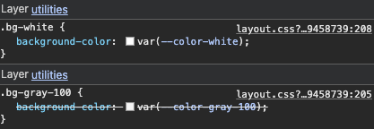
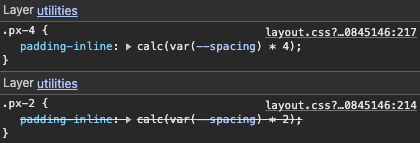
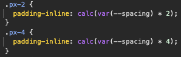
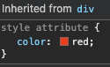
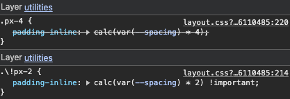
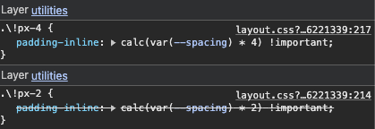
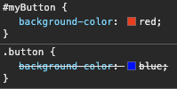
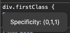
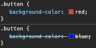
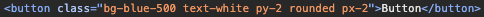

진행하고 있는 사이드 프로젝트는 Next.js 기반으로, TailwindCSS를 사용해 스타일을 적용하고 있다.

최근 중복된 코드를 제거하기 위해 특정 기능을 컴포넌트로 분리하는 작업을 진행했다. 컴포넌트의 스타일을 정의하고, 추가적인 스타일을 적용할 수 있도록 `className`을 전달 받을 수 있게 하였다. 그런데, 컴포넌트에 `className`을 전달해도 적용이 잘 되지 않는 문제가 발생했다. TailwindCSS의 클래스가 중복되어 발생하는 문제였다.

TailwindCSS는 필요한 스타일들을 클래스로 미리 정의해두고, 약속된 클래스 이름을 사용해 스타일을 적용하는 방식이다. 그런데 `className`에 여러 클래스를 전달할 때 중복된 클래스가 있을 경우, `className`에 적용된 순서와 상관 없이 TailwindCSS에 작성되어 있는 클래스의 순서에 따라 스타일이 적용된다. 이로 인해, 컴포넌트에 전달한 `className`이 무시되는 경우가 발생한다.

이 글에서는, TailwindCSS에서 발생하는 클래스 중복 문제를 알아보고, 이를 해결하기 위해 `tailwind-merge` 라이브러리를 사용하는 방법을 소개한다.

### TailwindCSS 클래스 중복 문제

TailwindCSS는 유틸리티 클래스 기반의 CSS 프레임워크로, 특정 스타일에 대한 클래스들을 미리 정의해두고, 클래스 이름들을 조합해 스타일을 구성할 수 있다. 예를 들어, `bg-white`, `text-sm`, `rounded-md` 처럼 각각의 속성을 나타내는 클래스들을 조합하여 UI를 표현할 수 있다.

```tsx
<div className="bg-white text-sm rounded-md px-2 py-1">Hello, World!</div>
```

적용된 스타일은 다음과 같다.

- `bg-white`: 배경색을 흰색으로 설정
- `text-sm`: 글자 크기를 작게 설정
- `rounded-md`: 테두리를 중간 정도로 둥글게 설정
- `px-2`: 좌우 패딩을 `0.5rem`으로 설정
- `py-1`: 상하 패딩을 `0.25rem`으로 설정

이처럼 약속된 클래스 이름을 사용하여 스타일을 적용하는 방식은, 별도의 CSS를 작성하지 않아도 되고, 익숙해진다면 매우 직관적이며 빠르게 UI를 구성할 수 있다. 실제로 TailwindCSS를 사용하는 이유중 하나도 생산성에 있다.

하지만, 중복된 클래스가 있을 경우에는 예상하지 못한 결과가 발생할 수 있다. 예를 들어, 아래와 같이 `className`에 중복된 클래스가 있을 경우를 생각해보자.

```tsx "bg-white" "bg-gray-100"
<div className="bg-white text-sm rounded-md px-2 py-1 bg-gray-100">
  Hello, World!
</div>
```

배경색에 `white`와 `gray-100` 클래스가 중복되어 있는데, 이 경우 어떤 것이 적용되는지 예측할 수 없다. 어떤 것이 적용될까?



정답은 `bg-white`가 적용된다.

그렇다면 앞에 있는 것이 먼저 적용되는 것일까? 아마 위치를 바꿔도 동일하게 `bg-white`가 적용될 것이다.

물론 이건 좀 극단적인 예시고, 같은 속성의 클래스를 할당하는 것은 대부분 실수일 것이기 때문에 하나를 지워주면 된다. VSCode 기준 TailwindCSS IntelliSense가 적용되어 있다면, 친절하게 중복 안내도 해준다. 따라서 이런 상황은 중복된 클래스를 제거하면 쉽게 해결할 수 있다.

그러나, 특정 스타일을 컴포넌트로 추상화한 경우에는 상황이 달라진다. 컴포넌트에 특정 스타일을 적용하기 위해 `className`을 전달했는데, 해당 클래스가 적용되지 않는 경우가 발생할 수 있다. 예를 들어, 아래와 같은 컴포넌트를 생각해보자.

```tsx
export type ButtonProps = React.ButtonHTMLAttributes<HTMLButtonElement>;

function Button({ className, ...props }: ButtonProps) {
  return (
    <button
      className={`${className} bg-blue-500 text-white px-4 py-2 rounded`}
      {...props}
    ></button>
  );
}
```

해당 컴포넌트는 파란색 배경에 흰색 글씨, 패딩과 테두리를 둥글게 설정한 버튼이다. 프로젝트에서 해당 컴포넌트를 범용적으로 사용하고 있던 도중, 특정 구간에서 버튼의 패딩을 변경하고 싶어졌다. 그래서 아래와 같이 `className`을 전달했다.

```tsx
<Button className="px-2">Click Me</Button>
```

하지만, 버튼의 패딩이 변경되지 않고 기존의 `px-4`가 유지된다.



이 상황은 TailwindCSS를 사용하는 프로젝트에서 종종 발생하는데, 컴포넌트에 `className`을 전달해도 예상한 스타일이 적용되지 않는 경우가 있다. 무엇이 문제일까? `className`의 순서도 아니고, 무언가 특별한 규칙이라도 있는 것일까?

TailwindCSS는 클래스를 HTML에서 읽어서 바로 적용하는 것이 아니라, 빌드 시점에 실제로 사용하는 클래스들을 기반으로 CSS를 생성한다. 이 때, 각 클래스들은 TailwindCSS 내부의 규칙에 따라 정해진 순서로 선언된다. 해당 컴포넌트를 선언한 프로젝트의 TailwindCSS가 생성한 CSS 파일을 살펴보면, `px-4`가 `px-2`보다 먼저 선언되어 있는 것을 확인할 수 있다.



그리고 브라우저에서 스타일은 CSS Cascading에 의해서 CSS의 상속과 우선순위를 판단하여 스타일이 적용되는데, 동일 우선순위를 가진 클래스의 경우에는 나중에 선언된 클래스가 우선 적용된다. 그래서 이 경우에는, TailwindCSS의 내부 규칙에 따라 `px-4`가 `px-2`보다 뒤에 선언되고, 우선 순위에 의해 `px-2`가 적용되지 않는 것이다.

이와 같은 현상은 TailwindCSS만의 문제는 아니고, 실제로 모든 CSS가 따르는 기본 동작 원리로 인해 결정되는 현상이다. 이를 좀 더 잘 이해하기 위해서, CSS 적용 방식에 대해 잠시 정리해보자.

### CSS Inheritance, Cascading

CSS에서는 동일한 요소에 여러 스타일 규칙이 적용될 수 있다. 이 때, 어떤 스타일이 실제로 적용될지를 결정하기 위해 몇 가지 규칙을 따르는데, 크게 다음과 같이 구분한다.

- **Inheritance**: 부모 요소의 스타일이 자식 요소에 상속되는 경우
- **Cascading**: 여러 스타일 규칙이 충돌할 때, 우선순위에 따라 하나의 스타일만 적용되는 경우

#### Inheritance

CSS는 상위 요소의 스타일이 하위 요소에 자연스럽게 전달되는 경우가 존재하는데, 이를 상속이라고 한다. 스타일 상속은 태그들이 어떤 구성을 가지는지에 따라 결정되며, 일반적으로 부모 요소의 스타일이 자식 요소에 상속된다. 대표적으로, 부모 요소에 `color: red;`가 설정되어 있다면, 자식 요소는 별도로 색상을 지정하지 않는 한 빨간색이 적용된다.

```html
<div style="color: red;">
  <p>이 문장은 빨간색입니다.</p>
</div>
```

개발자 도구에서 스타일을 확인하면, 부모 요소의 스타일이 자식 요소에 상속되어 적용된 것을 확인할 수 있다.



상속되는 스타일은 각 속성마다 다르게 적용될 수 있으며, 모든 속성이 상속되는 것은 아니다. 예를 들어, `color`, `font-family`, `line-height` 등은 상속되지만, `margin`, `padding`, `border` 등은 상속되지 않는다. 그리고, 만약 동일한 스타일이 자식 요소에도 동일하게 정의되어 있다면, 우선순위에 따라 상속받지 않고 자식 요소의 스타일이 적용된다.

#### Cascading

태그는 여러 스타일 규칙이 적용될 수 있다. 이 때, 어떤 스타일이 실제로 적용될지를 우선순위를 통해 판단하는데, 이를 결정하는 규칙을 Cascading이라고 한다. Cascading은 **출처**, **중요도**, **명시도**, **선언 순서**에 따라 결정된다.

**출처**는 스타일을 누가 작성했는가에 따라 우선순위가 결정되는 기준이다. 스타일 시트는 크게 작성자(개발자), 사용자, 브라우저가 작성한 세 종류로 나뉘며, 우선순위는 다음과 같이 적용된다.

```text
작성자 스타일 시트(author) > 사용자 스타일 시트(user) > 브라우저 스타일 시트(user agent)
```

우리(개발자)가 일반적으로 작성하는 CSS는 작성자 스타일에 해당하며, `link`태그로 불러온 외부 CSS나 `style` 태그에 작성한 CSS를 포함한다. 작성자 스타일 시트에서도 위치나 다른 규칙에 따라 우선순위가 달라질 수 있다.

**중요도**는 스타일이 얼마나 중요한지를 나타내며, `!important` 키워드를 사용하여 스타일의 중요도를 높일 수 있어 특정 스타일을 강제로 적용하고자 할 때 사용한다. 일종의 필살기로 볼 수 있으며, 다른 규칙에 의해 정해지는 우선순위를 무시하고 해당 스타일을 적용할 수 있다.

예를 들어, TailwindCSS에서 `!important`는 앞의 클래스 이름에 `!`를 붙여서 사용할 수 있다. 이전 예제에서 적용되지 않던 `px-2`에 `!important`를 추가하면, 다음과 같이 작성할 수 있다.

```tsx "!"
<Button className="!px-2">Click Me</Button>
```

이 경우, 원래는 적용되지 않던 `px-2`가 `!important`에 의해 강제로 적용된다.



만약 `!important`끼리 충돌한다면, 다시 다른 규칙에 의해 우선순위가 결정된다.



`!important`는 남용하면 유지보수를 어렵게 만들 수 있으므로, 꼭 필요한 경우에만 사용하는 것이 좋다.

**명시도**는 스타일을 적용할 대상을 얼마나 구체적으로 지정했는지를 나타낸다. CSS 선택자를 얼마나 구체적으로 작성했는지에 따라 우선순위가 높아진다.

선택자에 따라서 우선순위는 다른데, 예를 들어 `#id`로 선택한 스타일은 `.class`보다 구체적이며, 더 높은 우선순위를 갖게 된다. 또한, 인라인 스타일은 어떤 선택자보다도 더 우선적으로 적용된다.

```html
<style>
  .button {
    background-color: blue;
  }
  #myButton {
    background-color: red;
  }
</style>
<button class="button" id="myButton">Click Me</button>
```

위와 같은 스타일이 적용된 경우, `#myButton`이 더 구체적인 선택자이므로, 버튼의 배경색은 빨간색으로 적용된다.



명시도는 다음과 같은 방식으로 수치화를 할 수 있다.

- 인라인 스타일 : **1000**
  - `<div style="color: red">`
- ID선택자 : **100**
  - `#myId { ... }`
- 클래스, 속성, 가상 클래스 선택자 : **10**
  - `.myClass { ... }`
  - `[type="text"] { ... }`
  - `:hover { ... }`
- 태그, 가상요소 : **1**
  - `div { ... }`
  - `::before { ... }`

예로, `div.firstClass`는 **11**의 명시도를 가지며, `#myId .secondClass`는 **110**의 명시도를 가진다. 표기는 `(n, m, o)`로 나타낼 수 있다.

```html
<style>
  div.firstClass {
    color: blue;
  }
  #myId .secondClass {
    color: red;
  }
</style>
<div id="myId">
  <div class="firstClass secondClass">Hello, World!</div>
</div>
```

위 코드의 경우, 두 번째 `div`태그에 `color` 스타일이 중복 적용된다. 이 때, `#myId .secondClass`가 더 높은 명시도를 가지므로, 해당 스타일이 적용되어 글씨 색깔은 빨간색이 된다.


개발자 도구에서 마우스를 선택자에 올려보면, 해당 선택자의 명시도를 확인할 수도 있다.



명시도는 CSS 규칙이 충돌할 때, 이 명시도를 계산해서 특정 속성에 대한 우선순위를 결정하는 데 사용된다. 명시도를 높이기 위해 선택자를 중첩하는 것은 효과적일 수 있지만, 지나치게 복잡한 선택자를 사용하면 코드의 가독성이 떨어지거나 유지보수가 어려워질 수 있으므로 주의해야 한다.

앞서 이야기 했던 출처, 중요도, 명시도가 모두 동일한 경우에는, 마지막으로 **선언 순서**에 따라 우선순위가 결정된다. 즉, 가장 나중에 선언된 스타일이 우선 적용된다.

```html
<style>
  .button {
    background-color: blue;
  }
  .button {
    background-color: red;
  }
</style>
<button class="button">Click Me</button>
```

버튼에 대한 동일한 클래스가 두 번 선언되었다. 이 경우, 두 번째 선언이 마지막에 적용되므로 버튼의 배경색은 빨간색이 된다.



이처럼 CSS는여러 단계의 규칙을 통해 어떤 스타일이 적용될지를 판단한다. 출처, 중요도, 명시도, 선언 순서는 독립적인 개념 처럼 보이지만, 실제로는 서로 연결되어 함께 스타일의 우선순위를 결정한다.

이를 잘 알고 있다면 스타일 문제를 대버깅할 때 도움이 될 수 있다.

### tailwind-merge

앞 섹션에서 CSS는 여러 기준을 통해 우선순위를 판단하고, 선언 순서에 따라 스타일이 적용되기도 한다는 것을 알아보았다.

TailwindCSS에서는 앞서 말했듯 내부의 규칙에 따라 정해진 순서로 클래스가 선언되는데, 이 때 중복된 클래스는 선언 순서에 따라 우선순위가 결정되어 스타일이 적용된다. 그래서 컴포넌트에 전달한 `className`이 무시되는 경우가 발생하는 것이다.

이를 해결하기 위해서는 중복된 클래스를 제거해주거나, `!important`를 사용하여 강제로 적용할 수 있다. 하지만, 컴포넌트로 추상화된 상태에서는 제거할 수 없을 수도 있고, `!important`를 남용하면 유지보수가 어려워질 수 있다.

이 때 활용할 수 있는 것이 바로 [tailwind-merge](https://github.com/dcastil/tailwind-merge) 라이브러리다. `tailwind-merge`는 클래스 이름을 병합하여 중복된 클래스를 제거하고 마지막에 선언된 클래스가 적용되도록 처리하는 기능을 제공한다.

우선, 해당 기능을 제공하는 함수는 `twMerge`로, 함수의 명세는 다음과 같다.

```ts
type ClassNameValue =
  | ClassNameArray
  | string
  | null
  | undefined
  | 0
  | 0n
  | false;
type ClassNameArray = ClassNameValue[];

declare const twMerge: (...classLists: ClassNameValue[]) => string;
```

이 함수는 파라미터로 클래스 이름들을 전달하면 이를 병합하고 중복된 클래스를 제거한 결과를 반환한다.

```tsx
import { twMerge } from "tailwind-merge";

const className = twMerge("bg-white", "bg-gray-100", "px-2");
// className='bg-gray-100 px-2'
```

위 코드에서는 `bg-white`와 `bg-gray-100`이 중복되어, 마지막에 선언한 `bg-gray-100`만 남게 된다.

또한, 해당 함수는 파라미터로 다양한 타입을 전달받는데, `twMerge`는 조건문을 통한 조건부 클래스 할당도 지원한다.

```tsx
const classname = twMerge(
  isDark ? "bg-dark" : "bg-white",
  active && "font-bold"
);
// 만약, isDark와 active가 true라면, 'bg-dark font-bold'이 반환된다.
```

`tailwind-merge`는 중복을 제거하지 않고 단순하게 클래스 병합만 수행하는 `twJoin` 함수도 제공한다. 이 함수는 중복된 클래스를 제거하지 않고, 단순히 클래스 이름들을 병합하여 하나의 문자열로 반환한다. 명세와 사용 방법은 `twMerge`와 동일하다.

```ts
import { twJoin } from "tailwind-merge";
const className = twJoin("bg-white", "bg-gray-100", "px-2");
// className='bg-white bg-gray-100 px-2'
```

이 경우, `twJoin`은 중복된 클래스를 제거하지 않고 병합만 진행해 `bg-white bg-gray-100 px-2`을 반환하게 된다.

`tailwind-merge`에서 제공하는 `twMerge` 함수를 활용하면, 앞서 언급했던 컴포넌트에 전달한 `className`이 중복되어 적용되지 않는 문제를 해결할 수 있겠다. 예를 들어, 앞서 작성한 `Button` 컴포넌트에 `twMerge`를 적용해보도록 하자.

```tsx
import { twMerge } from "tailwind-merge";

export type ButtonProps = React.ButtonHTMLAttributes<HTMLButtonElement>;

function Button({ className, ...props }: ButtonProps) {
  return (
    <button
      className={twMerge("bg-blue-500 text-white px-4 py-2 rounded", className)}
      {...props}
    ></button>
  );
}
```

그리고 이전과 같이 `px-2`를 전달해보았다.

```tsx
<Button className="px-2">Click Me</Button>
```

중복된 클래스가 제거되고, 마지막에 할당한 `px-2`만 남아있는 모습을 확인할 수 있다.



이제 `twMerge`를 사용한다면, `className`을 전달해도 중복된 클래스가 제거되어, 원하는 스타일이 적용할 수 있게 되었다.

### Custom class 적용하기

TailwindCSS는 유틸리티 기반의 CSS 프레임워크로, 약속된 클래스 이름들을 사용하는 방식이다. 그러나 프로젝트에 따라서는 TailwindCSS에서 제공하지 않는 커스텀 클래스를 사용해야 하는 경우도 있다.

그런데 `tailwind-merge`는 내부에서 TailwindCSS의 클래스 이름을 인식하고 중복된 클래스를 제거하는데, 커스텀 클래스는 인식하지 못해 정상적으로 작동하지 않을 수 있다.

예시

이건 설정을 확장해야 함

확장하는 방법

### 주의 사항

`tailwind-merge`의 문서에는 라이브러리의 장단점을 소개한 글도 있다.

### 마치며

이 글에서는 TailwindCSS를 사용할 때 발생할 수 있는 문제와, `tailwind-merge` 라이브러리를 활용한 해결 방법에 대해 알아보았다.

처음 이 문제를 접했을 때에는 어떻게 해결해야 할지, 컴포넌트를 성급하게 추상화 한 것은 아닌지 고민했다. 실제로 라이브러리의 단점에서도 언급하던 부분으로, 컴포넌트의 정해진 스타일을 수정한다는 행위가 올바른지에 대해서 한 번 생각해볼 수 있었다.

결국, 상황에 따라서 필요할 경우 사용하면 되지 않을까 싶다. 디자인 시스템에서 정해진 부분이라면(예: 카드의 `padding`은 `0.5rem`이다.) 굳이 부모에서 동일한 스타일을 할당할 일은 없을 것 같기 때문이다. 하지만 필요한 경우가 있을 경우, 라이브러리 도입을 검토해볼 수 있겠다.

### 참고

- 링크1
- 링크2
